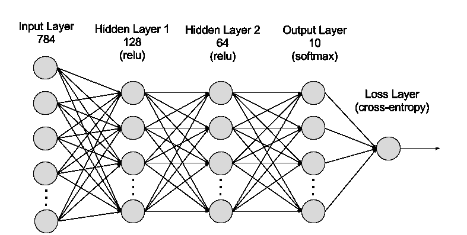

# 用 PyTorch 构建神经网络

> 原文：<https://towardsdatascience.com/building-neural-network-using-pytorch-84f6e75f9a?source=collection_archive---------2----------------------->

“计算机能否思考的问题并不比潜艇能否游泳的问题更有趣。”
― **埃德格·w·迪杰斯特拉**


source: [here](https://deeplizard.com/learn/video/k4jY9L8H89U)

在本教程中，我们将使用 PyTorch 从头开始实现一个简单的神经网络。我正在分享我从最近的 facebook-udacity 奖学金挑战项目中学到的东西。本教程假设你事先了解神经网络如何工作。

虽然有很多库可以用于深度学习，但我最喜欢 PyTorch。作为一名 python 程序员，我喜欢 PyTorch 的 python 行为是背后的原因之一。它主要使用 python 的风格和功能，易于理解和使用。

**py torch 的核心提供了两个主要特性:**

*   n 维张量，类似于 numpy，但可以在 GPU 上运行
*   用于建立和训练神经网络的自动微分

**什么是神经网络？**

神经网络是一组算法，大致模仿人脑，用于识别模式。网络是由近似神经元的单个部分构成的，通常称为单元或简称为“**神经元**”每个单元都有一些加权输入。这些加权输入相加在一起(线性组合)，然后通过一个激活函数得到单元的输出。

## 神经网络中的节点类型:

1.  输入单元—向网络提供来自外部世界的信息，统称为“输入层”。这些节点不执行任何计算，它们只是将信息传递给隐藏节点。
2.  隐藏单元—这些节点与外界没有任何直接的联系。它们执行计算并将信息从输入节点传输到输出节点。隐藏节点的集合形成了“隐藏层”。虽然前馈网络只有一个输入层和一个输出层，但它可以有零个或多个隐藏层。
3.  输出单元-输出节点统称为“输出层”，负责计算和将信息从网络传输到外部世界。

每层包括一个或多个节点。

**构建神经网络**

PyTorch 提供了一个模块`nn`,使得构建网络更加简单。我们将看到如何用`784 inputs`、`256 hidden units`、`10 output units`和`softmax output`构建一个神经网络。

```
from torch import nnclass Network(nn.Module):
    def __init__(self):
        super().__init__()

        # Inputs to hidden layer linear transformation
        self.hidden = nn.Linear(784, 256)
        # Output layer, 10 units - one for each digit
        self.output = nn.Linear(256, 10)

        # Define sigmoid activation and softmax output 
        self.sigmoid = nn.Sigmoid()
        self.softmax = nn.Softmax(dim=1)

    def forward(self, x):
        # Pass the input tensor through each of our operations
        x = self.hidden(x)
        x = self.sigmoid(x)
        x = self.output(x)
        x = self.softmax(x)

        return x
```

> 注:`**softmax**` **函数，**也称为`**softargmax**`或`**normalized**` `**exponential function**`是一个以 *K* 实数的向量为输入，并将其归一化为由 *K* 个概率组成的[概率分布](https://en.wikipedia.org/wiki/Probability_distribution)的函数。



image from google

让我们一行一行地过一遍。

```
**class** Network(nn.Module):
```

在这里，我们继承了`nn.Module`。与`super().__init__()`结合，这创建了一个跟踪架构的类，并提供了许多有用的方法和属性。当你为你的网络创建一个类时，从`nn.Module`继承是强制性的。类本身的名称可以是任何东西。

```
self.hidden **=** nn.Linear(784, 256)
```

这一行创建了一个用于线性变换的模块，𝑥𝐖+𝑏xW+b，有 784 个输入和 256 个输出，并将其分配给`self.hidden`。该模块自动创建我们将在`forward`方法中使用的权重和偏差张量。一旦使用`net.hidden.weight`和`net.hidden.bias`创建了网络(`net`，您就可以访问权重和偏差张量。

```
self.output **=** nn.Linear(256, 10)
```

类似地，这创建了另一个具有 256 个输入和 10 个输出的线性转换。

```
self.sigmoid **=** nn.Sigmoid()
self.softmax **=** nn.Softmax(dim**=**1)
```

这里我定义了 sigmoid 激活和 softmax 输出的操作。在`nn.Softmax(dim=1)`中设置`dim=1`计算各列的 softmax。

```
**def** forward(self, x):
```

用`nn.Module`创建的 PyTorch 网络必须定义一个`forward`方法。它接受一个张量`x`并通过您在`__init__`方法中定义的操作传递它。

```
x **=** self.hidden(x)
x **=** self.sigmoid(x)
x **=** self.output(x)
x **=** self.softmax(x)
```

这里，输入张量`x`通过每个操作，并重新分配给`x`。我们可以看到，输入张量经过隐藏层，然后是 sigmoid 函数，然后是输出层，最后是 softmax 函数。只要操作的输入和输出与您想要构建的网络体系结构相匹配，您在这里给变量取什么名字并不重要。在`__init__`方法中定义事物的顺序并不重要，但是您需要在`forward`方法中对操作进行正确排序。

```
# Create the network and look at it's text representation
model = Network()
model
```

**使用**构建神经网络`**nn.Sequential**`

PyTorch 提供了一种方便的方法来构建这样的网络，其中张量通过运算顺序传递，`nn.Sequential` ( [文档](https://pytorch.org/docs/master/nn.html#torch.nn.Sequential))。用它来构建等效网络:

```
# Hyperparameters for our network
input_size = 784
hidden_sizes = [128, 64]
output_size = 10# Build a feed-forward network
model = nn.Sequential(nn.Linear(input_size, hidden_sizes[0]),
                      nn.ReLU(),
                      nn.Linear(hidden_sizes[0], hidden_sizes[1]),
                      nn.ReLU(),
                      nn.Linear(hidden_sizes[1], output_size),
                      nn.Softmax(dim=1))
print(model)
```

> 这里我们的型号和之前一样: `784 input units`、`a hidden layer with 128 units`、 `ReLU activation`、`64 unit hidden layer`，再来一个 `ReLU`，然后是`output layer with 10 units`，再来一个`softmax output`。

您还可以传入一个`OrderedDict`来命名各个层和操作，而不是使用增量整数。注意字典键必须是唯一的，所以*每个操作必须有不同的名称*。

```
from collections import OrderedDict
model = nn.Sequential(OrderedDict([
                      ('fc1', nn.Linear(input_size, hidden_sizes[0])),
                      ('relu1', nn.ReLU()),
                      ('fc2', nn.Linear(hidden_sizes[0], hidden_sizes[1])),
                      ('relu2', nn.ReLU()),
                      ('output', nn.Linear(hidden_sizes[1], output_size)),
                      ('softmax', nn.Softmax(dim=1))])) model
```

现在，您可以通过整数或名称来访问图层

```
print(model[0])
print(model.fc1)
```

今天到此为止。接下来我们将训练一个神经网络。你会在这里找到它。

我们随时欢迎您提出任何建设性的批评或反馈。