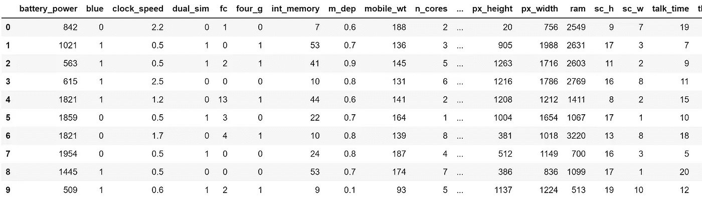
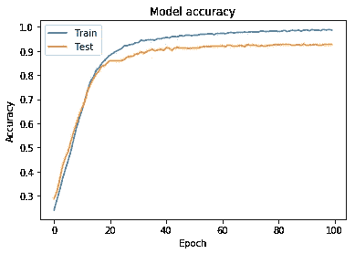
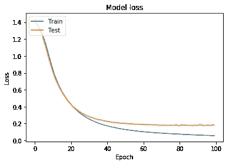

# 在喀拉斯建立我们的第一个神经网络

> 原文：<https://towardsdatascience.com/building-our-first-neural-network-in-keras-bdc8abbc17f5?source=collection_archive---------0----------------------->

报名参加我的计算机视觉直播课程:[https://bit.ly/cv_coursem](https://bit.ly/cv_coursem)

在本文中，我们将使用 keras 框架制作我们的第一个神经网络(ANN)。本教程是深度学习研讨会的一部分。我一更新课程，就会在下面给出链接。这个回购的 Github 链接就是这里的。链接到本教程的 jupyter 笔记本是[这里](https://github.com/sanchit2843/dlworkshop/blob/master/Lesson%204%20-%20Neuralnetworkkeras.ipynb)。

**索引**

1.  [机器学习和深度学习入门。](https://medium.com/@sanchittanwar75/introduction-to-machine-learning-and-deep-learning-bd25b792e488)
2.  [神经网络简介。](https://medium.com/@sanchittanwar75/introduction-to-neural-networks-660f6909fba9?postPublishedType=repub)
3.  [python 简介。](https://github.com/sanchit2843/dlworkshop/blob/master/Lesson%203%20-%20Introduction%20to%20python.ipynb)
4.  在喀拉斯建立我们的第一个神经网络。< — You are here
5.  [CNN 综合指南。](/a-comprehensive-guide-to-convolutional-neural-networks-the-eli5-way-3bd2b1164a53)
6.  [用 CNN 进行图像分类。](https://medium.com/@sanchittanwar75/making-our-first-cnn-based-project-using-keras-c3a7790b1e02)

在开始之前，我想概述一下如何构建任何深度学习项目。

1.  **预处理和加载数据-** 正如我们已经讨论过的，数据是神经网络工作的关键，我们需要在输入神经网络之前对其进行处理。在这一步中，我们还将可视化数据，这将有助于我们深入了解数据。
2.  **定义模型-** 现在我们需要一个神经网络模型。这意味着我们需要指定神经网络中隐藏层的数量及其大小，即输入和输出的大小。
3.  **损失和优化器-** 现在我们需要根据我们的任务定义损失函数。我们还需要指定优化器来使用学习率和优化器的其他超参数。
4.  **拟合模型-** 这是神经网络的训练步骤。这里我们需要定义我们需要训练神经网络的时期数。

拟合模型后，我们可以对测试数据进行检验，以检查是否存在过拟合的情况。我们可以保存模型的权重并在以后需要时使用它。

# 数据处理

我们将使用[移动价格区间分类器](https://www.kaggle.com/iabhishekofficial/mobile-price-classification)的简单数据。数据集由 20 个特征组成，我们需要预测手机所处的价格范围。这些范围分为 4 类。我们数据集的特征包括

```
'battery_power', 'blue', 'clock_speed', 'dual_sim', 'fc', 'four_g',
'int_memory', 'm_dep', 'mobile_wt', 'n_cores', 'pc', 'px_height','px_width', 'ram', 'sc_h', 'sc_w', 'talk_time', 'three_g','touch_screen', 'wifi'
```

在将数据输入我们的神经网络之前，我们需要以特定的方式使用它，所以我们需要相应地处理它。数据的预处理取决于数据的类型。这里我们将讨论如何处理表格数据，在后面的教程中，我们将处理图像数据集。让我们开始编码部分

```
#Dependencies
import numpy as np
import pandas as pd#dataset import
dataset = pd.read_csv(‘data/train.csv’) #You need to change #directory accordingly
dataset.head(10) #Return 10 rows of data
```

我们的数据集看起来像这样。



```
#Changing pandas dataframe to numpy array
X = dataset.iloc[:,:20].values
y = dataset.iloc[:,20:21].values
```

python 模块中讨论的代码将生成两个数组 X 和 y。X 包含特性，y 包含类。

```
#Normalizing the data
from sklearn.preprocessing import StandardScaler
sc = StandardScaler()
X = sc.fit_transform(X)
```

此步骤用于标准化数据。规范化是一种技术，用于将数组的值更改为通用比例，而不会扭曲值范围的差异。这是一个重要的步骤，您可以通过删除这一步骤来检查我们数据集上的精度差异。这主要是在数据集特性变化很大的情况下需要的，因为在我们的情况下，电池电量的值在 1000 左右，时钟速度小于 3。因此，如果我们将未标准化的数据输入神经网络，每一列的梯度将发生不同的变化，因此学习将会振荡。从这个[环节](https://www.quora.com/Why-do-we-normalize-the-data)进一步研究。

现在，X 将变为以下形式:

```
Normalized data:
[-0.90259726 -0.9900495   0.83077942 -1.01918398 -0.76249466 -1.04396559
 -1.38064353  0.34073951  1.34924881 -1.10197128 -1.3057501  -1.40894856
 -1.14678403  0.39170341 -0.78498329  0.2831028   1.46249332 -1.78686097
 -1.00601811  0.98609664]
```

下一步是对类进行热编码。一种热编码是将整数类转换成二进制值的过程。考虑一个例子，假设我们的数据集中有 3 个类，即 1、2 和 3。现在我们不能直接把它输入神经网络，所以我们把它转换成:

1- 1 0 0

2- 0 1 0

3- 0 0 1

现在这个类有了一个唯一的二进制值。形成的新数组的形状为(n，类的数量)，其中 n 是数据集中样本的数量。我们可以使用 sklearn 的简单函数来实现这一点:

```
from sklearn.preprocessing import OneHotEncoder
ohe = OneHotEncoder()
y = ohe.fit_transform(y).toarray()
```

我们的数据集有 4 个类，因此我们的新标签数组将如下所示:

```
One hot encoded array:
[[0\. 1\. 0\. 0.]
 [0\. 0\. 1\. 0.]
 [0\. 0\. 1\. 0.]
 [0\. 0\. 1\. 0.]
 [0\. 1\. 0\. 0.]]
```

现在我们的数据集已经处理完毕，可以输入神经网络了。

一般来说，最好将数据拆分为训练数据和测试数据。训练数据是我们用来训练神经网络的数据。测试数据用于检查我们训练好的神经网络。这个数据对于我们的神经网络来说是全新的，如果神经网络在这个数据集上表现良好，则表明没有过度拟合。点击阅读更多关于这个[的信息。](/train-test-split-and-cross-validation-in-python-80b61beca4b6)

```
from sklearn.model_selection import train_test_split
X_train,X_test,y_train,y_test = train_test_split(X,y,test_size = 0.1)
```

这将把我们的数据集分为训练和测试。训练数据将有 90%的样本，测试数据将有 10%的样本。这是由 test_size 参数指定的。

现在我们完成了无聊的部分，让我们建立一个神经网络。

# 构建神经网络

Keras 是一个构建神经网络的简单工具。它是一个基于 tensorflow、theano 或 cntk 后端的高级框架。

在我们的数据集中，输入有 20 个值，输出有 4 个值。因此输入和输出层分别是 20 和 4 维。

```
#Dependencies
import keras
from keras.models import Sequential
from keras.layers import Dense# Neural network
model = Sequential()
model.add(Dense(16, input_dim=20, activation=’relu’))
model.add(Dense(12, activation=’relu’))
model.add(Dense(4, activation=’softmax’))
```

在我们的神经网络中，我们使用了 16 维和 12 维的两个隐藏层。

现在我将逐行解释代码。

**Sequential** 向 keras 指定我们正在按顺序创建模型，我们添加的每一层的输出都是我们指定的下一层的输入。

**model.add** 用来给我们的神经网络增加一层。我们需要指定我们想要的图层类型作为参数。**密集**用于指定全连通层。Dense 的参数是输出维度，在第一种情况下是 16，输入维度是 20，在这种情况下要使用的激活函数是 relu。第二层是类似的，我们不需要指定输入维度，因为我们已经将模型定义为连续的，所以 keras 将自动认为输入维度与最后一层的输出相同，即 16。在第三层(输出层)中，输出维度是 4(类的数量)。正如我们之前所讨论的，输出层采用不同的激活函数，对于多类分类的情况，它是 softmax。

现在我们需要指定损失函数和优化器。这是使用 keras 中的编译函数完成的。

```
model.compile(loss='categorical_crossentropy', optimizer='adam', metrics=['accuracy'])
```

这里的损失是前面讨论过的交叉熵损失。Categorical _ crossentropy 指定我们有多个类。优化者是亚当。度量用于指定我们想要判断神经网络性能的方式。这里我们已经精确地指定了它。

现在我们已经完成了神经网络的构建，我们将对其进行训练。

# **培训模式**

在 keras 中，训练步骤很简单。用 model.fit 来训练它。

```
history = model.fit(X_train, y_train, epochs=100, batch_size=64)
```

这里我们需要指定输入数据-> X_train，标签-> y_train，历元数(迭代)和批量大小。它返回模型训练的历史。历史由每个时期后的模型精度和损失组成。我们稍后将会可视化它。

通常，数据集非常大，我们无法一次适应完整的数据，所以我们使用批量大小。这将我们的数据分成多个批，每个批的大小等于 batch_size。现在，只有这个数量的样本将被加载到存储器中并被处理。一旦我们完成了一个批处理，它将从内存中被刷新，下一个批处理将被处理。

现在我们已经开始训练我们的神经网络。

```
Epoch 1/100
1600/1600 [==============================] - 1s 600us/step - loss: 1.3835 - acc: 0.3019
Epoch 2/100
1600/1600 [==============================] - 0s 60us/step - loss: 1.3401 - acc: 0.3369
Epoch 3/100
1600/1600 [==============================] - 0s 72us/step - loss: 1.2986 - acc: 0.3756
Epoch 4/100
1600/1600 [==============================] - 0s 63us/step - loss: 1.2525 - acc: 0.4206
Epoch 5/100
1600/1600 [==============================] - 0s 62us/step - loss: 1.1982 - acc: 0.4675
.
.
.
Epoch 97/100
1600/1600 [==============================] - 0s 55us/step - loss: 0.0400 - acc: 0.9937
Epoch 98/100
1600/1600 [==============================] - 0s 62us/step - loss: 0.0390 - acc: 0.9950
Epoch 99/100
1600/1600 [==============================] - 0s 57us/step - loss: 0.0390 - acc: 0.9937
Epoch 100/100
1600/1600 [==============================] - 0s 60us/step - loss: 0.0380 - acc: 0.9950
```

训练大约需要一分钟。并且在 100 个时期之后，神经网络将被训练。训练准确率达到 99.5 %，从而训练出我们的模型。

现在，我们可以根据测试数据检查模型的性能:

```
y_pred = model.predict(X_test)
#Converting predictions to label
pred = list()
for i in range(len(y_pred)):
    pred.append(np.argmax(y_pred[i]))
#Converting one hot encoded test label to label
test = list()
for i in range(len(y_test)):
    test.append(np.argmax(y_test[i]))
```

这个步骤是热编码过程的逆过程。我们将使用这一步得到整数标签。我们可以使用一个简单的方法 keras，model.predict()对测试数据进行预测。它将测试数据作为输入，并将预测输出作为 softmax 返回。

```
from sklearn.metrics import accuracy_score
a = accuracy_score(pred,test)
print('Accuracy is:', a*100)
```

我们得到了 93.5%的准确率。

我们可以使用测试数据作为验证数据，并可以在每个时期后检查准确性。这将使我们了解仅在训练时的过度适应，我们可以在所有时期完成之前采取措施。我们可以通过将拟合函数更改为:

```
history = model.fit(X_train, y_train,validation_data = (X_test,y_test), epochs=100, batch_size=64)
```

现在，训练步骤输出也将包含验证准确性。

```
Train on 1600 samples, validate on 400 samples
Epoch 1/100
1600/1600 [==============================] - 1s 823us/step - loss: 1.4378 - acc: 0.2406 - val_loss: 1.4118 - val_acc: 0.2875
Epoch 2/100
1600/1600 [==============================] - 0s 67us/step - loss: 1.3852 - acc: 0.2825 - val_loss: 1.3713 - val_acc: 0.3175
Epoch 3/100
1600/1600 [==============================] - ETA: 0s - loss: 1.3474 - acc: 0.326 - 0s 50us/step - loss: 1.3459 - acc: 0.3231 - val_loss: 1.3349 - val_acc: 0.3650
Epoch 4/100
1600/1600 [==============================] - 0s 56us/step - loss: 1.3078 - acc: 0.3700 - val_loss: 1.2916 - val_acc: 0.4225
Epoch 5/100
1600/1600 [==============================] - 0s 74us/step - loss: 1.2600 - acc: 0.4094 - val_loss: 1.2381 - val_acc: 0.4575
.
.
.
.
Epoch 95/100
1600/1600 [==============================] - 0s 37us/step - loss: 0.0615 - acc: 0.9869 - val_loss: 0.1798 - val_acc: 0.9250
Epoch 96/100
1600/1600 [==============================] - 0s 43us/step - loss: 0.0611 - acc: 0.9850 - val_loss: 0.1812 - val_acc: 0.9225
Epoch 97/100
1600/1600 [==============================] - 0s 45us/step - loss: 0.0595 - acc: 0.9894 - val_loss: 0.1813 - val_acc: 0.9275
Epoch 98/100
1600/1600 [==============================] - 0s 44us/step - loss: 0.0592 - acc: 0.9869 - val_loss: 0.1766 - val_acc: 0.9275
Epoch 99/100
1600/1600 [==============================] - 0s 43us/step - loss: 0.0575 - acc: 0.9894 - val_loss: 0.1849 - val_acc: 0.9275
Epoch 100/100
1600/1600 [==============================] - 0s 38us/step - loss: 0.0574 - acc: 0.9869 - val_loss: 0.1821 - val_acc: 0.9275
```

我们的模型运行良好。现在，我们将可视化培训和验证损失和准确性。

```
import matplotlib.pyplot as plt
plt.plot(history.history['acc'])
plt.plot(history.history['val_acc'])
plt.title('Model accuracy')
plt.ylabel('Accuracy')
plt.xlabel('Epoch')
plt.legend(['Train', 'Test'], loc='upper left')
plt.show()
```



```
plt.plot(history.history['loss']) plt.plot(history.history['val_loss']) 
plt.title('Model loss') 
plt.ylabel('Loss') 
plt.xlabel('Epoch') 
plt.legend(['Train', 'Test'], loc='upper left') 
plt.show()
```



在下一章，我们将讨论用于图像数据的卷积神经网络(CNN)。如有任何疑问或我做错了什么，请评论。

和平…