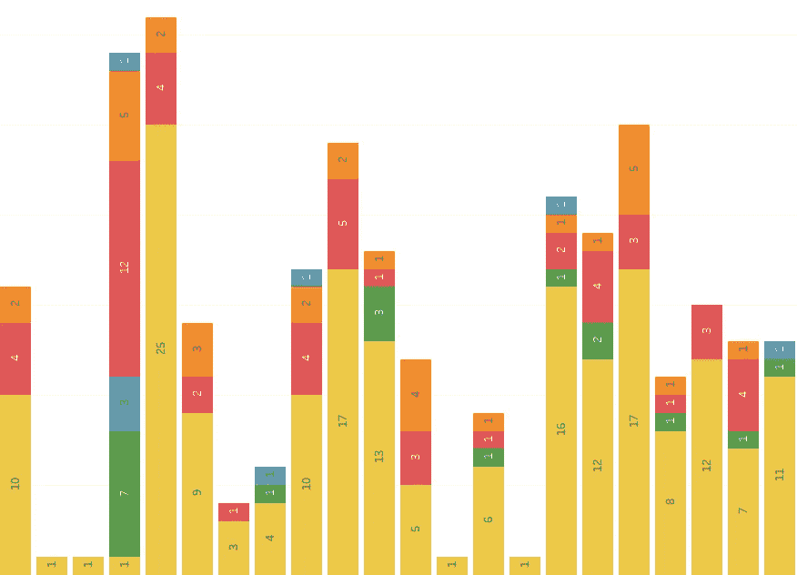
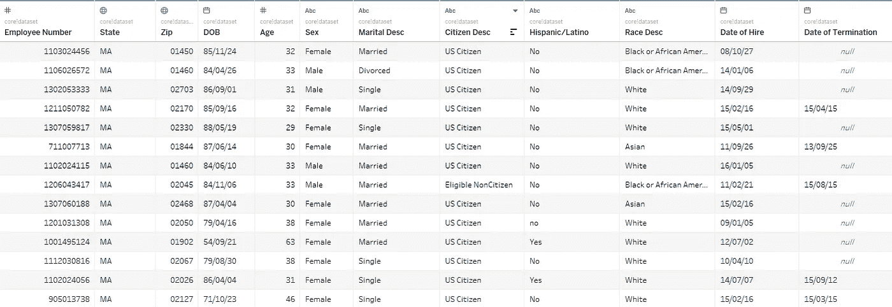
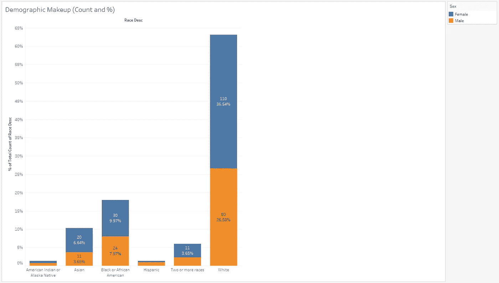
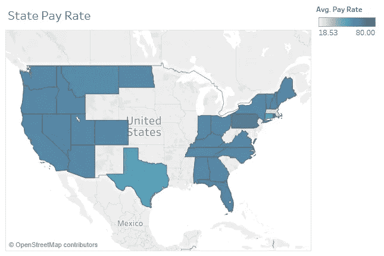
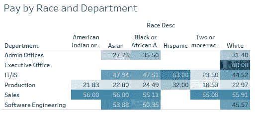
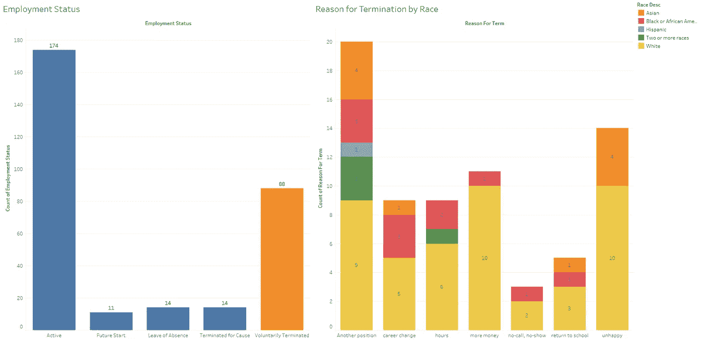
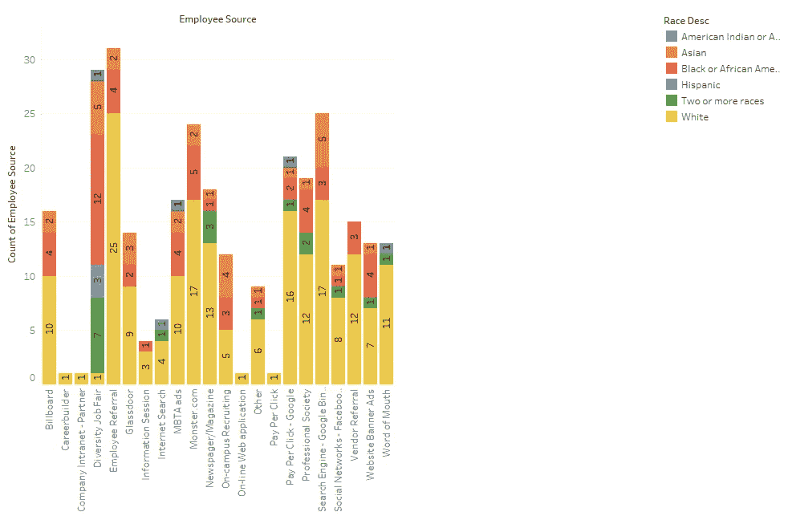

# 在 Tableau 中构建交互式仪表盘—员工流动率

> 原文：<https://towardsdatascience.com/building-out-interactive-dashboards-in-tableau-employee-turnover-c664d9e2de76?source=collection_archive---------26----------------------->

Tableau 是一个图形化的商业智能和分析平台，使人们能够快速连接到数据库，并构建图表、图形、地图和交互式仪表板。它功能强大，易于使用，而且有趣！

在这篇文章中，我将分享一个我围绕一组虚构的美国人口统计和员工流动数据创建的项目。

我们知道，员工流动是企业最大的开支之一:[认真点](https://www.peoplekeep.com/blog/bid/312123/employee-retention-the-real-cost-of-losing-an-employee)。

这个项目的资料可以在这里[下载。如果你想知道图表是如何构建的，工作簿可以从](https://www.kaggle.com/rhuebner/human-resources-data-set/home)[下载](https://public.tableau.com/profile/riley.predum#!/vizhome/HumanResourcesDataAnalysis-TurnoverRaceandSourcing/MARaceCount)。你只需要 [Tableau Public](https://public.tableau.com/s/) ，工作簿，和数据集。

现在，事不宜迟，我将深入我的分析。

## 设置

我使用 core_dataset.csv 文件，一旦我将它转换为。xlsx，以便 Tableau 可以加载它，我开始了。

首先，我检查了数据，看看哪些变量是可用的，它看起来像什么，以及我可能想进一步研究什么。

Glance at the data set (not all columns are visible here)

## 分析和图表

我知道我想看看性别和种族，看看它们是如何与工资率、部门和工作相关地分布的。我还想看看这些变量与离职率和员工离职原因的关系。所以首先，我需要看看这些的总体分布。

Demographics of the employees data set: count by sex and race

大多数雇员是白人女性，第二大群体是白人男性。第二个最普遍的种族是黑人雇员，第三个最普遍的种族是亚裔雇员。

为了理解工资率的差异，我从观察数据集中各州的平均工资率如何不同开始。

Average pay rate by state

然后，我按照种族和部门查看了更细致的薪酬水平。

Pay by race and department, colored to the same scale as the map above

从这张表中我们可以看到一些东西:

1.  只有白人雇员在行政办公室，这是工资最高的职位。
2.  西班牙裔员工的工资水平相对较高，但只在两个部门有代表。他们是 IT/IS 部门薪酬最高的群体。这是平均工资率，我在之前的条形图中看到，样本中很少有西班牙裔员工。因此，这不是一个非常准确的平均值。
3.  美国印第安人或阿拉斯加土著雇员的代表性同样不足。这在之前的条形图中也可以看到。
4.  销售、行政办公室、软件工程、IT/IS 是工资最高的部门。

然后，我研究了员工流动率，试图了解员工离开公司的原因。我很自然地专注于自愿的原因。

Employment status and reason for voluntarily quitting by race

看着图表，我发现大多数员工不管种族都跳槽了。第二个最常见的原因是工作中的不愉快。第三个最常见的原因是挣更高的工资。

为了提高员工保留率，我会根据这些数据推荐以下实施方案:

1.  进行广泛的离职调查/面谈，以了解公司如何改进，使人们不那么想离开去寻找其他机会(追溯方法)。
2.  在员工想要离开之前进行调查，旨在了解快乐、满意度等等。要考虑的领域可能包括文化准则、事件和社交、绩效评估等(预防性方法)。
3.  周转成本是巨大的。考虑给员工更多的钱来留住他们应该不是不可能的(预防性方法)。

公司的多样性对于促进文化理解和思想的多样性也很重要，而且已经证明能够催化创新。考虑到这一点，我按种族检查了员工来源，以了解这些公司在哪里能够为其员工队伍找到多样化的人才。

大多数多元化人才来自多元化招聘会。具有最多员工来源的箱是推荐。这是有道理的，也是常见的。这也是[雇佣](https://business.linkedin.com/talent-solutions/blog/2015/08/5-reasons-employee-referrals-are-the-best-way-to-hire)最便宜的方式。

可以根据不同渠道过去的表现来集中精力，就像市场营销中的归因模型如何帮助公司决定在哪里投资广告支出。

## 包扎

正如您在本文中看到的，Tableau 是一种对数据进行 EDA 并构建仪表板的快捷方式，同事可以根据自己的分析需求轻松使用和修改仪表板。这些都是在他们的[免费版](https://public.tableau.com/s/)中完成的！

完整的工作簿在我的 Tableau 个人资料[这里](https://public.tableau.com/profile/riley.predum#!/vizhome/HumanResourcesDataAnalysis-TurnoverRaceandSourcing/MARaceCount)。

在我的 [GitHub](https://github.com/rileypredum) 上查看更多项目。

如果你学到了新的东西，并且想把它送给下一个学习者，[考虑捐赠](https://www.patreon.com/rileypredum)你觉得合适的任何数量，谢谢！

感谢阅读和快乐编码！

奢侈的生活