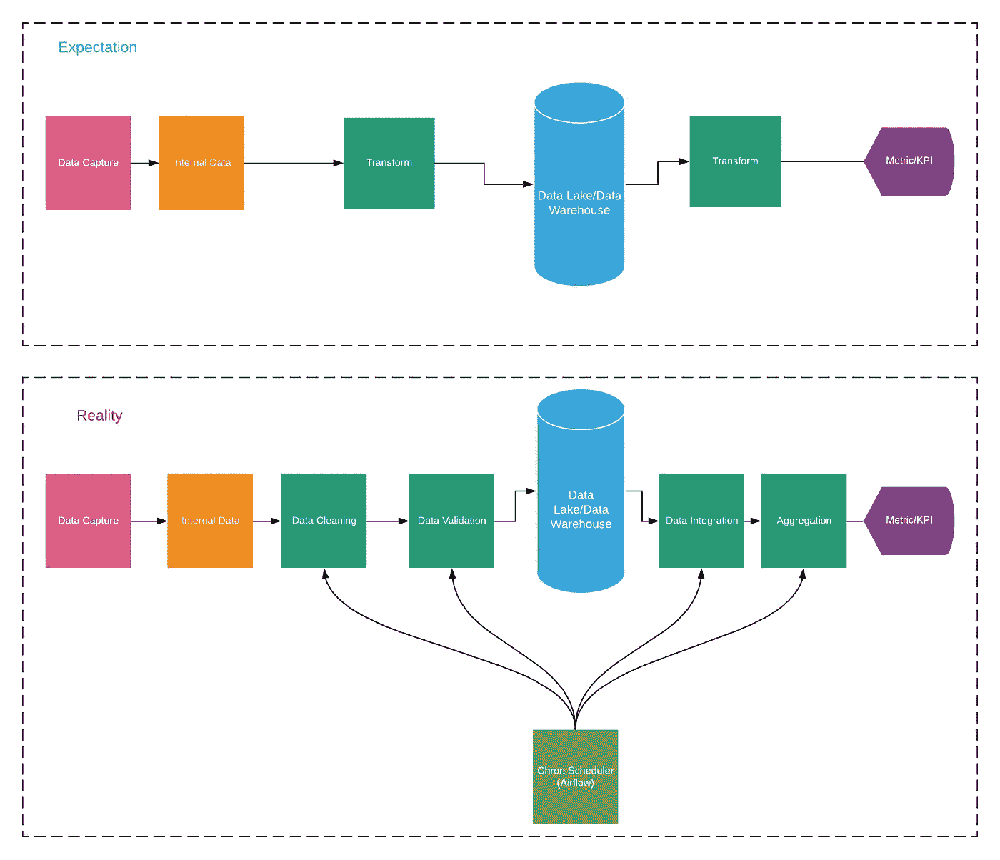
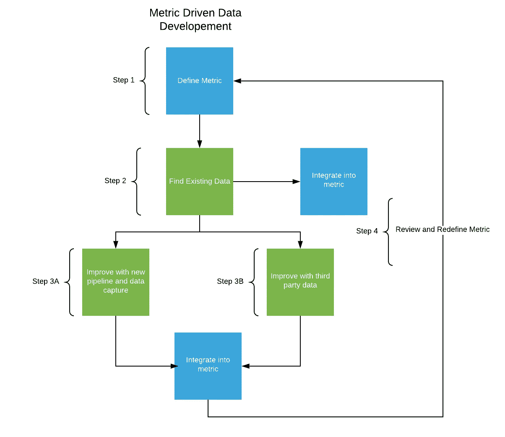
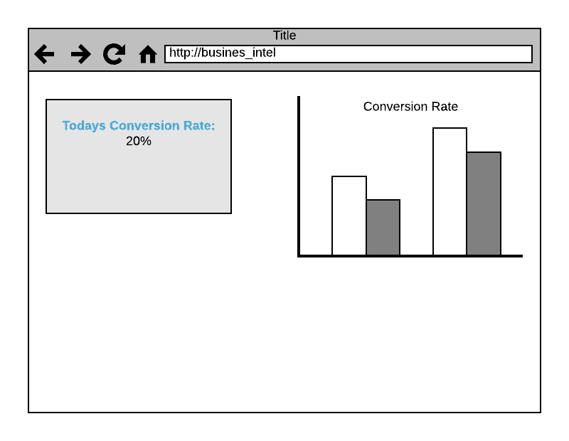

# 用有限的数据构建分析和数据湖功能

> 原文：<https://towardsdatascience.com/building-out-metrics-and-data-lake-with-limited-data-6c98ea2e8b2d?source=collection_archive---------21----------------------->

> 没有什么是完全独立存在的。每件事都与其他事相关。佛

许多组织，尤其是初创公司，遇到的一个非常普遍的问题是很少或没有数据。不幸的是，盲目操作和没有数据洞察力不再是一个选项。用数据操作就是简单的表桩；所有公司都利用数据来制定战略转变和日常决策。幸运的是，组织可以通过许多途径来获取更多数据。


# 建设数据管道的成本

一个常见的途径是尝试提取和输送每一个可能的数据集，无论是通过内部还是第三方来源，并寻找可能支持叙事的模式。这通常包括将所有东西放入湖中，对您的数据执行数据发现，然后使用相关数据集来构建仪表板和分析工具。

或者，相反的方向是预先定义所需的数据，并且只检索那些数据元素。这两种解决方案都有利弊。如果您提前将所有数据检索到您的数据湖中，那么当您想要快速构建和添加指标和报告时，需要做的工作会更少。但是，如果以按需方式检索数据，添加新的数据点将更加困难和耗时。

在这篇文章中，我主张预先清晰而周到地定义您的业务案例，以避免在构建不必要的数据管道上投入大量资金。这样做有几个原因。首先，这是一种灵活的方法，允许分阶段构建指标和分析，这意味着更快地交付数据产品。其次，构建数据管道比我们想象的要复杂。

引入每一个可用的数据点是昂贵的。对于数据交付来说，有一个**计划谬误**是很常见的，因为人们倾向于错误地假设事情不会出错，并且低估了集成数据的难度。在估算构建数据管道的成本时，经常会忽略数据质量清理、创建数据目录、集成数据集以及维护持续运行的管道的成本。



# **提高数据湖/分析能力的过程**

**开始自上而下**

解决这个问题的方法是从上到下开始。不要问我有什么可用的数据，如何从中获取最大的价值，而是问自己什么问题对业务最有意义，如何量化它。


这种方法类似于设计驱动开发的数据版本(我们将称之为**度量驱动开发**)。在设计驱动开发中，模型和/或用户界面是在开发软件之前建立的。这种方法迫使开发人员和业务用户更加注意他们引入的是什么类型的数据，并询问为什么这个特定的数据集有价值。它还减少了构建未充分利用的数据管道所花费的时间，使团队能够将精力集中在关键的数据管道上。

一个组织通常有 10-15 个组织指标，这些指标对于衡量其业务的成功和日常运营效率至关重要。组织指标，也称为 KPI 或关键绩效指标，是一个单一的数值或一组数值，可以随着时间的推移进行跟踪，以确定业务的总体方向。使用组织指标作为您需要引入分析的关键数据元素的指南。

**我已经拥有了什么？**

接下来，查看您已经可以访问的数据清单，问问自己如何使用该数据集来构建这些指标。

以最小可行产品的心态来建立这些指标。可用于估算 KPI 指标的最少可用数据量是多少？

使用这些数据点构建一个简化的指标。然后回到绘图板，头脑风暴如何改进这个指标。真正重要的是什么？什么是绒毛？例如，采用一个无处不在的指标，比如日浏览量(某一天有多少用户浏览你的网站)，并使它成为你的业务的个人指标。让业务的战略愿景和目标驱动您的度量标准的定义和构建。

**我能补充什么？**

接下来，引入什么样的数据集和数据点对构建更强大、更定制的组织指标最有价值。这里的目标是优化运营指标/KPI 的准确性。这甚至可能需要将指标分成多个子指标。例如，收入可以按照业务线、地域等进行划分..

一旦定义了这一点，下一步就是构建数据管道，将数据送入数据湖和报告层。这可能包括构建新的管道以从前端收集额外的数据点，以及从第三方数据源购买/收集数据。

同样重要的是要注意，某种程度的数据发现可能是必要的。然而，数据发现并不要求将数据通过管道传输到数据湖中。它可以简单到下载第三方 CSV 并用 SQL 或 Pandas 进行分析。

**继续完善你的指标**

最后，这个过程要细化。重新审视您的指标/KPI 并质疑它们从业务角度来看是否有意义以及如何改进是很重要的。这应该是您进一步扩大收集的数据并将其带入公司的驱动力。



# **深入探究一个真实的例子**

让我们深入一个从零开始构建组织 KPI 的具体示例，以更深入地说明这种方法。

在本例中，我们是一家电子商务时装零售商。我们的目标是增加销售数量，创造更多收入，发展我们的业务。因此，这家公司关心大约 10 个 KPI。这包括日常销售数量、新客户数量以及运营/物流成本的降低。出于这个例子的目的，我们真正关心的是转化率。转化率是查看产品或与在线商店互动并实际购买的用户数量。

转化率是一个直接的指标，表明我们的网上商店设计得有多好，以及我们的产品/植入式广告有多吸引人。低转换率可能表明设计不良的网上商店或劣质产品。

**客户转化率-使用现有数据**

我们从小处着手，询问有哪些数据可用。我们知道顾客购买了什么，我们从谷歌分析中知道有多少顾客浏览了一个页面。这为我们提供了一个简化的每日客户转换公式，即:

```
Customer Conversion = (Customer who made a purchase /Customer views) per day
```

然而，这是对客户转化的一种极端简单化的解释，没有告诉我们为什么客户不转化，也没有针对我们最感兴趣的客户。让我们使用我们的商业智能工具构建这个简化的指标，从湖中提取这些数据点。



为了改进这一指标，我们需要收集第三方数据源或在内部收集更多数据。然而，在我们这样做之前，我们应该仔细确定我们计划如何改进这个指标。

我们可以做很多事情来决定我们的页面在视觉上是否有效。一个计划是 A/B 测试该页面的两个版本，随机分配客户到任一页面，并跟踪两个版本的转换。此外，我们可能关心的另一个数据点是在页面上花费大量时间的用户，这意味着他们关心产品/商店并感兴趣，但不知何故没有足够的兴趣进行购买。

**建设额外的管道以改善关键绩效指标**


在这种情况下，我们希望知道用户在点击购买之前在页面上停留了多长时间，并且我们希望对在页面上停留了至少 30 秒的用户给予更多的重视或权重。

为了找到这些信息，我们需要收集用户在页面上花费时间的数据。具体来说，这意味着添加前端 javascript 代码，以根据 cookies 识别用户并跟踪他们在一个页面上花费的时间，然后将这些数据发送到日志，这些数据将被收集、提取并存储在数据湖中，并作为数据点呈现给商业智能工具。这是前端、后端和数据团队的共同努力。

首先，让我们确认这是一个对我们有用的数据点。让我们捕获这些数据的一个样本，比如说一天，将它添加到我们的日志中。然后，我们将手动解析日志，并在 excel 中创建指标。然后，让我们根据这一指标来确定这是否提供了有价值的见解。如果是这样，让我们把它建成一个完整的数据管道。

在构建数据管道时，需要在更彻底的数据质量检查和构建更快但不太健壮的管道之间进行权衡。如果这是一个将为公司范围的指标提供信息的数据点，那么添加彻底的检查以确保数据正确地从源移动到目标是很重要的。这意味着确保没有重复数据集、数据损坏或数据丢失。

同时，我们不确定这个数据点是否会持续。在不牺牲数据完整性的情况下，简化数据管道，以加快迭代速度。当一个数据点需要更长的时间，比如六个月，并且作为一个需求保持不变时，那么，在这一点上，巩固数据管道以变得更加健壮和可靠。如果你采用这种方法，要非常注意技术债务。

```
**Modified Customer Conversion** = (Customers who made a purchase/ Customers who viewed page greater than 30 seconds) per day
```

**第三方数据管道**

接下来，我们希望锁定符合我们特定人口统计标准的客户。我们的服装系列是专为中上阶层的成年人设计的。因此，我们希望增加特定年龄和收入水平的客户的权重。这不是我们可以在内部收集的数据。因此，我们需要从第三方来源购买(如果不容易通过开源数据获得)。


有很多第三方数据。我们需要缩小哪些数据点对改进指标至关重要，然后找到该数据点的最佳提供者。在这种情况下，我可以从 Equifax 购买这些数据。这将是一笔昂贵的重复购买。只有当他们清楚需要这些数据来增强他们的运营指标时，才应该购买。此外，人们仍然需要构建管道来接收这些第三方数据，并集成到他们更广泛的数据生态系统中，这既耗费资源又耗费时间。

如果可能的话，获取这些数据的样本(或者模型，如果没有的话),并首先确定这些数据在添加到您现有的指标中时是否真正有价值。一旦确定了这一点，就要构建您的数据管道来包含这一指标。

为第三方数据源构建管道同样耗费时间和资源，因为需要检查数据的质量。有时，第三方来源对数据源来说更具挑战性，因为在如何收集数据或数据的有效性方面可能不透明。在购买第三方数据之前，应该仔细评估第三方数据来源，明确如何使用这些数据。

```
**Modified Customer Conversion** = Customers who made a purchase/( Customers who view greater than 30 seconds and are between 18-30 with income > 40k) per day
```

**重新评估您的指标**

最后，定期重新审视你的公司指标并重新定义它们是很重要的。继续询问您可以收集或引入哪些数据点来改进您的指标。继续询问你的公司指标是否有意义。快速构建，经常失败，继续学习是在数据工作中取得成功的关键！

— — — — — — — — — — — — — — — — — — — — — — — — — —

特别感谢 Linda Yan 对战略思考过程的投入。琳达是 Blackboard Insurance 的现任战略主管，也是麦肯锡公司的前顾问。