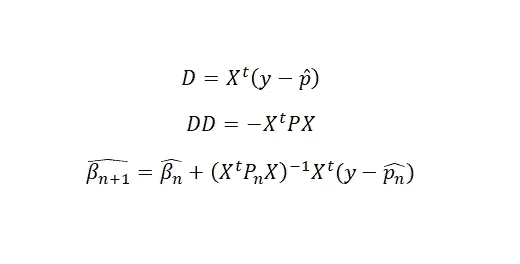

# 在 R 中构建自己的逻辑分类器[逻辑三部曲，第 2 部分]

> 原文：<https://towardsdatascience.com/building-own-logistic-classifier-in-r-logistic-trilogy-part-2-a36be209d2c?source=collection_archive---------25----------------------->

如果有人从为数据科学项目或统计项目开发自己的代码中获得了巨大的乐趣，那么这就是适合他/她的文章。

你可能在 R，
***glm(y~x，data，family=binomial)中用过或者学过 glm 函数。*** 对提供的数据进行逻辑回归拟合，取 y 为响应变量，x 为预测变量。但你有没有想过背后到底发生了什么？如果我们能理解这一点，我们能在 R 中为逻辑构建我们自己的函数吗？让我们一起试试。只有一个条件，我们将限制自己只进行二元分类。

开发一个模型首先需要什么？数据，分析中最重要的部分。我们需要一个可以是 1 或 0 的响应变量 Y 和 p 个预测变量 X1，X2，…，Xp。假设观察总数为 n。每个模型都有一些假设，

一般来说，假设是-

1.  Yi 是独立的，并且每个 Yi 遵循具有参数 **pi** 的伯努利分布
2.  预测因子 X1，X2，…Xp 是不相关的

在逻辑框架下，假设是 **pi=**


Logistic Inverse link function (CDF of standard Logistic Distribution)

那么可能性函数是-


因此对数可能性是-


经过简化，它可以归结为以下内容(我不包括这些步骤，因为键入方程仍然是一项单调乏味的任务😅)


其中β是维数为(p+1)×1 的参数向量，xi 是 1×(p+1)阶的第 I 个观测向量。那就是***Xi =【1x1i x2i x3i…xpi】。*** 现在我们需要训练的模型无非是根据手头的数据估计未知的参数。虽然有几种估计方法，但最大似然估计因其简单而被广泛使用。参数的最大似然是


让我们找到对数似然函数相对于参数向量的一阶导数，


> β向量的极大似然估计必须满足条件 D=0。是不是很美？
> 易-皮只不过是用皮预测易所犯的错误。它表明误差和预测值是正交的。在简单线性回归的情况下，这不是第一正规方程所说的吗？

我们使用逻辑回归，因为线性回归模型的假设在分类响应变量的情况下不满足。但是我们又回到了线性模型。这就是回归理论的妙处。真是太神奇了。

但不幸的是，不那么神奇的是，上述方程没有封闭形式的解。😥😥😥😥😥

我们需要一些优化技术。**梯度下降**和**牛顿-拉夫森**法可能是应用最广泛的。这里我坚持使用牛顿-拉夫森方法(这样我就不需要调整学习速度)。

我不打算深入研究牛顿-拉夫逊方法。粗略地说，它通过如下迭代过程找到函数 f(x)的根


并且当两个连续步骤的输出之间的差异变得太小时，我们停止。在我们的情况下，我们需要找到对数似然函数的一阶导数的根。


一阶导数我们已经找到了，二阶导数是


它拥有另一种美。这一项总是负的，或者就矩阵而言，它总是负定矩阵。**Logit 模型的似然函数满足全局凹性。D=0 的解总会使可能性最大化。**

由于我们要处理不止一个预测值，让我们找出上述量的矩阵对应项，



在哪里，

1.  x 是 N 阶 x (p+1)预测值的矩阵，第一列全为 1。
2.  y 是响应变量的列向量。
3.  p-hat 是更新概率 P[Y=1| X=x]的列向量。
4.  p 是 N×N 对角矩阵，第 I 个对角元素是 pi(1-pi)。
5.  n 表示第 n 次迭代。

我们的理论背景已经准备好了，现在是编码的时候了。我在这里用 R。

```
#at first lets write a function to find the pi values for given predictors and betas#x is the matrix of predictors, param is the vector of betas**pi_finder=function(x,param){**
 **pi=array(dim=1)**               #initializing an array
 **for(i in 1:nrow(x)){**
  **val=0**                        #temporary variable
  **for(j in 1:ncol(x)){
   val=val+x[i,j]*param[j]**     #x[i,j]=ith value of jth predictor
  **}
  pi[i]=1/(1+exp(-val))
 }
return(pi)**                     # it will return the updated pi
**}**#now lets write a function to construct the P matrix
#as input we only need the pi values**P_matrix_finder=function(pi){** 
 **P=diag(pi*(1-pi))**   #diagonal matrix with ith diagonal=pi(1-pi)
 **return(P)**           #returning the matrix
**}**#and finally the logistic function equivalent to glm.
# as input it will take the matrix of predictors, response variable and the precision for the convergence of Newton Raphson method.**logistic_own=function(predictor,response,precision){**
 **predictor_new=as.matrix(predictor)**   # just to be on the safe side
 **distinct=sort(unique(as.numeric(response)),decreasing=FALSE)
 response_new=array(dim=1)
 for(i in 1:length(response)){
  if(response[i]==distinct[1])
   response_new[i]=0
  else
   response_new[i]=1**
 **}**                     #in case response is in factor (not numeric)
 **constant=rep(1:length(response_new))**  #the first column of X matrix
 **X_matrix=cbind(constant,predictor_new)**
 **beta=rep(0,ncol(X_matrix))**          #initializing beta to 0 vector
 **dif=100**              #since do while loop does not exist in R  :(
 **while(dif>precision){
  pi=pi_finder(X_matrix,beta)
  P=P_matrix_finder(pi)
  updated=solve(t(X_matrix)%*%P%*%X_matrix)%*%t(X_matrix)%*%(response_new-pi)** 
  **beta=beta+updated**   #updating beta 
  **dif=sum(updated^2)**   #euclidean distance between old and new beta
 **}
 return(beta)
}**
```

模型培训框架完成。我一直保持简单。*多类分类会失败。*

我们要不要在数据集上试一试，并与 glm 函数的结果进行比较？我正在使用著名的*虹膜数据集。*

```
**library(datasets)
iris=iris
iris_new=iris[which(iris$Species!="setosa"),]** #taking only 2 outputs
```

数据看起来像这样:


```
#train test split. I am considering 75:25 ratio
**samples=sample(1:nrow(iris_new),size=nrow(iris_new)*0.75,replace=F)**
**iris_new_train=iris_new[samples,]**   #training data
**iris_new_test=iris_new[-samples,]**   #test data#model training using glm function
**inbuilt=glm(Species~Sepal.Length+Sepal.Width+Petal.Length+Petal.Width,data=iris_new_train,family=binomial(link="logit"))
inbuilt$coefficients**
```

输出是


让我们试试我们的功能，

```
**model=own_logistic(iris_new_train[,1:4],iris_new_train[,5],0.000000001)
model**
```


答对了。！！！！！！！！！！😀😀😀

但是工作还没有完成，我们仍然需要测试我们的模型。R 中有一个内置函数 **predict** ，它给出了测试数据点的预测概率。我们能开发类似的东西吗？

我们当然可以。我们已经有了训练好的系数。只需要测试数据集。

```
#takes our model output and test data predictors as inputs
**fitted=function(model,test_data_predictors){
  predictors=as.matrix(test_data_predictors)
  constant=rep(1,nrow(predictors))
  X_matrix=cbind(constant,predictors)
  pred=pi_finder(X_matrix,model)**   # the predicted probabilities
  **return(pred) 
}**
```

在 R 中使用内置函数:


让我们看看我们的函数给出了什么:


这有点笨拙，让我们把它们放在一起:

```
**R_inbuilt_pred=predict(inbuilt,iris_new_test[,1:4],type="response")
Our_own_pred=fitted(model,iris_new_test[,1:4])
cbind(R_inbuilt_pred,Our_own_pred)**
```


> 恭喜你！！！！！你已经学会了如何为二元分类创建自己的逻辑分类器。

编写自己的代码是一个很好的实践。这样你会变得更有创造力，并且对不同的最大似然算法的背景理论有很强的把握。

如果你需要通过创造力来理解逻辑回归背后的思想，你可以去看看我之前的文章 [**逻辑回归——源自直觉【逻辑三部曲，第 1 部分】**](/logistic-regression-derived-from-intuition-d1211fc09b10) 。你自己将从纯粹的直觉和逻辑中推导出逻辑回归。

[](/logistic-regression-derived-from-intuition-d1211fc09b10) [## 逻辑回归——源自直觉

### 让我们通过一个故事从头开始推导逻辑回归。我希望这将是有趣和好玩的…

towardsdatascience.com](/logistic-regression-derived-from-intuition-d1211fc09b10) 

创造力和创新在任何领域都非常重要。它会把你和其他人分开。最重要的是，数据科学家需要有创造力。

如果你不相信，或者有任何疑问或建议，请在评论区提问，或者通过我的 LinkedIn 个人资料联系我。

[](https://www.linkedin.com/in/soumalya-nandi-95176569/) [## SOUMALYA NANDI -联合健康组织(L2)助理数据科学家| LinkedIn

### 查看 SOUMALYA NANDI 在全球最大的职业社区 LinkedIn 上的个人资料。SOUMALYA 有 4 份工作列在…

www.linkedin.com](https://www.linkedin.com/in/soumalya-nandi-95176569/)