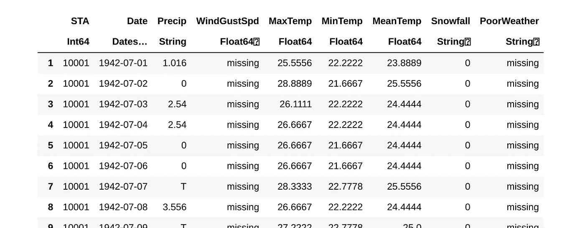
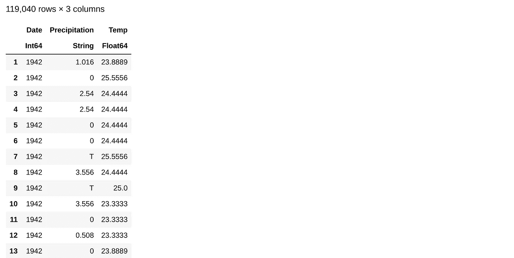
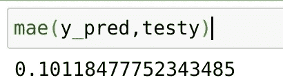

# 在 Julia 中用车床 0.0.7 构建管道(不稳定)

> 原文：<https://towardsdatascience.com/building-pipelines-with-lathe-0-0-7-unstable-in-julia-f7ba1850bde3?source=collection_archive---------36----------------------->


数据科学的很大一部分是数据科学的一个子集，称为数据工程。数据工程(DE)涉及各种格式的管道、管理和端点数据。好消息是，有了车床 0.0.7，我们可以非常容易地设计一个模型，并用管道进行预测。这个基本版本将会有进一步的改进。但就目前而言，它肯定会是一个非常有用的工具，而且说实话，它是多么容易做到令人难以置信。我期待着进一步扩大这个一揽子计划。

今天，我将向大家展示 Julia、Lathe、JLD2 和 Genie 在管道建设领域的成就。

> [笔记本](https://github.com/emmettgb/Emmetts-DS-NoteBooks/blob/master/Julia/Linear%20Regression%20Pipeline%20on%20WW2%20Weather.ipynb)

> 加载数据

为了训练一个模型，我们需要数据。我在 Kaggle 上发现了[这个很酷的数据集](https://www.kaggle.com/smid80/weatherww2/data?fbclid=IwAR2QgHmPywxqe5eY-sskQ5K8_jkjPfcLLoLJUyc6DNwDINjK9euc4gd6TDg)，所以我决定尝试一下。现在我们有了一个数据集，我们可以把它读入 Julia:

```
using CSV
df = CSV.read("Summary of Weather.csv")
```



快速浏览之后，我选择了三个我认为容易追踪和理解的不同特征。首先，我决定将每个日期戳限定为带有日期和数据框的年份:

```
using DataFrames
using Dates
df.Date = [i = DateTime(i) for i in df.Date]
df.Date = [i = year(i) for i in df.Date]
```

> 然后提取我提到的那些特征:

```
df = DataFrame(:Date => df.Date,:Precipitation => df.Precip,:Temp => df.MeanTemp)
```



除了其他特性，这些特性实际上是相对干净的，没有丢失值。现在我们已经有了三个特性，但是仍然不知道应该为目标选择什么，我们可能应该做一些统计测试！虽然这对于像多元线性回归这样的模型来说并不重要，但是我们还没有在车床上实现它。

> 我们可以用 Lathe.stats 做一些快速的 f 检验！

通过使用过滤器，我们可以在 Julia 中基于带有掩码的条件来分离我们的数据！方法，或者通过在数组上循环。

```
high_dfy = df[(df[:Date].>=1944),:]
```

执行我们的 f 检验:

```
using Lathe.stats: f_test
f_test(high_dfy.Temp,df.Temp)0.43963490045765957
```

> 不幸的是，我们必须接受这个零。

我决定使用这个特性，因为我并不真的像演示如何做那样追求准确性，所以接下来我使用 Lathe.preprocess 来测试 splitted。

```
using Lathe.preprocess: TrainTestSplit
train,test = TrainTestSplit(df)
```

在我看来，这是设定您的功能和目标的最佳方式:

```
target = :Temp
feature = :Date
trainX = train[feature]
trainy = train[target]
testX = train[feature]
testy = train[target]
```

对于这个例子，我选择了带有标准标量的线性最小二乘回归，不是为了太简单，而是为了说明问题:

```
using Lathe.models: LinearLeastSquare
using Lathe.preprocess: StandardScalar
```

现在我们必须将标准标量应用于 X:

```
trainX = StandardScalar(trainX)
```


现在，我们可以快速构建我们的模型:

```
model = LinearLeastSquare(StandardScalar(trainX),trainy,:REG)
```

> 请注意:REG 符号！

我们可以，如果我们在用一个更现实的模型工作(这里没有足够的时间进行线性回归，大约 4 年可以更好地进行分类)，我想验证它。假设我们测试了分裂训练，我们应该继续验证它。

```
using Lathe.models: predict
y_pred = predict(model,StandardScalar(testX))using Lathe.validate: r2,mae
```



我想指出的是，如果我们聪明地使用代码，我们可以用 4 行代码预测测试集，

> 包括进口

```
using Lathe.models: LinearLeastSquare, predict
using Lathe.preprocess: StandardScalar
model = LinearLeastSquare(StandardScalar(train.Year),train.Temp,:REG)
y_pred = predict(model,test.Year)
```

现在我们有了模型，我们如何在管道中实现标准标量和模型。

```
using Lathe.pipelines: Pipeline,pippredict
pipe = Pipeline([StandardScalar],model)
```

> 注意:将来，车床.管道将合并到车床.模型中，车床. nlp 也将合并到车床.预处理中。

现在我们可以使用 pippredict 方法进行预测，但在未来，它将只是来自车床模型的预测方法。

```
pippredict(pipe,testy)
```

现在我们可以使用 JLD2 来用宏序列化我们的结构。

```
using JLD2
[@save](http://twitter.com/save) "algorithm.jld2" pipe
```

我们可以像这样重新加载它:

```
[@load](http://twitter.com/load) "algorithm.jld2"
```

该结构将被添加到局部变量中，您可以再次执行以下操作:

```
pippredict(pipe,testy)
```

# 开发我们的管道

不幸的是，Julia 目前受到其软件包基础的限制，尽管它确实有 Pycall。我们唯一的本地 Julia 选项是 Genie。好消息是:精灵是相当可怕的！

实际上有一个超级简单的方法可以完全通过管理员命令来完成。像往常一样，首先我们需要进入我们的终端/SSH 客户端，并通过 SSH 连接到我们的服务器。

```
ssh emmett@----------
```

我也将通过 nautilus 传输 algorithm.jld2 文件。我的文件最终是 5.5 kb，因为 JLD2 实际上是一个非常令人印象深刻的压缩算法。

现在，我们将使用 Julia 在服务器中快速创建管道:

```
sudo mkdir /var/www/--------
```

如果您没有安装 julia，请获取:

```
sudo dnf install julia
```

然后在你的终端中输入“朱丽亚”进入朱丽亚 press，然后按]，这将带你进入 Pkg REPL。添加精灵:

*   添加“精灵”

现在用退格键离开 pkg repl，用 ctrl 或 command + D 离开 repl

现在我们要配置 NGINX 并获得一个精灵服务器设置。我们需要制作一个 NGINX 配置文件，将网站指向一个套接字端口，以便在其上执行代码。在这一点上，你将取代--用你的 IP/域名。

```
server {
    listen 80;
    server_name -----------;location / {
        proxy_pass [http://127.0.0.1:8000](http://127.0.0.1:8000);
        proxy_set_header Host $host;
        proxy_set_header X-Forwarded-For $proxy_add_x_forwarded_for;
    }
}
```

配置完 NGINX 之后，我们可以继续测试我们的配置。导航回我们之前创建的目录，并放入我们的 NGINX 配置中

```
cd /var/www/---------
```

您的算法应该包含在该文件夹中。现在，我们可以在终端内部使用所有文件。

```
route("/") do
       [@load](http://twitter.com/load) "algorithm.jld2"
       year = haskey([@params](http://twitter.com/params), :year)
       y_pred = pippredict(pipe,year)
       return(y_pred)
end
```

这是我做的一个:params 宏允许你基于符号获取参数，类似 Flask 中的 request.args()。

现在我们只需输入

> 向上()

并导航到我们的 NGINX 配置的 IP，如果您没有为此破例，您应该会得到一个空返回，但如果您输入一年，例如我的:

```
[http://45.56.119.8/?year=1955](http://45.56.119.8/?year=1955)
```

> (不确定该链接将存在多长时间)

但是还有一个大问题。我们的服务器将停止，如果我们退出这个朱莉娅 REPL，所以你必须保持这个终端永远开放。

> 开个玩笑…

我们将不得不创建一个真正的精灵应用程序来为我们做计算。首先，把你的工作目录转到我们用 NGINX 提供的 www 文件夹。

```
cd /var/www/-------
```

现在进入朱莉娅·REPL，加载精灵并运行`Genie**.**newapp_webservice() like so:`

```
julia
using Genie
Genie**.**newapp_webservice("app")
```

这将创建几个目录，但很可能在一个全新的文件夹中，该文件夹名为“无论您如何命名您的应用程序”,因此我们可以使用以下内容将其上移:

```
mv app/* .
rmdir app
```

现在用 nano 制作一个名为 Project.toml 的新文件。

```
nano Project.toml
```

> 注意:没有 Project.toml 文件，精灵不会启动

接下来，我们需要依赖 UUIDs。要获得这些，我们必须进入该项目的 github 页面，并像这样构造结果:

```
name = "WWPipe"
authors = ["emmett [emmett@emmettboudreau.com](mailto:emmett@emmettboudreau.com)"][deps]
JLD2 = "033835bb-8acc-5ee8-8aae-3f567f8a3819"
Lathe = "38d8eb38-e7b1-11e9-0012-376b6c802672"
```


[deps]部分之后的代码是包的 UUIDs。您可能不需要配置[deps],因为我们正在运行我们自己的 VPS 但是把它们放进去仍然是个好习惯。

现在，在我们编辑任何东西之前，我们首先需要激活我们的精灵环境，然后安装我们的两个 dep。我们可以使用 bin/repl 从项目的根目录访问 REPL。注意:如果在任何尚未安装的文件中调用了依赖项，REPL 将无法加载，因此最好先这样做。

```
-$ bin/repl
```

几分钟后，我们的 REPL 将上升，我们可以添加车床和 JLD2

```
]
pkg> add "Lathe"#Unstable
pkg> add JLD2
```

现在一直退格，直到 Julia 包装文本闪烁，并按 CTRL/Command + D，这将把我们带回 bash。现在要测试您的服务器，您可以简单地运行 bin/server:

```
-$ bin/server
```

现在我们需要编辑我们的 routes 文件来添加一些逻辑。

```
nano routes.jl
```

这就是我的结局:

```
using Genie.Router
using Lathe.pipelines: pippredict
using JLD2
route("/") do
      [@load](http://twitter.com/load) "algorithm.jld2"
      year = haskey([@params](http://twitter.com/params), :year)
      y_pred = pippredict(pipe,year)
      return(y_pred)
end
```

load 宏将我们的管道对象作为可变结构 pipe 加载。我们采用函数 pippredict(很快将使用 Lathe.models: predict)并插入我们的请求参数。当然，我们会返回结果。

现在我们有了一个包含文件和所有内容的工作服务器，我们需要一个管理员来为我们运行服务器。首先，如果您没有 supervisor，请安装它:

```
sudo dnf install supervisor
```

现在我们需要为主管做一个配置。所以纳米一上来！

```
sudo nano /etc/superviser/conf.d/genieapp.conf
```

启动 Genie 服务器的 sh 命令是 bin/server，所以我的配置看起来有点像这样:

```
[program:genie]
directory=/var/www/45.56.119.8/
command=/var/www/45.56.119.8/bin/server
autostart=true
autorestart=true
stopasgroup=true
killasgroup=true
```

现在我们需要重新启动我们的主管:

```
sudo systemctl reboot
```

等待几分钟，因为 Genie 可能需要重新编译您的依赖项，希望它会出现！

我真的很期待用 Genie 构建更复杂的算法！Genie 最大的弱点是缺乏文档，但是最近这越来越不真实了。我迫不及待地想看看我用这些奇妙的工具开发了什么！我们现在唯一能做的就是继续写作，继续承诺；车床几乎进入 0.1.0 版本，这是令人难以置信的兴奋！如果你想把承诺推到车床上，请这样做！车床不稳定可从这里获得:

> [车床](https://github.com/emmettgb/Lathe.jl/tree/Unstable)