# 用 OpenCV 和 OpenCV Contrib 构建 Python 源代码

> 原文：<https://towardsdatascience.com/building-python-source-with-opencv-and-opencv-contrib-ba95d709eb?source=collection_archive---------12----------------------->

## 从源代码在 Ubuntu 14.0 LTS 上安装 Python 3.7


Photo by [sarandy westfall](https://unsplash.com/@sarandywestfall_photo?utm_source=medium&utm_medium=referral) on [Unsplash](https://unsplash.com?utm_source=medium&utm_medium=referral)

从源代码在 Ubuntu 14.0 LTS 上安装 Python 3.7

1.  首先，更新包列表，并从源代码安装构建 Python3.7 所需的包:

```
sudo apt update
sudo apt install build-essential zlib1g-dev libncurses5-dev libgdbm-dev libnss3-dev libssl-dev libreadline-dev libffi-dev wget
```

2.使用下面的 [wget](https://linuxize.com/post/wget-command-examples/) 命令从 [Python 下载页面](https://www.python.org/downloads/source/)下载最新版本的源代码，或者将其下载到下载文件夹中。

```
wget https://www.python.org/ftp/python/3.7.4/Python-3.7.4.tgz
```

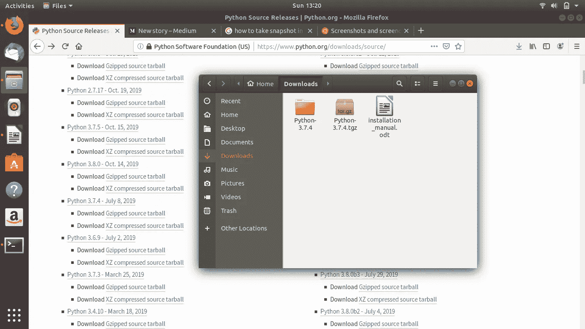

3.下载完成后，[解压压缩的 tarball](https://linuxize.com/post/how-to-extract-unzip-tar-gz-file/) :

```
cd Downloads/
tar -xf Python-3.7.4.tgz
```

4.接下来，[导航](https://linuxize.com/post/linux-cd-command/)到 Python 源目录并运行`configure`脚本，该脚本将执行大量检查以确保系统上的所有依赖项都存在。启用优化将通过运行多个测试来优化 Python 二进制文件。这使得构建过程更慢。

`cd Python-3.7.4 ./configure --enable-optimization`

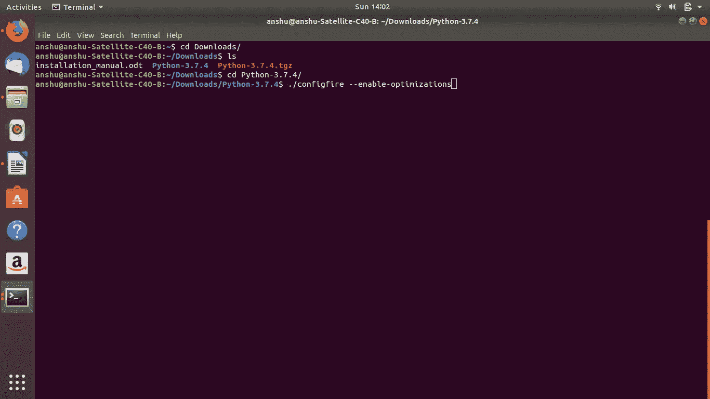

5.使用`make`启动 Python 构建过程:

`make -j 8`

为了加快构建时间，请根据处理器修改-j 标志。如果你不知道你的处理器的核心数，你可以通过捆绑 nproc 命令找到它。系统使用 8 个内核，所以我使用-j 8 标志。

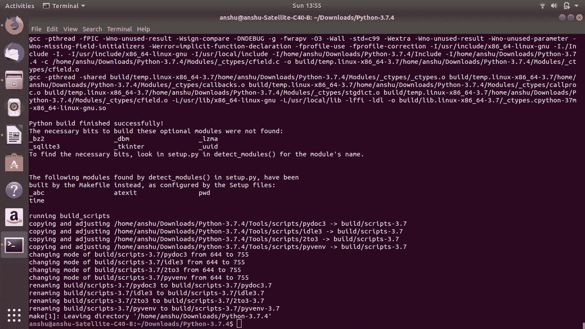

6.构建完成后，通过运行以下命令安装 Python 二进制文件:

`sudo make altinstall`

不要使用标准的`make install`，因为它会覆盖默认的系统 python3 二进制文件。

7.就是这样。Python 3.7 已经安装完毕，随时可以使用。键入以下命令进行验证:

`python3.7 --version`

输出将显示 Python 版本:

`Python 3.7.4`

用 Python3.7 源码安装 OpenCV 和 OpenCV_contrib 源码

1.  [从 Github 开放 CV 版本下载 OpenCV](https://github.com/opencv/opencv/releases/tag/4.1.2) [下载 OpenCV_contrib](https://github.com/opencv/opencv_contrib/releases/tag/4.1.2) 。

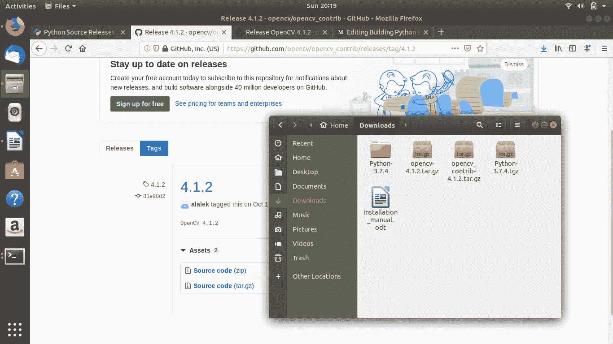

2.首先，更新包列表并安装从源代码构建 OpenCV 所需的包:

```
sudo apt-get install build-essential checkinstall yasm
sudo apt-get install cmake git gfortran libgtk2.0-dev libgtk-3-dev pkg-config libavcodec-dev libavformat-dev libswscale-dev
sudo apt-get install libtbb2 libtbb-dev libjpeg-dev libpng-dev libtiff-dev jasper libdc1394-22-dev
sudo apt-get install libavcodec-dev libavformat-dev libswscale-dev libv4l-dev
sudo apt-get install libxvidcore-dev libx264-dev libx265-dev
sudo apt-get install libatlas-base-dev gfortran
sudo apt-get install libwebp-dev
sudo apt-get install cmake-curses-gui
sudo apt install qtcreator
sudo apt install qt5-default
sudo apt-get install libgstreamer1.0-0 gstreamer1.0-plugins-base gstreamer1.0-plugins-good gstreamer1.0-plugins-bad gstreamer1.0-plugins-ugly gstreamer1.0-libav gstreamer1.0-doc gstreamer1.0-tools gstreamer1.0-x gstreamer1.0-alsa gstreamer1.0-gl gstreamer1.0-gtk3 gstreamer1.0-qt5 gstreamer1.0-pulseaudio
sudo apt -y install libtiff5-dev
sudo apt -y install libxine2-dev
sudo apt -y install libfaac-dev libmp3lame-dev libtheora-dev
sudo apt -y install libvorbis-dev
sudo apt -y install libopencore-amrnb-dev libopencore-amrwb-dev
sudo apt -y install libavresample-dev
sudo apt -y install x264 v4l-utils
sudo apt -y install libprotobuf-dev protobuf-compiler
sudo apt -y install libgoogle-glog-dev libgflags-dev
sudo apt -y install libgphoto2-dev libeigen3-dev libhdf5-dev doxygen
sudo apt-get install libqt5x11extras5-dev qttools5-dev
sudo apt-get install openexr libopenexr-dev
sudo apt-get install libx11-dev libboost-python-dev
```

3.转到下载并解压缩 OpenCV 和 OpenCV_contrib 模块。

```
cd Downloads/
tar -xf opencv-4.1.2.tar.gz
tar -xf opencv_contrib-4.1.2.tar.gz
```

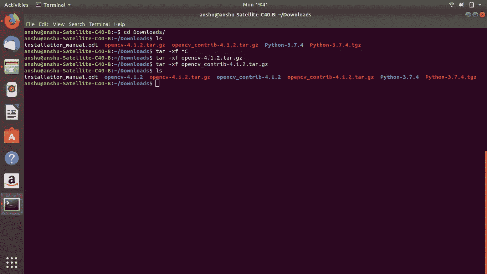

4.创建一个名为 Development 的新文件夹，以拥有一个虚拟 python 环境。

```
cd ..
mkdir Development
cd Development
python3.7 -m venv OpenCV_Python3.7 
```

现在检查您的 Python 虚拟环境是否已经创建。转到 OpenCV_Python3.7/bin 并查找 activate

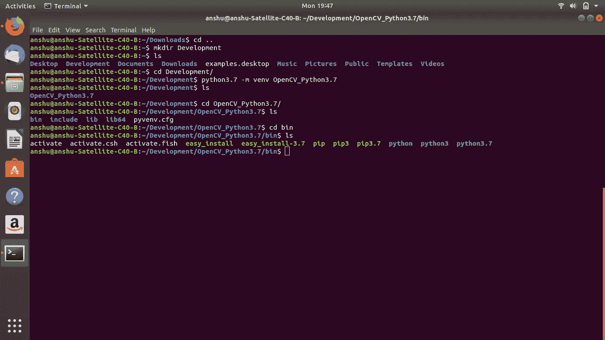

5.激活 Python 虚拟环境

```
cd
source /home/anshu/Development/OpenCV_Python3.7/bin/activate
pip install numpy
sudo apt-get update
```

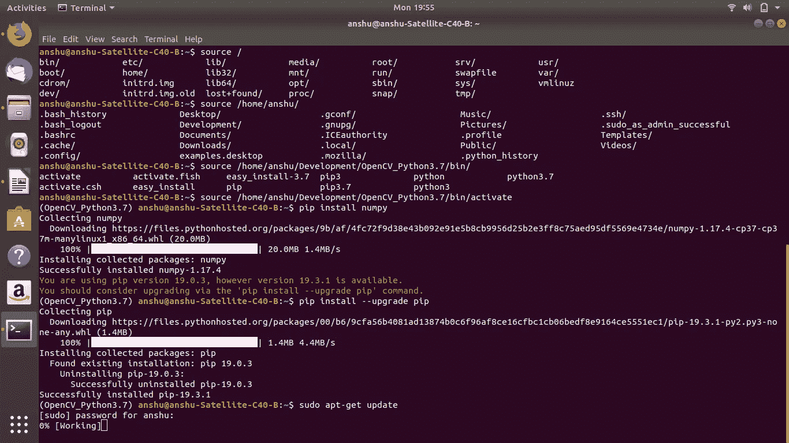

```
cd Downloads/
cd opencv-4.1.2/
mkdir build
cd build
ccmake ..
```

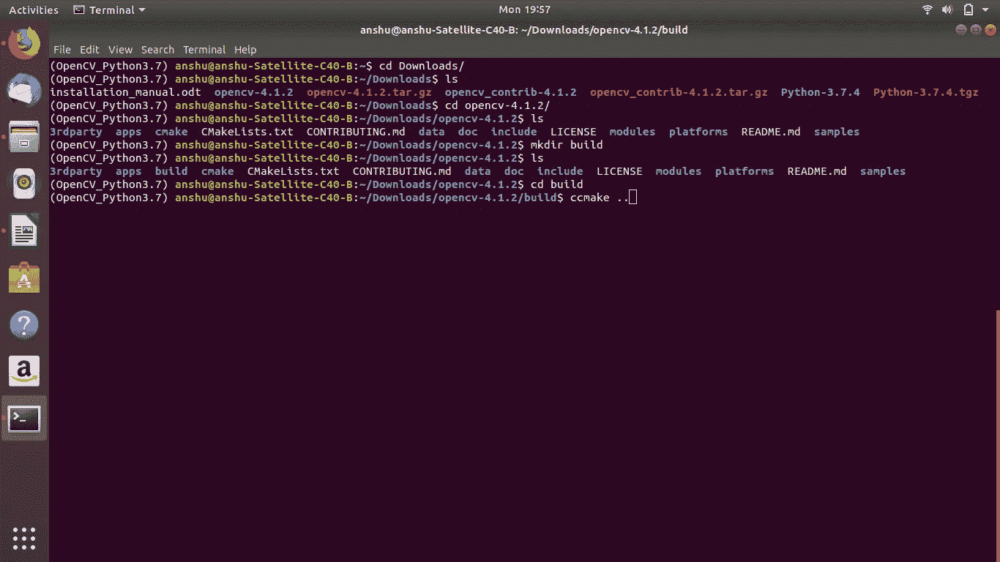

按回车键并回车

OPENCV _ EXTRA _ MODULES _ PATH =/home/anshu/Downloads/OPENCV _ contrib-4 . 1 . 2/MODULES

按向上箭头和向下箭头浏览页面

按 c 键进行配置

按 g 生成并退出

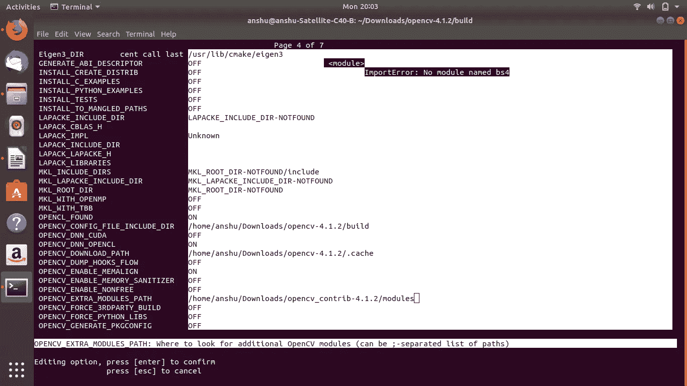

```
make -j4 
sudo make install
```

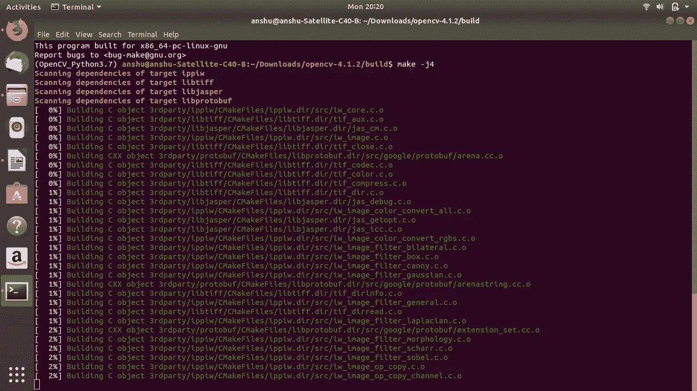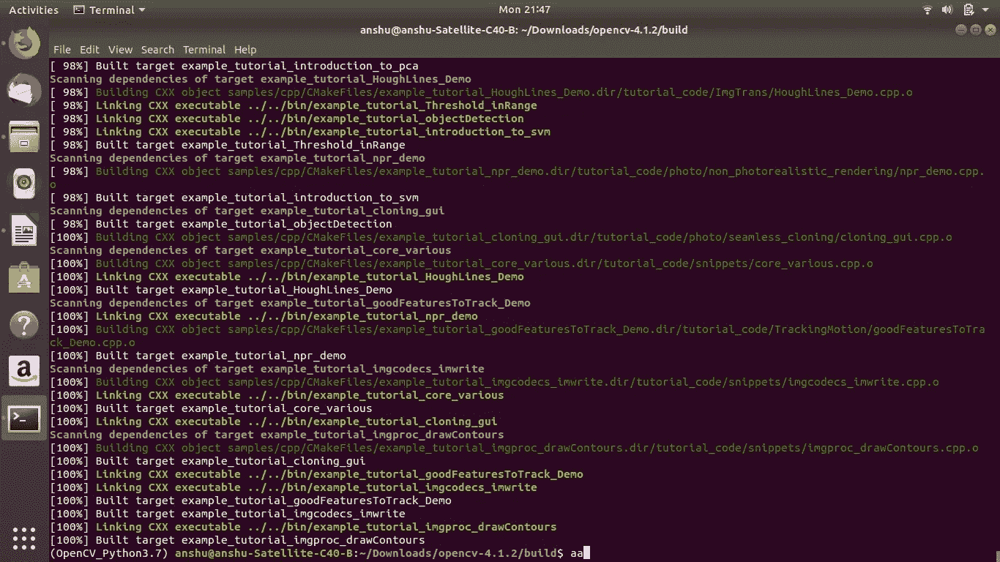

现在带有 OpenCV_contrib 模块的 OpenCV 已经成功安装。转到/Downloads/opencv-4 . 1 . 2/build/lib/python 3/并查找**cv2 . cpython-37m-x86 _ 64-Linux-GNU . so**文件。复制。所以把它归档粘贴到/Home/Development/OpenCV _ python 3.7/lib/python 3.7/site _ packages/中，**把它重命名为 cv2.so** 。

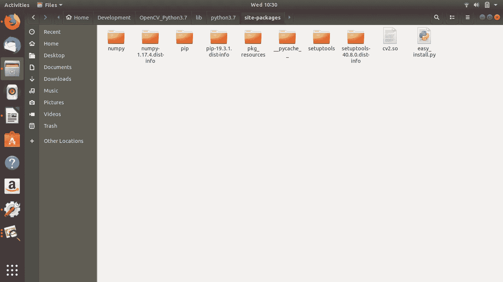

**PyCharm 装置**

PyCharm 现在也可以作为快照包使用。如果您使用的是 Ubuntu 16.04 或更高版本，您可以从命令行安装 PyCharm:

```
sudo apt-get install snap
sudo snap install pycharm-community — classic
```

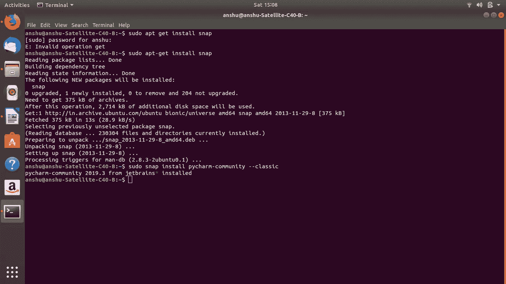

打开您的 Pycharm 并创建一个新项目，将解释器的路径设置为您的 OpenCV_Python3.7 虚拟环境

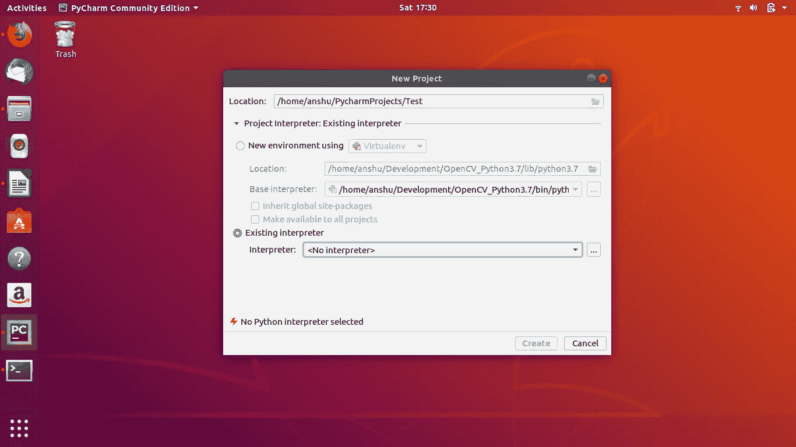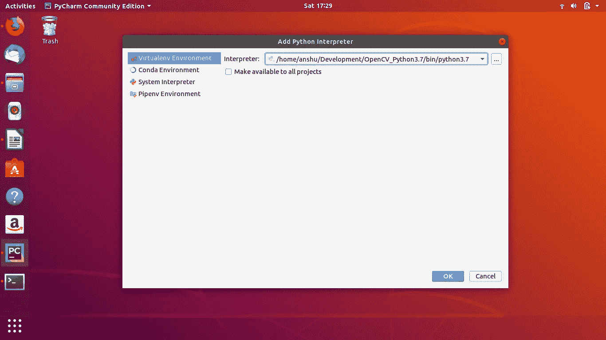

现在，在新项目中创建一个 test.py 并测试 openCV 库。现在可以尝试 OpenCV 主版本中缺少的“TrackerMedianFlow”。

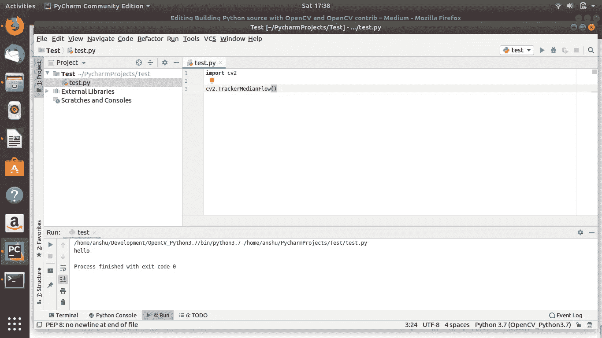

在我的 Youtube 频道上关注我

[https://www.youtube.com/channel/UCSp0BoeXI_EK2W0GzG7TxEw](https://www.youtube.com/channel/UCSp0BoeXI_EK2W0GzG7TxEw)

在此与我联系:

领英:[https://www.linkedin.com/in/ashishban...](https://www.linkedin.com/in/ashishban...)

github:[https://github.com/Ashishb21](https://github.com/Ashishb21)

中:[https://medium.com/@ashishb21](https://medium.com/@ashishb21)

网址:[http://techplanetai.com/](http://techplanetai.com/)

电子邮件:techplanetai@gmail.com ashishb21@gmail.com

参考资料:

1.  [https://towards data science . com/how-to-install-opencv-and-extra-modules-from-source-using-cmake-and-set-up-in-your-py charm-7e 6 AE 25 dbac 5](/how-to-install-opencv-and-extra-modules-from-source-using-cmake-and-then-set-it-up-in-your-pycharm-7e6ae25dbac5)
2.  [https://www . learnopencv . com/install-opencv-3-4-4-on-Ubuntu-16-04/](https://www.learnopencv.com/install-opencv-3-4-4-on-ubuntu-16-04/)