# 用 AWS Sagemaker 和 Comet.ml 构建可靠的机器学习管道

> 原文：<https://towardsdatascience.com/building-reliable-machine-learning-pipelines-with-aws-sagemaker-and-comet-ml-364ea4b0f27d?source=collection_archive---------24----------------------->

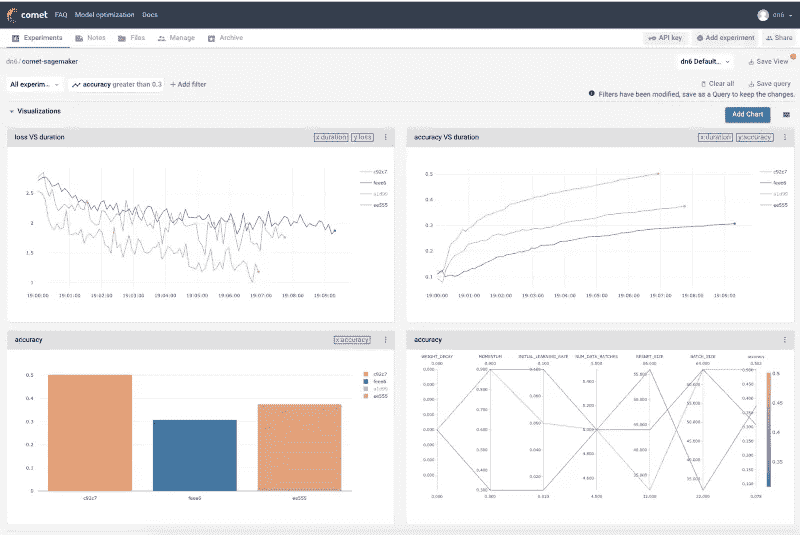

> 本教程是系列教程的第二部分。见第一部分[此处](https://medium.com/comet-ml/building-a-devops-pipeline-for-machine-learning-and-ai-evaluating-sagemaker-19f505070476)。

成功地大规模执行机器学习需要围绕你的模型建立可靠的反馈回路。随着您的管道的增长，您将达到这样一个点，即您的数据不再适合单台机器上的内存，并且您的培训过程将不得不以分布式方式运行。随着新数据的出现和底层特征分布的改变，定期的重新训练和模型的超参数优化将变得必要。

在数据上尝试新的建模方法以及在团队和其他利益相关者之间交流结果也增加了复杂性。

**在这篇博文中，我们将展示如何使用 AWS Sagemaker 和 Comet.ml 来简化监控和改进培训渠道的过程。**

## 数据复杂性+模型需求不断增长

创建功能性反馈循环所涉及的挑战超出了数据关注的范围，如跟踪变化的数据分布到模型级别的问题。稳健模型需要频繁的再训练，以便超参数在面对新的输入数据时是最优的。

随着每次迭代，管理数据和模型的子集和变化变得更加困难。跟踪哪个模型迭代在哪个数据集上运行是再现性的关键。

## 将复杂性乘以团队复杂性

在团队环境中，管理这些复杂的管道会变得更加困难。数据科学家通常会将多个模型的结果存储在日志文件中，这样就不可能有效地重现模型或交流结果。

传统的软件开发工具没有针对机器学习的迭代性质或机器学习所需的数据规模进行优化。缺乏工具和流程来简化相同数据科学团队成员之间(以及工程等职能部门之间)的协作，导致迭代周期大大变慢。组织还不断遭受新员工入职时间缓慢的痛苦，并承担员工带着他们的工作和专有知识流失的风险。

# 辅导的

本教程涵盖了如何将 [Comet.ml](http://www.comet.ml) 与 AWS Sagemaker 的 Tensorflow [Estimator API](https://sagemaker.readthedocs.io/en/latest/estimators.html) 集成。我们将使用 Tensorflow 在 CIFAR10 数据集上调整[运行 Resnet 模型。](https://github.com/awslabs/amazon-sagemaker-examples/tree/master/sagemaker-python-sdk/tensorflow_resnet_cifar10_with_tensorboard)

我们将实验指标记录到 Comet.ml，而不是 Tensorboard。

这使我们能够跟踪不同训练运行中的各种超参数配置、指标和代码。

*   AWS SageMaker 为训练和部署机器学习模型提供了方便可靠的基础设施。
*   Comet.ml 自动跟踪和监控机器学习实验和模型。

你可以查看 Comet.ml [这里](https://www.comet.ml/docs/python-sdk/getting-started/)了解更多关于 AWS Sagemaker [这里](https://docs.aws.amazon.com/sagemaker/latest/dg/gs.html)。

**环境设置**

当使用 AWS Sagemaker 时，您的帐户附带了多个预安装的虚拟环境，其中包含 Jupyter 内核和流行的 python 包，如 scikit、Pandas、NumPy、TensorFlow 和 [MXNet](http://bit.ly/2QG8ijM) 。

1.  创建一个 Sagemaker 帐户。在此处，您将被引导完成获取证书的所有步骤，以便向培训集群[提交工作。](https://aws.amazon.com/sagemaker/)

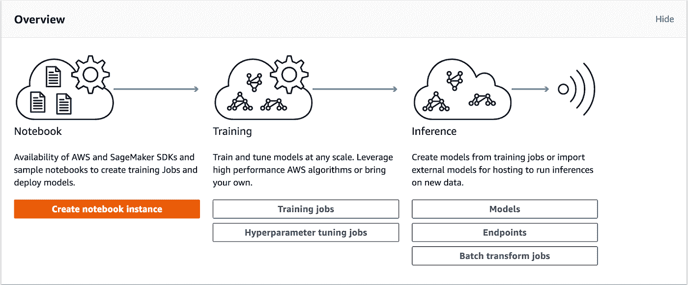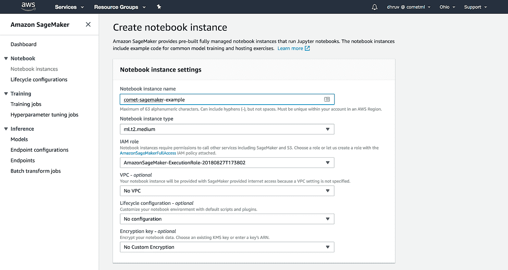

2.在这里设置你的 Comet.ml 账户。登录后，我们将带您进入默认项目，您将看到提供项目 API 密钥的快速入门指南。

3.创建一个 Sagemaker 笔记本实例，并从这个实例启动一个新的终端。

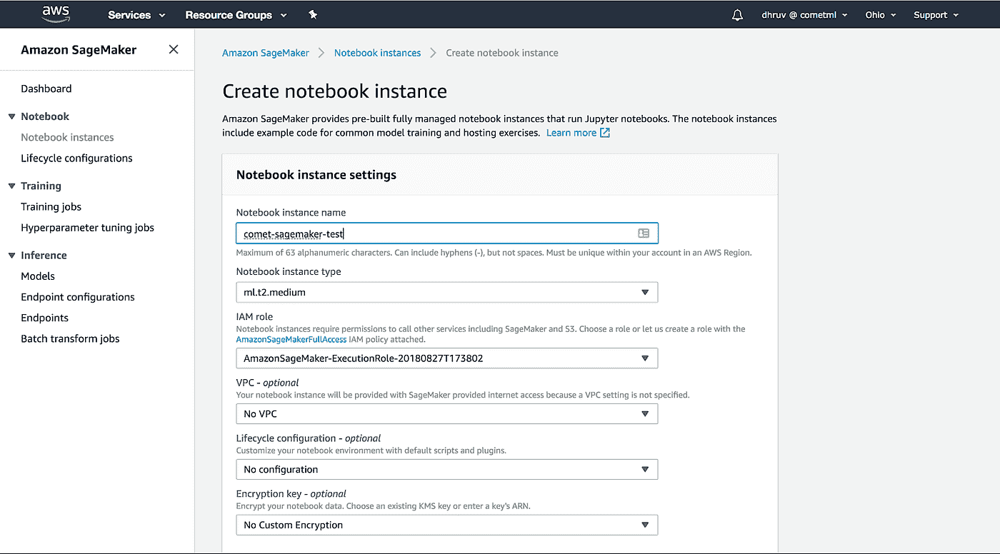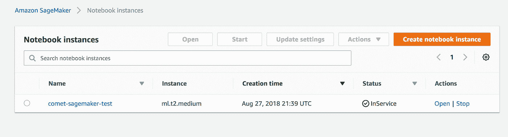

4.打开一个新的终端实例(使用**新建**下拉菜单)。使用命令行激活 tensorflow_p36 虚拟环境

```
$ source activate tensorflow_p36
```

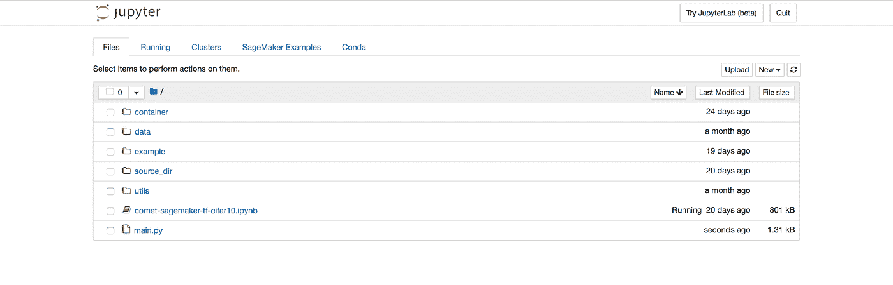

使用终端，将来自[**https://github.com/comet-ml/comet-sagemaker**](https://github.com/comet-ml/comet-sagemaker)**的 Sagemaker 实例克隆到您的 Sagemaker 实例中**

```
$ git clone [https://github.com/comet-ml/comet-sagemaker.git](https://github.com/comet-ml/comet-sagemaker.git) && cd comet-sagemaker && pip install -r requirements.txt
```

## **将 Sagemaker Estimator API 与 Comet.ml 集成**

**Sagemaker Estimator API 使用 Tensorflow (TF) EstimatorSpec 创建一个模型，并根据存储在 AWS S3 的数据对其进行训练。EstimatorSpec 是定义模型训练过程(模型架构、如何预处理数据、跟踪什么指标等)的操作的集合。**

1.  **为了让 Comet 与 TF EstimatorSpec 一起工作，我们必须创建一个训练挂钩，将 Comet 实验对象包装在 TF SessionRunHook 对象中。我们将修改 tf.train.LoggingTensorHook 中的代码，以便将指标记录到 Comet 中。你可以在这里找到参考实现。**

****初始化你的 Comet.ml 项目****

1.  **将 Comet.ml API 键、项目名和工作空间名添加到 CometSessionHook 中的实验对象。你可以在这里找到实验对象**
2.  **我们在 [resnet_cifar_10.py](https://github.com/comet-ml/comet-sagemaker/blob/master/source_dir/resnet_cifar_10.py) 文件的`model_fn`函数中初始化 CometSessionHook 对象。`model_fn`函数定义了我们想要跟踪的张量和参数。**
3.  **本实验的超参数设置在 [main.py](https://github.com/comet-ml/comet-sagemaker/blob/master/main.py) 中，但是可以随意调整这些默认值。该模型的超参数包括:学习速率、批量大小、动量、数据批量数、权重衰减。**
4.  **运行`python main.py` 或`! python main.py` ，如果从笔记本电脑内运行。**
5.  **您将在 Sagemaker 笔记本输出中收到一条消息，表明您的实验在 Comet.ml 中是实时的，并带有指向该实验的直接 url。**
6.  **您更改了`main.py`文件中的参数并重新运行脚本。**

****comet . ml 中的监控实验****

1.  **一旦您运行了这个脚本，您将能够通过直接的 url 看到您的不同模型在 Comet.ml 中运行。作为本教程的一个例子，我们已经创建了一个 Comet 项目，您可以在[https://www.comet.ml/dn6/comet-sagemaker](https://www.comet.ml/dn6/comet-sagemaker)查看。**
2.  **让我们看看如何使用 Comet 来更好地理解我们的模型。**

*   **首先，让我们通过单击实验表中的“精度”列，根据精度对模型进行排序。这些列是根据用户提供的超参数填充的，或者是根据代码中的命令行参数自动推断的。还可以使用**定制列**选项定制它们来跟踪相关参数和模型的指标。**

**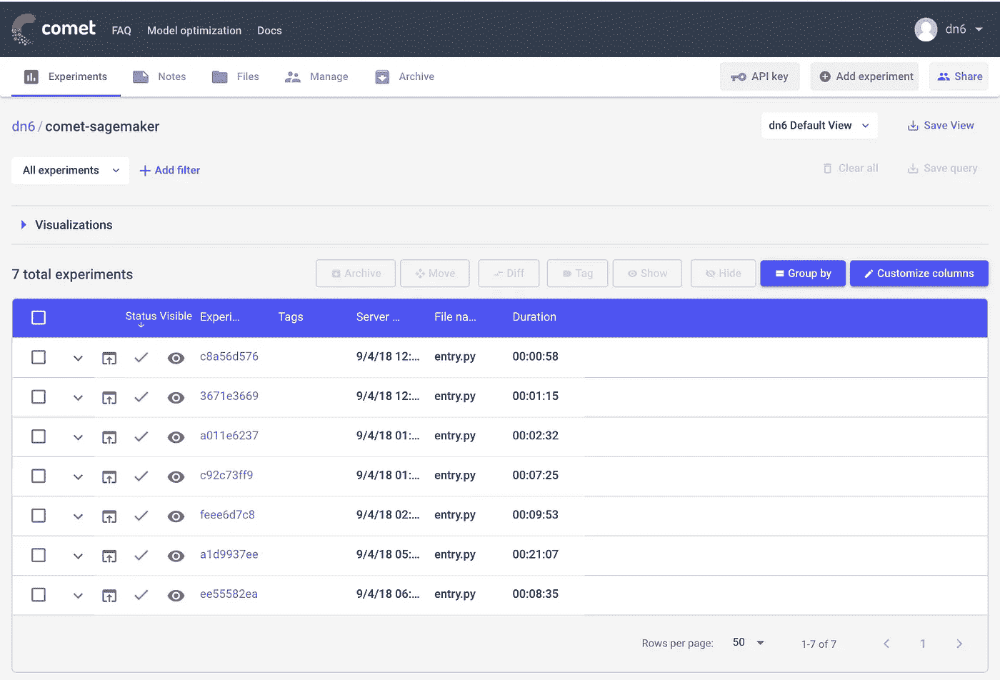**

*   **现在让我们给我们的项目添加一些可视化效果，这样我们就可以看到超参数是如何影响我们的实验的。**

**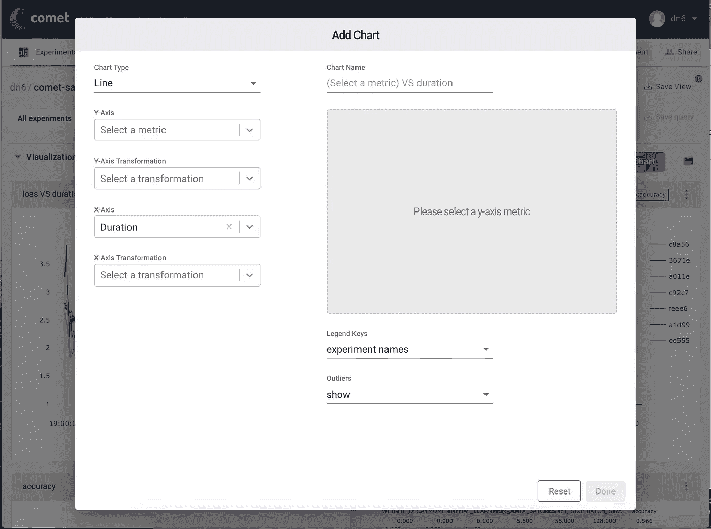**

*   **然后，让我们使用一个**线图**来可视化我们的学习曲线，一个**条形图**来跟踪我们跨实验的最终准确度分数，一个**平行坐标图**来可视化我们的超参数空间的哪些部分产生了最好的结果。**

**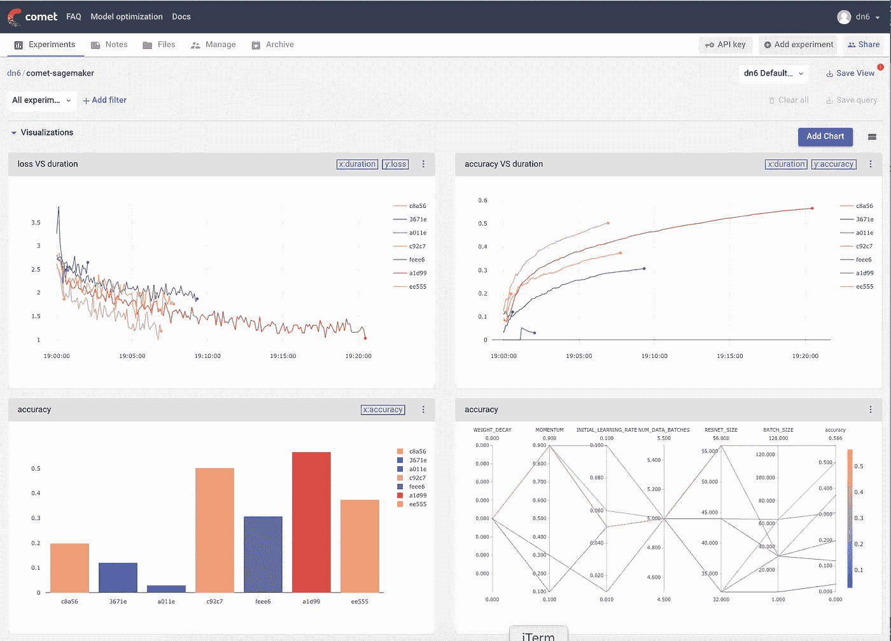**

*   **我们可以使用 Comet 的查询构建器来过滤我们的实验，以便我们只分析满足我们的阈值标准的模型。例如，也许你只想看到高于一定准确率的实验。**

**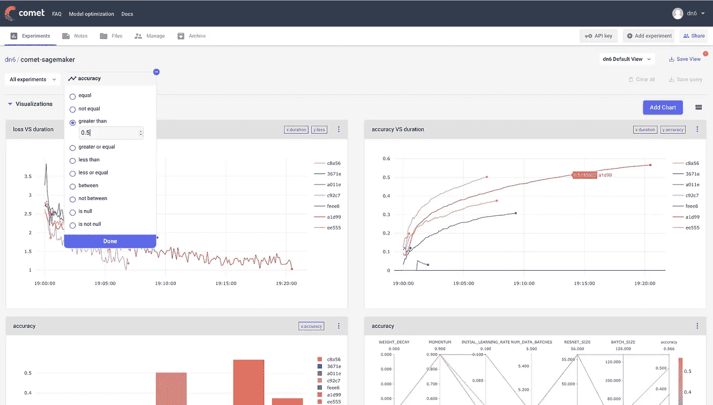**

*   **我们可以看到，我们的图表都根据应用于实验的过滤器而变化。**

**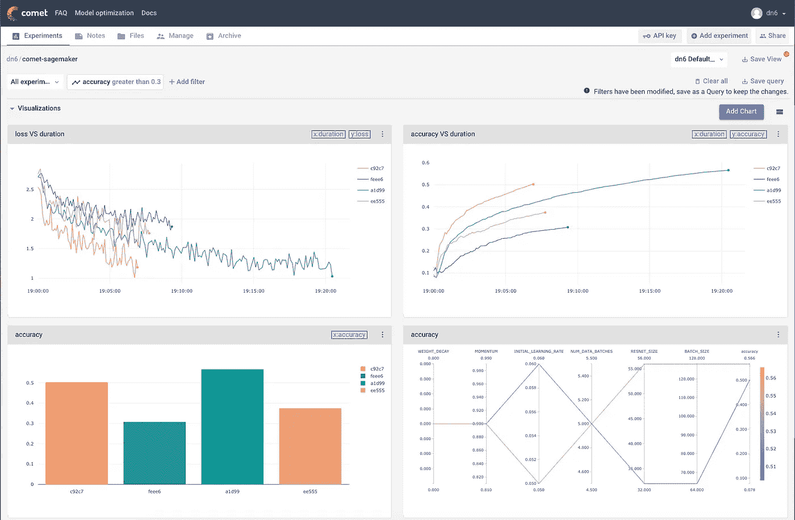**

*   **我们的平行坐标图能够显示我们已经探索的参数空间的部分，以及我们有差距的地方。在本例中，我们看到较大的 Resnet 大小和批量大小会产生更准确的模型。**

**然而，这个表现最好的实验也被允许比其他实验运行更长时间。为了更好地评估模型的性能，我们可以将它隐藏在实验表中，从而将其从图表中排除**

**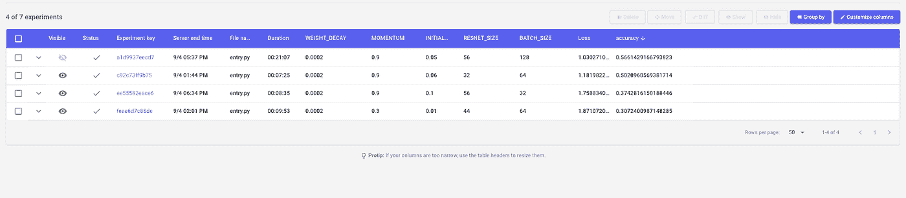**

*   **我们的图表表更新以反映我们的实验表，我们现在可以看到，给定类似的训练时间，较大的 Resnet 大小不一定产生最好的结果。**

**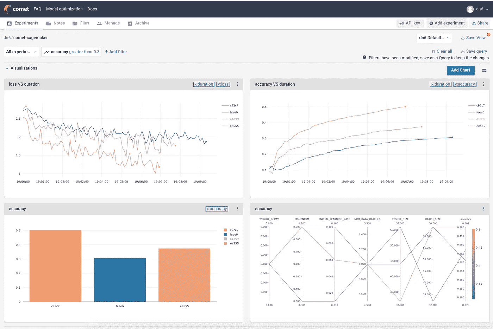**

**我们可以使用这些见解继续迭代我们的模型设计，直到我们满足我们的需求。**

**Comet.ml 允许您创建可视化效果，如条形图和线图，以便使用平行坐标图跟踪您的实验。这些实验级和项目级的可视化帮助您快速识别性能最佳的模型，并了解您的参数空间。**

**如果您想要公开共享您的结果，您可以通过项目的共享按钮生成一个链接。或者，您也可以通过在您的工作区设置中将人员添加为协作者来直接与协作者共享实验。**

# **教程摘要**

**您已经学习了如何使用 [Comet.ml](http://www.comet.ml) 和 AWS Sagemaker 的 Tensorflow [Estimator API](https://sagemaker.readthedocs.io/en/latest/estimators.html) 准备和训练 Resnet 模型。为了总结本教程的重点，我们:**

*   **使用 Sagemaker 的一个[预装虚拟环境](https://docs.aws.amazon.com/sagemaker/latest/dg/howitworks-set-kernel.html)在亚马逊 Sagemaker 笔记本实例中的 CIFAR-10 数据集上训练一个 Resnet 模型**
*   **探索了训练实验的不同迭代，其中我们改变了超参数**
*   **使用 Comet.ml 在不同的训练运行中自动捕获我们模型的各种超参数配置、指标和代码。**

****报名免费试用 Comet.ml** [**这里**](https://www.comet.ml/pricing) **。****