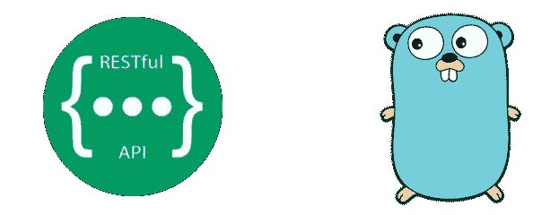

# 在 Golang 中构建 RESTful APIs

> 原文：<https://towardsdatascience.com/building-restful-apis-in-golang-e3fe6e3f8f95?source=collection_archive---------10----------------------->

*注:这最初发布在*[*martinheinz . dev*](https://martinheinz.dev/blog/8)

在上一篇文章中，我们讨论了如何为你的 *Golang* 项目创建*“终极”*设置，现在是时候将它应用到真实的东西上了——RESTful API。这篇文章将涵盖数据库、单元测试、API 测试、示例应用程序以及实际项目中你需要的一切。所以，让我们直接开始吧。

因为这篇文章是这些系列文章[的后续文章，为你的下一个 Golang 项目](/ultimate-setup-for-your-next-golang-project-1cc989ad2a96?source=friends_link&sk=2be68bb1ae993c17afc7d5c39a8be909)最终设置，所以如果你没有读那篇文章，那么你可能想先看看。

*TL；DR:这里是我的资源库(* `*rest-api*` *分支)-*[*https://github . com/Martin Heinz/go-project-blue print/tree/rest-API*](https://github.com/MartinHeinz/go-project-blueprint/tree/rest-api)

# 框架和库

首先，我们要用什么来建造它？

*   *Gin* —我们将使用 *Gin* HTTP web 框架。它是构建在`net/http`之上的高性能框架，提供了最基本的特性、库和必要的功能。它也有相当干净和全面的 API。
*   GORM —是在`database/sql`之上开发的 *Golang* ORM 库。它包括所有奇特的功能，如预加载、回调、事务等。它有一些学习曲线，没有那么好的文档，所以如果你是那种喜欢写原始 SQL 的人，那么你可以选择`sqlx`。
*   Viper — *Go* 配置库，可以处理各种格式、命令行标志、环境变量等。这个库的设置和使用已经在之前的帖子[这里](/ultimate-setup-for-your-next-golang-project-1cc989ad2a96?source=friends_link&sk=2be68bb1ae993c17afc7d5c39a8be909)解释过了，所以我就不在这里赘述了。

# 项目和包结构

接下来，让我们检查项目中的单个包。除了`main`还有以下包，每个包都有单独的责任。让我们从数据库开始，通过查询，一直到 API 端点:

## 模型

模型包(`models`)有一个文件，它定义了反映数据库表结构的类型。在存储库中的例子中，有两个`struct`类型- `Model`和`User`:

`Model`是与`gorm.Model`相同的类型，只是增加了 json 标签，使得生成包含其字段的 JSON 响应更加容易。其次，`User`用 *GORM* 标签描述了简单的应用程序用户，这些标签指定了字段应该与哪一列相关联。还有很多标签，比如索引、类型或关联，你可以在这里[找到更多。](http://gorm.io/docs/models.html)

## 数据访问对象

接下来是`daos`包，是*数据访问对象* ( *DAOs* )的简称。*道*是一个负责访问数据的对象(惊喜，惊喜...)，这实质上意味着它使用 *GORM* 或原始 SQL 进行 SQL 查询。在下面的例子中，我们有一个简单的函数，它根据 ID 检索用户数据，并以前面提到的`User`模型的形式连同错误(如果有的话)一起返回:

您可以根据 Dao 访问的表、相似的业务逻辑或者您想要的任何其他指标来分离 Dao，但不要将它们混为一谈，否则会变得一团糟。

## 服务

当我们将数据很好地加载到模型中时，我们可以在提供数据之前执行额外的逻辑来处理数据，这就是*服务*发挥作用的地方。这个额外的逻辑可以是例如过滤、聚集、修改结构或验证数据。最重要的是，它允许我们将数据库查询从业务逻辑中分离出来，这使得代码更干净、更易于维护，最重要的是(对我来说)更易于测试(稍后将详细介绍)。所以，让我们看看代码:

在上面的代码中，我们首先定义了 interface，它将所有之前创建的 *DAO* 函数组合在一起，在本例中只是来自前面部分的`Get(id uint)`。接下来，我们定义*用户*服务，它包含我们的 *DAO* 和一个使用作为参数提供的 *DAO* 创建它的函数。最后，我们定义一个函数，它可以执行一些额外的逻辑，并使用来自`UserService`的 *DAO* ，然而，这里为了简单起见，我们只使用 *DAO* 为用户查询数据库并返回它。此处可以执行的逻辑示例将是模型验证或错误检查。

## 蜜蜂

最后，有了准备好为我们提供经过处理的有效数据的服务，我们可以将它们提供给我们的用户。那么，让我们看看代码:

在这个代码片段中，我们可以看到可用于服务 API 端点的函数。这里，我们首先用提供的用户 *DAO* 创建服务，这在前面已经描述过了。接下来，我们解析 ID，我们希望它在 URL 中(类似于— `/users/{id}`)，然后我们使用服务从数据库中获取用户数据，最后，如果找到数据，我们以 JSON 格式返回它，并带有`200`状态代码。

## 将它们连接在一起

前几节中展示的东西都很好，但是现在我们实际上需要在`main`中设置它，以便 *Gin* 知道在哪里提供我们的 API:

显然，我们首先需要创建 *Gin* 的实例，然后我们将中间件附加到它上面，例如记录器或 *CORS* 。最后一部分——也是最重要的一部分——我们创建了一组端点，这些端点都以`api/v1/`开始，并注册我们上一节中的`GetUser`函数，该函数将在`/api/v1/users`处专门提供服务，然后是用户 ID 参数，就这样，现在我们可以运行我们的应用程序了！

此时你可能会想*“为什么要创建所有的包、单独的文件、函数层等等？”* —好吧，答案是——如果你的应用程序足够大，那么如果你把所有东西都集中在一起，这将成为可维护性的噩梦，而且——在我看来，更重要的是——这种分离对于更好的可测试性是必要的，因为单独测试每一层——数据库访问、数据操作和 API——比在一个地方测试要容易得多。所以，当我们谈到测试的话题时，我想是时候写一些…

*注意:在上面的代码片段中，为了清楚起见，我省略了几行代码和注释，比如连接到数据库或加载配置，这些可以在资源库* [*这里*](https://github.com/MartinHeinz/go-project-blueprint/blob/rest-api/cmd/blueprint/main.go) *中找到，包括一些更多的注释用于解释。*

# 测试一切

现在，对于我最喜欢的部分——测试——让我们从`test_data`包开始。这个包包含与测试数据库和测试数据相关的实用函数。这个包中我想注意的一个函数是`init`:

该功能比较特殊，因为 *Go* 在导入包时执行。这是设置测试的好地方——更具体地说，我们首先加载配置，然后创建我们的测试数据库，它是内存中的 SQLite，我们还为它启用了外键。最后，我们使用*GORM*函数创建数据库表。

你可能会问*“为什么使用 SQLite 内存数据库，不是更好吗？”*——是的，我自己在每个项目中都使用 *PostgreSQL* ，但是当涉及到测试时，您需要一致、快速(*内存中*)并且独立于主机系统/数据库服务器的东西，这正是本设置所提供的。

我不会重复这个包的剩余功能，因为这篇文章已经很长了，它们在这里的代码[中有记录。](https://github.com/MartinHeinz/go-project-blueprint/blob/rest-api/cmd/blueprint/test_data/init.go)

除了初始化函数之外，我们还在这个包中存储了一些数据，即包含 SQL 插入的`db.sql`文件，这些 SQL 插入在运行测试之前填充了我们的 *SQLite* 数据库，还有 JSON 测试用例，它们被用作 API 端点的预期输出。

现在，我们已经设置好了，让我们检查一下每个包中的测试:

首先，`daos`，上面的测试非常简单，我们只需创建 *DAO* 并调用被测函数(`Get`)并根据期望值进行测试，这些都是在设置过程中插入到 *SQLite* 数据库中的，其他的就没什么可说的了。让我们继续看`services`:

这是相当多的一点代码，让我们从下往上看。我们首先需要的是模拟*道* ( `mockUserDAO`)，这样我们就独立于真正的*道*的实现了。为了让这个模拟有用，我们需要用一些测试数据填充它，这就是在`newMockUserDAO`中发生的事情。接下来，我们还需要定义模仿真实版本的`Get`的模拟版本——在这里，我们不需要查询数据库，只需查看假记录，如果发现提供的 ID，就返回一个。

现在，对于实际的测试——我们创建了`NewUserService`,但是我们没有传入真正的 *DAO* ,而是使用具有可预测行为的模拟，因此我们能够将测试中的函数与底层的 *DAO* 隔离开来。之后，测试就非常简单了——我们使用 mock `Get`方法，测试插入到 mock 中的预期值是否存在。

最后要测试的是 API，这些测试实际上是一行程序，但是我们需要做一点准备:

这里的这 3 个函数模拟 HTTP 请求，用于我们的测试目的。首先在测试模式下创建 *Gin* 并重置数据库。第二个服务并随后命中特定的 API 端点，最后一个运行测试用例列表并检查状态代码是否相同，并且可选地检查 JSON 输出是否也相同。现在，让我们看看测试用例的例子:

参数很多，但很简单，让我们一个一个来看:

*   `"t1 - get a User"` -测试用例的名称-编号，这样在调试时更容易找到
*   `"GET"` - HTTP 方式
*   `"/users/:id"` -正在服务/测试的 URL
*   `"/users/1"` -被点击的 URL 带有填充的参数
*   `""` -请求体-在本例中为空
*   `GetUser` -附加到端点的方法
*   `http.StatusOK` -预期状态代码-此处为`200`
*   `path + "/user_t1.json"` -预期 JSON 输出的路径——这些存储在前面提到的`test_data`包中

# 结论

就这样——在 *Golang* 中创建 RESTful API 所需要的一切。希望在构建您的下一个项目时，这些内容至少会对您有所帮助。您可以在这里找到所有源代码，如果您有任何建议或改进，请随意创建问题、拉式请求或直接分叉/启动存储库。如果您喜欢这篇文章，请寻找下一篇，在那里我将展示如何将 *Swagger* 文档添加到这个项目中。