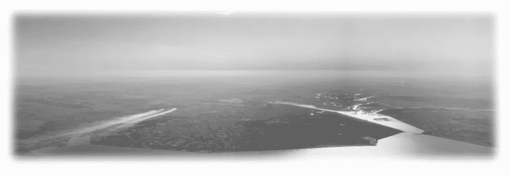

# 构建敏感度地图集

> 原文：<https://towardsdatascience.com/building-sensitivity-atlases-e305682d7b7d?source=collection_archive---------37----------------------->

研究人员、环境管理者、生态学家、研究人员——我们都在寻找更好的视角。实地调查、遥感和系统理解让我们能够将知识拼凑起来，这些知识反过来又可以用来确定人类与环境互动的优先次序。所有这些知识都是概括。概括的矛盾之处在于，有时我们需要它们来以一种可管理的方式看待我们的世界。我们看到的越少，我们的一些决定就会越好。

敏感性图谱是一种概括。灵敏度图册方法并不代表通常与法律、法规或国际协议相关的方法。目前它是一个被赋予一个名字的方法的大杂烩。该方法有 20 多种不同的实现方式——如果不是更多的话。考虑到这些实现的有用性，试图找到一个统一的方法是很有趣的。我们正在努力。

这种方法已经有 35 年的历史了。它以多种形式成为创建土地使用、应急响应等优先地图的核心工具。实施过程通常伴随着高成本、大量工时以及对众多从业者的高技术能力要求。

通过建立一个更好的文档和更轻量级的方法，我们希望看到许多积极的结果。以下是其中的一些:

*   通过培训和其他交流，可以更容易地共享一个描述良好的方法。
*   支持技术实现将更加统一，同时仍在使用不同的技术平台进行开发。
*   由此产生的灵敏度图谱产品更容易理解，并放在上下文中，因为方法不会改变。
*   统一的方法将促进建立更广泛的从业者群体。

2019 年 9 月在阿鲁沙举行的一次研讨会上，来自 8 个环境机构的代表应邀出席，介绍了走向统一方法的新步骤。我们的客人来自乌干达、加纳、坦桑尼亚、桑给巴尔、莫桑比克、肯尼亚、索马里和黎巴嫩。研讨会由挪威环境署和[环境署-WCMC](https://www.unep-wcmc.org/) 的代表举办。

研讨会上介绍了一种方法的初稿，其中根据 tis 方法准备和处理不同的数据集。在准备过程中，准备了一个脚本程序。除了该程序之外，我们还分发了包含准备好的测试数据集、800×800 米左右的网格集和 QGIS 项目文件的国家包。

用于处理的软件是来自安全软件公司的 FME。选择它是因为它代表了一种实现必要过程的简单方法。开发的程序要求由 [NEA](https://www.miljodirektoratet.no/) 和[环境署-WCMC](https://www.unep-wcmc.org/) 编写。这个程序是由挪威公司 [Norkart](https://www.norkart.no/) 利用 SAFE 软件公司的 [FME](https://www.safe.com/fme/) 快速开发出来的。它就像一个魔咒！

FME 是许多商业实体和政府部门用来准备、处理和交付数据的工具。作为一个商业工具，它通常要求像这样的研讨会的参与者拥有自己的许可证。在要求为这项工作提供实物许可证时，SAFE software 同意了，并向 30 名参与者提供了许可证。我们非常高兴有机会使用 FME！

结果数据集的演示软件是 [QGIS](https://qgis.org/en/site/about/index.html) 。选择它主要是因为它是开放和自由的软件。制作了展示数据的相关模板，并在研讨会上使用。QGIS 是管理数据和以动态方式展示数据的优秀工具。

这些工具在研讨会上大受欢迎。在 5 天之内，所有参与机构都使用现有工具建立了自己的敏感性地图集。对他们中的许多人来说，这已经计划了多年，但是现在工具让他们用为他的工作室准备的测试数据来做这件事。[国际鸟盟](https://www.birdlife.org/)、[国际自然保护联盟](https://www.iucn.org/)、[Protectedplaned.org](https://www.protectedplaned.org/)以及更多的组织提供了数据供我们在本次研讨会上使用。

使用这种方法需要生态学和技术知识。该方法的一个关键部分是评估该方法中所谓的敏感性和优先级。没有知识渊博的生态学家和生物学家是做不到这一点的。如果没有人能够在技术层面上培育这个过程，这项工作也无法完成和展示。

有了这个工具，参与的环境机构得到了解放。他们现在在技术上能够处理国家敏感地图。关于使用不同资产层的持续支持和建议将非常重要。跟进关于...

我们将继续记录我们在 [researchgate 项目](https://www.researchgate.net/project/Sensitivity-analysis-marine-coastal-and-terrestrial)上的工具，并且在我们进行的过程中也会尝试发布项目更新。如果你对这个项目中使用的四分之一度网格单元感兴趣，请阅读这篇[论文](https://www.researchgate.net/publication/230360048_Using_the_extended_quarter_degree_grid_cell_system_to_unify_mapping_and_sharing_of_biodiversity_data)。

这个研讨会代表了向前迈出的重要一步！

以下机构值得一提: [Safe Software](https://www.safe.com/) 、 [Norkart](https://www.norkart.no/) 、[坦桑尼亚保护资源中心](http://www.tzcrc.org/)、 [Obscom](http://www.obscom.eu/) 、#norad、#oilfordevelopment 等等。

*原载于 2019 年 10 月 24 日*[*http://www.mindland.com*](http://www.mindland.com/wp/building-sensitivity-atlases/)*。*