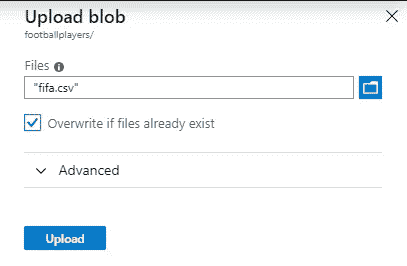
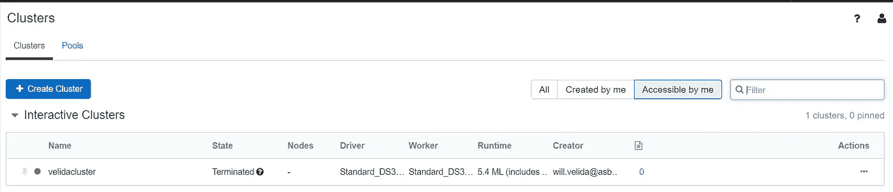

# 使用 Cosmos DB、Databricks 和 Blob 存储在 Azure 中构建简单的数据管道

> 原文：<https://towardsdatascience.com/building-simple-data-pipelines-in-azure-using-cosmos-db-databricks-and-blob-storage-fffac0d49505?source=collection_archive---------12----------------------->

感谢像 [Azure Databricks](https://azure.microsoft.com/en-in/services/databricks/) 这样的工具，我们可以在云中构建简单的数据管道，并使用 Spark 相对容易地获得对我们数据的一些全面的见解。将这与[Apache Spark connector for Cosmos DB](https://github.com/Azure/azure-cosmosdb-spark)结合起来，我们可以利用 [Azure Cosmos DB](https://azure.microsoft.com/en-us/services/cosmos-db/) 的能力来获取和存储对我们数据的一些难以置信的见解。

自从我在 Databricks 上写了一篇文章已经有一段时间了，而且因为我在过去的几个月里一直在使用 Cosmos DB，我想我应该写一个简单的教程，介绍如何使用 [Azure Blob Storage](https://azure.microsoft.com/en-us/services/storage/blobs/) 、Azure Databricks 和 Cosmos DB 来构建一个简单的数据管道，对我们的源数据进行一些简单的转换。

我还将加入一些 Azure Key Vault(T8),向您展示保护数据块中的重要机密(如存储帐户密钥和 Cosmos DB 端点)是多么简单！

这篇博文主要是针对初学者的。理想情况下，您应该对每个组件有所了解，并且对 Python 有所了解。

好了，聊够了！让我们开始吧。

**关于我们的文件**

我们的源文件包含来自国际足联数据库的各种足球运动员的数据。我从几年前参加的 Datacamp 课程中下载了它(如果有人知道哪个课程，请告诉我，我会适当地记下它)。我们的数据文件包含以下几列:

*   **Id**
*   **名称**
*   **评级**
*   **位置**
*   **身高(厘米)**
*   **脚**(哪个最占优势)
*   **稀有**(这是一个 0 或者 1。从数据集和我对足球的了解来看，我猜 1 是罕见的，0 是常见的。我不确定为什么这个专栏会存在，所以我们暂时忽略它)
*   **各种技能等级**(步伐、射门、传球、运球、防守、头球、鱼跃、处理、踢球、反射、速度、定位)。

在本教程中，我们只想找出哪些玩家的评分超过 85，并将这些玩家保存到 Cosmos DB 中的一个集合中。非常简单的东西只是为了展示所有东西是如何组合在一起的。

所以我们已经介绍了源文件，让我们把它放在云端！

**创建 Azure 存储帐户**

如果你不确定 Azure Storage 是什么，它是 blobs、文件、消息和 NoSQL 存储等东西的云存储。使用 Azure 存储，我们可以确保我们的数据安全且易于访问。

我将创建一个存储帐户，并在我们的存储帐户中创建一个容器来存放 Blobs。做到这一点非常容易。

在 Azure 门户中，点击“*创建资源*，并选择**存储帐户。**如果可以看到，使用搜索栏查找。

接下来，我们必须对其进行配置。首先，我们需要将它放在一个资源组中。这本质上只是 Azure 资源的集合。当我们通过 CI/CD 配置资源时，这些功能会派上用场，在管理资源时也很有用(比如在完成教程后删除我们不需要的资源)。

完成后，我们可以为我们的存储帐户指定一个**名称**，一个**位置**(我选择了澳大利亚东部，因为那里是离我最近的数据中心)，我们想要什么样的**性能**，我们想要什么样的**类型**帐户，我们需要什么样的复制级别以及我们想要什么样的**访问层**。如果你想要更多关于这些设置的解释，请查看 Azure 文档。

我们还可以在创建存储帐户时初始化一些高级设置，比如*允许从指定的虚拟网络*访问。还是那句话，基础教程，暂时忽略。如果您的配置有效，单击**创建**并等待您的存储帐户准备就绪。

现在我们的帐户已经准备好了，我们可以创建一个容器来存储我们的 blobs。

点击**服务**下的 **Blobs** ，然后点击**容器**选项卡来创建我们的第一个容器。从这个意义上来说，可以把容器想象成文件目录中的一个文件夹(而不是 Docker 容器)。给出名称和公共访问级别。

如果你将一个容器公开，那么这个容器中的所有内容都将对公众开放。只是暂时保密。

就这样，我们的容器被创建了！

好的，点击它，然后点击**上传**！我将把我们的源文件上传到容器中。如果文件已经存在于你的容器中，你需要覆盖它。

点击**上传**，如果一切正常，您只需点击几下鼠标，就已经将原始数据集上传到云中了！

很明显，这不是我们将 blobs 上传到真实应用的存储帐户的方式，但就目前而言，这已经足够了。

我们已经创建了一个存储帐户并上传了我们的文件，接下来我们来调配一个 Databricks 工作区。

**创建数据块工作空间**

Azure Databricks 是一个统一的分析平台，允许数据科学家、数据工程师和业务用户聚集在一起，利用 Azure 上托管的 Apache Spark 服务的力量获得对其数据的高级见解。

要创建一个工作区，回到 Azure 门户，点击“*创建新资源*”。在搜索中，输入*数据块*，然后选择 Azure 数据块选项(见下面的例子，假设门户没有改变)

现在我们必须给它一些设置。给你的工作区起一个**名**，为它分配我们为存储帐户创建的**现有资源组**，将其部署在你附近的数据中心**位置**，并分配一个**定价等级**(我选择了高级)。您可以选择在虚拟网络中部署您的 Databricks 工作空间，但这超出了我们的要求。

一旦我们的工作区部署完毕，我们可以通过点击*启动工作区*来导航到它。这将打开数据块用户界面。

为了在数据块中运行笔记本和作业，我们需要创建一个集群。在 Databricks UI 中，单击侧栏中的*集群*按钮，然后单击**创建集群**。

当我们在数据块中创建集群时，我们可以为它们提供以下设置:

*   **名字:**我们星团的名字
*   **集群模式:**我们可以在数据块中创建两种类型的集群。对于有多个用户同时使用的集群，我们将创建一个*高并发*集群(这些不支持 Scala)。对于本教程，我们将创建一个*标准*集群。这些确实支持 Scala 语言，并且是为单用户使用而设计的。
*   **池:**这是新特性！我们可以将一个集群分配给一个池，以减少启动时间。不过，我没怎么玩过这个。
*   **Databricks 运行时版本:**设置 Databricks 将用于创建集群的映像。这将创建一个拥有 Scala 和 Spark 特定版本的集群
*   **Python 版本:**我们可以选择 Python 2.7 或 3.5 作为集群使用的 Python 版本。
*   **启用自动伸缩:**创建集群时，我们设置集群可用的最小和最大工作节点数。如果我们启用自动缩放，Databricks 将在执行 Spark 作业时自动缩放它使用的工作节点数量。
*   **Terminate after period:** 该设置决定了在集群自动关闭之前我们希望经过的时间。
*   **工作者和驱动程序类型:**数据块中的集群本质上运行在虚拟机上。我们可以设置我们希望我们的节点基于工作机和驱动程序的虚拟机类型。如果愿意，我们还可以将它们设置为具有相同类型的虚拟机。
*   **高级选项:**在这里，我们可以配置我们的 Spark 配置，配置日志写入的位置，加载任何我们想要在初始化时运行的脚本等等。我们根本不会使用它，所以现在不用担心这个。

完成集群设置后，单击 create，几分钟后集群就创建好了。它将出现在集群 UI 中的“*交互式集群*部分的下方。

让我们暂时离开数据块。我们已经设置好了工作区和集群(如果它正在运行，您可以将其关闭)。我们稍后会回来安装我们的库。

**创建 Cosmos DB 帐户**

对于本教程，我将创建一个使用 SQL API 的 Cosmos DB 帐户(它也称为核心 API，但我现在称它为 SQL API)。这意味着我们将使用支持 SQL API 的 [Spark 连接器。MongoDB API](https://docs.microsoft.com/en-us/azure/cosmos-db/spark-connector) 和 [Cassandra API](https://github.com/datastax/spark-cassandra-connector) 有不同的连接器，所以如果你正在为你的 Cosmos 帐户使用这些 API 或者更熟悉这些数据存储，请确保你使用这些连接器！

要创建我们的 Cosmos DB 帐户，请返回 Azure 门户并单击*创建资源*。搜索 Azure Cosmos DB 并点击**创建**:

在 UI 中，将新的 Cosmos DB 帐户放入我们用于存储帐户和数据块工作区的同一个资源组中。给它一个**名称**，并选择**核心(SQL) API 作为我们的 Cosmos DB 帐户将使用的 API** 。将它放在您附近的**位置**，并且**暂时禁用地理冗余和多区域写入**。点击**创建**进行部署！

这可能需要大约 4 分钟来创建，所以如果你喜欢，你可以喝杯茶或咖啡。当您回来时，您应该已经准备好了一个 Cosmos DB 帐户，并且迫不及待地要使用它了！

我们现在需要创建一个容器来存储我们的数据。Cosmos 中的容器在不同的 API 中被称为不同的东西，但是你可以把它想象成一个存储文档的表格。

因为我们是第一次创建容器，所以我们还需要创建一个新的数据库来保存集合。您应该提供以下设置。

*   **数据库 Id:** 这是我们数据库的名称。
*   **吞吐量:**这是我们提供给宇宙神器的吞吐量。我写了一篇[文章](https://medium.com/@willvelida/understanding-and-optimizing-throughput-in-azure-cosmos-db-7dd71593c8d3)，深入探讨了宇宙中的吞吐量。
*   **容器 Id:** 这是我们集合的名称。
*   分区键:这将是我们对集合进行分区的属性。我还写了一篇[文章](https://medium.com/@willvelida/understanding-partitioning-in-azure-cosmos-db-361c4e120852)，更深入地探讨了分区。

点击**确定**以供应我们的新系列。过一会儿，导航到 Cosmos 门户中的数据浏览器，我们应该会看到我们的新数据库和集合。

因此，现在我们已经提供了我们的存储帐户(数据源位置)、Databricks 工作区(处理我们的数据的地方)和 Cosmos DB 集合(它将充当我们的接收器)。

在开始之前，我们还有最后一步要完成。为了访问这些资源，我们需要端点和访问键来将各个部分连接在一起。理想情况下，我们不应该将这些密钥暴露给公众或任何可能恶意使用它们的人。所以我们需要创建的最后一个 Azure 资源是一个密钥库来保护我们的秘密。

**创建 Azure 密钥库并添加我们的秘密。**

使用 Azure Key Vault 是管理我们想要保护的秘密和密钥的简单方法。让我们设置一个来存储我们的存储帐户和我们的 Cosmos DB 端点和访问密钥的秘密。

你现在知道该怎么做了！前往 Azure 门户，点击*创建资源*并搜索密钥库。

给你的钥匙金库起一个**名字**，把它添加到我们的**现有资源组**，把它放在你附近的**区域**并选择一个**定价等级**。对于本教程，我选择了标准层。

现在我们有了密钥库，我们可以把我们的秘密添加到它里面了。进入你的 Cosmos DB 账户，从侧边栏选择**键**。你应该看到下面的屏幕(当然没有可怕的审查关键值！).暂时将端点复制到剪贴板。

一旦你这样做了，回到你的密钥库，从侧边栏选择**秘密**。点击**生成/导入**为我们的宇宙端点生成一个新的秘密

当你创建一个秘密时，你需要指定你想要如何上传这个秘密，给它一个**名**并添加**值**，这里有一个例子:

点击**创建**来创建秘密，你应该会在你的秘密列表中看到这个秘密。

**对您的 Cosmos DB 主键和 Azure Storage 主键重复此操作**。

您还需要配置您的 Databricks 工作区，以将 Azure Key Vault 用作机密存储。关于如何做到这一点的完整指南可以在这里阅读[。](https://docs.azuredatabricks.net/user-guide/secrets/secret-scopes.html#create-an-azure-key-vault-backed-secret-scope)

太棒了。我们已经设置了所有需要的组件。在我们开始在笔记本上编码之前，我们现在只需要做最后一件事。

**安装并导入我们的库**

Databricks 附带了预安装在我们的集群上的各种不同的库，我们可以使用这些库来处理我们的数据。我们还可以在我们需要的集群上安装库。

为了在 Python 中使用用于 Cosmos DB 的 Apache Spark 连接器，我们需要安装 **pyDocmentDB** ，这是用于 Python 的 Cosmos DB 的客户端库(当然，在撰写本文时，Cosmos DB 团队最近发布了他们的 v3。NET 客户端，我相信这是将所有 SDK 从 DocumentDB(旧产品名)更改为 Cosmos DB(闪亮的新产品名)的漫长过程的开始。

在我们的集群上安装库非常简单。为此，我们需要确保我们的集群正在运行。如果它被终止，启动它，一旦它开始运行，点击集群 div 右上角的**库**超链接:

从这里，您将能够看到集群上安装了哪些库。正如您所看到的，我已经在这里安装了 **pyDocumentDB** 库和 Apache Spark 连接器，但是我将详细介绍如何将 **pyDocumentDB** 安装到您的集群上:

点击**安装新的**按钮，你会看到下面的对话框出现。

如您所见，我们可以通过各种不同的方式将库安装到我们的集群中。出于我们的目的，我们将直接从 PyPI 导入它。在 Package 文本框中输入 **pyDocumentDB** 并点击 Install。请稍候，它将安装在您的群集上！

唷！我们已经为基础教程做了很多。如果你已经走了这么远，你应该为自己感到骄傲！您已经设置了云中基本数据管道所需的所有组件！

现在我们已经设置好了一切，让编码开始吧！

**将存储帐户安装到数据块**

为了开始在 Databricks 中编码，我们需要创建一个笔记本。在 Databricks UI 侧边栏上选择**工作区**，并点击工作区文本旁边的下拉箭头。点击**创建>笔记本**，出现如下对话框:

我们必须给我们的笔记本起一个名字，一种语言，并给它分配一个集群。在本教程中，我们将使用 Python，所以请使用它。它将使用您在创建群集时分配给它的版本，因此在我的示例中，我们将使用 3.5 版本。

一旦完成，我们就可以开始添加代码了！(终于！).让我们从添加必要的 **pyDocumentDB** 库开始:

接下来，我们将把我们的存储帐户安装到笔记本电脑上。这允许我们将容器装入数据块中，然后像使用数据块工作区中的本地文件一样使用它:

为了将存储帐户安装到我们的 Databricks 笔记本，我们需要定义

*   **我们的源系统**(在这种情况下，它将是 wabss://container name @ storage account name . blob . core . windows . net)
*   **我们的挂载点**(我们可以随意命名)
*   **提供额外的配置**，这实际上是我们的密钥范围(Azure Key Vault)和我们想要调用的密钥的名称(查看您在 Key Vault 中的秘密列表以了解这一点)。

我们可以通过使用 DBFS API 和 Display()函数来查看我们的新挂载点内部的文件:

通过执行这个命令，我们可以在挂载点中看到 csv 文件。

我们已经安装了文件，现在让我们做一些简单的转换。

**将我们的文件转换成数据块中的数据集**

我们的笔记本中有一个源文件，因此我们现在必须将其转换为数据帧，以便使用它。

出于我们的目的，我们希望得到一个球员的评级，他们的身高，他们踢什么位置，他们的优势脚是什么，他们的名字，我们希望过滤评级为 85 或更高的球员。

让我们将源文件转换成 Spark 数据帧。使用 Spark API 做到这一点非常简单。我们只需要指定文件是什么格式，我们是否想要读取一个头，我们是否应该在读取时推断一个模式，最后设置我们想要读取文件的路径(这将是我们的**挂载点/filename.csv** )。让我们这样做，并将结果应用到名为 **footballPlayersDF** 的数据帧中。

现在我们的文件已经变成了数据帧，我们可以开始对它进行一些转换。让我们首先创建一个名为 **elitePlayersDF** 的新数据框架，它只从**足球运动员 sDF** 中选择评分等于或大于 85/100 的运动员。

我们为每个转换创建一个新的数据帧，因为它使并行处理更容易，并且允许我们以安全的方式操作我们的分布式数据。让我们创建一个最终的 DataFrame，它只选择我们在 Cosmos DB 中的最终集合所需的列。

我们可以在数据帧上调用 *Display()* 函数来快速查看数据帧的样子。Databricks 会自动将结果限制在 1000 行以内(如果记录比这个多的话)。在我们的数据集上调用 *Display()* ，我们应该会看到类似这样的内容:

我们已经完成了我们的转变！现在，我们可以使用 Apache Spark connector for Cosmos DB 将数据帧写入集合。

**将结果写入 Cosmos DB**

为了将我们的数据帧写入 Cosmos DB，我们需要向 writeConfig 对象提供我们的 C **osmos DB 端点、主密钥**、我们希望写入的数据库的**名称、我们希望写入数据的集合**的**名称，并且我们必须将 **Upsert 值设置为 true** 。**

一旦作业执行完毕，导航回您的 Cosmos DB 集合，并单击集合中的项目，查看 Cosmos DB 中的持久化项目！很酷吧？！

**删除资源并总结！**

你有它！这不是最复杂的例子，我们在这里所做的只是获取一个简单的 csv 文件，将其上传到 blob 存储，在 Azure Databricks 中读取它，使用 Spark API 对它进行一些非常基本的过滤，然后使用 Apache Spark Connector for Cosmos DB 将结果持久化到 Cosmos DB。

我希望我提出的观点是，几乎不使用任何代码行，并且对如何创建 Azure 资源有一个基本的理解，我们已经在 Azure 中建立了构建一些惊人的分析数据管道的基础。

如果你一直在跟进，确保完成后清理你的资源(只是为了省钱！).为此，进入你的 Azure 门户，点击侧边栏中的**资源组**。

从这里，单击已经部署了所有资源的资源组(希望它们都在同一个组中！).

点击资源组名称旁边的**省略号**，然后选择“**删除资源组**”。您应该会看到弹出以下对话框。

只需键入您的资源组名称即可删除资源和组本身。等一会儿，他们应该走了。

本教程到此结束！显然，如果你在 Azure 中为生产场景构建数据管道，它会比这更复杂和复杂(这里没有提到 CI/CD 管道)。但是我希望你能从中得到一个简单的解释，一个潜在的工作流程，你可以用它来满足你的需求。

如果您有任何问题或意见，请告诉我！我很想听听。

编码快乐！