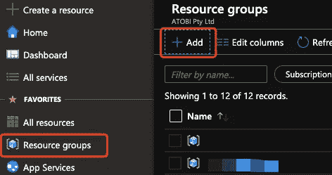
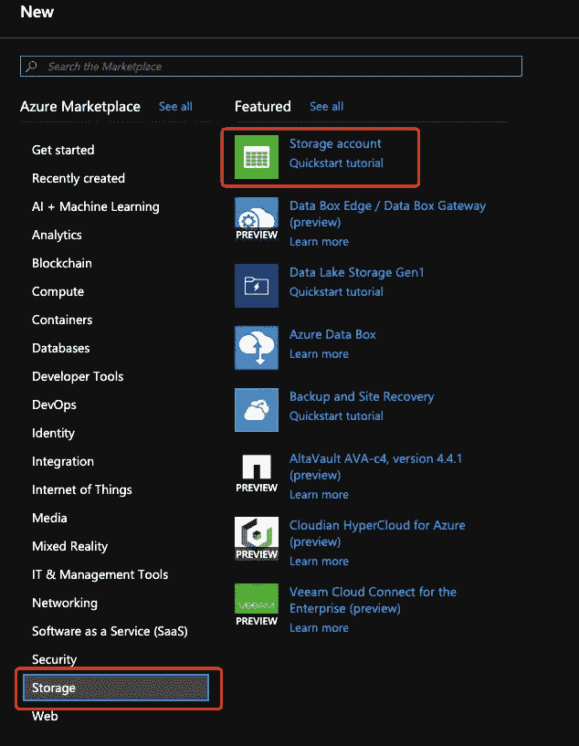

# 使用 Azure Portal Web UI 为雪花数据仓库在 Azure Blob 存储上构建 Snowpipe

> 原文：<https://towardsdatascience.com/building-snowpipe-on-azure-blob-storage-using-azure-portal-web-ui-for-snowflake-data-warehouse-f0cdd7997250?source=collection_archive---------1----------------------->


Image courtesy: [https://resources.snowflake.com/solution-briefs/snowflake-cloud-data-platform-solution-brief](https://resources.snowflake.com/solution-briefs/snowflake-cloud-data-platform-solution-brief)

Snowpipe 是雪花数据仓库的内置数据摄取机制。它能够监控并自动从云存储(如 Azure Blob Storage、亚马逊 S3)中提取平面文件，并使用“复制到”SQL 命令将数据加载到雪花表中。

在官方文档中，您会找到一个很好的教程:

> Azure Blob 存储自动化 snow pipe
> [https://docs . snow flake . net/manuals/user-guide/data-load-snow pipe-auto-Azure . html](https://docs.snowflake.net/manuals/user-guide/data-load-snowpipe-auto-azure.html)

但是，本文使用 Azure CLI(命令行界面)来构建云存储组件和 Azure 事件订阅。在我看来，这不够直观，尤其是对于新用户和对 Azure 了解不够的人来说。尽管他们可以按照这些命令构建 Snowpipe，但对于整体架构和数据流来说，它仍然是不可知论者。换句话说，本教程告诉你如何建立一个雪管，但很难让你理解。

在本教程中，我将介绍如何使用 Azure 门户构建 Snowpipe，这是 Azure 基于 Web 的 UI，我相信这会让您对 Snowpipe 的工作原理有更好的直觉。

# 创建存储帐户

首先，让我们创建一个资源组来组织将为 Snowpipe 构建的存储帐户。在你的 Azure 门户上，导航到**资源组**，点击**添加**。然后，输入该资源组的名称。为了获得最佳性能，您可以选择与雪花区域相同/接近的区域。



然后，让我们为暂存和事件队列消息创建存储帐户。

在官方教程中，创建了两个存储帐户，一个是用于存放平面文件的 blob 存储，另一个是带有存储队列的存储帐户，以便于事件订阅。

事实上，我发现一个既有 Blob 容器又有存储队列的 Azure 存储帐户就足够了。让我们创建这样一个存储帐户。

在我们刚刚创建的资源组中，单击 **Add** 按钮创建一个资源。在 Azure Marketplace 中，选择**存储**类别，并在“特色”列表中选择**存储帐户**。



请注意，存储帐户的名称应该是全局唯一的，所以我添加了日期作为后缀。这是因为每个存储帐户都有一个可以访问的 DNS CName([https://<name>. queue . core . windows . net](https://storagesfqueuedemo.queue.core.windows.net))。

确保您为**账户类型**选择了 **StorageV2** ，以同时拥有 **Blob 容器**和**存储队列**。然后，单击**查看+创建**验证并创建存储帐户。


# 准备存储帐户

现在我们有一个存储帐户。但是在我们利用它之前，我们需要创造:

*   Snowpipe 将加载的暂存文件的 Blob 容器
*   作为事件订阅端点的存储队列

要创建 Blob 容器，请单击**容器**按钮，然后单击**+容器**。给这个容器起一个你认为有意义的名字，然后点击 **OK** 创建它。


我们现在有了一个 Blob 容器。让我们创建存储队列。

返回到存储帐户概述页面。单击队列创建存储队列。


# 创建事件网格订阅

接下来，让我们为 Blob 容器创建事件网格订阅，并将端点设置为存储队列。

导航到**存储账户**->-**容器**，点击**事件**选项卡。


那里不应该有任何事件订阅。点击 **+活动订阅**创建一个。


为事件订阅命名。选择默认的**事件网格模式**。对于**事件类型**，确保您选择了 **Blob Created** ，这就是我们想要的 Snowpipe。然后，选择**存储队列**作为**端点类型**。


不要忘记选择存储队列。点击**选择您刚刚选择的**存储队列**下的一个端点**链接，右侧会弹出一个新的刀片导航窗口。首先，选择您的订阅，默认情况下，您当前的活动订阅应该已经存在。点击**选择存储账户**。


另一个弹出的刀片式服务器窗口让您选择存储帐户，因此请选择我们创建的帐户。


在最终的刀片窗口中，选择我们为此创建的存储队列，然后单击**确认选择**。


现在，您应该看到存储队列显示如下。


# **在雪花中创建一个集成**

之后，我们需要在雪花中创建一个**集成**。让我们首先从 Azure 记录一些集成所需的信息。

首先，记下存储队列的 URL。导航到存储队列，您将能够获得 URL 以及队列名称，如下所示:


然后，进入 **Azure 活动目录** - > **属性**获取**目录 ID** ，稍后雪花将使用该目录 ID 访问您的 Azure 订阅。


要在雪花中创建一个集成，您需要是一个帐户管理员。运行下面的 SQL 命令。

```
create notification integration SNOWPIPE_DEMO_EVENT
  enabled = true
  type = queue
  notification_provider = azure_storage_queue
  azure_storage_queue_primary_uri = '[<your_storage_queue_url>'](https://storagesfqueuedemo.queue.core.windows.net/sfeventqueue')
  azure_tenant_id = '<your_directory_id>';
```

注意:强烈建议在定义集成名称时全部使用大写字母，以避免在一些雪花场景中区分大小写。

> 提示:一旦完成，您可以运行`show integrations;`命令来检索您的雪花帐户中的所有集成；

# 向 Azure 认证雪花应用

现在，雪花知道去 Azure 哪里获取通知(Azure Events)，但我们仍然需要让 Azure 认证我们的雪花帐户。默认情况下，出于安全考虑，我们绝不应该让存放数据的 Azure 存储帐户被公开访问。

让我们首先在雪花中运行以下 SQL 命令:

```
DESC notification integration SNOWPIPE_DEMO_EVENT;
```

在结果窗格中，您将看到`AZURE_CONSENT_URL`属性，并且可以在`property_value`列访问登录 URL。将其复制并粘贴到您的浏览器中，以便像往常一样登录您的 Azure 帐户。

权限授予通知应该由 Azure 给出，点击**接受**按钮。


一旦完成，你应该被重定向到雪花官网。现在你可以关闭这个网页了。

现在，再次转到您的 **Azure Active Directory** ，单击**企业应用**选项卡。


滚动到底部，你会看到雪花应用程序的名称。


点击名称将让您进入雪花应用集成的详细信息中。记录出现在属性中的**名称**，以备后用。


现在，我们需要授予雪花对存储队列的访问权。否则，它不会得到事件消息。

导航到**存储帐户**->-**访问控制【IAM】->-**角色分配**。雪花仍然没有出现，所以我们需要添加角色分配。**


点击顶部的**添加**按钮，然后选择**添加角色分配**。


在弹出的刀片窗口中，选择**存储队列数据贡献者**作为角色，因为我们不想授予它不必要的更大权限。然后，在**选择**输入栏中输入“雪花”进行搜索，应该会检索到雪花应用帐户名。如果您有多个雪花帐户，请确保您选择了您在上述部分中记录的正确帐户。然后，点击**保存**按钮应用更改。


现在，您可以在**角色分配**列表中看到雪花账户。


# 创造一个雪花舞台

我们先来打造一个雪花舞台。这将被 Snowpipe 用作数据源。

创建数据库:

```
CREATE DATABASE SNOWPIPE_DEMO;
```

让我们使用公共模式，因为这只是一个实验。

要创建雪花外部阶段，我们需要获得 Azure Blob 容器 URL 和 SAS(共享访问签名)。我们去**存储账号**->-**属性**获取网址。


然后，转到“共享访问签名”选项卡以创建 SAS 令牌。在这里，我想更改 1 年后的年份，因此令牌将在一年内有效。您可能希望根据您的要求使用不同的结束日期时间。之后，点击**生成 SAS 和连接字符串**。


SAS URL 应该如下所示。请注意，这是一个 URL，令牌应该是以问号“？”开头的字符串


完成的 SQL 命令如下所示(请注意，这是一个示例，您需要用自己的命令替换`url`和`credentials`):

```
CREATE OR REPLACE STAGE "SNOWPIPE_DEMO"."PUBLIC"."DEMO_STAGE"
  url = 'azure://snowpipestorage20191214.blob.core.windows.net/snowpipe-source-blob/'
  credentials = (azure_sas_token=
    '?sv=2019-02-02&ss=bfqt&srt=sco&sp=rwdlacup&se=2020-12-14T18:44:03Z&st=2019-12-14T10:44:03Z&spr=https&sig=ZPN2qcMw64k44td90gSMzvC7yZuQjnQZZCD2xAUS25Y%3D'
  );
```

让我们测试雪花和 Blob 容器之间的连接。打开你的文本编辑器，写下以下内容，然后将文件另存为`emp.csv`

```
1,Chris
2,John
3,Jade
```

上传到 Blob 容器。


然后，在雪花中运行下面的命令。您应该能够在结果窗格中看到该文件。

```
ls @"SNOWPIPE_DEMO"."PUBLIC"."DEMO_STAGE";
```

# 创建雪管

现在我们到了最后一个阶段，制作雪管。让我们首先创建一个表作为 Snowpipe 的目的地。

```
CREATE OR REPLACE TABLE "SNOWPIPE_DEMO"."PUBLIC"."EMPLOYEE" (
  id STRING,
  name STRING
);
```

然后，使用以下 SQL 命令创建 Snowpipe

```
CREATE OR REPLACE pipe "SNOWPIPE_DEMO"."PUBLIC"."DEMO_PIPE"
  auto_ingest = true
  integration = 'SNOWPIPE_DEMO_EVENT'
  as
  copy into "SNOWPIPE_DEMO"."PUBLIC"."EMPLOYEE"
  from @"SNOWPIPE_DEMO"."PUBLIC"."DEMO_STAGE"
  file_format = (type = 'CSV');
```

现在，您将能够显示您刚刚创建的管道。

```
SHOW PIPES;
```

# Snowpipe 加载现有文件

在我们创建 Snowpipe 之前,`emp.csv`文件已经在 Blob 容器中了。因此，它不会自动加载文件，因为它依赖于“Blob Created”事件来触发自身，但该事件发生在它被创建之前。

我们确实有一种方法来加载 Blob 容器中的现有文件。使用下面的命令将手动刷新 Snowpipe，让它加载 Blob 容器中存在但尚未加载的任何文件。

```
ALTER PIPE "SNOWPIPE_DEMO"."PUBLIC"."DEMO_PIPE" REFRESH;
```

一旦运行该命令，结果窗格显示如下，这意味着加载请求已经发送到`emp.csv`文件:


现在，我们可以运行`SELECT * FROM EMPLOYEE`，您将看到从文件中加载的行。


# 测试雪管

最后，让我们通过上传一个新文件到 Blob 容器来测试 Snowpipe。

如下创建`emp_2.csv`文件，并将其上传到`snowpipe-source-blob` Blob 容器。

```
4, Alex
5, Olivier
6, Frank
```

稍等一会儿，再次检索`EMPLOYEE`表，新记录加载完毕！


# 未来作品

本教程介绍了如何创建 Snowpipe，并重点关注“利用 Azure Portal ”,而不是像雪花官方文档那样使用 Azure CLI。

如果您对在雪花中构建自动化数据管道(从数据接收到生产数据库)的最佳实践感兴趣，请关注关于该主题的下一篇文章。它将涵盖雪花流和任务。

[](https://medium.com/@qiuyujx/membership) [## 通过我的推荐链接加入灵媒-陶

### 作为一个媒体会员，你的会员费的一部分会给你阅读的作家，你可以完全接触到每一个故事…

medium.com](https://medium.com/@qiuyujx/membership) 

如果你觉得我的文章有帮助，请考虑加入 Medium 会员来支持我和成千上万的其他作者！(点击上面的链接)