# 与 Luigi 一起构建 Spotify Discover 每周电子邮件提醒

> 原文：<https://towardsdatascience.com/building-spotify-discover-weekly-email-alert-with-luigi-ca0bc800d137?source=collection_archive---------18----------------------->

## 一个简单的 Luigi 数据管道


Photo by [Ryan Quintal](https://unsplash.com/@ryanquintal?utm_source=medium&utm_medium=referral) on [Unsplash](https://unsplash.com?utm_source=medium&utm_medium=referral)

首先，我想让你明白，这是我个人学习的记录。您可能会找到比我在这里尝试和展示的方法更好的实现方法。如果你有任何改进代码的建议，我很乐意听取建议和评论。

如果你是 Spotify 用户，你可能听说过他们的一个功能，叫做“发现周刊”。Discover Weekly 是一个包含 30 首歌曲的播放列表，Spotify 会根据您的收听历史推荐这些歌曲。我非常喜欢 Discover Weekly，有时甚至有点害怕 Spotify 太了解我了。似乎不仅仅是我。

我使用 Discover Weekly 的唯一问题是，我无法访问我的历史 Discover Weekly，因为它每周一自动刷新。当我忘记将我喜欢的歌曲保存到我的库或播放列表中时，下周列表就完全消失了，我也没有办法找出我绝对喜欢但忘记保存的那首歌是什么。

我在这里分享的私人小项目，就是从上述问题开始的。我想到的解决方案是每周一从《发现周刊》提取歌曲列表，并将列表作为电子邮件发送给自己。这是一个用 Luigi 尝试简单数据管道的绝佳机会。

# 需要:

*   Spotify 帐户
*   Gmail 帐户
*   AWS 帐户

(顺便说一句，我用的是 Macbook 做这个项目，如果你用的是 Windows，有些步骤可能会略有不同。)

# 获取 Spotify API 访问权限

为了能够以编程方式访问 Spotify，您需要 Spotify 的客户端 ID 和客户端密码。您可以通过前往 [Spotify for Developers](https://developer.spotify.com/dashboard/applications) 页面轻松获得。进入仪表板页面后，您可以点击绿色的“创建客户端 ID”按钮，然后会询问您一些问题，如应用程序名称、描述等。

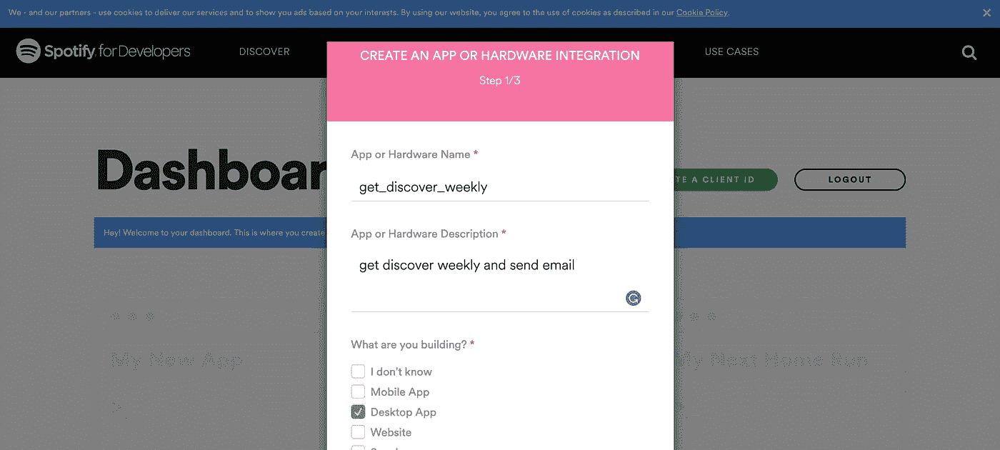

接下来会问你这个 app 是不是商业用的。在我的例子中，我只是为自己构建这个，所以我单击了“否”。

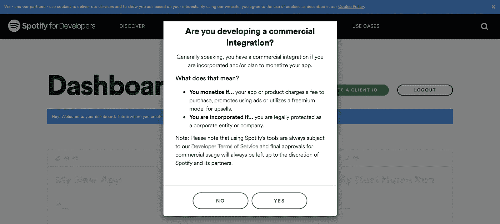

最后，勾选复选框，然后提交。

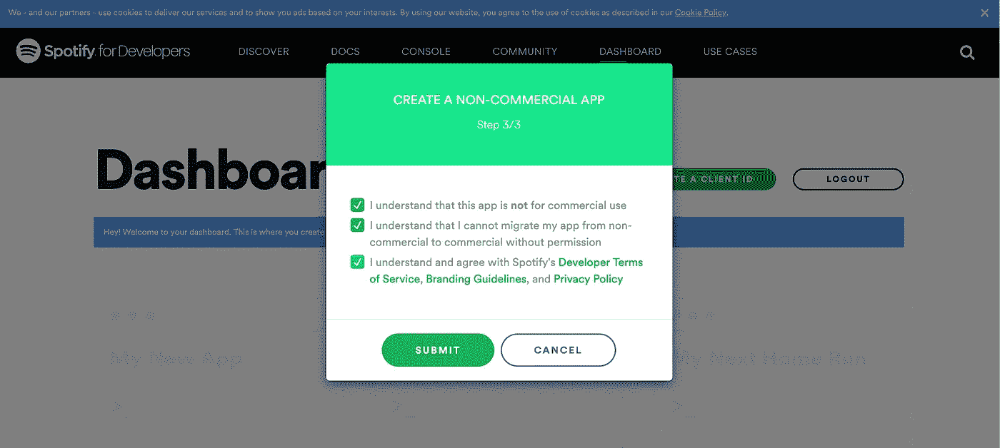

然后，您将获得一个客户端 ID 和一个客户端密码，您可以使用它们来访问 Spotify API。

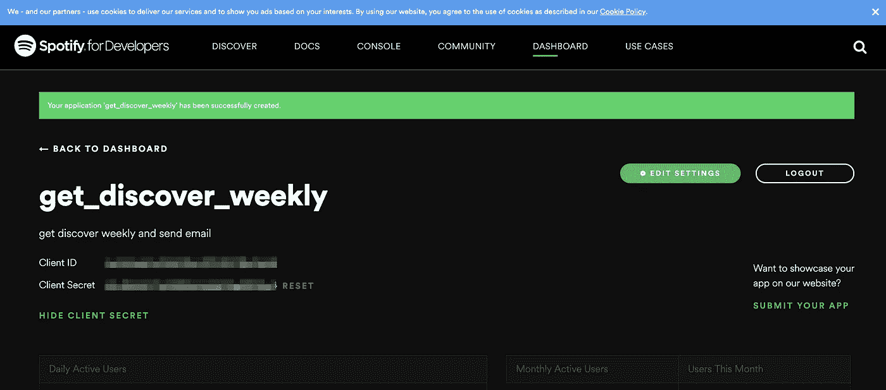

拿一份备忘录或复制粘贴到某个地方，因为我们以后会需要这些。点击“编辑设置”，添加“ [https://localhost:8080](https://localhost:8080) ”重定向 URIs。在正确的应用程序中，这将在确认 API 访问后将用户重定向到应用程序，但在这种情况下，这将仅用作身份验证参数的一部分。

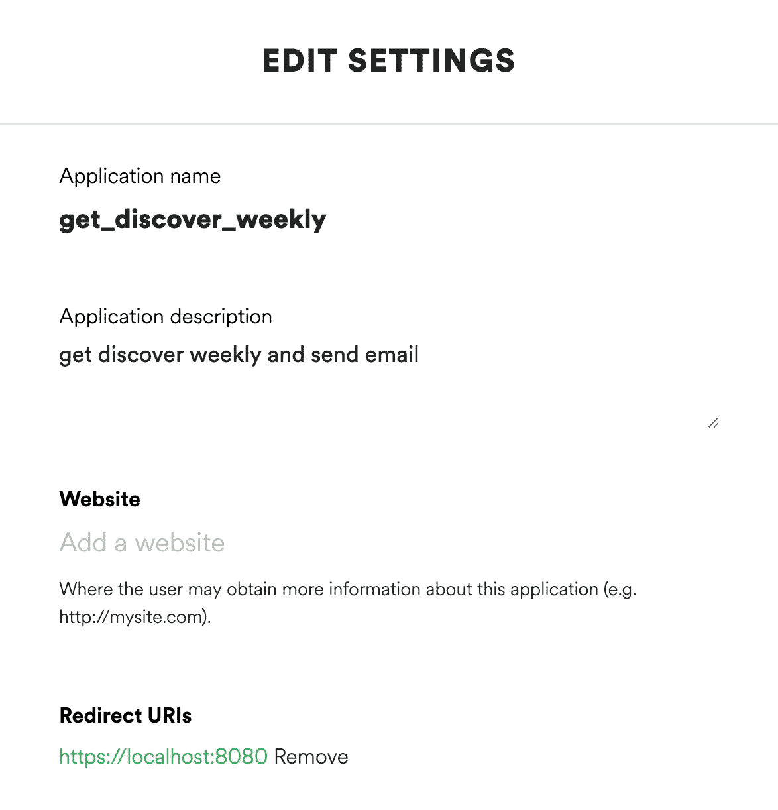

你需要做的最后一件事是在 Spotify 上关注《发现周刊》。这使得从我们的 Python 程序中检索 Discover Weekly 成为可能。

# 在 AWS 上启动 EC2 实例

登录到您的 AWS 管理控制台，并点击进入 EC2。我写这篇文章是假设你已经有一个 AWS 帐户。单击“启动实例”。对于这个项目，我选择了**亚马逊 Linux AMI 2018.03.0** 。

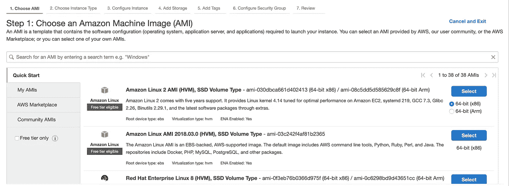

确保选择的实例类型是 t2.micro，它符合自由层的条件。我们应该做的一个重要步骤是为 Luigi 打开端口，以便我们可以访问 Luigi 的中央调度程序。

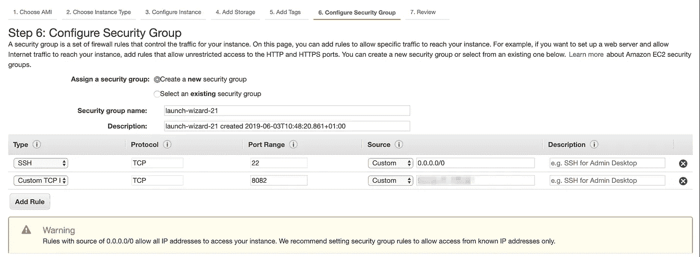

除了“6”之外，其余保持默认设置。配置安全组”。到达这里后，点击“添加规则”并从“类型”下拉列表中选择自定义 TCP，然后在“端口范围”中键入“8082”。Luigi 的中央调度程序 GUI 默认使用端口 8082，因此这一步使我们能够在 web 浏览器上访问 Luigi GUI。作为附加步骤，您可以在“源”部分添加您自己的 IP 地址，以便您只允许来自某个 IP 地址的入站流量。如果你想明确自己的 IP 地址，只需在源部分输入“你的 IP 地址/32”。现在点击“查看并启动”。

接下来，将提示您选择现有的密钥对或创建新的密钥对。从本地计算机与实例通信时将使用该密钥。让我们为项目创建一个新的密钥对。

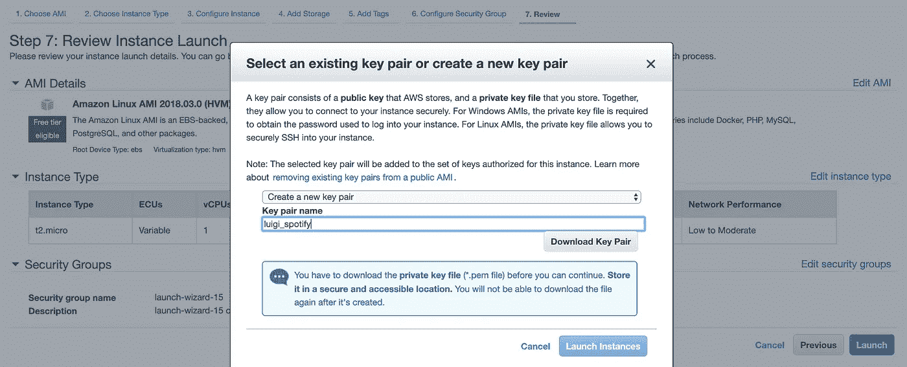

首先，下载密钥对，然后最后启动实例。回到 AWS 控制台的 EC2 部分，您可能会看到实例仍然没有处于“运行”状态。给它一些时间，当它转向“运行”时，记下它的公共 DNS (IPv4)和 IPv4 公共 IP。

# 附加 AWS 准备

从终端或 AWS web 控制台，创建一个名为“luigi-spotify”的 S3 存储桶。这将稍后用于存储从 Spotify 提取的歌曲列表，如 TSV。

# 连接到 EC2 实例

我希望到目前为止没有什么太复杂的事情。现在，既然我们启动了实例，我们可以 ssh 到它。在此之前，我们需要更改上面下载的密钥对的文件权限，因为 EC2 实例不接受公开可见的密钥文件。打开您的终端，并在将“目录…”部分替换到您自己的目录后运行以下命令

```
chmod 400 directory-where-you-downloaded-the-key-file/luigi_spotify.pem
```

3 种类型的用户(用户、组、其他)有 3 种权限(读、写、执行)。上面的代码行所做的是更改文件权限，这样密钥文件只有一种权限(Read)允许一种类型的用户(user)使用。现在我们准备好 ssh 到我们的实例中。同样，请用您自己的目录和公共 DNS 替换“目录…”和“您的实例…”部分。

```
ssh -i directory-where-you-downloaded-the-key-file/luigi_spotify.pem [ec2-user@y](mailto:ec2-user@ec2-34-240-79-107.eu-west-1.compute.amazonaws.com)our-instance's-public-DNS
```

# 正在为 Luigi 任务准备 EC2 实例

在 EC2 实例中，让我们首先安装 Git，这样我们就可以克隆我为这个项目准备的存储库。

```
sudo yum -y install git
```

现在使用 git clone 命令克隆存储库。

```
git clone [https://github.com/tthustla/luigi_spotify.git](https://github.com/tthustla/luigi_spotify.git)
```

转到克隆的目录，我们先来看看文件。

```
cd ~/luigi_spotify
ls
```


ec2-prep.sh 将用于安装所需的软件包。luigi.cfg 是一个配置文件，您将在其中放置所有的 API 密钥和凭证。luigi_cron.sh 是一个 bash 脚本，运行 run-luigi.py 中定义的 luigi 管道。

通过运行下面的命令，使这两个 bash 脚本都可以执行。

```
chmod 777 *.sh
```

现在让我们首先运行 ec2-prep.sh

```
./ec2-prep.sh
```

# 路易吉

在我们实际运行管道之前，最好了解管道做什么以及它是如何做的。下面是 run_luigi.py 的代码。

在高层次上，它执行两项任务。首先，从 Discover Weekly 播放列表中获取歌曲列表，并将它们作为 TSV 存储在 S3。一旦它存储完 TSV，然后通过 TSV，它会创建一封电子邮件，将[歌曲名称]——[艺术家]显示为 Spotify 链接，然后将该邮件发送给自己。第一个任务是在 GetWeeklyTracks 类中定义的，第二个是在 SendWeeklyEmail 类中定义的。为了使这些任务能够运行，它需要凭证信息，这些信息是使用 luigi 从 luigi.cfg 文件中检索的。配置类。获取 Spotify API 令牌并建立与 Spotify 的连接是在 Luigi 任务之外完成的。

# 在本地调度程序上运行 Luigi

接下来我们需要做的是填充 luigi.cfg 文件中的信息。首先用 Nano 打开文件。

```
nano luigi.cfg
```

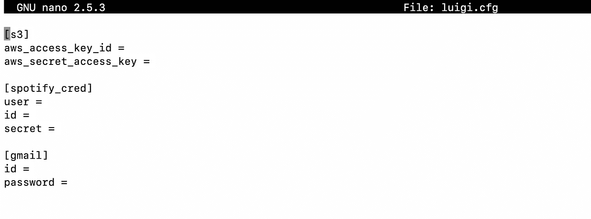

用您自己的凭据填写每个值，不带引号或双引号。现在，我们终于准备好在 EC2 中对管道进行本地测试运行了。

```
python3 run_luigi.py SendWeeklyEmail --local-scheduler
```

由于 spot ipy(Spotify API 的 Python 库)的认证流程，你会看到如下的说明。

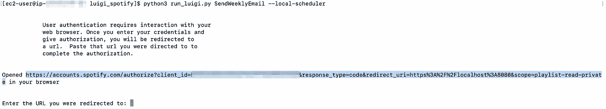

如果在您的本地机器上测试，这将打开 web 浏览器，但是在 EC2 上不能打开，因为没有安装 web 浏览器。复制 URL(上面截图中蓝色突出显示的部分)，粘贴到您的本地机器 web 浏览器并打开。

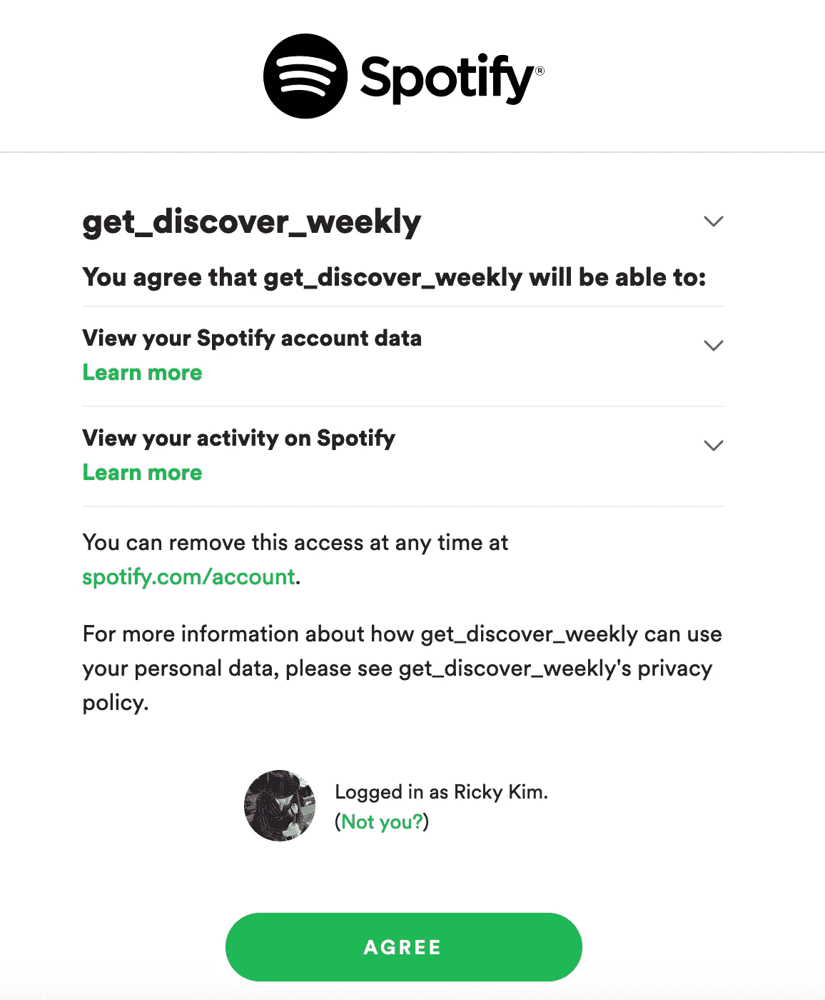

如果你看到一个如上的屏幕，点击“同意”，然后它会显示如下所示的错误页面。你不必担心这个错误页面。这是因为我们提供的重定向 URI 只是一个本地主机端口，上面没有运行任何东西。复制错误页面的 URL 地址，URL 中嵌入了一个代码，将被 Spotipy 的 autehntication 流使用。

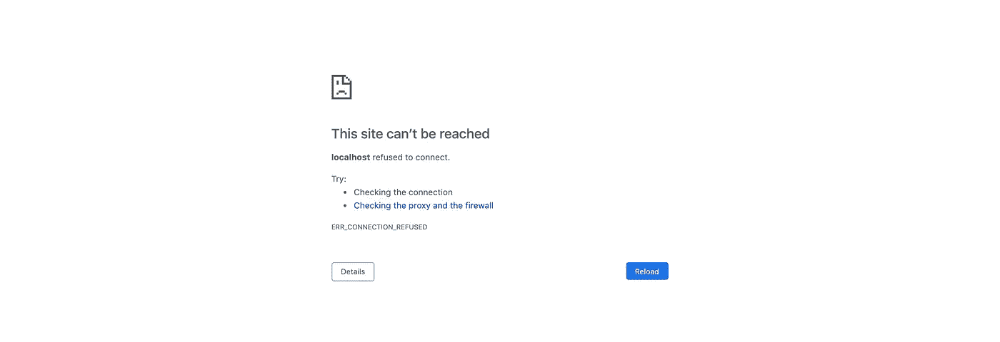

现在回到您的 EC2 终端，将 URL 粘贴到控制台，它显示“输入您被重定向到的 URL:”。现在很有可能第一次尝试不会成功，因为谷歌一开始会阻止这个来自未知 IP 地址的 Gmail 登录。如果发生这种情况，请使用本地机器的 web 浏览器登录到您的 Gmail，然后再次尝试运行该命令。如果一切顺利，您将会收到试运行时发送的电子邮件。

# 在中央调度程序上运行 Luigi

我们快到了。火车运行成功了，现在我们还有几步要走。现在，让我们用 Luigi 的中央调度程序对管道进行适当的运行，这样我们就可以访问 Lugi GUI 了。首先，为日志文件创建一个目录。

```
mkdir ~/luigi_spotify/log
```

当我们进行后台运行时，控制台输出将存储在我们刚刚创建的上述目录中的日志文件中。让我们启动 Luigi 中央调度程序。

```
luigid --background --logdir ~/luigi_spotify/log
```

由于我们已经打开了端口 8082 来访问 GUI，我们现在可以在 web 浏览器上打开 GUI。打开带有 IPv4 公共 IP 和“:8082”的页面，如下所示。

```
your-EC2-pulic-IP:8082
```

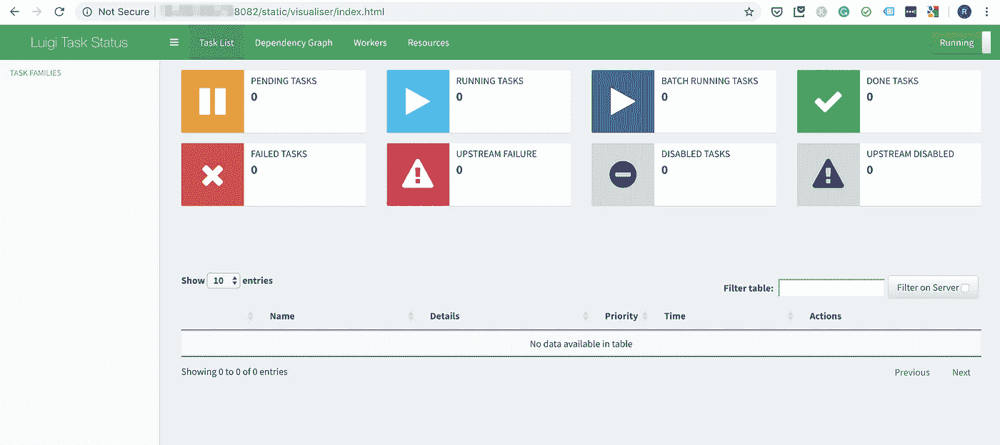

我们尚未运行任何任务，因此您现在不会看到任何任务。现在，让我们运行最后没有“—本地调度程序”参数的管道。您可能希望删除在试运行期间在 S3 存储桶中创建的文件夹，以便从头开始查看整个管道。否则，Luigi 将看到 S3 存储桶中的文件夹和文件，然后只检查输出文件是否在那里，并将任务标记为成功，而不运行任何任务。现在，您将看到两个任务成功运行。

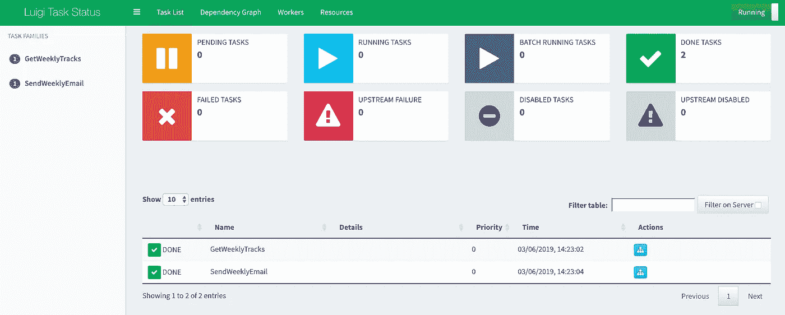

万岁！！


Image courtesy of [vernonv on Redbubble](https://www.redbubble.com/people/vernonv/works/28166990-luigi-dab?p=art-print)

# 设置 Cron 作业

最后一部分是设置一个 Cron 作业，以便我们可以决定这些任务运行的时间和频率。这里您必须考虑的一件事是，您的 EC2 实例的 Linux 时间可能与您的本地时间不同。运行以下命令来设置 EC2 实例中的时区。

```
cd /usr/share/zoneinfo
tzselect
```

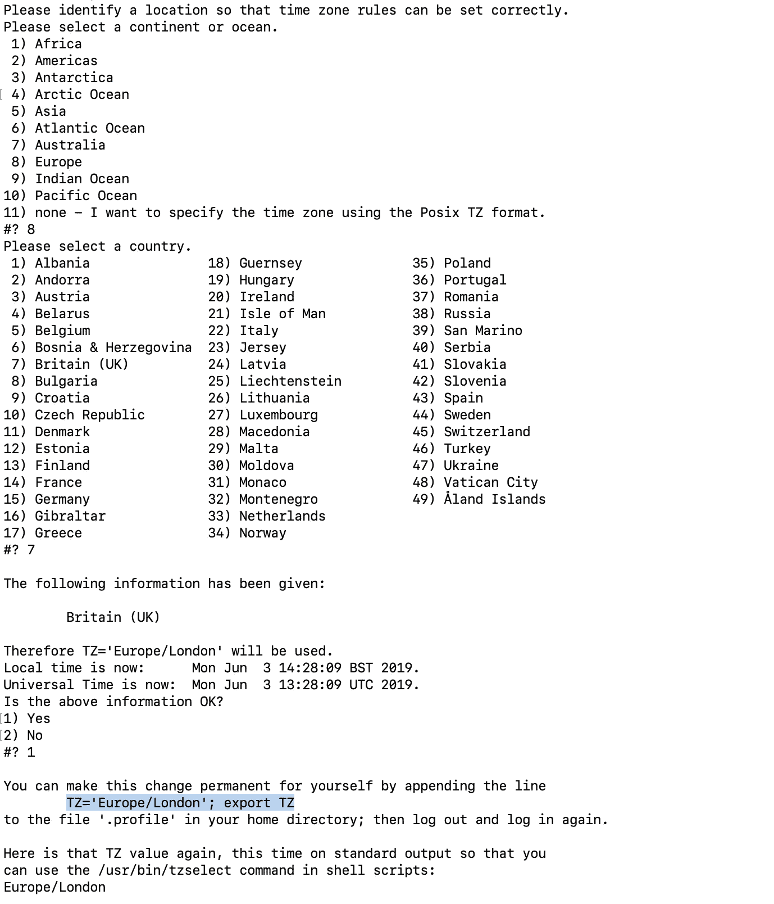

在你选择了正确的时区后。从您自己的终端复制用蓝色突出显示的部分并运行。因为我将在不重启的情况下完成 EC2 的设置，所以我只是在终端上直接运行代码，而没有将它附加到。个人资料。

```
TZ='Europe/London'; export TZ
```

我们将使用 luigi_cron.sh 设置一个 Cron 作业，该作业将运行 run_luigi.py。这个小部分我花了一段时间才想明白。当作为 Cron 作业运行时，相同的文件、相同的任务会抛出编码错误，而没有 Cron 它也能很好地工作。经过长时间的谷歌搜索，我终于找到了有效的方法。您可以通过运行“locale”找到 EC2 实例的 LC_CTYPE 值。

```
locale
```

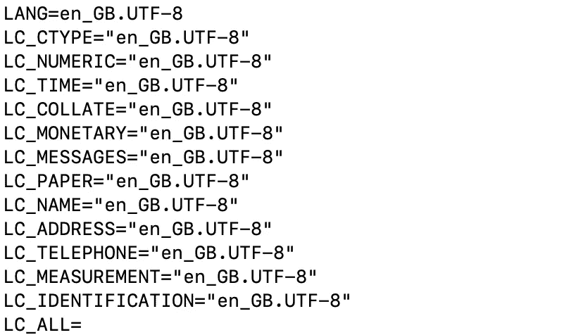

一旦有了 LC-CTYPE 信息，就用下面代码打开一个 Crontab。

```
crontab -e
```

你在那里什么也找不到。按“I”进入“插入”模式，然后粘贴下面的代码，按 esc 键，然后键入“:wq”来写修改并退出。

```
0 8 * * MON LC_CTYPE="en_GB.UTF-8" ~/luigi_spotify/luigi_cron.sh
```

上面的 Crontab 表达式将 bash 脚本安排在每周一上午 08:00 运行，但是您可以根据自己的喜好进行更改。如果你需要 Crontab 表达式的帮助，你可以在[https://crontab.guru/](https://crontab.guru/)尝试自己的表达式。

如果要检查 Cron 是否工作，可以先设置 Crontab 值如下(它会每分钟运行一次任务)，然后检查是否工作，再改回你要设置的每周 Crontab 值。再次，如果你想做这个检查，请不要忘记从你的 S3 桶删除文件夹。

```
*/1 * * * * LC_CTYPE="en_GB.UTF-8" ~/luigi_spotify/luigi_cron.sh
```

就是这样！现在，Luigi 管道将在每周一运行，从我的 Discover Weekly 获取歌曲，并将向我发送电子邮件！

我知道这不是一个非常复杂的任务。但对我来说，这是一次非常美妙的学习经历。当然，我的代码实现还有改进的空间，但是我今天很高兴，因为我使用数据和 Luigi 解决了我的一个日常问题！

感谢您的阅读。你可以从下面的链接找到 Git 仓库。

【https://github.com/tthustla/luigi_spotify 号