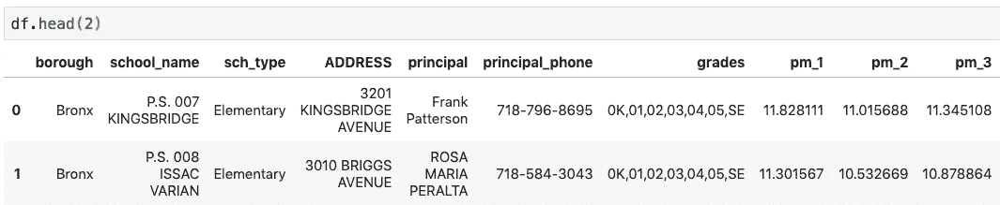

# 建设支持无污染城市:一个开放的数据工作流程

> 原文：<https://towardsdatascience.com/building-support-for-pollution-free-cities-an-open-data-workflow-888096797cc9?source=collection_archive---------14----------------------->

## [变更数据](https://towardsdatascience.com/tagged/data-for-change)

空气污染是我们这个时代的最大杀手之一，根据《柳叶刀》[的一项研究](https://www.sciencedirect.com/science/article/pii/S0140673616316798#fig1), 2015 年空气污染导致 640 万人死亡，相比之下，疟疾导致 70 万人死亡。我们如何推动更多的行动来解决这个问题？在本帖中，我们将介绍使用 Python 代码构建数据驱动的宣传工具的步骤。

受一项在伦敦获得显著回报的政治战略的启发，我们将展示如何为纽约或其他投资开放数据门户和 PM2.5 等污染物监测的城市建立类似的工具。

# 动机:从大雾霾到大扫除

就我个人而言，我一直将空气污染与中国东部沿海地区联系在一起，直到我得知我的家乡伦敦经历了或许是历史上最具破坏性的雾霾事件。

1952 年 12 月，由于一场寒流，伦敦人比平时燃烧了更多的煤，就在这时，低压和无风的条件笼罩着这座城市，将污染物截留在地面上。由于浓厚的黄色烟雾(一种“豌豆汤”)限制了能见度，交通陷入停顿。至少 12000 人死亡。

Left: The Great Smog of London (1952) killed up to 12,000 people. It has been cited by China’s leadership as a worst case scenario justifying stringent actions like limiting auto ownership. Right: air pollution outside the Forbidden City, snapped on my Jan 2018 China trip.

在最近的伦敦之行中，我对报纸、广播和电视中空气污染的突出报道感到震惊。这种媒体环境使得连续三任市长——肯·利文斯通、鲍里斯·约翰逊和萨迪克·汗——采取了影响汽车、工业甚至柴火的雄心勃勃的措施。报道围绕一件事:将空气污染视为儿童健康问题。

# 1.获取学校和污染数据

遵循相同的方法，但对于纽约市，让我们用来自纽约市社区空气调查的数据来获取并覆盖纽约市的学校位置。两者都可以从纽约市公开数据中获得。

NYCASS 是以合理的成本获取可操作的城市级空气污染数据的绝佳模型。从 2008 年开始，城市工人在 150 个地点安装了便携式空气质量监测器，每次两周，每季一次。使用[土地使用回归](http://nyam.org/media/filer_public/71/7c/717c1a15-eb6d-4584-8a29-06415aa8e22c/new_york_city_community_air_survey.pdf)，纽约市环境保护局可以估算整个城市的污染水平，而不需要安装永久性传感器。

这里，我们导入两个数据集，并使用矢量数据(Geopandas)和栅格数据(Rasterio)的关键 Python 库将它们绘制在一起。检查[源代码](https://github.com/nj935/nj935.github.io/blob/master/NYC_air_pollution.ipynb)，了解几个数据清理步骤。

NYCCAS air pollution raster for 2012 combined with Shapefile of New York City Public Schools

Left: Installing air quality sensor on Fifth Avenue. Right: the Community Air Survey built the case for measures like NYC’s ban on heavy fuel oil, which previously heated boilers at 10,000 apartment buildings.

# 2.每个位置的采样栅格值

NYCCAS 数据是 TIFF 格式的一组[栅格集](https://data.cityofnewyork.us/Environment/NYCCAS-Air-Pollution-Rasters/q68s-8qxv)。在一个 300 x 300 米的城市方格中，每个像素都给出了预期的 PM2.5 水平。

Rasterstats 是一个 Python 库，具有有用的 point_query 函数，如下所示。我们通过在每个学校的位置对每个栅格进行采样(我用了七年的栅格),为每个学校创建了一个估计 PM2.5 浓度的时间序列。

结果存储为 Pandas data frame(Excel 电子表格的 Python 等价物)。我还合并了贫困人口普查数据和城市健康结果调查。

DataFrame of schools with PM2.5 levels sampled from the rasters (years 1 through 3 shown).

# 3.分析 1:各区的污染程度不同吗？

世界卫生组织认为每立方米 10 微克以上的 PM2.5 水平是危险的。下面我们用红色标出了经历不同程度 PM2.5 的小学数量，世卫组织的阈值为红色。一个故事正在浮出水面:布朗克斯区的大多数小学都在门槛以下，但其他区有许多学校接近或超过了危险区。

接下来，同样的情节适用于中学。在把你的孩子送到曼哈顿的学校之前，要小心做好你的功课。

情况是恶化了还是改善了？绘制每个区的学校平均 PM2.5 浓度的时间序列，显示自 2009 年以来的明显改善；尽管许多孩子仍然接近或超过危险的污染物水平。

# 4.分析 2:空气质量与贫困有什么关系？

穷人常常面临环境污染带来的不成比例的影响。对于每所学校，我们采用周围人口普查地区的中值收入，并将其与最新一年的 PM2.5 估计值进行对比。有趣的是，在纽约，贫困和空气污染之间没有明显的联系。

在伦敦，媒体报道在一定程度上受到研究的推动，这些研究显示，无论是贫困地区还是富裕地区的学校——包括该市一些最负盛名的教育场所——都遭受着危险的污染水平。纽约似乎也遵循着类似的模式:像上东区和展望高地这样的富裕社区都是建筑物和车辆排放大量废气的地区。在工业排放在污染组合中扮演更重要角色的地方，模式可能会有所不同，但至少在这两个城市，空气污染是平等机会杀手。

# 5.将它们放在一起:数据可视化

我们的 shapefile 结合了学校位置、人口统计特征和 PM2.5 暴露时间序列，数据可视化的时机已经成熟。

什么是成功的宣传工具？在我们的案例中，关键因素是父母的关心。下面是用 Python 的叶库构建的原型，它根据污染水平对每所学校进行颜色编码:超过世卫组织阈值的学校是暗红色的。我们希望父母能够放大他们孩子的学校，看到空气质量，并感到愤怒。没有什么比父母要求为孩子的健康采取行动更能在市政厅推动事态发展了。

点击[此处](https://public.tableau.com/profile/nick.jones4257#!/vizhome/NYC_air_2/Dashboard1?publish=yes)查看使用 Tableau Public 构建的概念验证。纽约市学校数据集包括每个校长的姓名和电话号码，所以试着悬停在一所学校上，如果你特别担心，给他们打电话建议网站改进或无闲置规定！

将开放的数据门户和空气污染监测带到更多的城市将使这种公民行动主义在其他地方成为可能——毕竟，没有什么比关注孩子的健康更能让人类团结起来。

*感谢阅读！查看源代码* [*此处*](https://github.com/nj935/nj935.github.io/blob/master/NYC_air_pollution.ipynb) *。如果您想继续交谈，请联系我们或发表评论。*