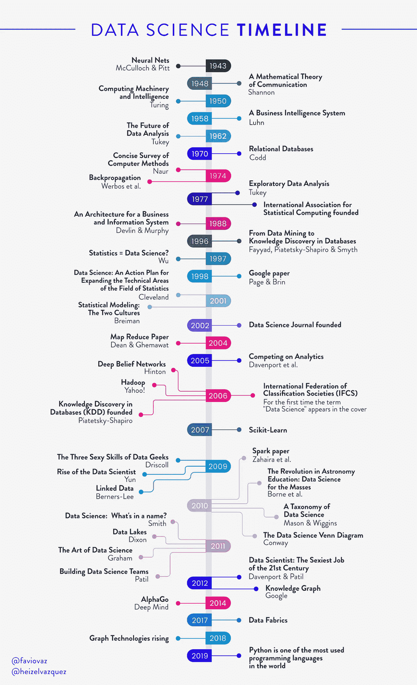
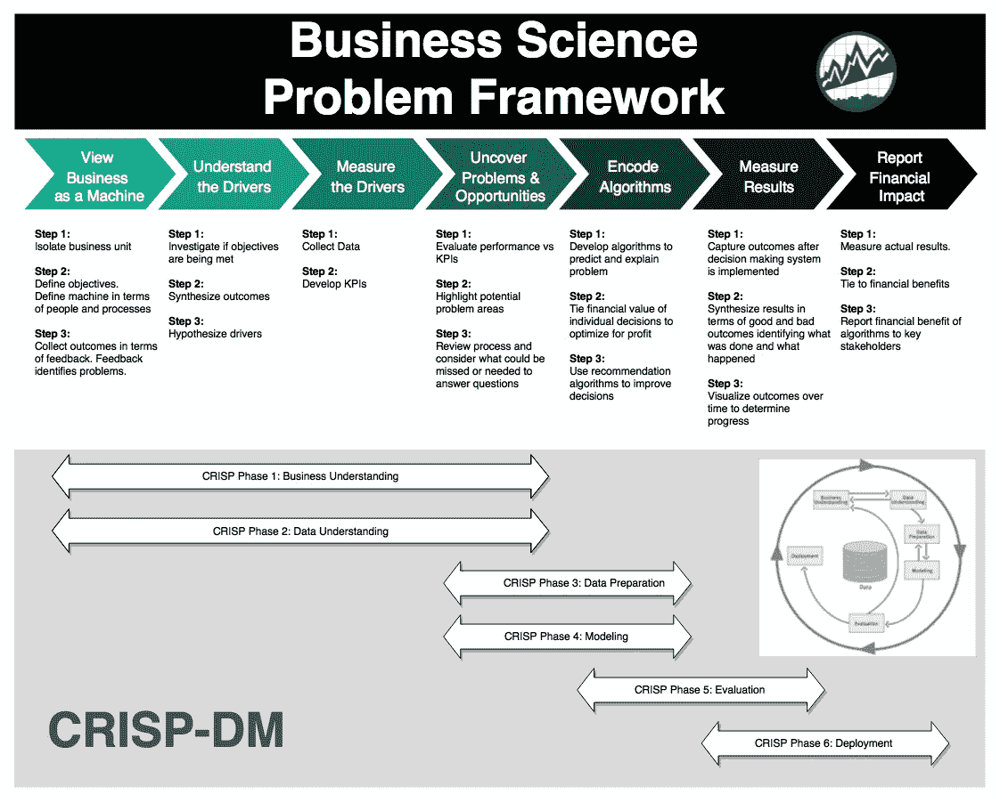

# 构建数据科学的未来

> 原文：<https://towardsdatascience.com/building-the-future-of-data-science-d5587a402e42?source=collection_archive---------10----------------------->

## 看完这里所有的部分:[第一部](/the-data-fabric-for-machine-learning-part-1-2c558b7035d7)、[第一部-1B](/the-data-fabric-for-machine-learning-part-1-b-deep-learning-on-graphs-309316774fe7) 、[第二部](/the-data-fabric-for-machine-learning-part-2-building-a-knowledge-graph-2fdd1370bb0a)、[第三部](/https-towardsdatascience-com-the-data-fabric-containers-kubernetes-309674527d16)。

## 如果我们不能预测未来，他们称我们为失败者，如果我们预测得太好，他们称我们为巫师。但正如庞加莱所言:“即使没有确定性也能预见，远胜于完全不预见。”

我谈论数据科学已经有一段时间了。在文章的上半部分，你可以看到我的一些与此相关的作品，但是我想更进一步。我将讨论这个领域的未来。

再次重构庞加莱关于数学的话，如果我们希望预见数据科学的未来，我们正确的做法是研究科学的历史和现状。我将分几个部分来做这件事(对此我很抱歉)，所以请稍后继续关注。

先说一些历史吧。我没有用一段段文字来让你厌烦，而是建立了这个关于数据科学的时间线，这将有助于理解我们从哪里来，我们将去哪里。

**免责声明:这个时间表可能不完全完整，所以如果你认为我遗漏了什么，请告诉我。此外，我正在将数据科学的历史与计算机科学、机器学习、深度学习、数据分析和数据挖掘的一些发展相结合。**

这根本不是一个新领域，但在过去几十年里有了惊人的发展。因为空间的原因，我不得不删掉一些部分和片段，但是最重要的东西还是有希望的。

我用来创建这个时间线的参考资料的完整列表在文章的底部。请检查他们，他们是令人敬畏的。

希望这个时间线能让你了解研究数据的科学的历史，我们现在称之为数据科学，但这可能不是我们的最终术语。所以要时刻准备着变化。

# 我们要去哪里？

前阵子我[发表了](/whats-going-to-happen-this-year-in-the-data-world-9fc065ac3870)这张图表:

关于他这些年对语义技术的兴趣。我们可以很容易地看到它随着时间的推移而增加。在这种情况下，语义意味着使用形式语义来赋予我们周围不同的原始数据以意义，以及能指和它们在现实中所代表的东西，它们的外延之间的关系。

当我们谈论数据中的语义时，我们通常指的是本体、关联数据、图形和知识图、数据结构等等的组合。您可以在本文开头的链接中了解所有这些内容。

但是为什么呢？为什么要转变？事实是，本体语言中的所有数据建模语句(以及其他所有东西)本质上都是增量的。事后增强或修改数据模型可以很容易地通过修改概念来实现。

在这些技术中，我们通常将数据存储在图表中。关系数据库将高度结构化的数据存储在具有预定列和行的表中，而图形数据库可以映射多种类型的关系和复杂数据。这对我们现在拥有的更好。

我现在已经参与了无数的项目，常见的事情是我们花费大量的时间试图理解我们拥有的数据，其中一个原因可能是我们没有以良好的格式存储数据及其关系。数据结构的承诺就是支持公司中的所有数据。它是如何被管理、描述、组合和普遍访问的。

请记住，**数据和上下文是第一位的**，这种新的模式使用内置的图形数据库和语义数据层来集成和协调所有相关的数据源，包括结构化和非结构化数据。数据结构传达了数据的业务上下文和含义，使业务用户更容易理解和正确利用。

对我来说，这是数据科学的未来。我们正朝着语义技术将成为每家公司标准的方向前进。但我们不会就此止步。增强现实、虚拟现实等领域的所有进步都将伴随着这些转变。例如，看看这个项目:

来自[创作者](https://northstar.mit.edu/):

> 北极星是一个交互式数据科学平台，重新思考人们如何与数据交互。它使没有编程经验、统计背景或机器学习专业知识的用户能够通过直观的用户界面探索和挖掘数据，并毫不费力地构建、分析和评估机器学习(ML)管道。

想象一下把它和语义技术结合起来，并且能够和你的数据交流。提出问题，系统会给你答案。这是我们未来的另一部分，自动化。我们需要数据存储、数据管理、数据探索、数据清理以及所有我们实际上花费大量时间做的事情的自动化。你可以说像 [DataRobot](https://www.datarobot.com/) 这样的工具可以给你提供这些东西，但是根据我的经验，在这个领域还有很多事情要做。

做所有这些事情的平台的一个很好的例子是 Anzo。到处都有自动化。而且很容易在旅途中添加更多功能，如**可解释的人工智能**、**持续智能**等等。

[https://www.cambridgesemantics.com/product/](https://www.cambridgesemantics.com/product/)

但是还有更多的，还会有更多的。我实际上用 AnzoGraph 做了一个练习，它是 Anzo 的一部分，你可以在这里阅读:

 [## 数据结构、容器、Kubernetes、知识图表等等

### 在上一篇文章中，我们讨论了知识图的构建模块，现在我们将更进一步，学习知识图的构建模块

towardsdatascience.com](/https-towardsdatascience-com-the-data-fabric-containers-kubernetes-309674527d16) 

# 我如何跟上所有正在发生的事情？

这是我反复遇到的问题之一。我如何知道去哪里看，并跟上该领域的最新进展。

我的回答是:

> 要积极。阅读但回复。见但评论。学习但解释。提问。

不要只是所有这些东西的消费者。沉浸在现场，读文章，看视频，看书等等，还要创作。回复对话、提问、创建小组研究、参加课程。

成为科学社区的活跃成员并不容易，因为数据科学使用了许多理论和应用科学，所以跟踪进展尤其不容易。但有可能。

有些地方你必须转换成你最常访问的网页:

在 arXiv 中，您可以找到该领域的最新文章。大部分是预印本，但几乎是最终稿。在那里你可以搜索术语、相关术语和特定作者。这是大多数攻读硕士或博士的人的主页。从这里开始:[https://arxiv.org/list/physics.data-an/recent](https://arxiv.org/list/physics.data-an/recent)

GitHub 是世界上几乎所有代码的所在地。你会发现有代码和例子惊人的应用程序和项目。此外，你有一个趋势页面，所以你可以看到人们现在感兴趣的。从这里开始:

 [## 探索 GitHub

### Explore 是您寻找下一个项目、了解流行趋势和连接 GitHub 的指南…

github.com](https://github.com/explore) 

《带代码的论文》的使命是用机器学习论文、代码和评估表创建一个免费开放的资源。您会发现无数关于数据科学和计算科学内部的论文，以及实现的代码。这些都是免费的，并且有很好的文档记录和分发。从这里开始:

 [## 带代码的论文:机器学习的最新进展

### 带代码的论文突出了 ML 研究的趋势和实现它的代码。

paperswithcode.com](https://paperswithcode.com/) 

如果你是一个程序员，或者你正在学习如何编码，你知道堆栈溢出。这是一个社区，人们在这里提问和回答与编程相关的问题。请确保经常访问它，以查看新的回复和进展。从这里开始:

 [## 包含“数据科学”的帖子

### Stack Overflow |世界上最大的开发人员在线社区

stackoverflow.com](https://stackoverflow.com/search?q=data+science) 

Reddit 是一个巨大的网站/论坛，在那里你可以找到世界上几乎所有的东西。但是有很多很棒的子编辑(比如小组)，人们在那里分享有价值的信息，提出很棒的问题，谈论数据科学、机器学习、数学、一般科学等等。搜索:r/learnmachinelearning/、r/deeplearning/、r/datascience/和 r/MachineLearning/。

KDnuggets 是阅读文章和数据信息的最大平台之一。由 Gregory Piatetsky-Shapiro 和 Matthew Mayo 编辑。你会在这里找到我的一些作品。从这里开始:

 [## 机器学习、数据科学、大数据、分析、人工智能

### 编辑描述

www.kdnuggets.com](https://www.kdnuggets.com/) 

另一个寻找关于数据科学的不可思议的文章、博客和更多的地方。几乎我所有的文章都存放在这里，并且来自这个领域的了不起的人。由 Ludovic Benistant 创作，由一个非常有才华的团队编辑。从这里开始:

 [## 走向数据科学

### 分享概念、想法和代码。

towardsdatascience.com](https://towardsdatascience.com)  [## 数据科学-走向数据科学

### 走向数据科学为成千上万的人提供了一个平台来交流思想，并扩大我们对…

towardsdatascience.com](https://towardsdatascience.com/data-science/home) 

# 我现在应该学什么？

[Article](/five-books-every-data-scientist-should-read-that-are-not-about-data-science-f7335fb1f84f) by [Isaac Faber](https://medium.com/u/81d6b9acba62?source=post_page-----d5587a402e42--------------------------------)

这不是一个简单的问题。但是读完这篇文章和其他文章后，你可能会感到不知所措。我的姐姐[海泽尔](https://heizelvazquez.tumblr.com/)和我创建了这个简短的解释，你应该了解数据科学:

对于我们正在构建的未来，您需要知道:

*   **图表**

[https://towardsdatascience.com/graph-databases-whats-the-big-deal-ec310b1bc0ed](/graph-databases-whats-the-big-deal-ec310b1bc0ed)

*   **图形数据库**

[https://blog.cambridgesemantics.com/why-knowledge-graph-for-financial-services-real-world-use-cases](https://blog.cambridgesemantics.com/why-knowledge-graph-for-financial-services-real-world-use-cases)

*   **语义**

[https://towardsdatascience.com/the-data-fabric-for-machine-learning-part-2-building-a-knowledge-graph-2fdd1370bb0a](/the-data-fabric-for-machine-learning-part-2-building-a-knowledge-graph-2fdd1370bb0a)

*   **本体语言**

[https://towardsdatascience.com/https-towardsdatascience-com-the-data-fabric-containers-kubernetes-309674527d16](/https-towardsdatascience-com-the-data-fabric-containers-kubernetes-309674527d16)

*   **能够使用自动化工具进行机器学习**

[https://www.kdnuggets.com/2017/01/current-state-automated-machine-learning.html](https://www.kdnuggets.com/2017/01/current-state-automated-machine-learning.html)

*   **真正理解商业问题。**这是计算机现在做不到的，它们要做到还需要一段时间。参见 [Matthew Dancho](https://medium.com/u/2ba518663a6?source=post_page-----d5587a402e42--------------------------------) 的精彩课程，这是从零到强大快速 fo 的最佳方式。

[https://www.business-science.io/](https://www.business-science.io/)

感谢阅读，并等待更多:)

如果您想联系我，请在 twitter 上关注我:

 [## 法维奥·巴斯克斯

### Favio Vázquez 的最新推文(@FavioVaz)。数据科学家。物理学家和计算工程师。我有一个…

twitter.com](https://twitter.com/faviovaz) 

和 LinkedIn:

 [## 法维奥瓦兹奎-教员，教授和数据科学的中小企业-荣誉退休研究所…

### ‼️‼️重要提示:由于 LinkedIn 的技术限制，我现在只能接受来自我…

www.linkedin.com](https://www.linkedin.com/in/faviovazquez) 

# 参考资料:

 [## 数据科学的简短历史

### 数据科学家如何变得性感的故事主要是关于成熟的统计学学科…

www.forbes.com](https://www.forbes.com/sites/gilpress/2013/05/28/a-very-short-history-of-data-science/#5568d0f955cf)  [## 数据科学历史入门指南

### “大数据”和“数据科学”可能是这十年中最热门的词汇，但它们不一定是新的…

dataconomy.com](https://dataconomy.com/2016/03/beginners-guide-history-data-science/)  [## 数据科学简史-数据大学

### 统计学和统计模型的使用深深植根于数据科学领域。数据科学始于…

www.dataversity.net](https://www.dataversity.net/brief-history-data-science/#)  [## 大数据-视觉历史| Winshuttle

### 从楔形文字，最早的书写形式，到数据中心，人类总是收集信息。崛起…

www.winshuttle.com](https://www.winshuttle.com/big-data-timeline/)  [## 业务和信息系统的体系结构

### 1988 年 2 月 Barry 在 1988 年写了描述数据仓库架构的第一篇公开发表的文章，基于他的…

www.9sight.com](http://www.9sight.com/1988/02/art-ibmsj-ebis/)