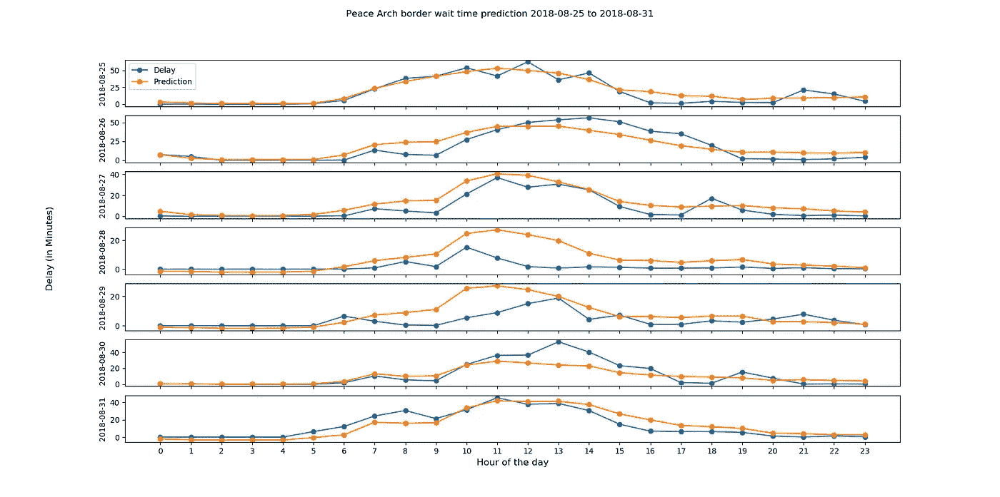

# 为加拿大-美国边境过境等待时间预测构建 Web 应用程序

> 原文：<https://towardsdatascience.com/building-web-app-for-canada-us-border-crossing-wait-time-forecast-18602373c79d?source=collection_archive---------42----------------------->

黑色星期五即将来临。许多加拿大购物者将开车南下，加入购物狂欢。如果你计划在 11 月 29 日跨境旅行，你会想聪明地计划，以避免在边境长时间延误。为了解决这个问题，我们建立了一个网络应用程序，预测未来 7 天的过境等待时间。

以下是该项目的工作流程:


Image by [Imre Tömösvári](https://unsplash.com/@timester12) on [Unsplash](https://unsplash.com/license)

1.  从[级联网关 API](http://www.cascadegatewaydata.com/Api) 中检索过境等待时间
2.  使用 Python + [XGBoost](https://xgboost.readthedocs.io/en/latest/) 建立未来穿越的预测模型
3.  使用 Flask，HTML，CSS，ajax 开发 web 应用程序 REST API
4.  在 AWS 上部署 web 应用程序
5.  每天刷新数据并重新构建预测模型

【链接到网页 app[**http://35.164.32.109:5000/**](http://35.164.32.109:5000/)

它没有永久地址，因为它是一个低成本的 AWS 实例。目前的预报只适用于未来 7 天和平拱门路口(不列颠哥伦比亚省和华盛顿州之间)的南行交通。

需要注意的一点是:通过边界的车流量可以用来预测，而不是等待时间。交通量应更加可预测，因为它不会因边境管制的变化而频繁变化，例如更严格的安全检查、开放的车道/岗哨数量以及有时的现场施工。然而，从通勤者的角度来看，他/她更感兴趣的是知道时间延误，而不是通过边界的车辆总数。

# 数据采集

从[级联网关](http://www.cascadegatewaydata.com/Api)数据仓库中检索过境等待时间数据。它有一个很好的 API 参考文档，使用起来非常简单。

我们提取了自 2014 年 1 月 1 日以来 Peach Arch (BC-Washington)南行车辆的每小时交叉等待时间。以下是一些记录示例:

```
Group Starts,Avg - Delay (Peace Arch)
2018-01-01 07:00:00,0.3
2018-01-01 08:00:00,1.6
2018-01-01 09:00:00,1.3
2018-01-01 10:00:00,18.8
2018-01-01 11:00:00,37.8
2018-01-01 12:00:00,41.4
2018-01-01 13:00:00,49.1
```

一天前的过境等待时间记录被添加到我们每天的模型训练中。

# 模特培训

从过境日期和时间中，我们提取年、月、月中的日、周中的日和小时作为训练特征。

```
data['HourOfDay'] = data['Date_time'].dt.hour        
data['Year'] = data['Date_time'].dt.year
data['Month'] = data['Date_time'].dt.month
data['DayOfMonth'] = data['Date_time'].dt.day 
data['DayOfWeek'] = data['Date_time'].dt.dayofweek
```

不列颠哥伦比亚省和西澳大利亚州的假日也是新增的特色。

```
# Get Canadian - BC holidays
ca_holidays = holidays.CountryHoliday('CA', prov='BC', state=None)
# Check each date what Canadian holiday it is
data['Holiday_CA'] = [ca_holidays.get(x) for x in data['Date_time']]
# Treat Observed holiday same as regular
data['Holiday_CA'] = pd.Series(data['Holiday_CA']).str.replace(" \(Observed\)", "")
# Convert holiday columns
data = pd.get_dummies(data, columns=['Holiday_CA'])
# Get US - WA holidays
us_holidays = holidays.CountryHoliday('US', prov=None, state='WA')
data['Holiday_US'] = [us_holidays.get(x) for x in data['Date_time']]
data['Holiday_US'] = pd.Series(data['Holiday_US']).str.replace(" \(Observed\)", "")
data = pd.get_dummies(data, columns=['Holiday_US'])
```

我们使用 [XGBoost](https://xgboost.readthedocs.io/en/latest/) 算法训练我们的模型，并使用 RMSE(均方根误差)评估其性能。

```
n_iter = 48
tscv = TimeSeriesSplit(n_splits=4)
xgb_regressor = xgb.XGBRegressor(random_state=29, n_jobs=-1)
xgb_grid_search = RandomizedSearchCV(xgb_regressor, 
         xgb_parameters, 
         n_iter = n_iter, 
         cv=tscv,
         scoring = 'neg_mean_squared_error',
         verbose=1,                                  
         n_jobs=-1,                                  
         random_state= 50)
```

我们可以定义 XGBoost 超参数范围的网格，并从网格中随机采样。产生最佳结果的参数组被选为最终模型。

```
xgb_parameters = {'objective': ['reg:squarederror'],
      'n_estimators': [80, 100, 120],
      'learning_rate': [0.01, 0.1, 0.5],
      'gamma': [0, 0.01, 0.1],
      'reg_lambda': [0.5, 1],
      'max_depth': [3, 5, 10], 
      'subsample': [0.5, 1.0], 
      'colsample_bytree': [0.5, 0.7, 1], 
      'seed':[0]
      }
```

数据集中最后 7 天的等待时间记录用于验证。这是一个将实际过境延误与我们对 2018 年 8 月 25 日至 8 月 31 日的预测进行比较的例子。



最后，我们可以保存我们的模型，并为生成未来 7 天的预测做好准备。

# Flask Web 应用程序

现在，我们已经完成了预测模型的构建，并准备通过 web 应用程序来展示它。Flask 是一个微型 web 框架，在用 Python 构建 web 应用程序时很流行。它是轻量级的，因为它不需要特定的库来启动。它旨在使入门变得快速简单，并能够扩展到复杂的任务。

# AWS 设置

有很多关于如何设置 AWS EC2 实例的资源，例如 [AWS 用户指南](https://docs.aws.amazon.com/AWSEC2/latest/UserGuide/get-set-up-for-amazon-ec2.html)、 [fast.ai 参考](https://course.fast.ai/start_aws.html)等。我们使用 Linux 2 AMI t2.micro，它有 1 个 CPU 和 1GB 内存，因为它很便宜。只需记住在安全组中配置 HTTP、SSH 和端口 5000(用于我们的 web 应用程序访问)。

# 环境设置和软件包安装

设置好 AWS EC2 实例后，克隆我们的 GitHub 项目

```
git **clone** [https:*//github.com/wangpengcn/border-crossing-delay-forecast-web-app-flask.git*](https://github.com/wangpengcn/border-crossing-delay-forecast-web-app-flask.git) *border_forecast*
```

然后，运行脚本来安装 python，创建虚拟环境，安装必要的包，并安排每日模型重建

```
./install.sh
```

让我们看看这个脚本做了什么。

定义一些环境变量。

```
FOLDER_PATH=”/home/ec2-user/border_forecast/”
FOLDER_NAME=”border_forecast”
VENV_NAME=”venv_border_forecast”
```

执行 yum 安装更新并安装 Python 3.6。

```
sudo yum update
sudo yum install python36-pip
```

注意，如果不确定可以安装什么 Python 包，运行`sudo yum list | grep python3`进行检查。

接下来，安装并创建虚拟环境，它有自己的站点目录，并与系统站点目录隔离。它使得项目部署更加容易，并且独立于其他正在进行的 Python 项目。

```
pip3 install — user virtualenv
python3 -m venv $VENV_NAME
```

激活我们的虚拟环境。

```
source $VENV_NAME/bin/activate
```

接下来，安装所需的 Python 包

```
$VENV_NAME/bin/pip3 install -r requirements.txt
```

就是这样！您的 Python 环境非常适合。

该脚本的最后一行是安排一个每日作业来重建预测模型并生成未来 7 天的预测。

```
(crontab -l 2>/dev/**null**; echo “0 5 * * * cd $FOLDER_PATH &amp;&amp; $VENV_NAME/bin/python3 border_wait_time_forecast.py > /tmp/border.log”) | crontab -
```

咖啡时间到了！让脚本运行几分钟，我们就可以启动我们的 web 应用程序了。

# 运行 Web 应用程序

运行`./run_app.sh`启动 web 应用程序。它将运行并显示一条警告消息“*这是一个开发服务器*”。这是因为我们运行在 Flask 开发服务器上。它应该被生产中的 WSGI 服务器所取代。

Web app 现在运行在 [http://0.0.0.0:5000](http://0.0.0.0:5000) 上访问时，用您的 AWS IPv4 公共 IP 替换 0.0.0.0，例如[http://35.164.32.109:5000/](http://35.164.32.109:5000/)

搞定了。您的 web 应用程序现已上线！

# 未来作品

*   扩大对其他边境口岸的预测
*   允许用户报告实际过境时间，并纳入模型

Python 代码可以在我的 [GitHub](https://github.com/wangpengcn/border-crossing-delay-forecast-web-app-flask) 上找到。

感恩节快乐！机器学习快乐！

*如果你喜欢这篇文章或者有任何问题，欢迎留下评论。帮我接通* [*LinkedIn*](https://www.linkedin.com/in/peng-wang-cpa/) *。*