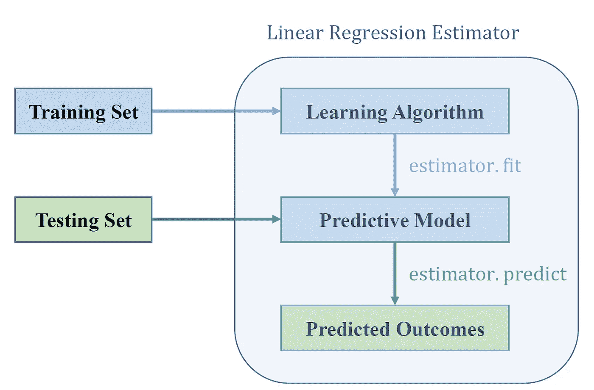
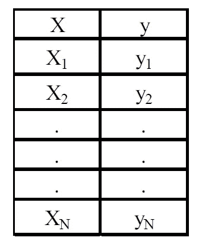
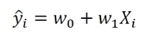
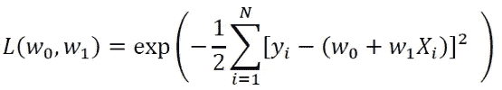
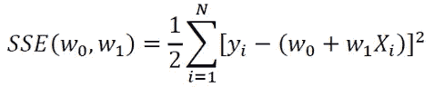
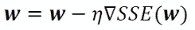
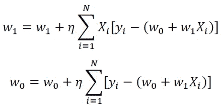
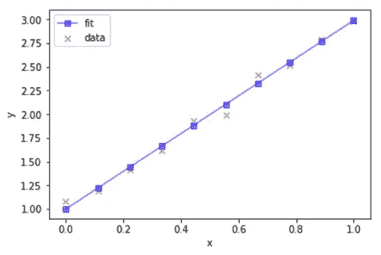

# 构建您的第一个机器学习模型:线性回归估计器

> 原文：<https://towardsdatascience.com/building-your-first-machine-learning-model-linear-regression-estimator-ba86450c4d24?source=collection_archive---------28----------------------->



有这么多好的软件包可以用来构建预测模型。一些最常见的预测分析包包括

*   Sci-kit 学习包
*   插入符号包
*   张量流

重要的是，在使用这些包之前，你要掌握预测建模的基础，这样你就不会把这些包简单地当作黑盒工具来使用。

理解机器学习模型功能的一种方法是让你实际学习如何建立自己的模型。最简单的机器学习模型是线性回归模型。每个刚接触数据科学的人都应该掌握线性回归估计器的基础知识，因为大多数机器学习模型(如 SVM、KNN、逻辑回归等)都是线性回归估计器。)非常类似于线性回归估计量。

在本文中，我们将描述如何构建一个简单的 python 估算器，以使用梯度下降法执行线性回归。假设我们有一个包含单个要素(X)和结果(y)的一维数据集，并假设数据集中有 N 个观测值:



拟合数据的线性模型如下所示:



其中 w0 和 w1 是算法在训练期间学习的权重。

# 梯度下降算法

如果我们假设模型中的误差是独立的且呈正态分布，则似然函数如下所示:



为了最大化似然函数，我们最小化 w0 和 w1 的误差平方和(SSE ):



目标函数或我们的 SSE 函数通常使用梯度下降(GD)算法来最小化。在 GD 方法中，权重根据以下程序更新:



即在与梯度相反的方向上。这里，eta 是一个小的正常数，称为学习率。该等式可以用分量形式写成:



如果你想了解更多关于 GD 算法及其工作原理的信息，请参见以下文章: [**机器学习:梯度下降算法如何工作**](https://medium.com/towards-artificial-intelligence/machine-learning-how-the-gradient-descent-algorithm-works-61682d8570b6) 。

# 使用 Python Estimator 实现

```
import pandas as pd
import numpy as np
import matplotlib.pyplot as pltclass GradientDescent(object):
    """Gradient descent optimizer.
    Parameters
    ------------
    eta : float
        Learning rate (between 0.0 and 1.0)
    n_iter : int
        Passes over the training dataset.

    Attributes
    -----------
    w_ : 1d-array
        Weights after fitting.
    errors_ : list
        Error in every epoch.
    """    def __init__(self, eta=0.01, n_iter=10):
        self.eta = eta
        self.n_iter = n_iter

    def fit(self, X, y):
        """Fit the data.

        Parameters
        ----------
        X : {array-like}, shape = [n_points]
        Independent variable or predictor.
        y : array-like, shape = [n_points]
        Outcome of prediction.
        Returns
        -------
        self : object
        """
        self.w_ = np.zeros(2)
        self.errors_ = []

        for i in range(self.n_iter):
            errors = 0
            for j in range(X.shape[0]):
                self.w_[1:] += self.eta*X[j]*(y[j] - self.w_[0] -                     self.w_[1]*X[j])
                self.w_[0] += self.eta*(y[j] - self.w_[0] - self.w_[1]*X[j])
                errors += 0.5*(y[j] - self.w_[0] - self.w_[1]*X[j])**2
            self.errors_.append(errors)
        return self    def predict(self, X):
        """Return predicted y values"""
        return self.w_[0] + self.w_[1]*X
```

# Python 估计器的应用

**a)创建数据集**

```
np.random.seed(1)
X=np.linspace(0,1,10)
y = 2*X + 1
y = y + np.random.normal(0,0.05,X.shape[0])
```

**b)拟合和预测**

```
gda = GradientDescent(eta=0.1, n_iter=100)
gda.fit(X,y)
y_hat=gda.predict(X)
```

**c)绘图输出**

```
plt.figure()
plt.scatter(X,y, marker='x',c='r',alpha=0.5,label='data')
plt.plot(X,y_hat, marker='s',c='b',alpha=0.5,label='fit')
plt.xlabel('x')
plt.ylabel('y')
plt.legend()
```



**d)计算 R 平方值**

```
R_sq = 1-((y_hat - y)**2).sum()/((y-np.mean(y))**2).sum()
R_sq
0.991281901588877
```

总之，我们已经展示了如何使用 GD 算法在 Python 中构建和实现一个简单的线性回归估计器。如果你想看看 GD 算法在一个真实的机器学习分类算法中是如何使用的，请看下面的 [Github 知识库](https://github.com/bot13956/LogisticRegression_gradient_descent)。