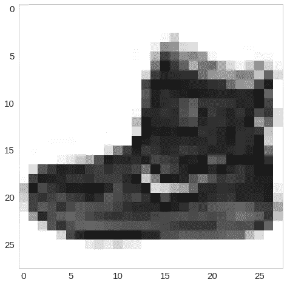
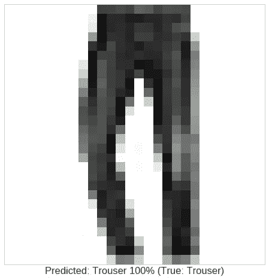
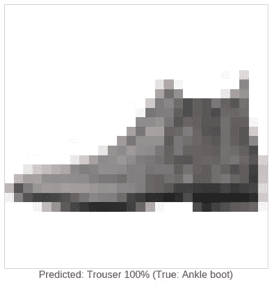
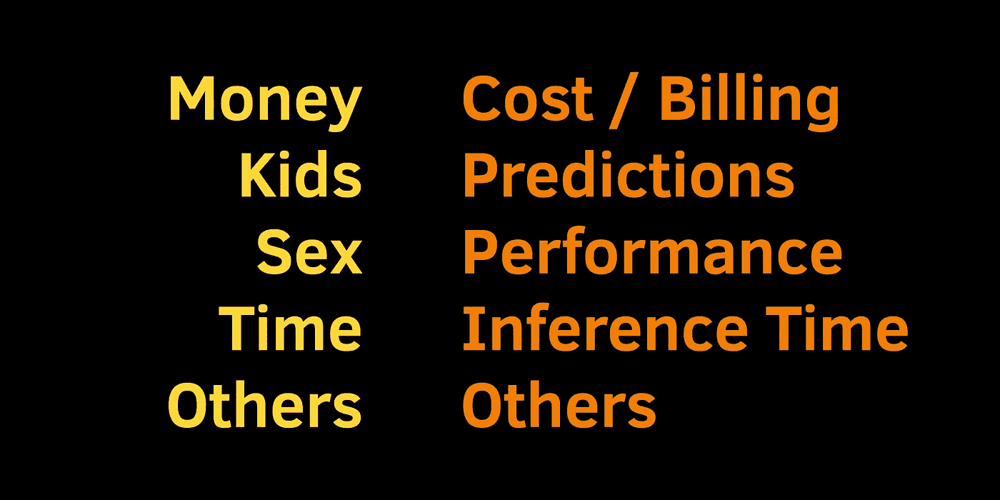

# 在 TensorFlow 2 |面向黑客的 TensorFlow 中构建您的第一个神经网络(第一部分)

> 原文：<https://towardsdatascience.com/building-your-first-neural-network-in-tensorflow-2-tensorflow-for-hackers-part-i-e1e2f1dfe7a0?source=collection_archive---------2----------------------->

## 用 TensorFlow 和 Keras 进行深度学习能让你更时尚吗？


> *TL；DR 使用 TensorFlow 2 构建并训练您的第一个神经网络模型。使用该模型从图像中识别服装类型。*

好吧，我先说一个秘密——我是时尚奇才(只要我们说的是运动服)。幸运的是，即使是像我这样的人，也有获得帮助的方法！

你能想象一个真正有助于“时尚无障碍”的浏览器扩展吗？一些能告诉你你正在看的衣服类型的东西。

毕竟我真的很需要这样的东西。我发现没有这样的东西存在，甚至没有去寻找它。我们来做一个从图像预测服装类型的神经网络吧！

这是我们要做的:

1.安装张量流 2
2。看看一些时尚数据
3。转换数据，这样对我们有用
4。在 TensorFlow 2
5 中创建你的第一个神经网络。预测你的神经网络没有看到的图像上显示的是什么类型的衣服

# 设置

随着 TensorFlow 2 的出现(不确定这个拐角有多远)，创建您的第一个神经网络变得前所未有的简单(就 TensorFlow 而言)。

但是什么是[张量流](https://www.tensorflow.org/overview)？机器学习平台(真的是 Google？)由 Google 创建并开源。请注意，TensorFlow 不是用于创建神经网络的专用库，尽管它主要用于此目的。

那么，TensorFlow 2 为我们准备了什么？

> TensorFlow 2.0 专注于简单性和易用性，具有渴望执行、直观的高级 API 和在任何平台上灵活构建模型等更新

好了，让我们检查这些声明并安装 TensorFlow 2:

# 时尚数据

你的神经网络需要学习一些东西。在机器学习中，这种东西叫做数据集。今天的数据集叫做[时尚 MNIST](https://github.com/zalandoresearch/fashion-mnist) 。

> `Fashion-MNIST`是一个由 [Zalando](https://jobs.zalando.com/tech/) 的文章图像组成的数据集，由 60，000 个样本的训练集和 10，000 个样本的测试集组成。每个示例都是 28x28 灰度图像，与 10 个类别的标签相关联。

换句话说，我们有 70，000 张 28 像素宽和 28 像素高的灰度图像。每张图片展示了 10 种可能的服装类型。这里有一个:



以下是数据集中的一些图片以及它们展示的服装:


这里有各种不同类型的衣服:

```
| Label | Description |
|-------|-------------|
| 0     | T-shirt/top |
| 1     | Trouser     |
| 2     | Pullover    |
| 3     | Dress       |
| 4     | Coat        |
| 5     | Sandal      |
| 6     | Shirt       |
| 7     | Sneaker     |
| 8     | Bag         |
| 9     | Ankle boot  |
```

既然我们已经熟悉了现有的数据，让我们把它用于我们的神经网络。

# 数据预处理

让我们从将数据加载到内存开始:

幸运的是，TensorFlow 内置了数据集，因此我们可以轻松地获取它。

加载它给了我们 4 样东西:
`x_train`—6 万*件*件衣服的图像(像素)数据。用于**构建**我们的模型。
`y_train` —以上服装的类别(服装类型)。用于**构建**我们的模型。

`x_val`—*万件*衣服的图像(像素)数据。用于**测试/验证**我们的模型。
`y_val` —服装类(服装类型)以上为服装。用于**测试/验证**我们的模型。

现在，你的神经网络不能像你一样真正看到图像。但它能理解数字。我们数据集中每个图像的每个数据点都是像素数据，即 0 到 255 之间的数字。我们希望数据被转换(为什么？虽然事实更微妙，但可以说它有助于训练更好的模型)在 0-1 的范围内。怎么才能做到呢？

我们将使用 TensorFlow 的[数据集](https://www.tensorflow.org/api_docs/python/tf/data/Dataset)来准备我们的数据:

让我们解开这里发生的事情。`[tf.one_hot](https://www.tensorflow.org/api_docs/python/tf/one_hot)`是做什么的？假设你有以下向量:

`[1, 2, 3, 1]`

下面是它的一键编码版本:

```
[
 [1, 0, 0],
 [0, 1, 0],
 [0, 0, 1],
 [1, 0, 0]
]
```

它在数字的索引位置放置 1，在其他位置放置 0。

我们使用`[from_tensor_slices](https://www.tensorflow.org/api_docs/python/tf/data/Dataset#from_tensor_slices)`从数据中创建*数据集*，并将图像的每个像素除以 *255* 以在 0–1 范围内缩放。

然后我们使用`[shuffle](https://www.tensorflow.org/api_docs/python/tf/data/Dataset#shuffle)`和`[batch](https://www.tensorflow.org/api_docs/python/tf/data/Dataset#batch)`将数据转换成块。

但是，为什么要打乱数据呢？我们不希望我们的模型根据训练数据的顺序进行预测，所以我们只是打乱它。

我真的为那个糟糕的笑话感到抱歉:

# 创建你的第一个神经网络

你做得很好！现在是有趣的部分，使用数据创建您的第一个神经网络。

## 使用 Keras 层构建您的神经网络

他们说 TensorFlow 2 有一个简单的高级 API，让我们试一试:

原来高级 API 是旧的 [Keras](https://keras.io/) API，非常棒。

大多数神经网络是通过“堆叠”层来构建的。想想煎饼或者千层面。你的第一个神经网络真的很简单。它有 5 层。

第一个([整形](https://www.tensorflow.org/api_docs/python/tf/keras/layers/Reshape))层称为输入层，负责为下面的层转换输入数据。我们的图像是像素。我们只是将 2D `28x28`数组转换为 1D `784`数组。

所有其他层都是[密集](https://www.tensorflow.org/api_docs/python/tf/keras/layers/Dense)(互连)。您可能会注意到参数`units`，它设置每层的神经元数量。`activation`参数指定了一个函数，该函数决定层中特定神经元的“意见”是否应该被考虑以及考虑到什么程度。有很多激活功能可以使用。

最后(输出)层是一个特殊的层。它有 10 个神经元，因为我们的数据中有 10 种不同类型的衣服。你从这一层得到模型的预测。

## 训练你的模型

现在你的神经网络完全是个哑巴。它就像一个没有灵魂的躯壳(很好，你得到了灵魂)。让我们用我们的数据来训练它:

训练神经网络包括决定准确性的客观测量和知道如何改进的算法。

TensorFlow 允许我们指定将要使用的优化算法— [Adam](https://www.tensorflow.org/api_docs/python/tf/train/AdamOptimizer) 和度量(损失函数)—[CategoricalCrossentropy](https://www.tensorflow.org/api_docs/python/tf/keras/losses/CategoricalCrossentropy)(我们正在选择/分类 10 种不同类型的服装)。我们也在训练过程中测量模型的准确性！

实际训练发生在调用 [fit](https://www.tensorflow.org/api_docs/python/tf/keras/models/Model#fit) 方法时。我们向它提供我们的训练和验证数据，并指定我们训练了多少个纪元。在一个训练时期，所有数据都显示给模型。

以下是我们培训的一个样本结果:

```
Epoch 1/10 500/500 [==============================] - 9s 18ms/step - loss: 1.7340 - accuracy: 0.7303 - val_loss: 1.6871 - val_accuracy: 0.7812 
Epoch 2/10 500/500 [==============================] - 6s 12ms/step - loss: 1.6806 - accuracy: 0.7807 - val_loss: 1.6795 - val_accuracy: 0.7812
...
```

经过 10 个时期后，我在验证集上获得了大约 82%的准确率。让我们从我们的模式中获利！

# 做预测

既然你的神经网络已经“学习”了一些东西，让我们试一试:

下面是一个预测示例:

```
array([
 1.8154810e-07, 
 1.0657334e-09, 
 9.9998713e-01, 
 1.1928002e-05,        
 2.9766360e-08, 
 4.0670972e-08, 
 2.5100772e-07, 
 4.5147233e-11,        
 2.9812568e-07, 
 3.5224868e-11
], dtype=float32)
```

回想一下，我们有 10 种不同的服装类型。我们的模型输出关于每种服装类型在图像上显示的可能性的概率分布。要做决定，我们可以得到概率最高的一个:

```
2
```

以下是我们模型中一个正确的和一个错误的预测:



# 结论

好了，你运行了你的第一个神经网络并做了一些预测！你可以在这里看看谷歌联合实验室笔记本(包括更多图表):

[](https://colab.research.google.com/drive/1ctyhVlD9Y85KTBma1X9Zf35Q0ha9PCaP) [## colab.research.google.com](https://colab.research.google.com/drive/1ctyhVlD9Y85KTBma1X9Zf35Q0ha9PCaP) 

有一天你可能会意识到，你和机器学习的关系类似于婚姻。你可能遇到的问题也是类似的！《是什么让婚姻运转》作者约翰·戈特曼，南·西尔弗列出了婚姻存在的 5 个问题:“金钱、孩子、性、时间、其他”。以下是机器学习的对应部分:



我们一起解决它们好吗？