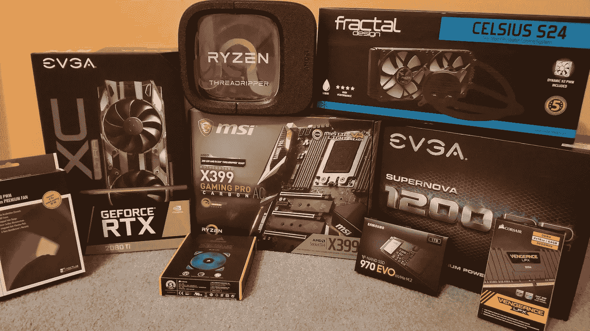

# 构建自己的深度学习计算机并在云服务上省钱

> 原文：<https://towardsdatascience.com/building-your-own-deep-learning-computer-and-saving-money-on-cloud-services-c9797261077d?source=collection_archive---------2----------------------->

纠结了几年微软 Azure 的 GPU VM，又听说亚马逊的 AWS 也好不了多少，决定是时候拥有自己的本地深度学习机器了。

我的一个主要原因是云虚拟机没有显示器，因此你不能在视觉上做任何事情。如果你只是在那里训练，然后在本地计算机上运行模型，这没什么大不了的，但如果你需要从事基于模拟的机器人项目，这些项目根本不会在虚拟环境中运行。

我后来发现，不仅建立一个几乎最先进的机器在大约 4 个月内就收回了成本，而且它比云服务器快得多(主要是因为本地数据传输速度，因为所有东西都在同一条总线上的同一个盒子里，而云服务可能将计算单元和存储放在不同的机架上——所以即使 GPU 更快，它也不能足够快地获得数据以受益于这种速度)。

我的系统最终花费不到 100 美元 3K(相比之下，你每月要为 AWS 或 Azure 的入门级云 GPU 支付大约 800 美元)。那是在 2019 年 5 月，价格往往变化很大，所以它可以在任何时候下降或上升 10%。此外，当你读到这篇文章时，这项技术可能已经发展了。

你可能会问，为什么不去买一台高端的超级计算机，而要自己痛苦地制造这台计算机。这是因为现成的深度学习系统非常昂贵。但是如果你仍然害怕修补昂贵的组件，并且对预建的系统感兴趣，我发现 [Exxact 出售一些最实惠的深度学习系统，起价为 5899 美元(2 个英伟达 RTX 2080 Ti +英特尔酷睿 i9)](https://www.exxactcorp.com/Deep-Learning-NVIDIA-GPU-Workstations?utm_source=web%20referral&utm_medium=backlink&utm_campaign=Chris%20Fotache) ，其中还包括 3 年保修和深度学习堆栈。他们也是由另一位人工智能工程师[陈明杰](https://medium.com/the-mission/why-building-your-own-deep-learning-computer-is-10x-cheaper-than-aws-b1c91b55ce8c)推荐的。



An overview of the components that went in

为了确保一切都一起工作，我推荐使用[电脑零件拾取器](https://www.pcpartpicker.com)。它将显示每个组件的最低价格，并确保您不会选择不兼容的部分。至于把东西放在一起，YouTube 说了算。只需输入组件的名称，你会发现几个非常说明如何安装它的视频。现在，我们来看一下所需的组件:

**CPU**

在这里，你必须做出重大选择:AMD 还是英特尔。我一生都是英特尔的粉丝，但对于这台机器来说，CPU 并不是最重要的部分。那就是 GPU。英特尔 CPU 的价格是 AMD 的两倍。AMD 的新锐龙线有非常好的评论，我不需要超频，因为我不玩视频游戏。因此我选择了***AMD thread ripper 1920 x***，它有 12 个内核和 24 个线程，对于我的情况来说绰绰有余。它的定价在 350 美元左右是合理的，但价格正在下降。另一种选择是售价超过 900 美元的 10 核英特尔 i9–7900。


The AMD Ryzen Threadripper CPU

**CPU 冷却器**

AMD 的 CPU 总是运行得非常热(这是它们不那么可靠的主要原因之一)。他们仍然是，所以你肯定需要一个液体冷却器。我选择了有两个风扇的 ***分形 S24*** ，大约 115 美元。另一种选择是海盗船 H100i。


The liquid cooler installed over the CPU

**主板**

关于主板的选择主要是芯片组。简单的规则是:对于 AMD Threadripper，使用 X399。对于英特尔 7900，使用 X299。

根据评论，我选择了***MSI X399 Gaming Pro Carbon AC***，它拥有我进行深度学习所需的一切。你会发现它的价格刚刚超过 300 美元。其他不错的选择是华硕 ROG，技嘉 Aorus 和华硕太极(只要确保它至少有 40 个 PCIe 车道)。你必须确保电路板的设计能够容纳 GPU 的大小，也许还需要添加多个 GPU。微星一号空间很大，东西都摆放的很好。


Motherboard is ready to go

**GPU**

现在这是你深度学习系统最重要的组成部分。你必须使用 Nvidia GPU，推荐的最低配置是 GTX 1080 Ti。不幸的是，当我在寻找时，不可能找到它的正常价格约 800 美元(责怪游戏玩家？秘密矿工？).所以我不得不去下一个级别，RTX 2080 Ti，这也不容易找到，但我很幸运地从 EVGA 得到了一笔 1187 美元的好交易。RTX 是新一代产品，是 2019 年初消费 GPU 中性能最好的产品之一。我很高兴我是“被迫”做出那个选择的。如果你环顾四周，你可能仍然会发现 1200 美元左右的交易。我觉得 EVGA 和技嘉是顶级厂商，你做的选择都是关于散热系统的。EVGA RTX 2080 Ti XC Ultra 有两个空气冷却器，到目前为止证明足够了，它从未达到临界过热。


The most important component — the Nvidia RTX 2080 TI GPU

**记忆**

对于上面的配置，DDR4 是最好的选择。海盗船可能是主要制造商。而且是 2019 年，你需要 64Gb。所以我最后用了 4x16Gb ***海盗船复仇 LPX DDR4*** 。我花了 399 美元，但是价格急剧下降，现在已经低于 300 美元了。

**硬盘**

固态硬盘现在已经是老技术了。最先进的是 M.2 标准，这种驱动器直接插入主板的 PCIe 插槽中。以主总线速度，这基本上是一个高容量，持久的内存芯片。我真的很喜欢那台 ***1Tb 三星 EVO SSD M.2*** 。我花了 241 美元，但是它的价格也降到了 200 美元。如果你需要更多的存储空间，你可以添加一个普通的固态硬盘，价格应该低于 100 美元。


Memory chips and M.2 hard drive are in place

**电源**

PCPartPicker 将确保您为您的系统选择足够大的电源。也有其他在线瓦数计算器。使用一个 GPU，你可能不会接近 1000 瓦，但如果你计划添加第二个 GPU，那么你需要 1200 瓦才安全。EVGA 是一个可靠的制造商，我选择了大约 250 美元的 ***EVGA SuperNOVA P2 白金 1200*** 。

**案例**

这里有很多选择，这可能取决于个人喜好和设计，但重要的是要确保它足够大，能够容纳所有的组件，而不会拥挤，并具有良好的空气流通。我选择了 114 美元的联立 PC-O11AIR，因为它符合这些要求。它非常宽敞，所有的东西都放在里面，而且有很好的冷却系统。

**附加冷却**

完成构建后，您可能需要添加额外的风扇来改善空气流动。我的箱子里有几个风扇，但我又买了几个，几乎填满了每个安装位置。它永远不会在 GPU 机器中变得太冷，这将启动卷积网络。我弄了一个 ***80mm 夜航*** 做背面，还在上面加了一个普通的 ***120mm 海盗船*** 。是的，我得到了一个。我不太在乎我箱子里明亮闪亮的颜色(反正它在桌子下面)，但最后我让步了，买了一个很酷的风扇。

**装配**

就像我说的，在 YouTube 上搜索每个组件，你肯定会找到关于安装的详细步骤。作为一个例子，下面是我跟随的一些:一个类似于我的的[构建，一个 MSI X399 主板](https://www.youtube.com/watch?v=orzOOPD-E9Y)及其组件的[演练，以及一个关于](https://www.youtube.com/watch?v=83mA2TGNRCU) [Threadripper 安装](https://www.youtube.com/watch?v=yk4EpVUU03E)的焦点。并阅读手册中的所有安装说明。例如，要注意内存单元的插槽位置。

基本上，操作顺序是这样的:

首先，准备机箱，安装电源，拉电源线。然后准备主板，装 CPU，再装 M.2 驱动。将主板安装在机箱中，并添加 CPU 冷却器。然后添加其他风扇，连接电源和按钮/灯线。最后安装内存模块和 GPU。


Getting the CPU into the socket

完成并启动系统后，完成电缆管理并优化冷却。例如，我最终拆除了大多数覆盖风扇的灰尘过滤器。我制定了一个密集的 GPU 繁重的测试协议(训练一个 Yolo 模型)，并不断移动风扇，直到我得到最低的温度。

**软件安装**

这才是真正有趣的地方，但这不是这个故事的重点。2019 年春天——你可能会选择 Ubuntu 18.04，你的 GPU 版本的 Nvidia 驱动程序(快点做，否则显示会非常糟糕)，CUDA 10，然后是你使用的任何框架(PyTorch，Tensorflow 等)。享受比你尝试过的任何云 GPU 更高的速度，一次性的价格在几个月内就有回报。


And we’re up and running!

**组件列表**

这是我的零件清单，价格从 2019 年 4 月开始。您还可以在我的 [PCPartPicker 列表](https://pcpartpicker.com/list/84BMWD)上看到更新的价格。

```
CPU: AMD Threadripper 1920x 12-core ($356)
GPU: EVGA RTX 2080 Ti XC Ultra ($1,187)
CPU Cooler: Fractal S24 ($114)
Motherboard: MSI X399 Gaming Pro Carbon AC ($305)
Memory: Corsair Vengeance LPX DDR4 4x16Gb ($399)
Hard-drive: Samsung 1TB Evo SSD M.2 PCIe ($241)
Power: EVGA SuperNOVA P2 Platinum 1200W ($249)
Case: Lian-Li PC-O11AIR ($114)
```

这里有一些其他可供选择的版本，我用它们作为灵感和教育:[陈明杰的](https://medium.com/the-mission/why-building-your-own-deep-learning-computer-is-10x-cheaper-than-aws-b1c91b55ce8c)，[科林·肖的](https://medium.com/@colinshaw_36798/building-a-deep-learning-machine-125ee714cca3)和[韦德·乔里安的](https://waydegg.github.io/making-a-dl-server.html)。

*Chris Fotache 是一名人工智能研究员，在新泽西州工作。他涵盖了与我们生活中的人工智能、Python 编程、机器学习、计算机视觉、自然语言处理、机器人等相关的主题。*