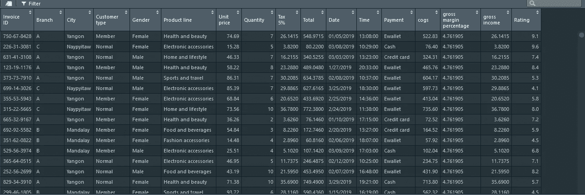
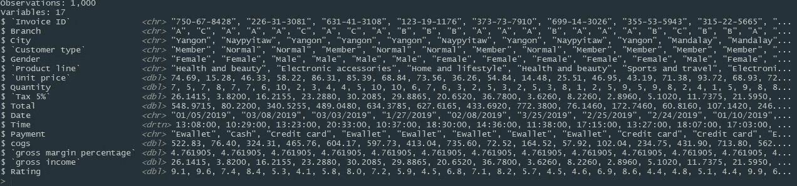
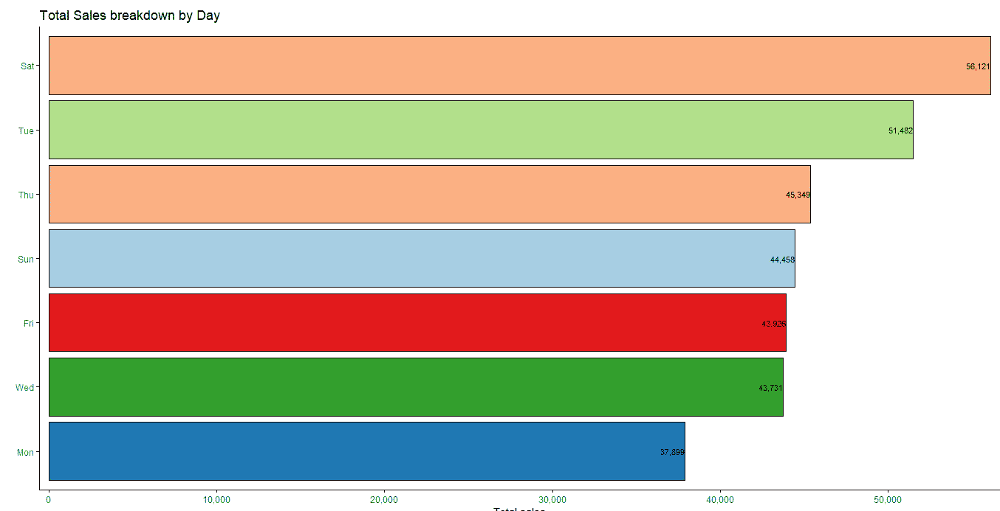
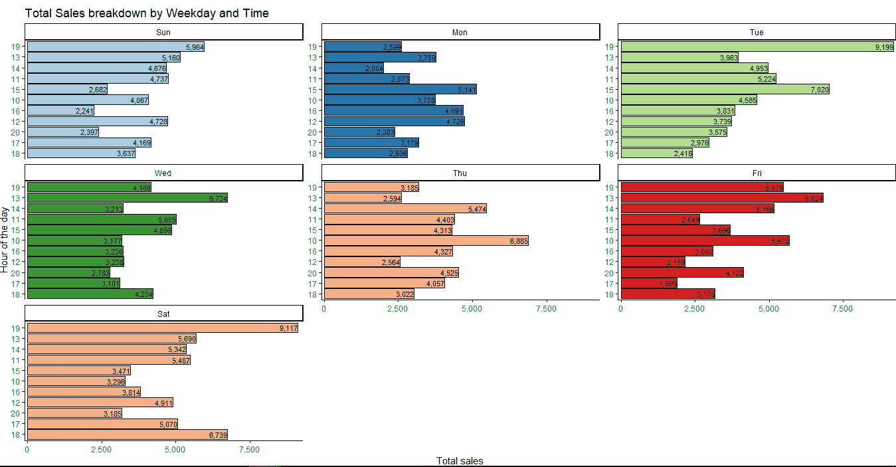
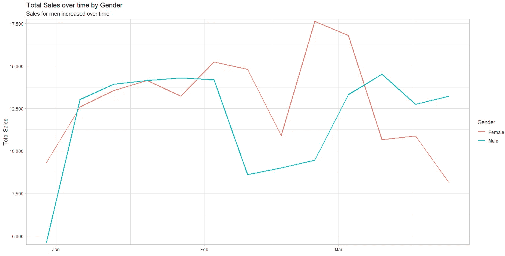
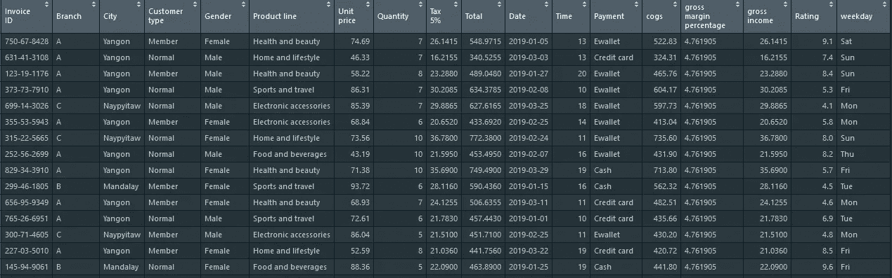
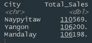
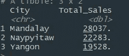
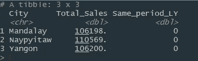

# R 中的业务分析

> 原文：<https://towardsdatascience.com/business-analysis-in-r-part-1-advanced-filtering-and-conditional-calculations-c6b3ef7eb7a2?source=collection_archive---------8----------------------->


您会发现许多关于人们分析不同数据集的优秀文章，但很难在 R 中找到与业务分析相关的材料。这是我在 R 系列中开始这篇**业务分析的主要原因之一，这样我就可以分享一些有用的方法，让您可以更有效地分析工作中的数据。在我们继续之前，我建议您对 r 中的 **Tidyverse** 包有一个基本的了解**

在这个[数据集](https://www.kaggle.com/aungpyaeap/supermarket-sales)中，我将尝试复制我在工作中做的一些任务，你会发现这些真的很有用。您将会看到 R 与 Excel 相比有多么强大。

## 加载库

加载我们将用于数据管理和分析的以下库

```
library(tidyverse) ## A set of tools for Data manipulation and visualization
library(lubridate) ## for date time manipulation
library(scales) ## Formatting numbers and values
library(hrbrthemes)# For changing ggplot theme
library(extrafont) # More font options
```

## 读取数据

我使用 **read_csv** 函数读入数据。只需将文件的路径复制到机器上的任何位置，并将“\”替换为“\\”。我总是将 **trim_ws** 参数设置为 TRUE，以防数据中有任何空白。如果它保存为 excel 文件，您可以从 **readxl** 包中调用 **read_excel** 函数，基本上遵循相同的原则

```
supermarket_sales <- read_csv("C:\\Users\\Hamza\\Downloads\\supermarket_sales - Sheet1.csv",trim_ws = TRUE)
```

**查看数据**

**View()** 是一个非常方便的功能，它允许你以类似 excel 电子表格的格式查看你的数据，如下所示。我还将使用 **glimpse** 函数来检查数据类型

```
supermarket_sales %>% View()glimpse(supermarket_sales)
```



Output from View function



Output of glimpse function

看起来我需要修复我的**日期**和**时间**列，并将它们转换成正确的格式。我将把**时间**列四舍五入到最近的小时，并将**日期**列转换为日期格式。之后，我们将创建一个显示星期几的新列。

```
supermarket_sales <- supermarket_sales %>% 
  mutate(Time=as.POSIXct(Time),Time=hour(Time),
         Date=mdy(Date),weekday = wday(Date,label = TRUE))
```

我首先将**时间**列改为日期-时间类型，并从中提取小时。 **Lubridate** 包中的 **mdy** 函数允许我将 **Date** 列格式化为我从中提取工作日的日期类型

# 分析

让我们从一些探索性的数据分析开始。虽然我们将揭示数据中的不同见解，但这里的主要焦点是让您了解如何在 r 中获得期望的结果。一旦您了解了代码是如何工作的，您就可以以任何方式分析和探索它。

## 条形图和多面条形图

我们将绘制一些条形图，以深入了解与一周中的某一天和某个时间相关的总销售额

```
## Creating a summary
sales_by_day <- supermarket_sales %>% group_by(weekday) %>%
                summarise(Total_Sales=sum(Total)) %>% ungroup##Visualizing summary datasales_by_day %>% 
 ggplot(aes(reorder(weekday,Total_Sales),Total_Sales,fill=weekday))+
  geom_col(show.legend = FALSE,color="black")+
geom_text(aes(label=comma(Total_Sales)),size=3,hjust=1,color="black")+
  scale_y_comma()+
  scale_fill_brewer(palette = "Paired")+
  coord_flip()+
  theme_classic()+
  labs(title = "Total Sales breakdown by Weekday and Time",x="Hour of the day",y= "Total sales")
```



Sales by day

```
## Summarizing by day and hoursales_by_day_hour <- supermarket_sales %>% group_by(weekday,Time) %>%
  summarise(Total_Sales=sum(Total)) %>% ungroup()## Visualizingsales_by_day_hour %>% 
  mutate(Time=fct_reorder(Time,Total_Sales)) %>% 
  ggplot(aes(Time,Total_Sales,fill=weekday))+
  geom_col(show.legend = FALSE,color="black")+
  geom_text(aes(label=comma(Total_Sales)),size=3,hjust=1,color="black")+
  scale_y_comma()+
  scale_fill_brewer(palette = "Paired")+
  facet_wrap(~weekday,scales="free_y")+
  coord_flip()+
  theme_classic()+
  labs(title = "Total Sales breakdown by Weekday and Time",x="Hour of the day",y= "Total sales")
```



## 曲线图

我们现在将探讨不同性别的销售额如何随着时间的推移而变化。

```
supermarket_sales %>%
  group_by(Monthly=floor_date(Date,unit = "1 weeks"),Gender) %>% 
  summarise(Total_Sales=sum(Total)) %>% 
  ggplot(aes(Monthly,Total_Sales))+
  geom_line(aes(color=Gender),size=1)+
  theme_light()+
  scale_y_comma()+
  labs(title = "Total Sales over time by Gender",subtitle = "Sales for men increased over time",y="Total Sales",x="")
```



## 高级过滤

r 有一些真正强大的数据过滤选项，是其他工具如 Excel 所没有的。例如，我想筛选高于女性平均销售额的销售额。

```
supermarket_sales %>% 
  filter(Total > mean(Total[Gender=="Female"]))
```



All sales greater than the average sale of females

你甚至可以更进一步。让我们筛选出高于女性健康和美容产品平均销售额的销售额。

```
supermarket_sales %>% 
  filter(Total > mean(Total[Gender=="Female"&`Product line`=="Health and beauty"]))
```

这很简单。我所要做的就是在计算平均值时为**产品线**添加一个额外的过滤上下文。

有时，您不知道基于字符的列中的确切字符串，具体地键入每个字符串会很痛苦。这是您可以使用正则表达式来简化事情的地方。

```
supermarket_sales %>% 
  filter(str_detect(`Product line`,regex("sport|beauty",ignore_case = TRUE)))
```

基本上，我过滤的数据在**产品线**列中包含以下字符串。还有一个**否定**参数，您可以将其设置为**真**，它将只显示不包含这些字符串的结果。

```
supermarket_sales %>% 
  filter(str_detect(`Product line`,regex("sport|beauty",ignore_case = TRUE),negate = TRUE))
```

**分组依据和汇总**

这可能是你最常使用的功能。你可能在 R 中看到过很多教程，在那里人们使用这些函数，但是它们只显示了基本的内容，比如 **sum，mean，**或 **count。**但是在现实中，你要计算很多我很少看到任何教程涵盖的条件计算。我将从基本计算开始，然后转向条件计算。

让我们按城市来看看我们的销售情况。

```
supermarket_sales %>%
  group_by(City) %>%
  summarise(Total_Sales= sum(Total)) %>% 
  arrange(desc(Total_Sales))
```



这是一个简单的计算。我只是将数据按城市分组，计算总销售额，并按最大销售额排列。

现在，如果我们想计算每个城市的**分支机构 A** 的销售额，我们将这样做。

```
supermarket_sales %>%
  group_by(City) %>%
  summarise(Total_Sales= sum(Total[Branch=="A"])) %>% 
  arrange(desc(Total_Sales))
```

我们使用 **[]** 来添加一个过滤上下文，与我们之前过滤数据的方式相同。这是我如何计算我所有的条件计算。让我们针对不同的产品和支付类型再做一次

```
supermarket_sales %>%
  group_by(City) %>%
  summarise(Total_Sales= sum(Total[Payment %in%c("Cash","Credit card")&
                                     str_detect(`Product line`,regex("sport|beauty",ignore_case = TRUE))])) %>% 
  arrange(desc(Total_Sales))
```

这可能看起来有点复杂，但是当我们分解它时，它是非常简单的。我做了一个条件求和，其中**付款**等于**现金** 或**信用卡**以及名称中包含**运动**或**美容**的产品。我像以前一样使用 **str_detect** ，结合 **regex** 来获得我想要的产品，因为我懒得输入它们的长名称。



这些条件计算的可能性是无限的，我在工作中一直在使用它们。有时你还必须在工作中进行基于时间的计算。例如，**本年销售额**和**去年同期销售额**。我们可以通过遵循与上面相同的原则并结合 L **ubridate** 包的帮助来实现，这个包允许我们操作日期值。

```
supermarket_sales %>%
  group_by(City) %>%
  summarise(Total_Sales= sum(Total[Date %within% interval("2019-01-01","2019-03-31")]),
            Same_period_LY=sum(Total[Date %within% interval("2018-01-01","2018-03-31")]))
```

在这里，我使用了% 内的**%和**间隔**函数来指定我想要聚合的日期。不要担心没有 2018 年的数据，因为没有，但我只是想让你理解这个概念。我真的很喜欢这些“时间智能”计算，因为这些功能让我可以随心所欲地具体。**



Time intelligence calculation

# **结论**

这些是我在工作中用来分析数据的一些函数。我将在 R 系列中继续我的**业务分析，分享一些非常酷和有用的方法，告诉你如何在 R 中更有效地分析你的业务数据。**