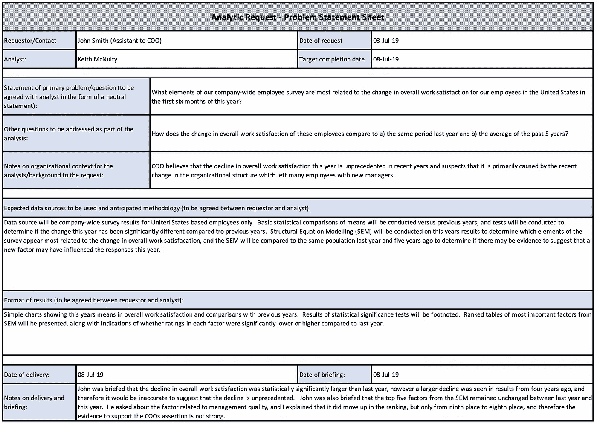
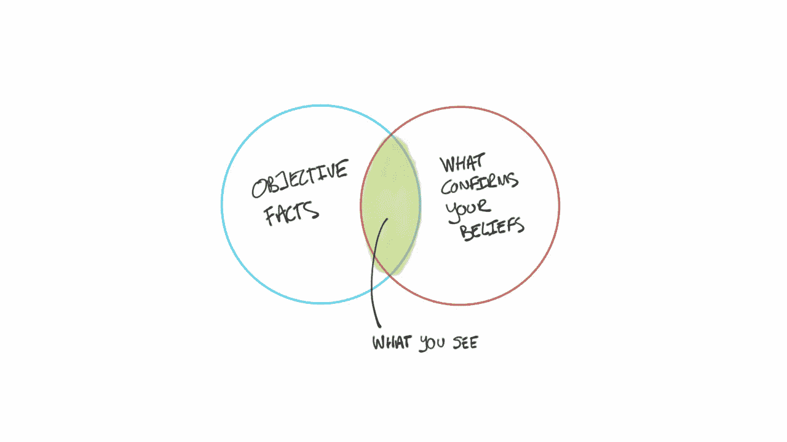

# 商业分析充满了确认偏见

> 原文：<https://towardsdatascience.com/business-analytics-is-ridden-with-confirmation-bias-c60e077d81dd?source=collection_archive---------21----------------------->

## 通过正确的流程，您可以控制它

几个月前，我发表了一篇关于如何运行世界级商业分析功能的会议演讲。就像这些事件一样，紧接着，许多人向我提出了许多问题。虽然试图回答所有问题可能会很累，但这实际上是我最喜欢的部分，因为它帮助我了解商业分析人员面临的日常问题。

我有一次难忘的谈话是和一个人，她看起来真的对给出“令人满意的”分析结果的压力感到沮丧。她描述了几个月前的一种情况，当时她承受着巨大的压力，要找到一个事实——*任何一个事实——*来支持她的客户所做的断言。尽管她尽了最大努力，但她最终还是屈服了，向客户提供了一个事实，尽管还有许多其他事实不支持这一说法。她告诉我，客户明确表示，他们只想听到有助于他们实现目标的事实，对反驳不感兴趣。在这种情况下，她感到无助，最后为了摆脱自己的工作，继续前进，她变得温和了，但她显然对自己允许这种事情发生感到非常厌恶。

这种确认偏见在商业世界很普遍，许多人会说它在学术界也无处不在。它可能不总是像我刚才举的例子那样极端地表现出来，但是它经常隐藏在明显的地方。我敢肯定，许多读者都会遇到这样的情况:他们只寻找事实来支持一个论点，而排除了所有其他相关的事实。

## 我们为什么要担心确认偏差？

确认偏见对任何人都没有帮助，尤其是遭受这种偏见的企业或组织。缺乏对不同观点的开放，增加了决策者与根深蒂固的观点发生分歧的机会，这反过来又增加了错误决策或根本不决策的机会(决策瘫痪)。

在分析环境中，我经常看到确认偏差以三种方式表现出来:

*   **在开始的时候，**它可以以分析被请求的方式来表现自己。组织中有人有一个议程或目标，并希望使用分析来支持它。所以他们的问题会带有确认偏见:*你有证据支持吗…？找到显示…* 的数据
*   **在中间，**一个常见的行为是要求在子群或不同的时间框架内重新进行分析，直到最终得出令人满意的结论。*如果我们只将时间限制在过去 3 个月，这意味着什么？仅限美国的情况如何？*
*   **最后，**分析师提供的分析以一种看起来支持预期结论的方式被改写，通常忽略分析师对此的警告。

在个人专注于寻找支持理想结论的数据时，他们往往不能后退一步，意识到——通过忽略反驳或以不平衡的方式进行分析——他们可能没有为企业做出*正确的*决策。

## 控制确认偏差

我不支持去偏见化。你不能消除偏见。但是，你可以控制它。做到这一点的最佳方式是引入结构化的、一致的流程，减少偏见发挥作用的机会。

发现确认偏差的最佳时间点是最初请求分析的时候。在这一点上，可以向请求者简要介绍分析小组的中立价值观和公正方法，并且可以用支持平衡的、基于证据的方法的方式来表述请求。

当您收到分析请求时，假设这不仅仅是简单的原始数据提取，您可以考虑以下一些方法来控制确认偏差:

1.  一开始就写一份*服务章程*与客户分享。除了包含周转时间等承诺之外，它还可以用来明确团队基于证据的价值观，并让客户同意以与这些价值观一致的方式工作。例如，同意对问题采取不偏不倚的态度，承诺不在未经协商的情况下修改事后的结论。
2.  确保分析请求以*中立问题*而非*目标*的形式表达。坏消息:我们正在寻找能证明销售下降的数据，因为自从我们的办公室搬迁后，客户现在离我们更远了。**好:**根据我们的数据，最近销售下降的可能原因是什么？
3.  *向客户汇报*分析结果，并记录结果和汇报。向客户汇报有助于避免对结果的误解，并可以预先要求更深入的挖掘。保留记录意味着，如果结果被误解或误用，可以在以后进行干预。

确保所有这些一致发生的一个方法是建立一个接收和处理分析请求的标准流程。例如，您可以创建一个分析请求表或问题陈述，需要在客户和分析师之间完成并达成一致。我举了一个例子来说明这一点:

Illustrative example of a standardized problem statement sheet for an analytic request

如果业务分析职能的作用是支持组织中的准确决策，那么它必须有一种方法来对抗确认偏差，并可以为其客户提供平衡的分析视角。通过安装正确的流程并鼓励客户遵循它们，你可以朝着这个目标取得很大进展。

最初我是一名纯粹的数学家，后来我成为了一名心理计量学家和数据科学家。我热衷于将所有这些学科的严谨性应用到复杂的人的问题上。我也是一个编码极客和日本 RPG 的超级粉丝。在 [*LinkedIn*](https://www.linkedin.com/in/keith-mcnulty/) *或*[*Twitter*](https://twitter.com/dr_keithmcnulty)*上找我。*

