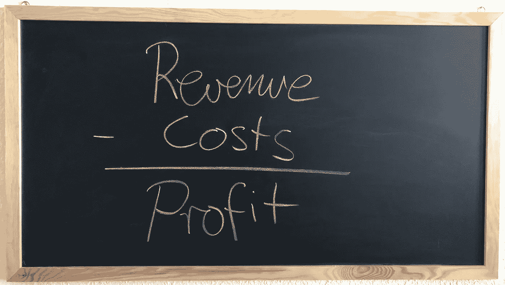
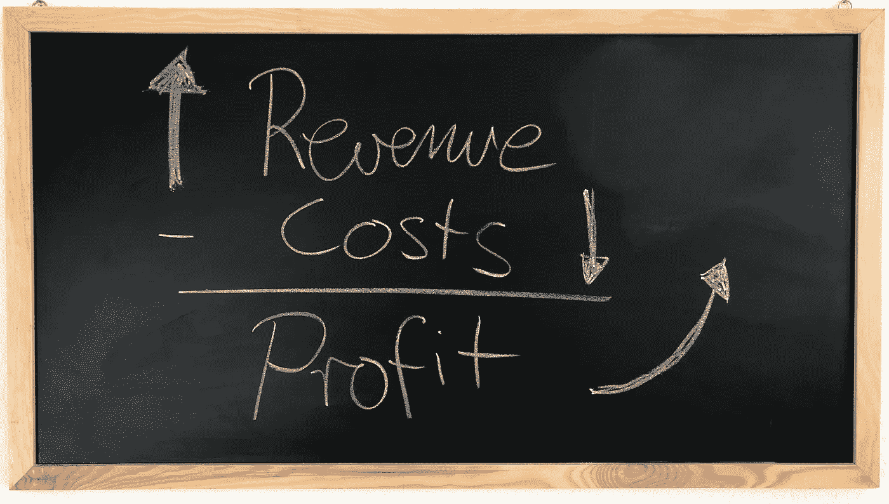
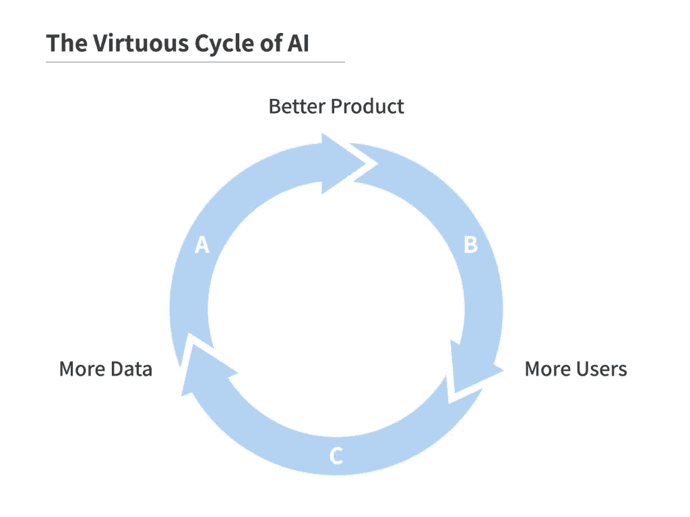
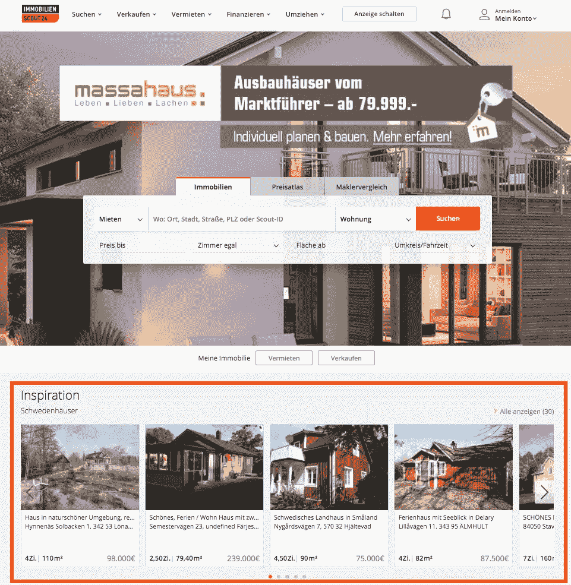
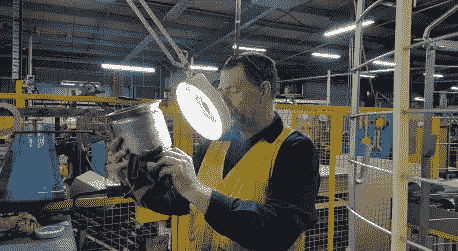

# 数据科学家的业务基础

> 原文：<https://towardsdatascience.com/business-basics-for-data-scientists-862f116a82da?source=collection_archive---------13----------------------->

## [人工智能项目管理](https://towardsdatascience.com/tagged/project-management-ai)

## 使用你的机器学习能力来影响基本的商业方程式。

T 这位初出茅庐的数据科学家专注于掌握 TensorFlow &统计概念。这无疑是重要的。然而，太多人忘记了成为高质量数据科学家的第三层。通过了解业务视角，对您的数据科学技能集进行最后的润色。

Photo by [Samson Creative.](https://unsplash.com/photos/ZGjbiukp_-A?utm_source=unsplash&utm_medium=referral&utm_content=creditCopyText) on [Unsplash](https://unsplash.com/search/photos/business?utm_source=unsplash&utm_medium=referral&utm_content=creditCopyText)

这篇文章探讨了每个数据科学家都应该理解的基本业务等式。该内容旨在培养希望通过其工作产生切实影响的技术数据科学家。了解机器学习能在你的公司发挥什么作用，如何寻找机会。

让题外话开始吧。💰

# 基本的商业等式

企业的目标是赚钱。正如[张秀坤·海茨](/the-third-wave-data-scientist-1421df7433c9)所言，数据科学家被雇佣来帮助公司实现这一目标。你如何定义「赚钱」？

在数据科学中，准确性由样本总数中正确分类的样本数来定义。同样，利润是由收入和成本这两个变量定义的。

利润是收入和成本之间的差额。我们有一个等式——*holla*！让我们解释一下每个变量。

收入是你的公司赚的钱的总数。想想你高中的柠檬水摊。顾客花在购买美味提神饮料上的每一块钱都会计入你柠檬水摊的收入。🍋

Photo by [Rod Long](https://unsplash.com/photos/JB5YCqOXV1o?utm_source=unsplash&utm_medium=referral&utm_content=creditCopyText) on [Unsplash](https://unsplash.com/search/photos/lemonade-stand?utm_source=unsplash&utm_medium=referral&utm_content=creditCopyText)

成本描述了你的公司花费的所有金钱。对于柠檬水摊位，这是柠檬的价格，租用摊位的费用，以及你虚构的工资，等等。

利润是你的公司赚的钱和花的钱之间的差额。对你的柠檬水摊来说，这是你把柠檬钱还给妈妈后，你口袋里剩下的所有钱。💁

所有这些与您作为数据科学家的工作有什么关系？现在我们知道了基本业务等式中的关键变量，让我们来谈谈你的角色。

# 向利润优化

因此，在全体会议上，这些西装革履的家伙一直在喋喋不休地谈论利润增长、危险的竞争对手和新的商业模式。🤵当他们继续让观众感到厌烦时，你的思绪又回到了超级简单却又基本的商业方程式上。然后你就有了想法——*Bazinga*！就像在机器学习中一样，你会遇到一个优化问题。厉害！我们优化的关键指标是利润。

如果你是一个魔术师，你认为为了最大化利润，你可以增加收入，降低成本，或者两者兼而有之。让我们来谈谈你在机器学习方面的工作如何影响这两个变量。

# 超级机器学习

作为一名数据科学家，你有幸拥有机器学习的超能力。你尽情享用数据，并将其转化为超人的预测，为令人难以置信的产品提供动力。让我们来探索如何明智地使用你的力量，卢克。⭐️

Photo by [Lopez Robin](https://unsplash.com/photos/1JS6n1uT-uI?utm_source=unsplash&utm_medium=referral&utm_content=creditCopyText) on [Unsplash](https://unsplash.com/search/photos/power?utm_source=unsplash&utm_medium=referral&utm_content=creditCopyText)

Landing.ai 创始人、前谷歌和百度大脑负责人吴恩达表示，机器学习以三种方式产生价值:

*   创造新产品
*   改进现有产品
*   自动化流程

让我们看一下每个类别的例子。

# 创造新产品

机器学习帮助你的公司创造全新的产品来增加收入。一个例子是由自动驾驶汽车驱动的新型移动服务，也被称为[机器人出租车](https://en.wikipedia.org/wiki/Robo-Taxi)。没有机器学习，这个新产品是很难创造出来的。在这种情况下，机器学习允许公司开发全新的产品来增加收入。

人工智能(“AI”)驱动的产品的圣杯是进入 AI 良性循环的产品。这一切都始于一个产品，它在没有人工智能的情况下已经很好，但随着更多用户和更多数据的增加而不断改进。

特斯拉就是一个很好的例子。特斯拉汽车在没有人工智能的情况下驾驶很有趣，但随着更多用户收集数据，它会不断改进。这使得特斯拉自动驾驶更加令人愉快。[特斯拉首席执行官埃隆·马斯克](https://podcasts.apple.com/de/podcast/artificial-intelligence-lex-mit-ai/id1434243584?l=en&i=1000434777061)估计，他的公司收集了全球汽车数据的 99.5%。特斯拉准备好了吗？

Source: [https://landing.ai/ai-transformation-playbook/](https://landing.ai/ai-transformation-playbook/)

在寻找潜在的新产品时，你可以做四件事:

*   评估竞争对手的产品。他们是否在提供客户想要的产品，并且你可以通过人工智能来模仿？
*   **放眼其他行业**。你能从这个聊天机器人 AI 公司学到一个有趣的方法吗？
*   **集思广益。在黑客马拉松中，你能想出一个很酷的主意吗？**
*   **检查您的数据**。你能利用这些数据创造一个新的人工智能产品吗？

机器学习通过创造新产品来增加利润，从而增加收入。你也可以用你的超能力改进现有的产品。

# 改进现有产品

既然你的公司存在，它就有产品或服务在销售。

Popular item recommender from [is24.de](https://www.immobilienscout24.de/) for new users

如果你在一家数字企业工作，推荐系统很有可能存在。在上面的例子中，你可以看到德国领先的房地产网站推荐的热门商品。它向我推荐瑞典的房子——这与我无关。

很多公司仍然使用热门商品推荐器。这些又甜又傻的算法显示了哪些产品是你公司最常购买的。有了机器学习，你可以构建一个漂亮的算法，提供定制的[建议](https://blog.statsbot.co/recommendation-system-algorithms-ba67f39ac9a3)。

直接与产品经理交谈，了解如何改进现有产品。你有关于机器学习的知识，他们对他们的产品了如指掌。他们知道未来的挑战和路线图。你们将一起想出一个改进现有产品的好方法。

你已经看到了如何通过机器学习创造新产品或改进现有产品来增加收入。然而，机器学习也可以降低成本。让我们看看下一步该怎么做。

# 自动化流程

机器学习通过自动化流程来降低成本。每个公司都有创造产品的成本。像[计算机视觉](/convolutional-neural-networks-for-all-part-i-cdd282ee7947)或[自然语言理解](https://blog.insightdatascience.com/how-to-solve-90-of-nlp-problems-a-step-by-step-guide-fda605278e4e)这样的机器学习任务可以完美地支持过程。公司规模越大，可以自动化的重复性任务的可能性就越大。这通常被称为机器人流程自动化 [RPA](https://blog.bernd-ruecker.com/how-to-benefit-from-robotic-process-automation-rpa-9edc04430afa) 。

[Automating](https://gph.is/2CoAI9w) dancing. So helpful.

使用 RPA 降低成本的一个很好的例子是在制造过程中自动进行目视检查。目视检查是用眼睛检查产品的过程。想象一下，一队人正在检查新生产的汽车的外表是否有划痕。[奥迪](https://www.volkswagenag.com/en/news/2018/10/audi-optimizes-quality-inspections-in-the-press-shop-with-artifi.html)利用计算机视觉自动化了这一过程。Landing.ai 是一家专注于这项任务的公司。

[Visual inspection](https://www.globalwelding.com.au/servicesndt/visual-inspection/) of a manufactured good.

为了识别过程自动化的任务，寻找需要有限认知能力的重复性任务。吴恩达给出了一条经验法则，即任何人类不到一秒钟就能完成的事情，都有可能实现自动化。这样你可以降低成本，影响公司的盈利能力。

这是通过自动化流程降低成本的一个很好的例子。现在我们知道了如何通过机器学习来影响利润，让我们优先考虑你的下一个项目。

# 应用基本业务等式

管理顾问专注于增加收入，而不是降低成本。降低成本会对现有产品的质量造成意想不到的后果。这再次导致收入下降。

> 成本前收入。——[哈佛商业评论](https://hbr.org/2013/04/three-rules-for-making-a-company-truly-great)

Photo by [Franki Chamaki](https://unsplash.com/photos/z4H9MYmWIMA?utm_source=unsplash&utm_medium=referral&utm_content=creditCopyText) on [Unsplash](https://unsplash.com/search/photos/machine-learning?utm_source=unsplash&utm_medium=referral&utm_content=creditCopyText)

另外，想出伟大的新产品更有趣。这一观点同样适用于非营利组织和政府组织。因此，一般的建议是先增加收入，再降低成本。

# 关键要点

作为一名数据科学家，你可以通过优化公司业绩来获取利润。你知道如何通过增加收入或降低成本来影响利润。你已经走了这么远，现在省点力气工作吧。

Photo by [Roman Kraft](https://unsplash.com/photos/i-IFVE1qXGQ?utm_source=unsplash&utm_medium=referral&utm_content=creditCopyText) on [Unsplash](https://unsplash.com/search/photos/lemonade?utm_source=unsplash&utm_medium=referral&utm_content=creditCopyText)

*   向利润优化
*   利润=收入-成本
*   成本前收入
*   通过创造新产品或改进现有产品来增加收入
*   通过自动化任务降低成本

接下来，使用[人工智能项目画布](/introducing-the-ai-project-canvas-e88e29eb7024)向管理层推销你对利润有影响的想法。

这篇文章是正在进行的教育数据科学家成为商业头脑的系列文章的继续。该系列旨在帮助您完善您的整体数据科学家技能。如果你喜欢这种形式，请**在 [LinkedIn](https://www.linkedin.com/in/jan-zawadzki/) 或 [Medium](https://medium.com/@janzawadzki) 上关注**我，了解最新文章。

Photo by [Miguel Bruna](https://unsplash.com/photos/TzVN0xQhWaQ?utm_source=unsplash&utm_medium=referral&utm_content=creditCopyText) on [Unsplash](https://unsplash.com/search/photos/powerful?utm_source=unsplash&utm_medium=referral&utm_content=creditCopyText)