# 商业智能在用户参与问题中的应用

> 原文：<https://towardsdatascience.com/business-intelligence-applied-to-a-user-engagement-problem-8e215d8f8cda?source=collection_archive---------17----------------------->

# **语境**

公司经常关注并愿意利用数据来获得关于问题所在以及如何解决问题的指导的一个关键领域与消费者保留或用户参与有关。

因此，让我们假设我们是为一家科技公司工作的分析师，该公司最重要的 KPI 围绕着客户如何使用其主要产品。一种类似于工作场所内部社交网络的产品，用户可以像他们一样发送和接收个人或群体消息，共享文档，查看收件箱，发表想法，以及搜索来自同一公司其他用户的信息。出于简化的目的，我们将其称为“Hub”。

Hub 被出售给世界各地的几家公司，以便其员工可以使用通信工具。他们可以免费使用它，但公司要为此付费。

# 数据

数据由 3 个表组成:用户、事件和电子邮件。

第一个表收集用户的基本信息，即标识号、帐户状态、销售线索注册的日期、销售线索完成注册过程并成为用户的日期、用户工作的语言和公司。该表被称为用户。

第二个表称为 events，收集用户与产品的交互信息、交互类型、交互的日期和时间、位置以及使用的设备。

最后一个表格叫做电子邮件，是关于我们公司和用户之间的电子邮件互动的用户反应。它仅限于以每周内容摘要的形式发送的电子邮件，以促进参与。

数据，以及完整版本的代码，可以在我的 [Github repo 中找到这个项目](https://github.com/Salvinha-vlc/Business-intelligence/tree/master/User_engagement)。

# 工作流程

上述数据集被推送到 PostgreSQL 数据库。另一方面，包含 psycopg2 适配器的 SQLalchemy 库允许我们通过其引擎模块混合 postgreSQL 数据库和 Python 之间的工作流，以便我们可以在不离开笔记本的情况下用 SQL 语言运行我们的查询，这意味着 Python 可以顺利地接管被查询的数据帧，以执行进一步的数据操作和可视化。

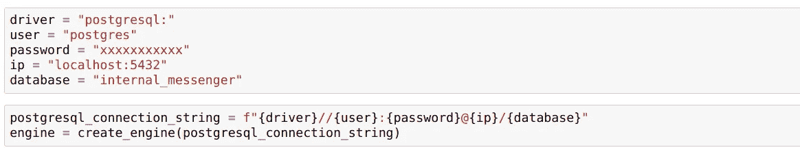

Snippet code of the “create_engine” module of SQLalchemy that enables the blended workflow

# 这个问题。用户参与度的下降

八月底到了，当回顾关键指标仪表板时，有些事情很突出(见下图)。用户参与度有所下降。

在这种情况下，参与度被定义为与产品交互的服务器调用，换句话说，当用户在给定的一周内登录到 Hub 时，他/她正在参与产品。因此，用户不登录，因此不参与，肯定对业务不利，所以作为一名分析师，您想知道发生了什么，并准备好处理数据库以获得见解并指导可能的纠正措施。

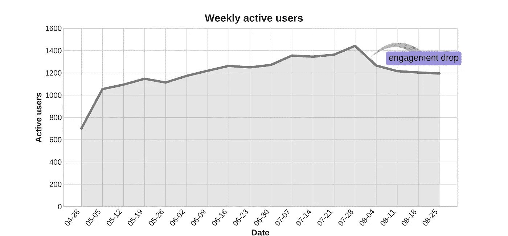

# 问题的潜在来源

在开始询问之前，建议考虑所有可能导致用户参与度下降的因素。以下是我想到的关于这个案例的一些例子:

*   **节假日**。在许多国家，尤其是位于北半球的国家，8 月是休假人数最多的月份，所以这很可能是休假人数下降的原因。
*   **性能问题**。很多时候，电子商务、市场或技术公司中的主要问题来源于与网站/应用程序的纯粹交互，它可能会对用户或其他人产生不同的影响，这仅取决于用于登录的设备类型和操作系统。也有可能是技术团队在 web/app 前端引入了一项改变，影响了某个特定的功能，从而对参与度产生了直接的负面影响。网站加载缓慢或会话导航中的功能损坏可能会导致用户体验不佳，导致产品参与度降低。
*   **报名特征流程**。为了让销售线索成为能够登录并使用该产品的用户，他/她必须首先完成注册流程的每个步骤。例如，可能会出现这样的情况:流程的任何功能都存在技术问题，这可能会阻止新用户注册，从而错过新手的新参与贡献，这自然会抵消系统的流失。
*   **跟踪日志破损**。还可能发生的情况是，标识每个用户操作的代码/日志本身被破坏或受到影响。看到某个特定的使用特性下降到绝对为零，暗示问题来自这个方向。
*   **坏数据**。我们可能会存储“脏”产品流量的记录，这意味着不是来自真实用户的记录，而真实用户才是我们感兴趣的。例如，QA 可能会开发和测试一个新的特性或新的技术基础设施。通常，QA 和生产数据是分开的，但是由于小故障导致的 QA 活动可能最终与真实的外部用户流量混合在一起。另一种解释这种不良数据的可能性可能来自机器人，由于这些相同的变化，现在以不同的方式在网络上爬行，因此导致流量记录波动。
*   **与摘要电子邮件相关的技术问题。**它们以每周摘要的形式从 Hub 内容团队发出。它们旨在通过总结前一周的活动和同事的活动来吸引客户并培养参与度。

让我们逐一分析这些要素。

## 假日

下面的查询试图找出 8 月份活跃用户数量多于 7 月份的国家。为了将假期视为用户参与度下降的原因，我们希望在查询输出中看到 8 月不是主要休假月份的国家的列表，我们希望这些国家或者是传统上主要休假月份不是特定月份的国家，或者是因为位于南半球等原因的国家。

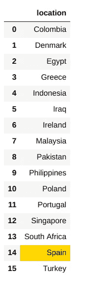

我是西班牙人，我可以说八月是传统上最主要的度假月份。例如，据我所知，希腊也是如此。

因此，认为假期是用户参与度下降的原因让我有些沮丧。我宁愿调查其他可能的原因，而不是深究这个原因。

以下是西班牙和希腊每月的参与用户情况。

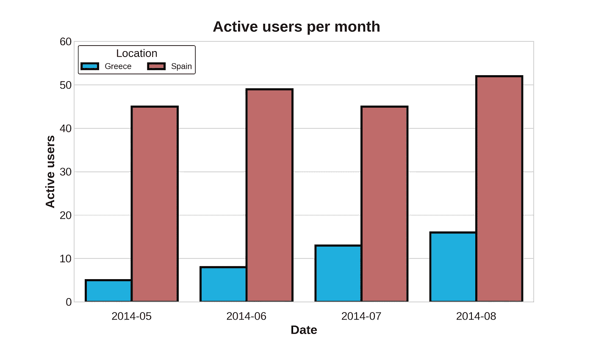

如果这是 Hub 用户参与度整体下降的实际原因，我们预计本月的活跃用户会有所增加。

## 性能问题

***设备类型***

为了了解在与产品的交互中是否存在某种性能问题，查看特定的操作系统或设备是否受到特别的影响可能会很有意思。

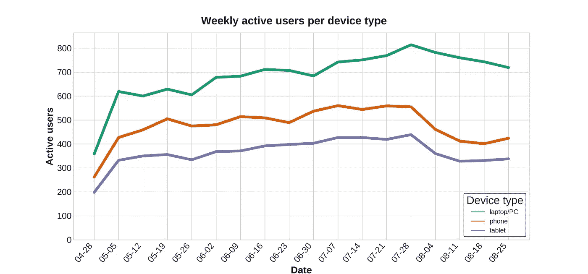

上图显示，参与度的下降来自各个方面，但对于通过手机和平板电脑登录的用户来说，这种下降尤为明显。最重要的是，笔记本电脑用户的比例高于其他类型的设备，因此按比例来说，这一下降在各组之间有很大不同。

让我们来看看从 7 月到 8 月这些比例是如何变化的。

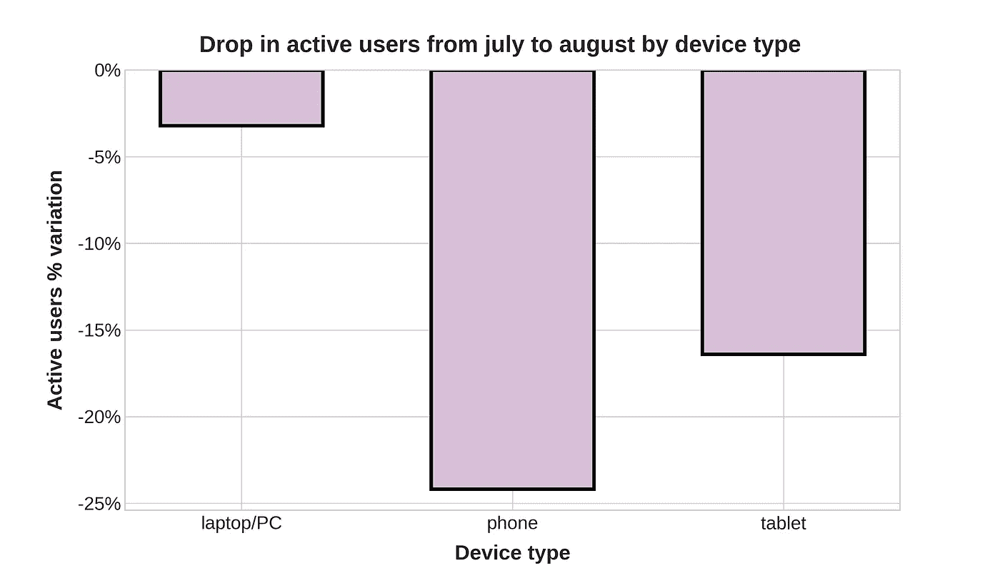

设备类型与用户参与度变化之间的差异非常大，足以将此列为解释用户参与度下降的一个可能原因。这并不意味着这是肯定的原因，但看看这些数据，有些事情是可疑的，值得进一步调查。例如，与技术团队交谈，了解他们是否正在调整应用程序中的某些内容(通过手机和平板电脑使用，而不是通过 PC/笔记本电脑)，以便从他们的开发中找出潜在的问题，这可能是有用的。

***操作系统***

与上面针对设备类型所示的方式相同，该分析也可以按操作系统进行分解(顺便说一下，操作系统在一定程度上与设备类型相关)。

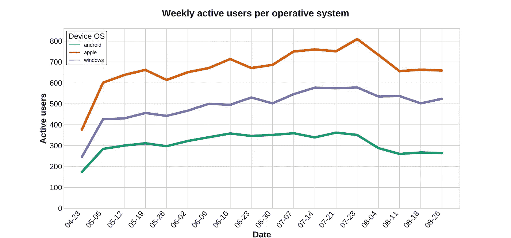

上面的图表告诉我们，下降似乎主要来自苹果和安卓用户，这在一定程度上与之前我们看到的设备类型效应的图表有关。

让我们通过观察每个操作系统从 7 月到 8 月的比例变化来理解这种影响的相对大小。

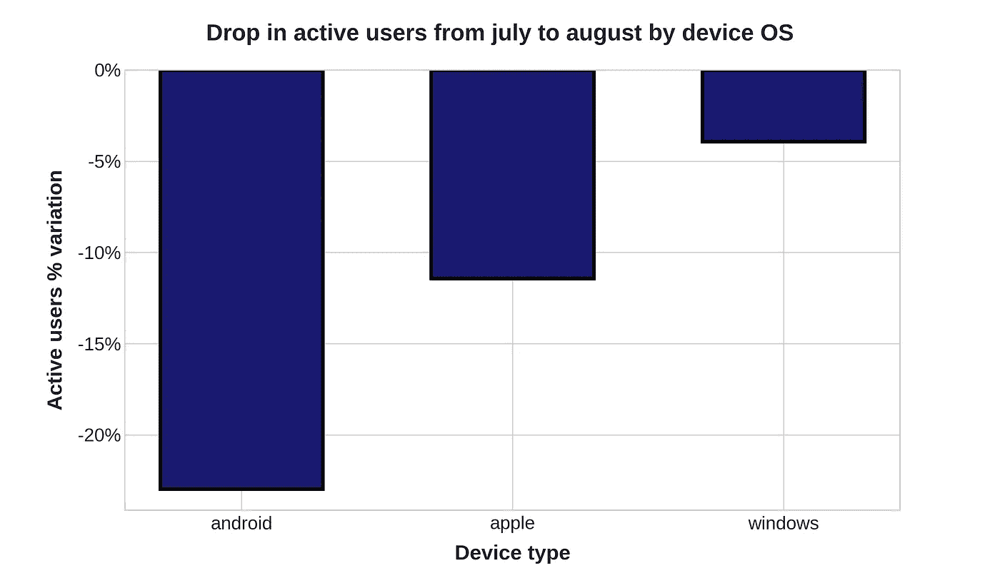

与之前的发现一致，手机和平板电脑似乎积累了更大比例的用户参与度下降，如最后一张图表所示，尤其是 android 设备。

然而，如果这是问题的唯一来源，为什么 window 笔记本电脑的用户参与度会下降，尽管不太明显，但仍然是下降？

让我们继续调查其他可能的原因。

## **注册特征流程**

第一，方便查看每月新增用户。

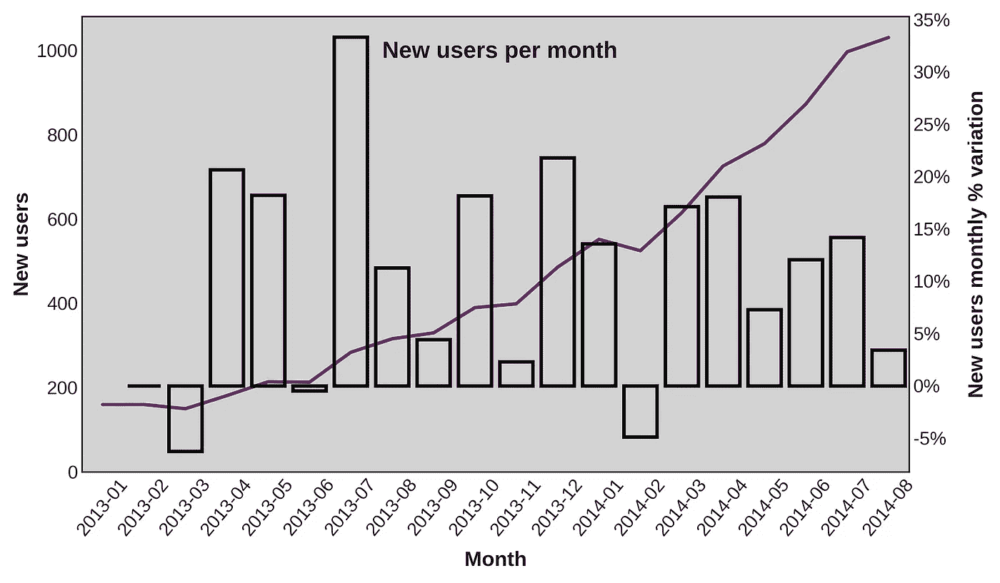

紫色线显示每月新增用户的变化，连接到左侧的 Y 轴，而条形显示每月新增用户的百分比变化，连接到右侧的 Y 轴。

通过阅读图表，我们可以看到，在 2013 年至 2014 年的时间跨度内，用户获取量呈现出明显的上升趋势。特别是，如果我们注意最近的夏季(这是用户参与度下降分析的中心)，与 7 月(2014 年)相比，2014 年 8 月的新用户数量实际上有所增加。仅此一点就足以排除注册流程中的一个问题作为我们问题的原因之一。

然而，由于用户获取增长率在 8 月份明显放缓，仔细研究一下注册流程步骤是安全的。

并在 8 月前的几个月内捕获。

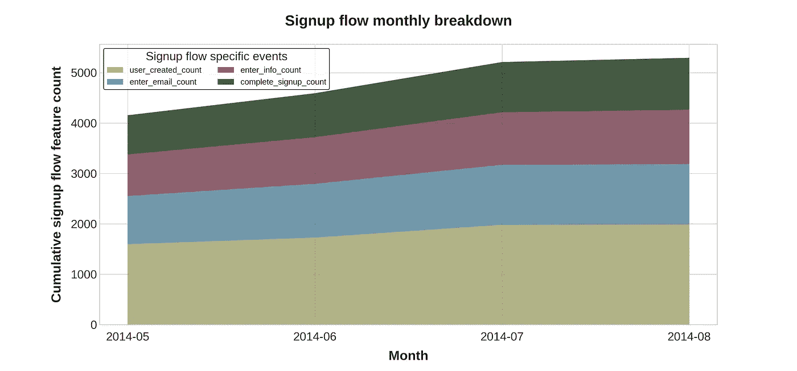

正如我们所看到的，注册流程漏斗的所有步骤在不同的月份中保持着相对于彼此的比例，因此我们可以安全地排除这个流程中的技术问题作为我们问题的根本原因。

## 破损的跟踪日志

可能的情况是，由于日志(用户在与产品交互时采取的每一个动作的标识符)的问题，使用流程中的某些特定功能无法被跟踪。

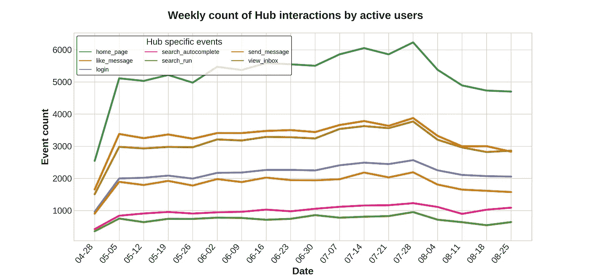

事实并非如此。所有事件都有一个普遍的下降，以至于它们看起来是同步移动的。让我们放大到 7 月-8 月，看看它的相对比例。

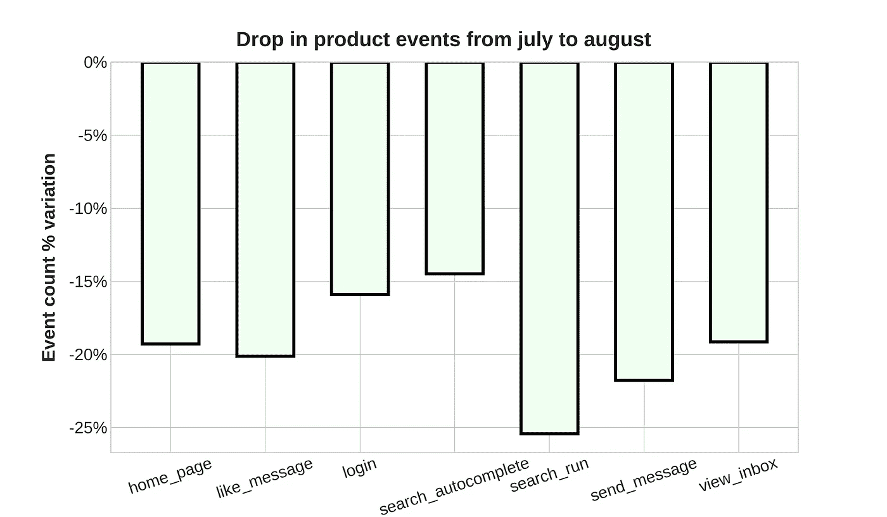

事实上，在参与度下降是如何通过它们形成的方面存在一些差异，但它们似乎并不太相关，不需要考虑属于它们中任何一个的跟踪日志被破坏的情况。

## 错误数据

为了确定这是否是原因，我们需要查看用户的活动，并检查其中一些用户是否有异常活动。这将导致人为活动，或者换句话说，某种类型的峰值/不寻常的上升，在我们的情况下，在 7 月份进行可能是有意义的。如果这是真的，我们可以说 8 月份用户参与度的下降并不是这样，因为这是一个前一个月虚假用户参与度的问题。

首先，让我们检查是否有任何人开始接触网络但没有登录，这将指向那些奇怪的事情，如某人不需要注册成为记录日志的一部分(类似机器人的行为)。

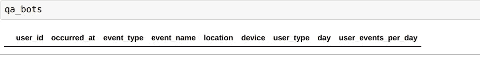

这意味着产品交互的每一条记录都是在登录之后产生的。

其次，让我们看看一周内是否有一些日子有不寻常的活动。

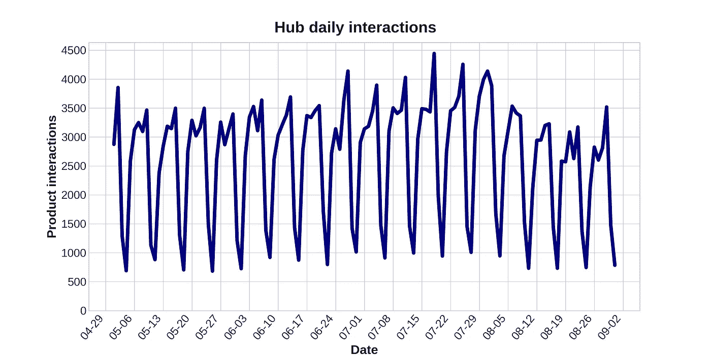

我们可以看到，一周内有一个系统的波动，工作日的枢纽活动较多，周末自然较少，最相关的可能是 7 月下半月的高峰，虽然看起来不是特别高，但不能草率排除，因此值得深入研究。

第三，检查在该时间段内某一天是否有日志事件数据可用，以及是否有非常不寻常的活动，这也很有帮助。

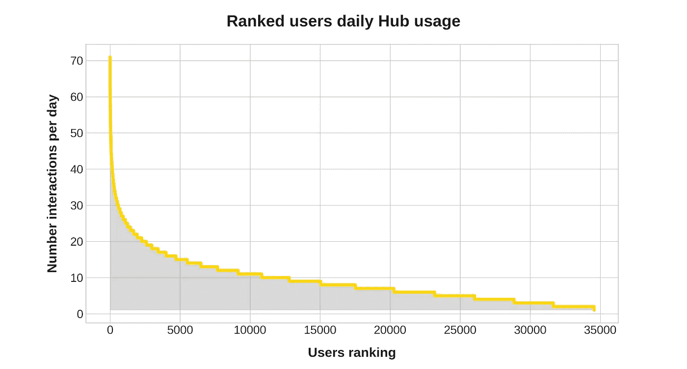

似乎确实有一些日子有不寻常的活动，但很难说这是非常不寻常的。如果 7 月至 8 月的用户参与度变化背后有糟糕的数据，我们预计这些数据将集中在 7 月。让我们找出答案。

因为我可能认为我们在谈论不寻常的活动，在某一天内来自单个用户的多达 70 个事件，所以让我们考虑离群值的存在，不管是不是假的，但是离群值。

为了描述异常值，我们需要从数据的分位数范围(IQR)中定义一个阈值。这是我做这件事的方法。

首先我们得到了 IQR。

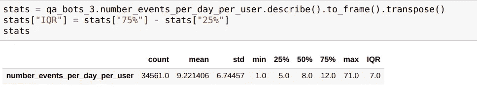

然后可以用它来隔离异常值。

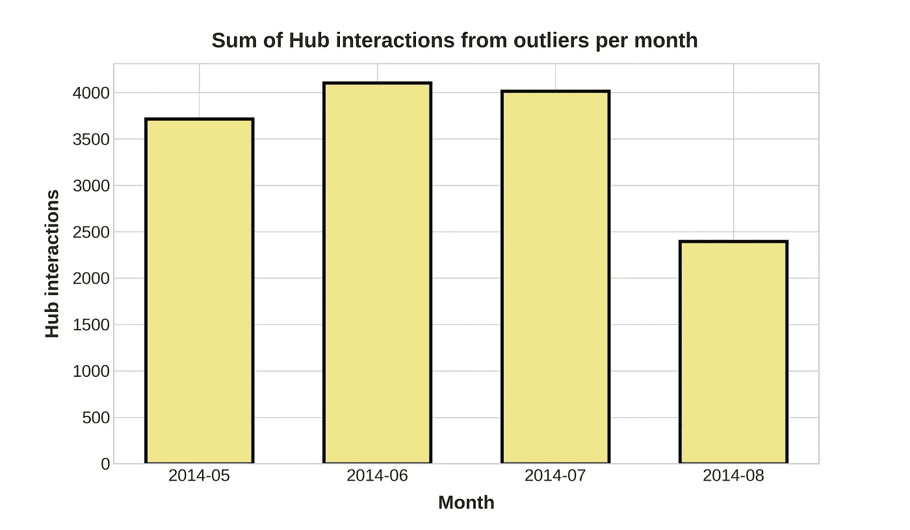

从上面的柱状图中可以得出两点:第一，从异常值(或潜在的坏/假数据)来看，7 月份似乎没有异常的活跃，事实上，与前几个月类似。第二个是，8 月份离群值的互动确实很低。

这打开了许多场景，需要根据优先级进行进一步的调查，以便对它们有更多的了解。在这些人当中，我会突出这些人。

*   搜索引擎抓取网站的方式可能在 8 月份发生了变化，这可以解释这个月的大幅下降。一种可能的方法是进一步分析用户模式并对其进行聚类。这将有助于识别机器人，然后验证所寻求的用户参与度下降是否来自于它们活动的减少。
*   过去几个月的重要产品开发伴随着紧张的质量保证工作，这些工作在 8 月前完成。出于某种原因，QA 数据进入了生产日志，并且干扰了指标。我认为不太可能，但与产品开发部门核实一下也无妨。
*   在其他方面解释了其他原因，例如导致性能下降的技术问题，从而使那些最活跃的用户在糟糕的用户体验后做出反应，只是减少参与。

## 每周摘要电子邮件

如前所述，在列出问题的所有可能来源时，这些电子邮件是 Hub 的客户和内容团队用来促进用户参与的工具。它们是与每个用户相关的信息的汇总。

所以让我们看看数据是否能告诉我们一些关于它们的有趣的事情。普通数据被进一步操纵成关键利率。

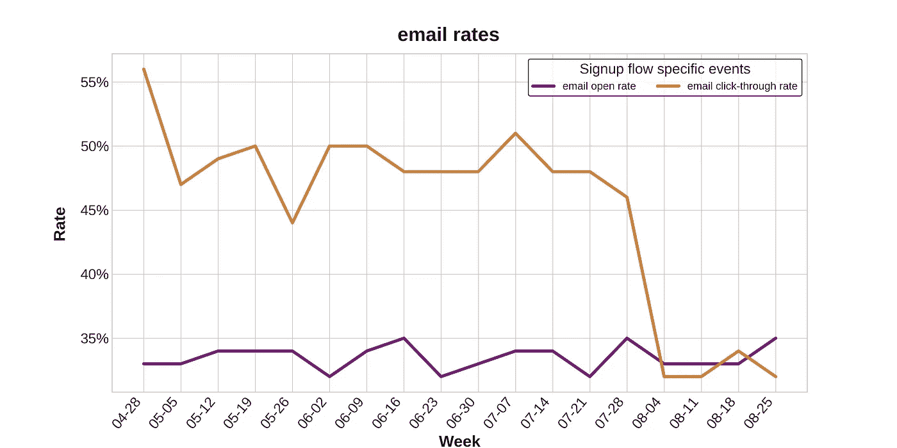

事实上，有些东西立刻就凸显出来了。虽然几个月来每周摘要邮件的打开率保持不变，但我们可以清楚地看到，点击率在 8 月份从 50%左右下降到 30%左右。也就是说，三分之二的用户不太关心这些互动电子邮件，然而在那些关心的用户中，在 8 月份之前，有二分之一的用户通过点击这些电子邮件中的链接重新参与到产品中，而在 8 月份，这一数字变成了三分之一的用户在电子邮件后重新参与。简而言之，从 7 月到 8 月，每周摘要邮件的有效性下降了 35%，直接导致用户参与度下降。

要么是电子邮件链接本身存在技术问题，导致用户无法点击进入，要么是选择与每个用户相关的内容并通过电子邮件发送的方式发生了变化(无论是来自算法还是专业团队)。

# 结论

列出许多旨在解释用户参与度下降的不同可能原因，对于减少我们忽略问题真正根源的机会非常有用。然后，每个查询都允许我们为分析消费准备好数据。根据这一分析，似乎影响手机和平板电脑用户的应用程序导航以及互动电子邮件的内容存在问题。

值得注意的是，这些发现并不是结论性的，可能需要向产品和技术团队提出进一步的问题，但至少我们已经能够有一个良好的开端来找到一个令人困扰的问题的答案。