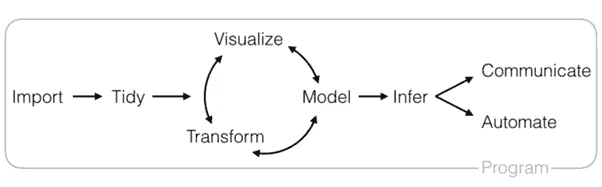
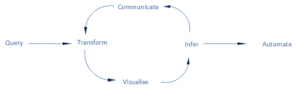
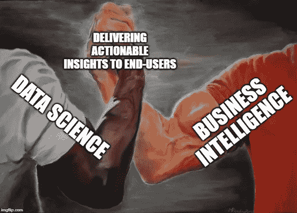
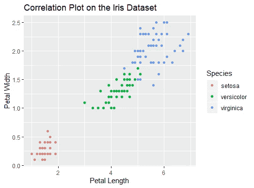
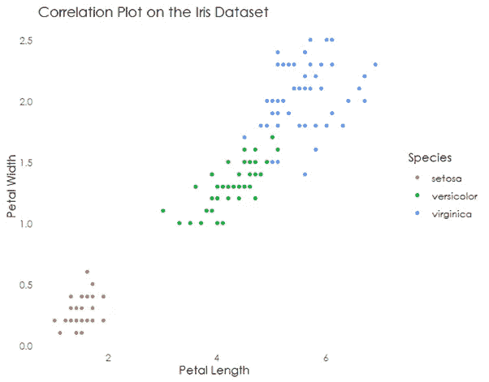
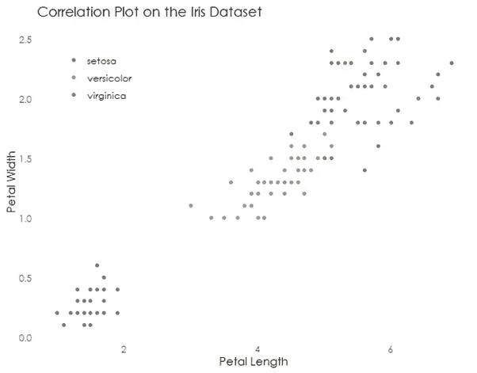
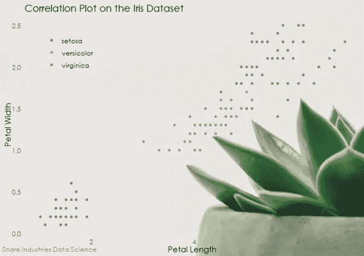

# 作为数据科学家的商业智能—第 2 部分

> 原文：<https://towardsdatascience.com/business-intelligence-as-a-data-scientist-part-2-b3d45bbdcce?source=collection_archive---------33----------------------->

## 作为数据科学家的商业智能—第 2 部分

这个博客系列是关于我在商业智能和数据科学领域的工作经历，以及这两个行业之间的交叉。[作为数据科学家的商业智能——本系列的第 1 部分](/business-intelligence-as-a-data-scientist-part-1-2974655766c5)谈到了这两种职业之间的相似之处。我坚信数据科学和商业智能有着内在的联系——我将再次讨论这两种职业之间的细微差别，并通过一个例子继续。和以往一样，这个代码保存在我的 [Github](https://github.com/shaun-parker/snareplot) 上，你可以在 [LinkedIn](https://www.linkedin.com/in/shaun-parker-56353886/) 上找到我。

在这篇文章的讨论部分，我想谈谈商业智能和数据科学之间更广泛的定义和区别。这两项工作涉及相似的工作流程:



RStudio’s definition of “The Data Science Workflow”

让我们做一个简短的，每个步骤一句话:

1.导入您的数据——这可能来自数据仓库、Lake、文本文件、JSON 等等——无论您使用什么数据源

2.整理你的数据——同样，这取决于你正在做的事情的背景，但你可能会过滤掉一些不相关的东西，对丢失的数据做一些事情，清理一些杂乱的数据点 [—这一步和接下来的步骤是你将花费大部分时间的地方](https://businessoverbroadway.com/2019/02/19/how-do-data-professionals-spend-their-time-on-data-science-projects/)

3.想象、建模、转化——这不可能用一句话来解释，但我们可以试试！这些步骤包括可视化和探索性数据分析的洗衣机，为您的任务选择一个模型，转换您的数据以适应该模型所需的格式(参见一键编码、特征工程、符号化)，特征的可视化和模型性能

4.推断模型的结果—我们的模型说 96%，这个数字是多少？这是准确性吗，准确性是这个问题的正确衡量标准吗？我们需要担心过度拟合或采样误差吗？[基线是 98%，因此我们的模型是垃圾吗？](https://machinelearningmastery.com/how-to-get-baseline-results-and-why-they-matter/)

5.如果我们足够幸运到这一步，我们需要做什么来生产这个模型？要么:

a.将模型升级为实时模型，并开始自动创建真实预测(在这一步之后有一个完整的其他工作流程，确保您的模型保持相关，您是否希望自动重新训练等。)

b.传达模型的发现——我经常发现人们对模型的思考方式感兴趣——参见特征重要性，[解码黑盒](https://www.analyticsvidhya.com/blog/2019/08/decoding-black-box-step-by-step-guide-interpretable-machine-learning-models-python/)。有时候，找出预测中的重要因素可能比预测本身更有用——我见过企业改变他们的流程，比如不在周二下午向客户发送发票，因为那时客户做了一些奇怪的内部活动，而我们的发票在归档中丢失了。这一结果直接来自一个为预测流媒体环境中支付可靠性而构建的模型，但该模型从未投入使用，因为决策树比即时预测发票更有趣

我承认——上面的工作流是一个数据科学工作流，来自一个非常著名的数据科学来源([RStudio Github page](https://github.com/rstudio/RStartHere))——显然那些家伙知道他们在说什么！但是，让我们考虑一个商业智能分析师的工作流，他的任务是为其财务部门创建 KPI 仪表板:

1.从数据仓库中查询一些财务数据——数据仓库 ETL 中的导入和整理步骤已经完成

2.对数据进行任何转换/过滤/列插补，使其符合我们财务仪表板的必要格式/形状

3.可视化输出——我们的仪表板是否显示了我们想要它显示的内容？

4.对可视化进行 QA，以确保输出中的数字与经验证的来源相匹配(推断输出？)—如果我们仪表板中显示的总收入与业务中其他地方显示的值不同，那就不好了

5.将工作传达给业务用户。此时，将会发生以下两件事之一:

a.业务用户要求更改您已经完成的工作，在这种情况下，重复步骤 2 到 5

b.业务用户对工作很满意，在这种情况下，下一步是自动化仪表板并升级到实际环境

我高度概括的 5 步商业智能工作流程是否与上图中高度概括的 5 步数据科学工作流程相似？我有点偏向于自己的叙述，并且遗漏了几个步骤——虽然你也可以为 DS 工作流争论这一点——但是在我看来这两个流程并没有很大的不同。我们甚至可以创建一个图表:



Excuse my poor Visio skills!

在我看来相隔不到一百万英里。两个工作流都忽略了一个关键步骤，即两个工作流都从业务用户开始和结束。在每种情况下，都有一个用户在询问分析团队的业务问题。在分析团队施展了他们的魔法之后，我们希望输出能够改变企业的行为方式——这可能不是在周二发送发票，也可能是一个财务仪表板，显示该客户今年迄今为止带来的收入。

这是对两个工作流程的全面概述。数据科学家和商业智能分析师将处理的数据类型有很大不同，因此从技术角度来看，左侧的查询、导入和整理步骤完全不同。除此之外，两种工作流的最终产品也有很大的不同— BI 处理的是精确的历史数据—例如，我们公司上个月的收入是 50，000 英镑。DS 处理非绝对和预测，例如，我们公司下个月的预测收入将是 55，000 英镑，在 95%的置信区间内，在 52，250 英镑和 57，750 英镑之间。除了技术方面，两个工作流的高层次概述显示了我认为的交付端到端产品的相似性。



Obligatory cringeworthy meme for Medium!

无论如何——继续这篇文章的编码部分。[作为数据科学家的商业智能第 1 部分](/business-intelligence-as-a-data-scientist-part-1-2974655766c5)谈到了品牌的重要性。总之，业务用户习惯于以某种方式查看他们的报告，让您的工作符合公司标准绝对是您的工作。之前我们构建了一个[闪亮的应用](https://github.com/shaun-parker/shiny-template)——这一次我们将创建一个 ggplot2 包来自动化发布图形的标准化。这并不是一个新的想法——我们将大量借鉴 BBC 新闻数据团队最近出版的[标准化食谱。他们的软件包被称为 bb plot——我们的被命名为](https://github.com/bbc/bbplot) [snareplot](https://github.com/shaun-parker/snareplot) ，以我虚构的公司 Snare Industries 命名。回想起来，我确实应该把我的包叫做花盆——虽然现在有点晚了！

Snareplot 使用了第 1 部分中所有相同的主题元素。配色方案是用 [colormind.io](http://colormind.io/) 生成的，软件包可以从我的 [Github](https://github.com/shaun-parker/snareplot) 下载——你可以用 devtools 安装。


Snareplot can help create branded graphics like these — the main work is in building the ggplot itself, snareplot makes the rest of it easy

Snareplot 使用 4 个函数来切换默认的 ggplot2 格式。这些函数是 theme_snare()、scale_colour_snare()、scale_fill_snare()和 finalise_plot()。

让我们建立一个情节。

```
library(ggplot2)library(snareplot)scatter_data <- iris scatter_plot <- ggplot(data=scatter_data, 
        aes(x=Petal.Length, y=Petal.Width)) + geom_point(aes(color=Species)) + labs(x=”Petal Length”, y=”Petal Width”, title=”Correlation Plot on the Iris Dataset”)scatter_plot
```



Standard plot using ggplot2 default formatting

Snareplot 通过在已经构建的 ggplot2 图形上分层来工作。让我们将 theme_snare()应用于 scatter_plot。

```
scatter_plot <- scatter_plot + theme_snare()scatter_plot
```



scatter_plot with theme_snare() applied

这里有一些事情正在进行——让我们进入[主题 _ 陷阱中的函数。R](https://github.com/shaun-parker/snareplot/blob/master/R/theme_snare.R) 文件。本质上，我们正在设置一个字体(通过 extrafont 包)，从 ggplot2 中应用 theme_bw()，并从主题中移除大多数元素。这当然可以按照你喜欢的方式定制——我个人喜欢有很少内容的极简主题。

接下来，我们将看看颜色。

接下来的两个函数覆盖 ggplot 中的颜色和填充参数。这就把我们从上面的情节引向了这个:

```
scatter_plot <- scatter_plot + scale_colour_snare() + theme(legend.title = element_blank(), legend.position = c(0.05, 0.95), legend.justification = c(“left”, “top”)) scatter_plot
```



Note the extra theme() arguments to move the legend to the top left — this is nothing to do with snareplot, it just looks better in this particular plot to move it to an empty area of the grid.

[Scale_colour_snare()](https://github.com/shaun-parker/snareplot/blob/master/R/scale_colour_snare.R) 和 [scale_fill_snare()](https://github.com/shaun-parker/snareplot/blob/master/R/scale_fill_snare.R) 都是通过对绘图应用调色板来工作的。这些都是简单的功能，但是颜色是根据我们的 Snare Industries 品牌选择的，如[第 1 部分](/business-intelligence-as-a-data-scientist-part-1-2974655766c5)所述。这里最重要的部分是颜色本身——这些函数只是让用户不必记住要在 scale_colour_manual()中输入哪些 html 值。

snareplot 包中的第四个函数是 finalise_plot()。该函数有两个参数——它寻找一个要“完成”的 ggplot2 对象，并询问用户是否绘制背景。

```
finalise_plot(plot_variable = scatter_plot, draw_background = TRUE)
```



很容易看出这个最后的函数是做什么的！当安装软件包并调用该函数时， [/data/](https://github.com/shaun-parker/snareplot/blob/master/data/5k-botanical-minimal-potted-wallpaper.jpg) 存储库中的图像文件位于绘图的下面。该图像有时会使绘图变得混乱，因此可以通过设置 draw_background = FALSE 来呈现没有该图像的绘图。该函数还在左下方设置了 Snare Industries 数据科学水印，这是为了标记该图，以便我们知道它在业务的任何地方结束，它都来自 Snare Industries 数据科学团队。

Snareplot 中的一切都可以按照您的意愿进行更改——我强烈建议为您的组织研究颜色方案和字体，并在您创建的任何 ggplot2 图形中使用它们。这将为你的团队创建一个品牌标识，并最终帮助吸引业务中的非技术用户。[第 1 部分](/business-intelligence-as-a-data-scientist-part-1-2974655766c5)对此谈了很多——品牌是数据科学家工具箱中经常被忽视的技能。

第 2 部分到此为止！和以往一样，所有代码都托管在我的 [Github](https://github.com/shaun-parker) 上，你可以在 [LinkedIn](https://www.linkedin.com/in/shaun-parker-56353886/) 上关注我。