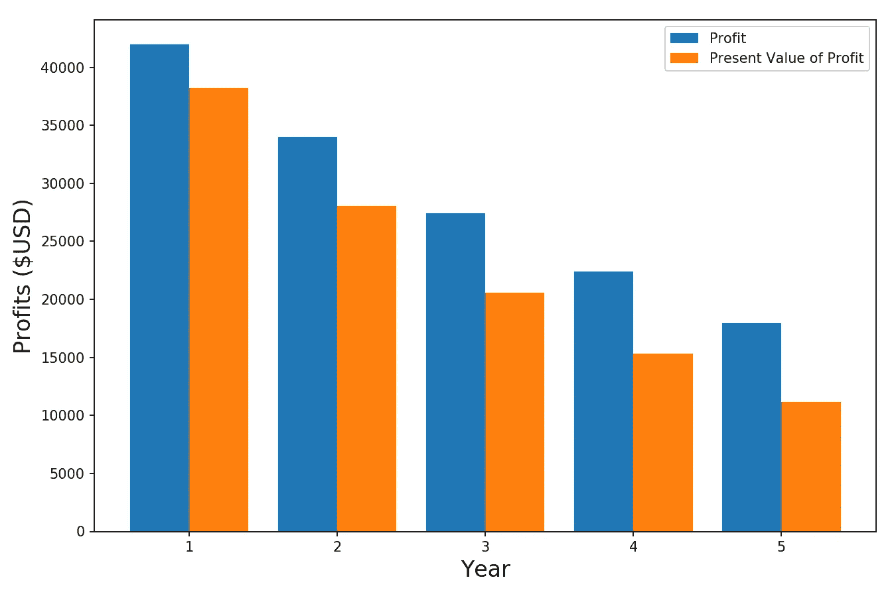
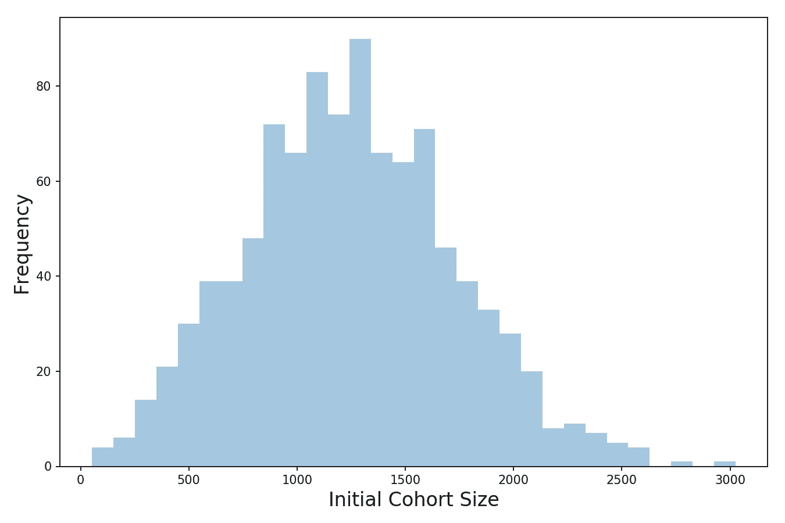
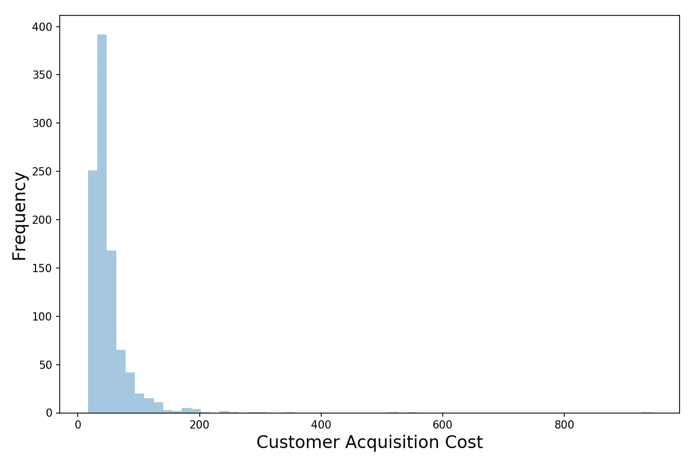
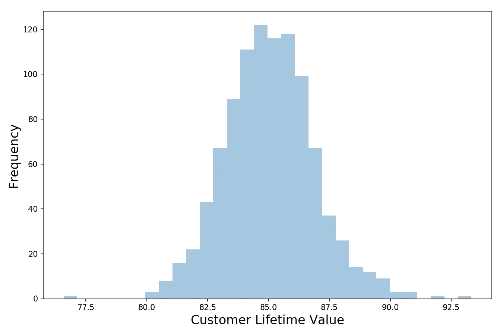
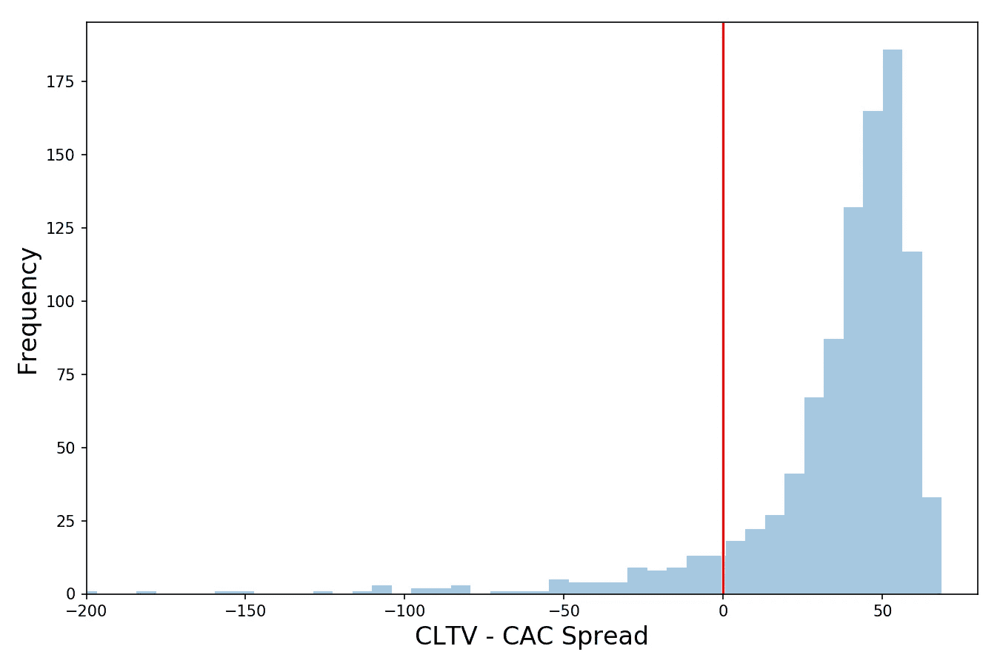

# 用 Python 进行商业模拟

> 原文：<https://towardsdatascience.com/business-simulations-with-python-a70d6cba92c8?source=collection_archive---------9----------------------->


## 用蒙特卡罗方法探索客户终身价值和客户获取成本

当我写下 [**这篇关于数据科学家**](/business-strategy-for-data-scientists-25e3ca0af5ee) 的商业战略的文章时，我意识到为营销活动及其产生的新客户群体进行模拟可能会很有趣。

我职业生涯的大部分时间都在金融和投资领域度过。我更习惯于把公司作为一个整体来考虑(在总体水平上分析)，而不是在日常水平上。但我确实发现更细致的细节非常有趣。毕竟，如果整体不是部分的总和，那它是什么呢？

了解更多信息的一个好方法是模拟它(使用合理的输入和假设)，然后研究结果。你经常会惊讶于几个关键变量之间看似简单的相互作用会产生一些令人惊讶的结果。所以让我们用 Python 来模拟一个营销活动，看看会发生什么。

**我们将重点模拟客户终身价值(CLTV)和客户获取成本(CAC)，这是许多初创公司(以及上市公司)的关键指标。[在我之前的商业战略文章中，我从概念上深入探讨了这些指标，所以如果你想要更多的背景知识，请参考它。](/business-strategy-for-data-scientists-25e3ca0af5ee)**

# 策划营销活动

这个模拟的详细代码可以在我的 GitHub 上找到。但这里是我们正在努力做的事情的高级概述:

*   给定一些输入，如转换率、成本、预算等，定义一个运行营销活动的函数。，我想返回新注册客户的列表。
*   定义一个模拟一群客户的函数— **给定一些关于流失率、消费频率和消费金额的假设，我想模拟这一群客户的表现，并最终计算他们对我的企业的平均终身价值。**
*   运行一堆模拟，看看结果的分布。

让我们先写一个运行营销活动的函数。我们可以通过两种方式之一来实现这一点——我们使用一个随机生成的数字来表示每个印象的结果(每个印象有微小的概率变成付费客户),然后汇总我们的结果(使用 for 循环)。或者我们可以利用统计模型。让我们使用后者，因为循环数百万次相当慢。**相反，我们可以利用我们的老朋友，** [**二项分布**(这给了我一个链接到我以前博客的借口——如果你不熟悉二项分布，请阅读)](/fun-with-the-binomial-distribution-96a5ecabf65b)。

引用我以前的话:

> **二项式分布是一系列实验的概率分布，其中每个实验产生一个二元结果，并且每个结果独立于所有其他结果。**

每个印象的结果是否真正独立是有争议的，但为了我们的目的，我们可以安全地做出这种假设。这意味着**我们可以使用一个随机变量和** [**一个二项分布**](/fun-with-the-binomial-distribution-96a5ecabf65b) **来模拟我们的营销活动。我们的预算和 CPM(来自像谷歌这样的广告供应商的每 1000 次展示的成本)决定了试用的次数。而每次印象的转化率就是成功的概率。下面的函数做了我刚才描述的事情:**

```
# Function for calculating the results of a marketing campaign
def run_campaign(spend, cpm, conversion_rate):
    return np.random.binomial(spend/cpm*1000, conversion_rate)
```

转换率本身只是一个估计值，所以我们也应该在其中加入一些不确定性。对于第一遍，假设我们的转换率呈正态分布是合理的。请注意，我为转换率设置了一个下限，因为负转换率没有意义。

```
# From the expected conversion rate and stdev of it, get the
# realized conversion rate
def get_conversion_rate(expected, stdev):
    conversion_rate = max(expected + np.random.normal()*stdev, 
                          0.000001)
    return conversion_rate
```

现在让我们输入一些信息——花费是我们计划在营销活动上花费的金额，cpm 是 1000 次展示的成本，两个转化率相关变量是我们对转化率期望值和标准偏差的估计。预期转化率看起来很小，其实没那么小。另一种理解方式是，每提供 20，000 次展示，我们就会有一个客户。在你意识到多亏了谷歌，每一千次展示的成本是 2 美元之前，这听起来好像很多——所以 2 万次展示只花了我们 40 美元。

```
# Budget
spend = 50000
# Cost per thousand
cpm = 2
# Conversion rate
conversion_rate_expected = 0.00005
conversion_rate_stdev = 0.00002
```

现在让我们试试我们的函数。可变群组规模是我们追求的目标，它是我们营销活动产生的新客户数量。而有了它，我们就可以计算出我们的**客户获取成本(CAC)** 。 **CAC 是我们营销努力的总成本除以我们通过努力获得的客户数量。**

```
# Let's call it to get the number of new customers from our campaign
conversion_rate = get_conversion_rate(conversion_rate_expected, 
                                      conversion_rate_stdev)
cohort_size = run_campaign(spend, cpm, conversion_rate)# And calculate our Customer Acquisition cost
CAC = spend/cohort_sizeprint('Customers Gained: ', cohort_size)
print('CAC: ', round(CAC, 2))
```

运行上面的行会产生以下结果:

***获得客户数:1309***

***CAC(客户获取成本):50000 美元/1309 = 38 美元***

当然，如果我们再次运行它，我们会看到不同的值，因为我们已经注入了两层随机性(转化率作为正态分布的随机变量，最终成为客户的人数作为二项式分布的随机变量)。

# 随着时间的推移模拟客户群体

我们的下一步是编写一些函数来模拟我们的客户群如何随时间变化。每年，这个群体中的一些成员会流失(不再是顾客)，而剩下的人会从我们这里购买商品。

我们可以使用一个随机数生成器(生成一个 0 到 1 之间的浮点数，均匀分布)来模拟一个特定的客户是否每年都有变动。逻辑是这样的——对于给定年份群组中的每个客户，我们生成一个随机数。如果我们生成的数量低于最小阈值，则该客户已经取消。为了简单起见，我们假设所有的取消都发生在年初，因此，在他们离开的那一年里，顾客不会从我们这里购买任何东西。

```
# Function that models the progression of a cohort over time
def simulate_cohort(cohort_size, churn_rate, transactions, price, 
                    retention_cost, yrs=5):
    customers_left = []
    spending = []
    profit = []
    for i in range(yrs):
        for customer in range(cohort_size):
            # Assume cancels happen at the start of the year 
            # (for simplicity)
            churn_random_num = np.random.random()
            # Generate a random number between 0 and 1, if less 
            # than churn_rate then customer has churned and we 
            # subtract 1 from cohort_size
            if churn_random_num <= churn_rate:
                cohort_size += -1
            # Calculate and record cohort's data
        customers_left.append(cohort_size)
        spending.append(cohort_size*transactions*price)
        profit.append(cohort_size*(transactions*price -\
                                   retention_cost))
    return customers_left, spending, profit
```

接下来，让我们收集输入并运行我们的函数。更实际的是，我们应该假设每个客户每年的保留成本。这是我们每年需要花费的金额，以保持特定客户对我们服务的满意度和忠诚度。**请注意，我只预测了 5 年的利润——我们剩余的客户可能在第 6 年仍会购买我们的产品，但为了保守起见，我将假设给定的客户群最多还有 5 年的寿命。**

```
churn_rate = 0.20
# Number of annual transactions per average cohort member
transactions = 6
# Price of goods sold per average transaction
price = 10
# Annual cost of retaining/servicing customer
retention_cost = 20# Run the function
customers_left, spending, profit =\
    simulate_cohort(cohort_size, churn_rate, transactions, 
                    price, retention_cost, yrs=5)
```

**我们最感兴趣的产出是利润**，即我们的客户群为我们的业务带来的收入，因为这是客户终身价值的主要驱动力。还有其他间接驱动因素，如满意客户的推荐，但我们今天不会在此建模。

在我们计算**客户终身价值(CLTV)** 之前，我们需要写一个现值函数。随着时间的推移，客户会购买我们的产品(只要他们是客户，每年都会在我们的产品上花一点钱)。**这意味着很多收益发生在未来。由于通货膨胀、机会成本和不确定性，未来的美元不如今天的美元值钱。**我们可以通过对未来收到的任何款项进行贴现来大致调整这些影响(收到的款项越多，需要贴现的金额就越多)。下面的函数就是这样做的:

```
def present_value(cashflows, rate):
    pvs = []
    for i, val in enumerate(cashflows):
        pvs.append(val/(1 + rate)**(i+1))
    return pvs
```

我们现在有了计算 CLTV 所需的东西。我们将应用 10%的贴现率将未来收到的利润转换为现值(以今天的美元计算)。对于那些好奇的人来说，贴现率是复杂的，因为我们试图通过一个单一的数字来表达众多的因素(通货膨胀、风险、我们的希望和梦想等)——关于如何正确估计贴现率有大量的文献，所以我在这里就不赘述了。

```
# Calculate CLTV
rate = 0.10# Get the PV of the profits
pvs = present_value(profit, rate)
# Value of the cohort in today's dollars is sum of PVs
cohort_value = sum(pvs)print('Total Cohort Value: ', int(cohort_value))
print('CLTV: ', int(cohort_value/cohort_size))
print('CLTV-CAC Spread: ', int(cohort_value/cohort_size - CAC))
```

让我们来看看利润和它们的现值是如何比较的:



Profit and Its Present Value

随着越来越多的客户流失，这个群体(蓝色部分)的利润会随着时间的推移而下降。利润的现值(橙色)以更快的速度下降，因为未来更远的利润折现更大。

**现值之和是我们队列的值，我们的 CLTV 是队列值除以队列的初始规模:**

***总群体价值:113，285 美元***

***CLTV(客户终身价值):113，285 美元/ 1，309 = 86 美元***

***CLTV-CAC 利差:$86 - $38 = $48***

**我们真正关心的价值是 CLTV 和 CAC 之间的利差——如果它是负数，那么我们就不会长久。当然，在某些情况下，负息差是可以的。例如，处于早期阶段的初创公司不顾一切地扩大规模，会花费大量资金来吸引甚至是低价值的客户。这是因为他们的结果分布相当二元(而且他们的风险/回报相当不对称)。如果他们扩张得足够快，他们就会建立成功的企业并变得富有。如果他们没有达到要求的规模，最终失败了，那也是别人的钱(这种态度是多年来资金(尤其是来自风险资本家的资金)变得如此廉价和容易获得的副产品)。**

当然，预计未来客户群的传播将是积极的——随着公司和品牌获得动力，CLTV 应该会增加，而 CAC 会下降。

# 运行 1000 个场景

最后，我们有了所有必要的部分，现在可以运行我们的蒙特卡洛模拟。我们将模拟 1000 次营销活动，这样我们就可以看到结果的分布。

```
# Simulate 1000 times and look at the distributionscohort_size_list = []
CAC_list = []
CLTV_list = []for i in range(1000):

    # Run marketing campaign sim
    conversion_rate = get_conversion_rate(conversion_rate_expected, 
                                      conversion_rate_stdev)
    cohort_size = run_campaign(spend, cpm, conversion_rate)
    CAC = spend/cohort_size

    # Simulate the resulting cohort
    customers_left, spending, profit =\
        simulate_cohort(cohort_size, churn_rate, transactions, 
                        price, retention_cost, yrs=5)

    cohort_value = sum(present_value(profit, rate))

    cohort_size_list.append(cohort_size)
    CAC_list.append(CAC)
    CLTV_list.append(cohort_value/cohort_size)

# Store simulation results in a dataframe
results_df = pd.DataFrame()
results_df['initial_cohort_size'] = cohort_size_list
results_df['CLTV'] = CLTV_list
results_df['CAC'] = CAC_list
results_df['Spread'] = results_df['CLTV'] - results_df['CAC']
```

我们的客户群的初始规模可能会有很大差异，因为我们有两层随机性(我们允许每个活动的“真实”转化率有所不同，每个投放出去的印象本身就是一个随机结果的试验):



Initial Cohort Size Distribution

如果队列规模可以变化很大，那么 CAC 也可以变化很大(我们预计它的中值约为 40 美元(因为 or 我们的输入假设)。哇，它真的很宽。CAC 的中位数是 40 美元，但有可能经历可怕的活动回报(很少有客户注册)并获得三位数的 CAC-超过 6%的模拟导致 CAC 达到 100 美元或更高。所以不要做最坏的打算，但要做好准备。

分布的形状很有趣。从 CAC 的角度来看，这是不对称的——如果我们签了很多客户，我们的 CAC 会很低，但它能低到什么程度是有现实限制的(我称之为我们上升的软上限)。但是如果我们没有签下很多客户，我们可能会看到非常高的 CAC，这对我们公司来说是灾难性的。



CAC Distribution

现在让我们看看收入方面的情况，CLTV。由于我建模的方式，这里的差异明显较小。我可以通过在年度流失率或客户交易中注入随机性(通过改变每笔交易的频率和价值)来允许更多的差异。如果我这样做了，钟形曲线会更宽(由于更多的变异和不确定性来源)，但仍然会有相同的平均值和一般形状。



CLTV Distribution

最后，让我们看看 CLTV 和 CAC 之间的价差。在这里，我们再次看到一个长尾和软帽，但这一次它是翻转的(因为我们在计算利差时从 CLTV 中减去了 CAC)。它有双重含义:

*   **即使我们有一个非常成功的营销活动，我们所能实现的每位客户的收益(以价差衡量)也是有限的。**这一限制的存在是因为 CAC 只能降到这么低(例如，在我运行的 1，000 个场景中遇到的最低 CAC 是 16 美元)，每个客户只能购买这么多。
*   **另一方面，如果我们有一个灾难性的活动，传播很容易是负面的，这意味着由此产生的客户可能永远不会收回他们的收购成本。**根据公司所处的阶段和营销活动的规模，这可能不会成为交易的阻碍(这可能只是暂时的、一次性的问题)。但是这应该阻止我们将公司的大部分资产或预算押在一个大规模的活动上——一个失败可能意味着公司的毁灭。



CLTV-CAC Spread Distribution

希望这是有帮助的，干杯！

***更多数据科学与分析相关帖子由我:***

[*数据科学家的商业战略*](/business-strategy-for-data-scientists-25e3ca0af5ee)

[*数据科学家是做什么的？*](/what-do-data-scientists-do-13526f678129)

[*理解贝叶斯定理*](/understanding-bayes-theorem-7e31b8434d4b)

[*理解朴素贝叶斯分类器*](/understanding-the-naive-bayes-classifier-16b6ee03ff7b)

[*二项分布*](/fun-with-the-binomial-distribution-96a5ecabf65b)

[*了解 PCA*](/understanding-pca-fae3e243731d?source=post_page---------------------------)