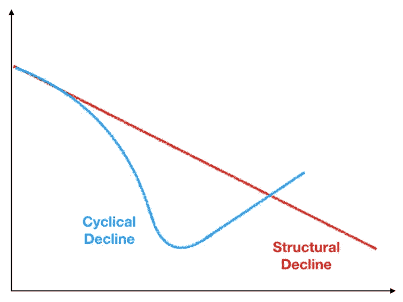
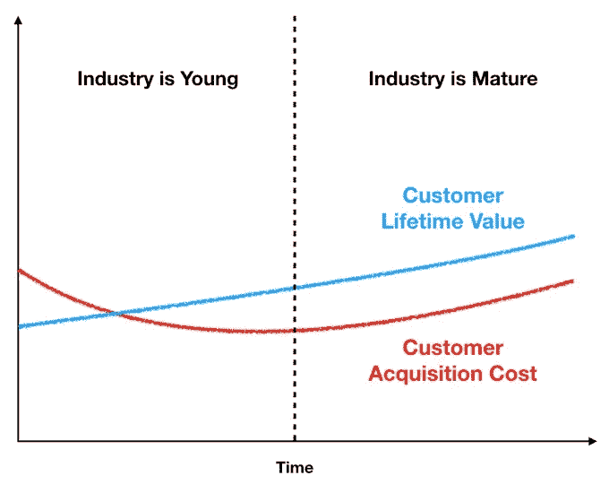

# 数据科学家的商业战略

> 原文：<https://towardsdatascience.com/business-strategy-for-data-scientists-25e3ca0af5ee?source=collection_archive---------11----------------------->

Photo by [Skitterphoto](https://www.pexels.com/@skitterphoto?utm_content=attributionCopyText&utm_medium=referral&utm_source=pexels) from [Pexels](https://www.pexels.com/photo/tilt-shift-lens-photo-of-black-and-white-chess-pieces-51055/?utm_content=attributionCopyText&utm_medium=referral&utm_source=pexels)

## 在开始机器学习之前，先学习商业策略的基础知识

科学是令人兴奋的。从我们学习第一个机器学习算法的那一刻起，就有一种将它应用于数据、做出预测和揭示深刻见解的冲动。

但是商业方面也非常重要和有趣。我向你保证，在你的数据科学职业生涯中，投入一些时间来了解企业如何运作以及好公司和坏公司的区别将会带来巨大的回报。

这可能是几个帖子中的第一个，因为不可能在一个帖子中公正地处理这个问题。另外，请不要认为这些帖子是 MBA-lite。相反，我计划写一些对我如何看待商业世界影响最大的概念和想法。因此，可能有一些相关的商业策略主题我会完全跳过。当然，如果你真的想从我这里听到什么，请在评论里告诉我(我会尽力的！).

# 公司成长阶段与数据科学需求

硅谷初创企业尽管如此，做生意的目的是赚取利润。这是否发生以及如何发生主要取决于公司目前所处的阶段:

The growth phases of a company

**高速增长**—**现阶段，销售增长比利润更重要，因此公司可能会承受巨大损失，以赢得越来越多的客户。**风险投资家为这种增长提供了动力，其目标是将收入扩大到公司在财务上有足够吸引力进行首次公开募股(IPO)的程度。

由于增长是必需的，超高速增长公司的数据科学家专注于客户获取和产品开发。他们可能要解决的问题包括:

*   定量识别最有吸引力的潜在客户。
*   设计和优化营销策略，如优惠券、推荐活动、社交媒体广告等。
*   研究和开发构成公司产品或服务核心的算法。

上市、增长(不太快)和盈利 —一些私营公司肯定也属于这一类别，但我们现在将专注于上市公司(因为华尔街是这一阶段公司行为的驱动力)。**一旦一家公司上市，每股收益(净收入除以发行在外的股票)就成为关键指标。公众投资者奖励能够持续增加利润的公司，惩罚不能持续增加利润的公司(优步就是最近的一个例子)。因此，这些公司的数据科学家必须关注的不仅仅是增长。**通常，这些公司规模很大，以至于优化损益表的费用部分对底线(利润)的重要性不亚于增加销售额。**数据科学家可能面临的挑战包括:**

*   设计客户忠诚度计划或其他保持客户参与和消费的方式。这一点和接下来的几个要点的目标是最大化客户终身价值。
*   定量识别最有可能流失的客户。
*   建立推荐系统，有效地向现有客户交叉销售新产品和服务。
*   使用数据和分析来帮助确定要进入的新市场，甚至是要收购的公司。

衰落的公司——虽然没有人渴望为一家衰落的公司工作，但这些公司的数据需求往往与成长型公司一样多，甚至更多。通常一家公司在走下坡路，要么是因为管理不善，要么是因为其所在行业处于结构性衰退。

如果公司管理不善，精通数据的人可能会有机会利用分析来改善局面。**这些公司通常有很多需要改进的地方，即使是简单的分析(几个 Excel 数据透视表)也能对业务产生重大影响。考虑到大量的改进机会，更重要的问题是公司的董事会和管理层是否有改变的欲望、勇气和意愿。如果不是，那就离远点。**

结构性衰退行业的公司给数据科学家带来了更严峻的考验。这可能是一个没有正确答案的测试，只有不太错误的答案。我强烈建议不要将你的职业生涯与一个衰落的行业挂钩。但如果你必须这么做，那么作为一名数据科学家，你可能会从数量上找出你所在行业衰落的原因，以及相对于竞争对手而言，是否有任何方法可以减轻对你公司的损害。

还有，有没有巩固的机会？整合(收购你的竞争对手)通常是严重衰退行业的一条生命线，因为它消除了供应，恢复了某种程度的定价能力。诚然，这些决策中的大部分可能超出了数据科学家的工资级别，但我确实相信，在这种情况下，客观的、数据驱动的方法可能会非常有帮助(有效沟通量化发现的能力也很重要)。

# **关于周期性与结构性下跌的说明**

刚才我重点谈到了结构性衰退，这是一个看似不可逆转的趋势导致的衰退——一些例子包括优步对出租车行业的影响，网飞对有线电视的影响，数码照片对电影的影响，以及亚马逊对传统零售业的影响。在大多数情况下，新产品或服务更好(无论是质量还是便利性)且成本更低，提供这种产品或服务的公司经营得更好，也更有野心。对于现任来说，这是一个难以置信的艰难组合。

在光谱的另一端是**周期性下降**(如下图所示)。这些通常涉及大宗商品生产行业，如原油、半导体、平板电视，甚至智能手机(苹果因其标志性品牌而例外)。这些行业的特点是竞争激烈，产品差异极小(埃克森美孚的石油与雪佛龙的相同)，并且无法定价。周期性下跌是影响所有商品的繁荣和萧条周期的萧条部分——周期通常是这样的:

*   高价格吸引了新进入者和现有参与者的更高投资，这大大增加了供应。
*   新供应的涌入压低了价格和每个人的利润。如果伴随着经济下滑，需求萎缩会迫使价格进一步下跌。破产比比皆是。
*   破产和整合最终会恢复供求平衡。随着新一轮周期的开始，那些在低迷时期幸存下来的公司现在开始收获回报(我们永远不会知道)。

Cyclical vs. Structural Declines

关键在于，周期性衰退最终会带来复苏，而结构性衰退不会结束，直到现有行业受到不可修复的损害。目前，通常很难弄清楚你的公司正处于何种衰退之中。我向你保证，许多有线电视公司的高管认为有线电视用户的下降只是暂时的——所以他们一直尽职尽责地投资新的节目和频道，同时徒劳地等待趋势自行恢复正常(它从未恢复)。

这是数据科学可能有所帮助的另一个领域。它始于一个假设，即你的公司正在经历的衰退是周期性的。为了测试这一点，你可以研究经济时间序列数据或公司客户的财务报表(你可以对他们的季度收益电话会议记录进行情绪分析)。在这一切之后，如果你认为低迷是暂时的，那么是时候将你的数据科学技能转向识别廉价收购(促进整合)和优化公司运营(削减成本和积累现金，以便公司能够进入复苏阶段)。

# 当您的公司试图实现起飞时，衡量成功的标准

但是我们大多数人都希望为成长中的、高潜力的公司工作(没有被解雇的压力)。因此，让我们来看看我们公司是否会实现起飞并最终变得盈利和成功的两个主要决定因素— **客户终身价值**和**客户获取成本**。

Photo by [Chevanon Photography](https://www.pexels.com/@chevanon?utm_content=attributionCopyText&utm_medium=referral&utm_source=pexels) from [Pexels](https://www.pexels.com/photo/art-blur-cappuccino-close-up-302899/?utm_content=attributionCopyText&utm_medium=referral&utm_source=pexels)

**客户终身价值用今天的美元(通货膨胀调整后的术语)来衡量一个客户对企业的价值。**确切的定义因公司而异，但你可以这样想象。假设你经营一家咖啡馆，而我是你相当忠诚的顾客。我大约每周去一次(一年 50 次)，每次花费大约 7 美元(一杯咖啡和一块饼干)——所以每年我在你的咖啡馆花费 350 美元。附近有很多其他竞争的咖啡馆，你想留住我的生意，所以你每年给我几张礼品卡，偶尔给我一些免费的饼干——这些赠品的成本总计 50 美元。所以除去我的保留费用，我每年对你来说值 300 美元。最后，根据您对以前的客户群(及其流失模式)的分析，您估计您的典型客户会逗留 4 年。**因此，我的顾客对你的咖啡馆业务的终身价值是 4 * 300 美元= 1，200 美元。继续送我那些饼干吧！**

请记住，增加客户终身价值有三个主要杠杆**:**

1.  ****向每位顾客销售更多**。**
2.  **向每位顾客收取更高的价格。**
3.  ****降低客户流失率**(增加客户平均寿命)。**

**其中任何一项的增加都会增加客户对企业的价值。**

****客户获取成本衡量的是获取每个客户的平均成本。**请记住，这个指标包括你失败和成功的成本——也就是说，在计算它的时候，**你需要将获得客户的总成本分摊到你最终成功获得的客户身上。**例如，在过去的一年里，你在海报、脸书/谷歌广告和电子邮件活动上花费了 60，000 美元。总之，你能够获得 200 个新的老客户(包括我，因为我是一个喜欢漂亮海报的人)。**所以你的客户获取成本是 60，000 美元/200 = 300 美元。****

**好消息是，假设我是你的典型客户的代表，你的咖啡馆的客户终身价值为 1200 美元，远远高于你的每位客户获得成本 300 美元。**

**重要的是要记住，虽然 1，200 美元是经过通货膨胀调整的(通常资本成本也经过调整)，但它有很多不确定性——您对客户流失的估计可能太低，可能会发生火灾，每年的保留成本可能会上升，等等。此外，它是在接下来的 4 年中赚取的，而 300 美元的客户获取成本是现在支付的(在本年度)。**因此，你的客户终身价值和收购成本之间的 900 美元差距绝不是板上钉钉的事情。相反，它应该是一个深思熟虑的和保守的估计，在你与他或她的关系持续期间，普通客户可能给你的企业带来多少利润。****

## **理想情况下，这些指标应该如何随时间变化？它们实际上是如何走向的？**

**最后，让我们思考一下我们希望看到这些指标的哪些方面，以及我们可能会看到哪些方面。**

**显然，如果客户终身价值随着时间的推移持续上升，而客户获取成本下降，那就太好了。**

****

**The ideal case**

**这是最成功的公司的情况，凭借他们的竞争优势(我们将在未来的帖子中详细探讨竞争优势的每个来源)，他们能够不断地从他们的客户那里获得越来越多的钱。与此同时，随着这些公司变得更加成功和知名，它们获得新客户的成本大幅下降。例如，想想 Airbnb 现在已经是旅游和酒店的代名词，而 10 年前它还在努力证明自己是一家企业，现在收购一个客户的成本要低得多。随着 Airbnb 规模和产品的不断扩大，每一个新客户都可能会在更长时间内保持对 Airbnb 的忠诚(几乎没有可比的替代品)，同时每年都会在 Airbnb 平台上花费更多。**

**但是如果我们公司不是下一个 Airbnb 呢？那我们应该期待看到什么？下图描绘了一个不太理想但可能更常见的场景。**

****

**The more realistic case**

**客户终身价值仍呈上升趋势，但速度要慢得多。回想一下增加客户终身价值的三个杠杆:更多的交易、更高的价格或减少流失。当竞争激烈时，这三者都会受到影响。除非我们公司拥有某种神奇的东西，比如强大的品牌、专利等等。，你可以打赌会有竞争(导致我们的客户货币化增长比我们希望的要慢得多)。**

****客户获取成本大概会经历两个阶段。**在第一阶段，要么竞争者减少，要么所有人都有足够的顾客。因此，随着我们的产品和服务越来越为人所熟悉和接受，我们的公司(及其竞争对手)能够降低其客户获取成本。但最终，我们的行业将达到一个转折点，市场突然变得过度拥挤，竞争对手和容易增长的机会都耗尽了。**

****第二阶段的特点是价格竞争和客户挖走。我们公司需要向现有客户提供更多优惠券和忠诚度积分来留住他们。与此同时，我们的营销努力比以前收效甚微。因此，客户获取成本和保留成本都开始增加，我们公司努力维持客户终身价值和获取成本之间的利差。在这些时候，良好的管理和执行是至关重要的。例如，一个具有精益成本结构和重视客户文化的公司可能会加强其行业地位，因为它可以通过更低的价格和更好的服务来区分其产品(同时相对于其竞争对手遭受更小的财务冲击)。****

****编辑:**需要注意的一件重要事情是，在一家公司的早期阶段(可能持续数年)，**客户终身价值可能低于(有时显著低于)客户获取成本。这不一定是一件坏事——这只是意味着还没有人知道你的业务，所以你的广告和推广成本会更高。那些签约成为客户的人仍然对你的价值主张持怀疑态度，所以他们不太可能把所有业务都给你。**这是一个自然的挑战，几乎所有企业在寻求实现可持续发展时都必须克服这个挑战**(就规模和利润而言)。****

# **结论**

**希望你喜欢这篇文章。不久，我们将讨论平台公司和网络效应。干杯！**

*****更多数据科学与分析相关帖子由我:*****

**[*数据科学家是做什么的？*](/what-do-data-scientists-do-13526f678129)**

**[*理解贝叶斯定理*](/understanding-bayes-theorem-7e31b8434d4b)**

**[*理解朴素贝叶斯分类器*](/understanding-the-naive-bayes-classifier-16b6ee03ff7b)**

**[*二项分布*](/fun-with-the-binomial-distribution-96a5ecabf65b)**

**[*了解 PCA*](/understanding-pca-fae3e243731d?source=post_page---------------------------)**

**[*理解神经网络*](/understanding-neural-networks-19020b758230?source=post_page---------------------------)**