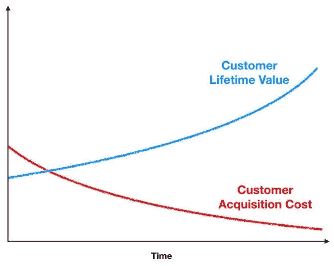

# 数据科学家的商业策略:品牌评估

> 原文：<https://towardsdatascience.com/business-strategy-for-data-scientists-brand-valuation-daf4ec862399?source=collection_archive---------30----------------------->

Photo by [Nik Shuliahin](https://unsplash.com/@tjump?utm_source=medium&utm_medium=referral) on [Unsplash](https://unsplash.com?utm_source=medium&utm_medium=referral)

## 学习如何评估品牌和其他无形资产

在商业世界里，有有形资产和无形资产。像车辆和工厂这样的有形资产很容易估价——我们可以看到和触摸到它们，它们(被企业)用来产生可测量的现金流，我们可以用这些现金流来估计它的合理价格。

像品牌这样的无形资产——本刊关注的焦点——更难估价。我们看不见也摸不着它们。而且它们不会直接产生我们可以用来评估它们的任何现金流或有形收益。但在很多情况下，品牌就是业务——业务只能产生一定水平的利润，因为它有品牌。

因此，考虑到品牌可以而且经常是企业价值的主要驱动力，能够估计其价值就变得相当重要。例如:

*   投资者需要知道一个品牌值多少钱，这样他们才能判断一只股票的价值是过高还是过低。
*   数据科学家和分析师应该知道使品牌更有价值和更强大的关键杠杆，以及这对他们公司的影响。

# 我们如何测量无法直接观察到的东西？

鉴于品牌是无形的，我们如何衡量它们的价值？让我们集思广益，找出几个可能的解决方案:

1.  我们可以估算一下**一家新公司从零开始创建一个同等质量的品牌**需要多少成本。
2.  我们可以**比较一个行业内品牌强势和品牌弱势公司的财务和股票表现**。
3.  我们可以对品牌如何改进的关键指标[**进行**第一原则分解，如客户终身价值(CLTV)和客户获取成本(CAC)。****](/business-strategy-for-data-scientists-25e3ca0af5ee)

**注意每一个都包含了很多不确定性。不幸的是，对于一般的商业价值评估，尤其是品牌价值评估，没有快速的方法来得出合理的答案。相反，我们需要深入调查业务，以便我们了解品牌价值的关键驱动因素，然后让我们对品牌价值的估计进行三角分析。**

# **为什么要有品牌？**

**在我们研究上面提到的 3 种方法之前，让我们先快速回顾一下公司试图用他们的品牌实现的商业目标。**

## **优质图像**

**在一个企业投资一个品牌的所有原因中，这可能是最广为人知和研究得最多的。**奢侈或优质品牌允许公司以更高的价格销售其产品**，因为产品的稀缺性以及它所赋予的“地位”(苹果、蒂芙尼&公司、路易威登)。**

**注意，溢价不一定意味着奢侈。这也可能意味着在质量和价格(好市多)或可靠性和安全性(沃尔沃)或一致性(In-N-Out Burger)之间进行良好的权衡。**

## **熟悉和情感联系**

**公司投资品牌的另一个原因是将自己与商品市场上的竞争对手区分开来(在商品市场上，每个公司的产品之间没有真正的差异)。这通常更难做到，因为每个公司都试图利用其品牌和营销来与潜在客户建立情感联系。而它建立这种联系的能力几乎与实际产品无关(壳牌的天然气和雪佛龙的天然气是一样的)，一切都与它的营销头脑(加上运气)有关。但如果它能像麦当劳或星巴克那样成功做到这一点，就能大大增加对其产品的需求。这是因为面对非常相似的选择，消费者会选择最熟悉或让他们感觉最温暖和最模糊的东西(假设他们已经被有效地推销给了消费者)。**

## **概述**

**因此，概括地说，公司试图通过品牌实现两件事情中的一件(或者两件都实现，如果他们执行得非常好的话)——**优质的形象带来更高的价格，或者熟悉度和情感联系带来更高的销量。****

****

**dePhoto by [贝莉儿 DANIST](https://unsplash.com/@danist07?utm_source=medium&utm_medium=referral) on [Unsplash](https://unsplash.com?utm_source=medium&utm_medium=referral)**

# ****从头开始建造的成本****

**这可能是最容易估计的，但也是最没有帮助的。我们可以看看苹果、百事、宝马、路易威登等公司有多喜欢。每年在营销上的花费。我们可能希望按比例增加年度美元金额，以反映我们从零开始的事实(而我刚才提到的那些公司正在花钱维护和加强已经建立的品牌)。但是有两个问题。**

****旁注:**如果你分析的公司是一家折扣店，其品牌显示低价，那么你应该考虑包括与维持低价相关的费用(折扣、促销、买一送一等。).类似地，如果一家公司的品牌是围绕技术创新建立的，那么你会希望至少包括一些年度研发支出。通常，维护一个品牌的成本并不仅仅停留在公司损益表的营销行上。**

## **皱纹 1**

**就像花大量的钱来推广和营销一部电影并不能保证成功一样，增加公司的营销预算并不意味着你一定会有一个强大的品牌。**

**即使有巨大的营销预算，仍然有机会和运气(和执行)的成分。尽管我们花了很多钱，但顾客可能不会认同我们的品牌或信息。如果花 200 亿美元能保证你拥有苹果的品牌，那么标准普尔 500 一半的公司都会这么做。**

**因此，如果我们决定用成本来估计品牌价值，就需要考虑这种不确定性。最明显的方法是估计成功的概率，并根据该概率调整值。例如，如果您决定从头开始打造品牌需要 50 亿美元，而您成功的几率为 50%，那么您对品牌价值的估计为 5B/0.5 = 100 亿美元。**

## **皱纹 2**

**第二个问题是，我们只关注事物的成本方面，这可能会有问题。例如，如果行业中的所有参与者都高估了拥有一个强大品牌的优势，他们最终都会超支。这将导致我们基于成本的估价被高估。品牌的价值取决于它所带来的优势。因此，任何忽视收益的估值尝试都很可能是离谱的。**

****

**Photo by [Glenn Carstens-Peters](https://unsplash.com/@glenncarstenspeters?utm_source=medium&utm_medium=referral) on [Unsplash](https://unsplash.com?utm_source=medium&utm_medium=referral)**

# **强势与弱势品牌比较**

**理想情况下，我们会发现(某个行业中)有强大品牌的公司和没有品牌的公司。然后，我们可以将它们的财务表现和市场资本(投资者愿意为其股票支付的总额)与较弱的同行进行比较。**

**例如，在奢侈品这样的行业，我们可以根据品牌实力对玩家进行排名，尽管带有一定的主观性。然后，我们可以比较收入增长、利润率、投资资本回报率等。强势和弱势品牌。**

**放眼整个行业也很有帮助。一些更有趣的分析可能来自于将能源这样的大宗商品产业(实际上要么没有品牌，要么很弱)与奢侈品这样的品牌驱动型产业进行比较。**

**如果我们想以这种方式评估一个品牌，我们可以考虑使用一个统计模型。线性回归是我想到的一个问题，其中我们的 Y 变量是我们每家公司的市值，我们的 X 变量是我们想要控制的所有因素，加上一个分类变量来判断公司是否拥有一个强大的品牌。应注意控制哪些因素。感兴趣的**参数是分类变量上的β系数，表示公司是否有一个强大的品牌。这个特定的回归测试版告诉我们，在其他条件相同的情况下，投资者对一个拥有强大品牌的公司比对没有品牌的公司更有价值。****

**但在这里我们必须小心。**只有在所有其他因素保持不变的情况下，β值才是准确的。但是，如果我们把一个强大品牌的存在所驱动的 X 个变量包括在内，那么我们就不能再以表面价值来衡量测试版了。****

**例如，假设我们发现贝塔系数是 50 亿美元。这意味着，在其他条件相同的情况下，投资者愿意为一家拥有强大品牌的公司多支付 50 亿美元。但是我们注意到我们的 X 变量之一是年销售额。假设一个强大的品牌可以推动更高的年销售额是非常合理的(毕竟这是拥有品牌的一个要点)。但这意味着我们再也不能说“所有其他事情都是平等的”。相反，归属于强势品牌的一些价值(强势品牌分类变量的β值)很可能已经泄露给年度销售变量的β值以及受品牌影响的任何其他变量。这将导致回归低估我们品牌的价值。解决这个问题的一个方法是通过在我们的回归中包含相互作用项来明确考虑相互作用的影响。**

**通过建立这样一个模型，我们可以学到很多东西。所以我们也可以在以后的文章中构建它。我一直想写一篇“理解线性回归”的文章。所以我们将把细节留到以后再说。**

# **基本原则评估**

**这是我的首选方法。这比只关注成本更不容易出错，也比我之前建议的线性回归更直观和直接。**

**尽管如此，它需要我们估计许多事情。但使用第一原则方法的好处是，它迫使我们理解品牌和业务是如何相互作用的。**

**在早先的一篇文章中，[我们介绍了两个关键指标:客户终身价值(CLTV)和客户获取成本(T3)。这一部分应该相当明显——一个强大的品牌应该:](/business-strategy-for-data-scientists-25e3ca0af5ee)**

*   ****通过提高客户支出或增强客户忠诚度来增加 CLTV。**一个强大的品牌应该带来更高的交易频率、更高的公司产品价格和更高的客户忠诚度(更长的平均客户寿命)。这些都会导致 CLTV 的增加。**
*   ****增加 CAC——强大的品牌更容易吸引新客户。当你公司的品牌强大时，这本身就是一个广告，它极大地提高了市场对你的产品和服务的认知度。****

**随着你的品牌越来越强大，我们希望看到 CLTV 和 CAC 像下图这样发展:**

****

**The impact of a strong brand**

**像往常一样，棘手的部分是弄清楚这两个指标的改善有多少可以归因于强大的品牌。金额因企业和行业而异。**

**理想情况下，我们希望比较同一家公司在一个拥有强大品牌的世界和一个没有强大品牌的世界(其他一切或多或少相同)中 CLTV 和 CAC 的表现。但是一个品牌要么是，要么不是(这么哲学对吧？)，所以实际上没办法做那个比较。因此，我们需要再次求助于调查方法:**

1.  **列出品牌影响力从低到零的公司。这份名单是我们的控制组——我们对没有品牌的企业的最佳估计。**
2.  **然后看看每个公司的 CLTV 和 CAC(如果你纯粹依靠公开的财务报表，那么你需要做一些估计，因为一些公司不直接公布这些数字)。**
3.  ****将我们公司的 CLTV 和 CAC 与我们对照组公司的平均 CLTV 和 CAC 进行比较。我们公司与对照组平均值之间的指标差异主要归因于我们的品牌。**我们可能希望缩小计算出的差异，因为其中一些可能归因于更好的执行或更严格的支出纪律。**
4.  **最后，一旦我们对每个客户的品牌收益有了一个估计，我们就可以用我们公司拥有的客户数量乘以**。****

# **直到下次**

**品牌估值没有 100%正确的答案。这绝对是一门不精确的科学。让我们面对现实吧，试图过于精确没有任何好处——估计我们的品牌价值 180 亿美元和 200 亿美元之间的差异并不显著(也不值得为此失眠)。更重要的是了解品牌赋予我们业务的优势。**

**希望这是有帮助的，干杯！**

*****更多数据科学与分析相关帖子由我:*****

**[*数据科学家的商业战略*](/business-strategy-for-data-scientists-25e3ca0af5ee)**

**[*用 Python 进行业务模拟*](/business-simulations-with-python-a70d6cba92c8)**

**[*了解 PCA*](/understanding-pca-fae3e243731d?source=post_page---------------------------)**

**[*理解贝叶斯定理*](/understanding-bayes-theorem-7e31b8434d4b)**

**[*理解朴素贝叶斯分类器*](/understanding-the-naive-bayes-classifier-16b6ee03ff7b)**

**[*二项分布*](/fun-with-the-binomial-distribution-96a5ecabf65b)**