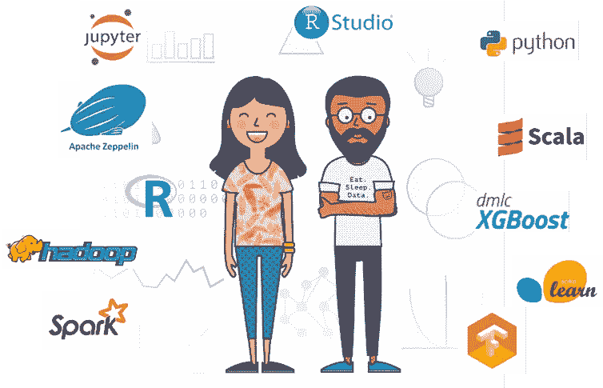
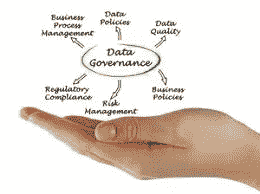

# 但是我喜欢开源——为什么我需要一个人工智能平台？

> 原文：<https://towardsdatascience.com/but-i-love-open-source-why-would-i-need-a-data-science-platform-3c1d118fa330?source=collection_archive---------29----------------------->

## 企业投资人工智能平台的 10 个原因

构建一个*机器学习* (ML)模型从未如此简单。几行 R 或 Python 代码就足够了，网上有大量的资源和教程甚至可以训练一个复杂的神经网络。最好的部分:这是你能想到的几乎每一个人工智能算法的情况，而人工智能研究的几乎每一个新进展通常都伴随着相应的开源实现。

然而，正如我之前在[这篇文章](/seven-steps-to-machine-learning-afb9f71f2a97)中讨论的，人工智能不仅仅是建立模型。这个旅程实际上是从*数据* *收集*、*策划、探索、特征工程、模型训练、评估、*最后是*部署。*

Hadoop 生态系统似乎是收集和聚合不同数据源的开源选择。Hive 和 HBase 符合访问、混合和匹配多个数据源的要求。现在，对于数据准备(即*监管*、*探索*和*特征工程*)，Apache Spark 可以通过 SparkSQL 对大型数据集进行切片和切块，甚至利用内存处理来加快响应时间。Spark 还为您提供了*自然语言处理* (NLP)功能和特征提取器，如*主成分分析* (PCA)。但可能开源软件最强的一套是它的大量不同的人工智能模型。scikit-learn、R、SparkML、TensorFlow、Keras 和 PyTorch 等等，提供了我和我的任何数据科学家伙伴们梦寐以求的一切。最后，像 Docker 和 Plumbr 这样的工具可以通过 HTTP 请求以 web 服务的形式简化机器学习模型的部署。

> 等等……这是否意味着人们可以仅仅使用开源堆栈来构建一个企业级的端到端人工智能系统？不完全是。

这可能是构建*概念验证* (POC)的情况。回到 2012 年，作为我论文的一部分，我纯粹在开源的保护伞下构建了一个人类活动识别系统(包括[这个](https://www.youtube.com/watch?v=4Jen6O1lfms)手机 app)——谢谢 Java、Weka、Android 和 PostgreSQL！然而，对于企业来说，情况却大不相同。

别误会我的意思。我不仅是一个超级粉丝，也是开源软件的狂热用户，我确实意识到有这么多神奇的工具；但同时也有不少差距。我来分享一些企业投资 AI 平台的原因。让我告诉你一些我作为一个人工智能和人工智能从业者最痛苦的时刻。

# **1。开源集成、启动和运行以及版本更新**

> 上次我试图在我的机器上安装 TensorFlow，它破坏了我的 Apache Spark 配置。几分钟后，当我认为我已经修复火花，我意识到张量流是烤面包。又来了！

长话短说:我花了整整一个下午的时间让这两只野兽跑起来。想象一下，当这么多其他工具需要共存于一个数据科学家的工作环境中时，会有多少事情出错:Jupyter、R、Python、XGboost、Hadoop、Spark、TensorFlow、Keras、PyTorch、Docker、Plumbr 等等。现在考虑一下，所有这些工具每隔一个月都会有新的发布，因此需要频繁的更新。有人说冲突吗？啊！*让一个平台来帮我处理这件事。*

# **2。协作**

现在我和我的三人数据科学家团队一起工作。我们正在使用我们最喜欢的 Jupyter+Python+Spark+tensor flow 环境，并决定创建一个 GitHub 存储库来共享我们的代码和数据资产。但是我在我的环境中使用定制的软件包——这花了我一段时间来安装和配置——我的同事无法访问它们。他们将不得不经历和我一样的痛苦，在他们自己的机器上安装软件包。好吧，但是，我们如何共享我们部署的模型？创建 Docker 图像或 PMML 文件听起来一点也不性感！分享我们的预测、实验和评估(混淆矩阵、ROC 曲线、RMS 等)怎么样？)?啊！让平台为我处理这件事。

# 3.数据虚拟化

企业中最常见的挑战之一是数据集分散在多个系统中。一个典型的解决方案是将数据复制到中央数据存储中——那里有您的数据*湖—* 用于运行您喜欢的分析。然而，这种方法显然成本高且容易出错。

> [数据虚拟化](https://www.ibm.com/analytics/data-virtualization)允许跨多个系统查询数据，无需任何复制，简化了数据收集流程。

开源软件没有提供数据虚拟化解决方案。因此，*让平台为我们处理这个问题。*

# **4。治理和安全**

这是企业关心的一个关键问题，也是开源留下巨大空白的一个领域。资产需要治理，我指的不仅仅是数据，还有代码、模型、预测、环境和实验！所有数据科学家都应该知道批准/拒绝向客户贷款的标准吗？或者哪些因素导致将交易标记为潜在欺诈？肯定不是！限制每个用户的资源利用率怎么样？让平台为我们处理这些。

# **5。模型管理、部署和再培训。**

> 如果一个质量完美的人工智能模型只放在我的笔记本电脑上，它有什么用？一个模型是没有用的，除非它作为服务运行，提供预测并被最终用户消费。

在[这篇文章](/github-autocompletion-with-machine-learning-a833cb90983e)中，我描述了如何为 Github 工作项目构建一个自动完成系统——换句话说，预测*团队*、*受托人*等。·给定一个工作项*标题*作为自由文本。建立模型(包括数据准备)花了我将近两周的时间。但是部署花了我的同事一个多月的时间，不得不创建模型的 *docker* 图像，以便稍后使用 *plumbr* 来连接东西。每当我创建一个新的模型时，我还想再经历一次吗？不了，谢谢你！那么如何跟踪不同的模型版本呢？还是关于各款车型性能的统计？如何检测模型退化？或者时常自动化整个再培训过程，以确保模型是最新的？*让平台给我做！*

# 6.偏差检测和校正

想象一下，一位数据科学家使用性别或年龄作为信用风险的预测指标。而且，生成的模型是给某个性别分配更高的风险。这不仅不道德，而且在大多数司法管辖区也是非法的。如何检测一个模特是否有性别偏见？如果是这样，如何在不必重建模型的情况下纠正这种偏差？点击了解更多关于偏置检测和校正[的信息。再来，*让平台给我做！*](https://medium.com/trusted-ai/bias-detection-in-ibm-watson-openscale-6f37f055a1aa)

# 7。辅助数据管理

> 我的一个同事经常和我开玩笑，公然告诉我，鉴于我花了很多时间清理数据，我实际上不是一名数据科学家，而是一名数据管理员。

遗憾的是，他指出，在数据科学项目中，高达 80%的时间和精力经常用于数据管理和准备。让我们面对现实吧，来自开源的数据监管工具，包括 Spark，都涉及到繁重的编码工作，这可能非常乏味。但是，如果有一个[可视化工具](https://www.ibm.com/cloud/data-refinery)可以清理和提炼多个数据源而无需编写一行代码，那会怎么样呢？是的，*让平台给我做吧！*

# **8。GPU**

在过去的十年中，计算能力有了巨大的提高，图形处理单元有了显著的进步。这对*深度学习*算法尤其有利。现在，配置 TensorFlow/Keras 等框架以获得最佳性能本身就是一个项目，需要的技术知识并不具备典型数据科学家的背景，包括我自己。再一次，*让平台为我处理那件事！*

# **9。可视化建模**

许多统计学家、数据分析师甚至经理可能对构建机器学习模型感兴趣，尽管他们不精通 Python 和 r 等语言的编码。几十年来， [SPSS](https://www.ibm.com/analytics/spss-statistics-software) 等工具一直在为 ML 和 AI 提供可视化接口，现在可以在云上利用这些接口。换句话说:

> 拖放您的数据集，然后是您喜欢的数据准备和建模算法，最后部署您的模型，而无需编写任何代码。

当谈到可视化建模时，开源中也有一个空白，因此，*让平台为我提供它*。

# **10。自动化人工智能**

我们作为数据科学家的角色有一个很大的机械组成部分，即反复尝试不同的算法、超参数、特征组合等。但是，如果我们让它自动化，包括实验，也就是说，*交叉验证*、*混淆矩阵*、 *ROC 曲线*、*精确回忆曲线*等等，会怎么样呢？哦是的，请让平台为我做那件事！

> 在寻求一个利用开源但填补上述所有空白的人工智能平台吗？免费试用 [*沃森工作室*](https://www.ibm.com/cloud/watson-studio) ！
> 
> 对全面的数据和人工智能解决方案感兴趣？看一下 [*IBM Cloud Pak 获取数据*](https://www.ibm.com/products/cloud-pak-for-data) 。

## **关于作者**

> scar D. Lara Yejas 是高级数据科学家，也是 IBM 机器学习中心的创始成员之一。他与世界上一些最大的企业密切合作，将人工智能和人工智能应用到他们的特定用例中，包括医疗保健、金融、制造、政府和零售。他还为 IBM 大数据产品组合做出了贡献，特别是在大规模机器学习领域，是 Apache Spark 和 Apache SystemML 的贡献者。
> 
> scar 拥有南佛罗里达大学的计算机科学和工程博士学位。他是《人类活动识别:使用可穿戴传感器和智能手机》一书的作者，也是大量关于大数据、机器学习、以人为中心的传感和组合优化的研究/技术论文的作者。