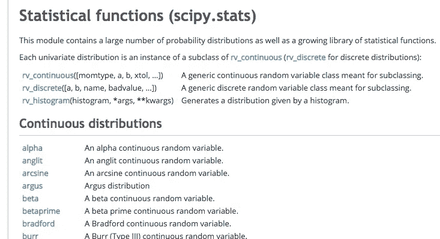
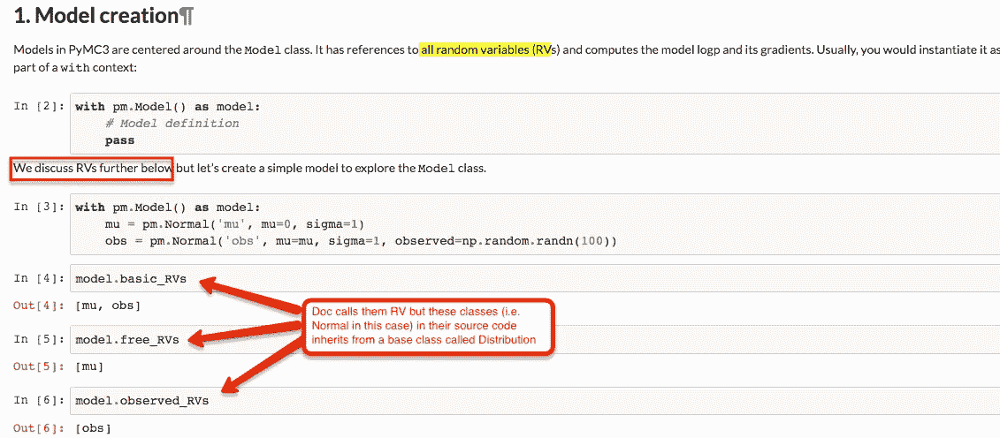
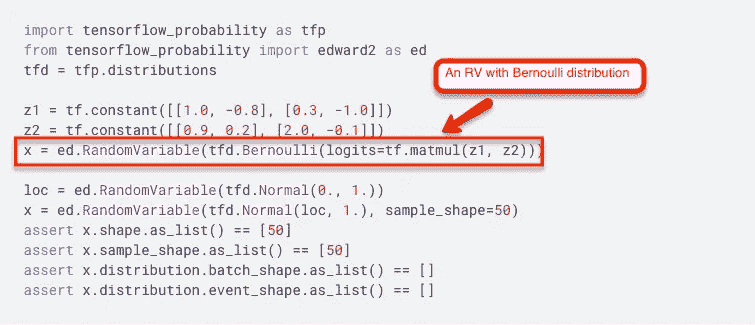

# 但是什么是随机变量呢？

> 原文：<https://towardsdatascience.com/but-what-is-a-random-variable-4265d84cb7e5?source=collection_archive---------12----------------------->

Coin toss from https://www.pexels.com

# **简介**

通常简单的概念会因为术语和应用它们的上下文而变得难以理解。对我来说，随机变量就是这样一个令人困惑的方面(尽管事后看来很简单)。

对于软件工程师来说，变量有两种类型——局部变量和全局变量。当你写软件时，变量通常有一个范围和界限，但如果你给它们加上形容词*，这意味着它们可以有任何*值(尽管你仍然可以使用种子的概念来控制随机性)。**

**对于一个密码学家来说，随机性是他/她的算法最重要的特性之一。他/她努力生成完全不应该重复的随机数。**

**从初等代数的角度来看，变量的概念是直截了当的，也就是说，它代表等式的输入，写在右边，也代表等式的输出，写在左边。随机方面通常不会出现或讨论到那个层次。**

**现在，如果你在维基百科或谷歌上阅读它的定义——什么是统计学中的随机变量？，您会看到这样的语句:**

> **随机变量是将结果映射到真实值的函数。**

****实际上是函数的变量？****

**对于统计学家来说，这可能没问题，但对于来自其他学科(如软件工程)的人来说，这种说法开始严重破坏语义，因为它扰乱了他们对每天处理的 3 个非常基本的事情的理解——变量、函数和随机性！**

**显然，统计的随机变量是不同的生物，理解它们是使用它们和/或建立在它们之上的许多其他概念(高斯过程、贝叶斯统计等)的基础。**

# ****结果、样本空间和事件空间****

**随机变量在概率论中有其适用性，所以让我们先修改一下该领域的一些术语。**

**当你在观察一个现象或进行一个实验时，你会得到结果。通常给出的典型例子是-**

*   **扔硬币有两种可能的结果——正面或反面**
*   **掷骰子可能有 6 种结果——1、2、3、4、5 或 6**

**一个可能结果的列表(正式称为 ***集合*** 即列表中的项目不重复)称为一个 ***样本空间。*****

**这意味着抛硬币的样本空间是{头，尾}，掷骰子的样本空间是{1，2，3，4，5，6}。**

**这里的第二个重要术语叫做**事件。什么是事件取决于你如何在你的样本空间中定义一个实验。****

**考虑一个对应于投掷硬币两次的样本空间。可能的结果是{HH，HT，TH，TT}。现在，如果我对导致头先出现的结果感兴趣，那么我会将我的事件集描述为{HH，HT}。从这个**事件**的例子中，你应该开始看到一个事件实际上是样本空间的一个子集。**

**有一个符号用来代表**样本空间**(即所有可能的结果)，它是**ω****

**类似地，对于**事件空间**(即所有可能的事件)也有一个符号，它是 **∑****

**另一个例子是为了更清楚。假设你正在掷骰子(**ω= { 1，2，3，4，5，6}** )，如果你的实验是观察**甚至**的结果，那么事件空间将是— **∑ = {2，4，6}****

# ****随机性和可变性****

**现在我们终于可以看到随机变量在所有这些中的位置，更重要的是，对应于随机性和可变性的部分。**

****随机性****

**你看，与你的实验相对应的事件有内在的**不确定性(随机性)**与之相关，也就是说，你在上面实验中的两次抛硬币可能是 HH 或 HT 或 TT 或 th。然后你用概率论来量化这些事件的不确定性。**

**我意识到归根结底这只是语义学，但我真的很喜欢不确定性这个词，因为它帮助我不把我对随机性的理解从其他学科带进来。这也意味着统计学中的随机变量 ***本来可以被*** 称为不确定变量。但是他们不这么叫:(…..文献一直称它们为随机变量，所以如果有帮助的话，你可以(就像我经常做的那样)在你的脑海里翻译成不确定变量。**

**我将在文章的后半部分详细解释量化随机变量的不确定性。**

****可变性****

**在抛硬币实验中，我们在样本空间中使用了单词 HEAD & TAIL。相反，我们可以用**数字**来表示它们，比如我会用 1 表示头部，用 0 表示尾部。换句话说，我可以说我将头部映射到 1，尾部映射到 0。映射意味着执行这种转换的函数。回想一下你在维基百科或谷歌搜索中找到的早期定义— ***“随机变量是将结果映射到真实值的函数”。*****

**你可能想知道为什么我选择把 1 赋给头部，0 赋给尾部…会不会是另一种方式，即 0 代表头部，1 代表尾部？。在许多方面，你可以自由分配(或者我应该说映射到)数值，但是正如你在更复杂的例子中看到的，这些映射有一定的意义和一致性，这主要取决于你对实验的定义。例如，即使对于一个简单的掷硬币的例子，我也可以通过将我的实验设定为“我对观察头的感兴趣”来证明 1 的分配是合理的。我会使用 1(=真)，因为它表示这个实验定义的布尔逻辑。**

**为了不局限于布尔实验，我们来看另一个例子。这里我有两个抛硬币的例子，即**ω= { HH，HT，TH，TT}** ，我对实验的定义是观察到的人头数。因此，我将定义我的(随机)变量来为{TT}生成(记住它是一个映射器/函数)0，为{TH} & {HT}生成 1，为{HH}生成 2。**

**随机变量通常用大写字母表示。例如，对于上面的实验，我将把它写成 **H = {0，1，2}** 。**

> **也就是说，样本空间(ω= { H，T})的结果到(实数)的映射看起来非常确定，即在映射(函数)方面没有随机性。这意味着不是“随机变量”的变量部分是随机的，而是它代表我们正在与具有与结果相关的不确定性(随机性)的样本空间一起工作。**

**如果你想知道——这只是简单地给样本空间中的结果分配一个数字，还是有更多的故事，那么你就在正确的道路上。事实上还有更多！**

**你看，给定样本空间的结果可以用来定义许多不同的实验。例如，这一次你将掷出两个骰子，这样如果它们不可区分(即你不关心哪个骰子产生哪个数字)，那么可能的样本空间是**ω= {(1，1)，(1，2)，(1，3)，(1，4)，(1，5)，(1，6)，(2，2，(2，3)，(2，4)，(3，3)，(3，4)，(3，4)，(3，5)，(3，5)，(4，4)，(4，5)，(4，4)这里有 21 种可能的结果。从这里开始，我可以提出几个不同的实验，这些实验将导致它们各自的事件空间。一个实验可以是——两个骰子的和大于 8，另一个实验可以是——观察两个骰子的乘积何时为偶数，还有一个实验可以是——观察乘积减去 3 后的结果何时为偶数以及更多。****

**这种使用样本空间的实验创建是随机变量开始使用其“函数”能力并将结果映射到实数的地方，这取决于你如何提出你的实验定义。**

**但为什么称之为**变量呢？**关于这一点，我想了很久，我能想到的最好的(应该说是唯一的)解释是，你的任务往往不是关于一个单一的样本空间。你的任务的最终结果可能取决于许多现象，它们有各自的样本空间。你将在这些样本空间上应用代数，因此你将结束加，减，乘的结果。因为你通常加/减/乘变量，而不是函数，所以他们最终称之为变量。**

# **随机变量、事件空间和概率**

**随机变量的定义似乎暗示了与样本空间的强联系；毕竟，是一个 ***函数*** 将结果映射到实数，但现实是随机变量的应用与事件更相关。**

**你会意识到一个更有趣的方面是知道所有可能结果中的哪些事件已经发生，因此当你用随机变量做代数时，你实际上是在处理这些事件。**

**为了更加清晰，我们来看一个例子。在我们观察两次抛硬币的正面数量的例子中，我们定义了 H = {0，1，2}。这个集合中的每个元素对应一个事件。由于事件具有不确定性(随机性),我们利用概率论。我们通常说观察的概率**

*   **0 头是 p1**
*   **1 头是 p2**
*   **两个头是 p3**

**而且我们知道 p1 + p2 + p3 = 1。对此的另一种解释是，p1、p2 和 p3 正在量化与其各自事件相关的不确定性。**

**现在，当我们使用随机变量时，我们可以简单地写成**

**P(H=0) = p1，P(H=1) = p2，P(H=2) = p3**

**应该清楚的是，这里显示的事件和随机变量的输出范围(所有可能的值)之间有直接的对应关系。**

**这也意味着你所知道的概率计算的用法，即独立事件、联合事件、条件事件、求和规则、乘积规则等，也同样适用于随机变量。换句话说，你可以对独立或相关的随机变量和/或条件进行概率计算。**

# ****随机变量的类型****

**到目前为止，我们讨论的所有例子都只是一种称为**离散随机变量的随机变量。**这些变量(顾名思义)代表可以计算的结果。你可以数人头的数量，产品是 8 的次数，等等。**

**还有另一种类型的不确定现象是不可计数的，例如，如果我们正在处理一天中温度的实验和观察，那么你正在处理一个可以取无限多不同值的测量，因此实际上是不可计数的。然后使用**连续随机变量来表示这些类型的随机/不确定现象。****

# **随机变量和概率分布**

**我们已经接触到了概率的关系，但是这需要一个单独的小章节，因为你很少谈论没有概率分布的随机变量。**

****什么是概率分布？****

> **如果你取与随机变量 ***X*** 的输出范围相关的概率，那么你将得到 ***X.*** 的概率分布**

**方便的是，许多概率分布函数已经被定义来反映典型的数据生成过程。例如，我们的随机变量在任务是观察头部时取值 1，在任务是观察尾部时取值 0，使用[伯努利分布](https://en.wikipedia.org/wiki/Bernoulli_distribution)来描述。**

**这篇文章不是关于各种分布的解释，甚至也不是对概率分布本身的深入探讨，但是如果你感兴趣，我强烈建议你阅读 https://medium.com/@aerinykim 写的文章。她在解释许多重要发行版背后的目的、起源和数学方面做了非凡的工作。**

**我想说的是，在实践中，概率分布往往比随机变量更有趣，更重要，因为它是描述随机现象各种特性的分布。换句话说，一旦你为你的实验确定了合适的概率分布(*和所需的参数*)，那么原始的样本空间可以被处理掉，你可以简单地使用概率分布对未观察到的数据进行预测。**

# **随机变量和各种工具包/库**

**本节的目的是说明我在上一节中提到的内容，也就是说，在实践中，您最终只会处理发行版。在这里，我提供了一些来自不同库的例子，这些库实现了随机变量(读取概率分布)以及它们如何互换使用这两个术语。**

****科学统计****

**scipy 有一个名为 [stats](https://docs.scipy.org/doc/scipy/reference/stats.html#module-scipy.stats) 的子模块，它实现了各种发行版。它们定义了基类`rv_continuous` & `rv_discrete`，从中继承了一系列令人印象深刻的分布函数。**

****

**注意上图中随机变量和分布的概念是如何混淆的。文档上写着`An alpha continuous random variable`，但它被列在标题`Continuous distributions`下，即使文档上说该模块包含大量的概率分布。**

****pyMC3****

**谈到概率编程，pyMC3 可能是(没有双关语)使用最多的工具包。**

****

**你可以试试他们的笔记本[这里](https://docs.pymc.io/notebooks/api_quickstart.html)但是正如我在上面的 pyMC3 截图中显示的，随机变量和分布是一回事。**

****张量流 _ 概率&爱德华 2****

**Tensorflow probability 是 Tensorflow 生态系统的一部分，它定义了各种分布和神经网络层，利用了 tensorflow 核心原语和加速功能。edward2 定义为使用 tensorflow_probability 构建的 ***概率编程语言*** 。唷！！….谈论称软件框架或库为编程语言会增加更多的混乱，但这似乎是概率建模领域的一种趋势。**

**至少 edward2 似乎有一个名为 [RandomVariable](https://www.tensorflow.org/probability/api_docs/python/tfp/edward2/RandomVariable) 的 python 类，封装了随机变量的属性，即其分布、样本形状和可选值。我喜欢这个，因为它似乎更好地代表了软件设计中的理论。**

****

# **结束语**

*   **把随机变量想象成不确定变量**
*   **随机变量是将结果映射到实数的函数**
*   **随机变量本身是确定性的，随机性(或者说不确定性)存在于样本空间中**
*   **你可以对随机变量进行概率计算**
*   **在实践中，随机变量和概率分布经常互换使用，即使它们是不同的东西(尽管一个没有另一个是没有用的)。**

# ****参考文献****

**[1][https://en.wikipedia.org/wiki/Random_variable](https://en.wikipedia.org/wiki/Random_variable)**

**[2]样本空间和事件的一个很好的例子列表—[https://faculty.math.illinois.edu/~kkirkpat/SampleSpace.pdf](https://faculty.math.illinois.edu/~kkirkpat/SampleSpace.pdf)**

**[3]math.stackexchange.com 的一个回答帮助我了解了术语“变量”的用法—【https://math.stackexchange.com/q/864839 **

**[4]艾林·金(【https://medium.com/@aerinykim】)写了许多解释重要分布的文章。**