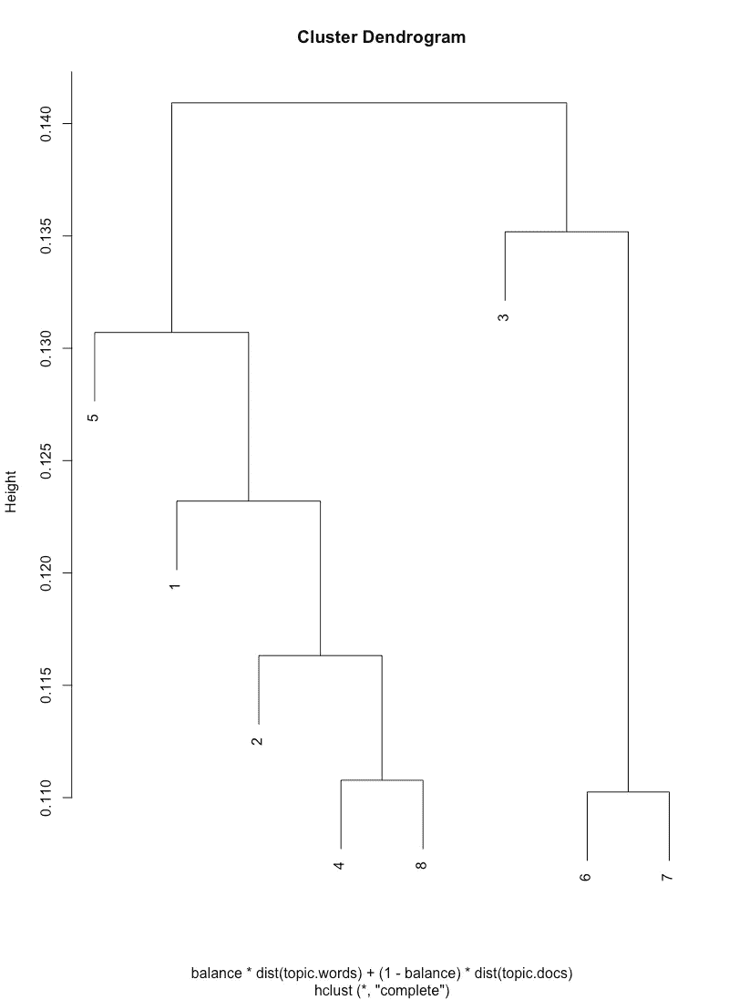
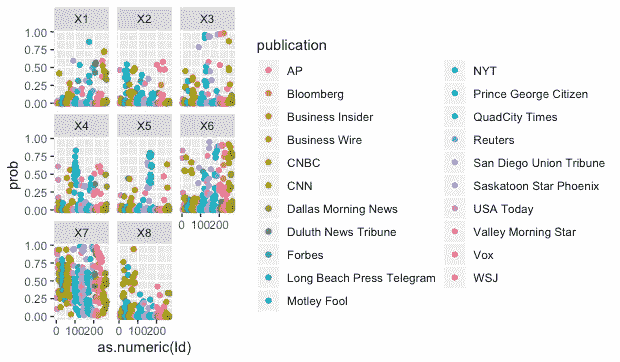
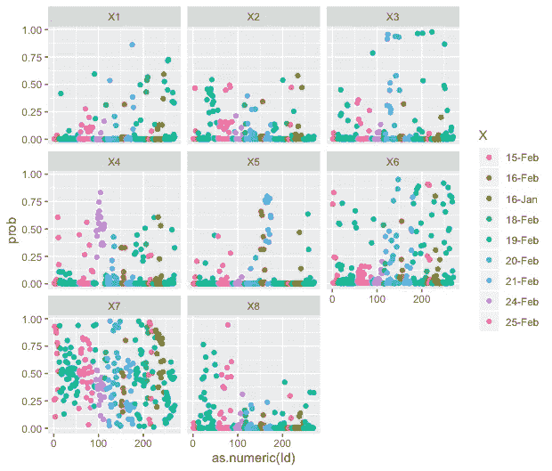

# 但债务从何而来？

> 原文：<https://towardsdatascience.com/but-where-did-the-debt-come-from-e63864333d7d?source=collection_archive---------26----------------------->

## 似乎没有人明白导致零售业末日的债务从何而来。这里有一个机器学习驱动的框架分析，可以帮助回答。

Payless ShoeSource 再次破产。这一次，它意味着我们所知道的公司的结束。商店将被清算。但该公司将继续存在:Payless Holdings 与其说是一家经营鞋店的公司，不如说是一家持有许可证的公司，其投资组合包括 Sperry、Stride Rite 和 AirWalk。如果你喜欢船鞋、滑板鞋，或者是个孩子，你的品牌将会继续。

但 Payless 为什么会拥有这么多品牌呢？因 Velcro 而闻名的折扣鞋类连锁店 Payless 自 2012 年被百隆资本、金门资本和金刚狼全球收购后就不再是原来的样子了。这些私人股本公司通过举债收购零售商，然后试图用它们来偿还收购费用。如果金门资本这个名字耳熟能详，那么它就是玩具反斗城和克莱尔破产等灾难背后的私人股本公司。如果你喜欢桌子，本·昂格尔斯比有[一家很好的被私募股权收购的零售公司。](https://www.retaildive.com/news/the-road-to-bankruptcy/540617/)

**世代机遇**

你可能会问，什么是杠杆收购？这是指一家公司带着债务收购另一家公司，并将收购的债务转移到被收购公司。假设一家对冲基金认为必胜客有一些他们可以解决的小问题，他们可以申请贷款，购买必胜客，然后将贷款转给必胜客。

如果一家公司的现金多于其发行在外的股票，掠夺者可以贷款收购一家公司，并立即偿还贷款。这是老牌企业攻略的核心活动。现在这种不可思议的情况非常罕见，所以通常公司并不打算迅速偿还贷款，相反，他们会在被收购的公司中进行这样的转变，以至于它可以简单地偿还自己的收购价格。这就引出了一个非常重要的问题:你有多少次真的发现了这家你可以免费买到的神奇公司？有多少公司能在杠杆收购过程中存活下来？

很少见，少之又少。

但这并不能阻止人们去尝试:毕竟，这些另类投资是真正致富的最佳途径之一。所以我们产生幻觉，认为一家成功的鞋店连锁店可以用信用卡购买。很明显，这是一个非常糟糕的主意。

人们是如何谈论它的？

表面上的金融新闻故事直截了当:Payless ShoeSource 破产了。在更深的层面上，我们经常使用一个叫做[框架分析](https://www.theguardian.com/science/head-quarters/2017/jul/20/the-power-of-framing-its-not-what-you-say-its-how-you-say-it)的想法来寻找更广泛的描述系统。框架是使故事有意义的隐喻、主题和风格的集合。你可能熟悉的一个特殊框架是政治中的“赛马”。这个故事依靠最近的民意调查来告诉我们两个候选人之间的竞争情况。一次民意调查的结果真的能告诉我们那么多吗？不。这就是为什么像王少伟或内特·西尔弗的聚合方法也很受欢迎，他们提供了对赛马的更深入的分析。个人投票的故事，以及它为什么继续的原因，是它可能是竞选中一个转变的指标。聚合模型可能会更明确地告诉你谁赢了，而快速投票故事可能会告诉你一匹马现在领先一个鼻子。

为了让赛马框架有意义，你必须接受民意调查背后的某种逻辑，即两个候选人相对平等，以及被讨论为与投票密切相关的新闻事件实际上是相关的。这里有很多结缔组织。框架也存在于其他领域，几乎每一项新的营养研究都可以被定位为值得报道的变化。

**分析过程**

在这个分析中，我假设 MALLET 提出的主题标签可以用来推断主题框架的特征。这种方法的结果包括文档主题概率的列表，以及这些主题之间的关系。因为我没有包括重复的，所以总的语料库是 270 段文本。我倾向于用经典的树状图来思考这些关系。

机器学习中的这种方法试图给每一段指定一个主题。这里有一个重要的警告，也是我们为什么要求助于人的判断，那就是系统无法解读更深层次的含义。同时，这种机器和人类阅读的结合有助于防止人类读者对主题和集群产生幻觉。

Balance of topic words to doc topics @ .7

您可以看到有两类主题，3–6/7 和 5–1–2–4/8。

原始主题输出可能难以阅读，并且依赖于一些解释工作。我的一般程序是检查自动生成的主题中的关键术语或专有名称。然后，在我对这个类别有了一些概念之后，我会检查概率最高的文件，寻找这些文本中的论点。

在这一点上，我建立了一个键，描述了哪些类型的令牌被检测为关联。作业将包括我的语义判断，基于我对 MALLET 提取的关键词的阅读以及对每个主题中最有可能出现的文本(段落)的仔细阅读:

1.  加拿大的维度
2.  在线竞争和债务
3.  负债累累的零售业
4.  与其他公司和房地产相关的零售问题
5.  关于股票市场状况的一般性讨论
6.  加拿大境外的清算和全球业务
7.  崩溃的细节，付不起房租
8.  零售商受到限制，缺乏强有力的员工，流动性问题

在我们继续之前，了解一下有多少数据集被分配给了一个特定的主题是很重要的。主题 7，崩溃的细节是目前分配最重的主题。这是新闻业建设中的一个重要环节，这是有意义的——这是行动所在。主题 6 和 4 也高于其他主题，这更有意义。需要理解的重要一点是，关于债务的讨论并没有很好地集中到故事的主要部分——我们知道大多数细节都是围绕第七类展开的。

这种关系也能告诉我们一些我们正在看的故事。一组是该行业背负债务的故事，附有清算的关键细节，以及那种淫秽的线索。另一个集群包括一个更完整、更复杂的商业故事中可能会出现的所有部分，最深入的棒球内部有几个层次，包括加拿大股市的总体状况，但高于特殊问题，如零售招聘和房地产。

仅有的两段讨论了金门公司和合伙人在玮伦鞋业灭亡中的作用，这两段被分配给了主题 7 和主题 2。主题 2 特别有趣，因为它是故事真正理论化的地方。鉴于主题 7 无处不在，我将沿着主题 2 更丰富的次要任务继续分析。考虑主题 2 中的这两段:

**Valley Morning Star:** 这家公司成立于 1956 年，以在自助环境下提供打折鞋为前提，2012 年被金门资本(Golden Gate Capital)和百隆资本(Blum Capital Partners)私有化，并因此举引发的严重债务问题而陷入困境。

**彭博:** Payless 成立于 1956 年，目标是在自助环境中销售价格合理的鞋子，并称其是西半球最大的专业鞋类连锁店。该公司努力管理 2012 年金门资本(Golden Gate Capital)和百隆资本(Blum Capital Partners)杠杆收购的债务，并于 2017 年 4 月申请破产保护。

这是整部文集里金门资本出现的两段。这是唯一一次记者将债务的原因归结于一个演员，而不是将其作为崩溃故事本身的一个父概念。我觉得这很荒唐:我们知道债务是导致公司破产的原因，但是我们可以插入任意数量的解释(主题 2 的孩子)来解释债务从何而来。

很明显，话题 2 的峰值附近的故事很少。这可以在对主题密度的分析中进一步看出:

低密度并不意味着某些东西不重要，而是意味着故事可能均匀分布，或者大部分段落不太可能出现在该段落中。例如，主题一是一个专业故事，分配给它的那些段落实际上是关于加拿大的。同样清楚的是，某些出版物和主题与某一天或某个作者有更密切的联系。像 2 或 5 这样的限制话题可以指向特别专业的故事。在主题 5 的情况下，真正关注股票市场的故事通常是一个特定和独特的子集。主题建模器可以有效地指向框架。当与其他语义方法相结合时，就有可能提取帧并将这些帧作为族进行关联，以便进一步分析。

在很大程度上，这项研究揭示了零售报告的一种按数字着色的方法。如果一家公司破产，请注意它是因为债务而倒闭的，这可能会导致戏剧性的一幕，其中将包括清算。从这个简短的研究中可以得出一个结论，主题模型可以为新新闻故事的自动生成提供一个简单的框架。

你为什么在乎？

这些商店失败的直接原因是，它们没有销售额来补偿它们的财务设计强加给它们的破坏。在零售业的背景下，这似乎是对整体经济的合理调整——美国的零售业空间太大了。同时，这也不需要发生。玩具反斗城和 Payless 的世界会更好，这些都是可行的业务。

在这个论述中，债务有一种本体论性质，它只是零售企业的一种财产。它不知从哪里冒出来，必须予以反击。这不同于教育、消费或抵押贷款债务的表现，后者似乎是个人做出不负责任的决定的结果，尽管有充分的证据表明，促进房屋交易的制度选择导致了大衰退，或者掠夺性的盈利机构而不是你所在的州是许多教育债务的来源。我们在谈论债务存在的原因方面做得很差，在让人们感到羞耻方面做得很好。

公司看起来像是法人，但不知何故，他们比普通人承担的责任要少。公司之间也存在差异:私人股本公司在某种程度上比普通公司享有更大的回旋余地。只有两名勇敢的记者在报道中提到了金门的名字。

Payless 倒闭是因为它在一次杠杆收购中被私有化。他们失败不是因为他们的库存系统、缺乏熟练的鞋类销售人员、DSW、著名的鞋履或互联网。这些文章中的分析包括一个强有力的非推论，即“债务”以某种方式简单地出现，然后允许其他因素在企业中发生。在这种框架下，承担债务的行为者不仅无可指责，而且是隐形的。谁被允许进入购买所需的现金池？你如何申请做这样的事情？尽管是大规模杀伤性金融武器，为什么这种做法还在继续？我能像这样得到一堆钱吗？

开始改变报告的一个重要地方:为什么我们不能讨论谁积累了债务，作为我们报告零售破产的一个关键因素？我们不需要的是又一个招牌竖起、周六开始清算销售、债务突然出现的故事。