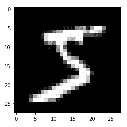
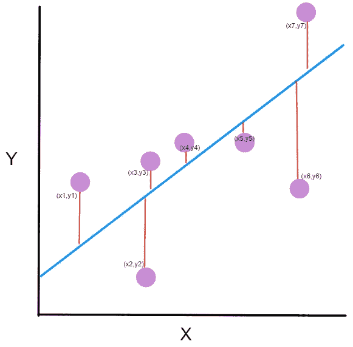
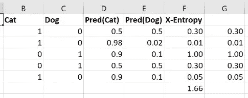

# 但是泡菜去哪里了呢？

> 原文：<https://towardsdatascience.com/but-where-does-the-pickle-go-53619676bf5f?source=collection_archive---------39----------------------->

fast.ai《程序员实用深度学习》第五课

我正在学习 fast.ai 的[“程序员实用深度学习”](https://course.fast.ai/)课程，并把我的经历写在博客上。由于非常慷慨的 fast.ai 社区已经为每一课做了详细的笔记(参见第 5 课[的笔记，这里是](https://github.com/hiromis/notes/blob/master/Lesson5.md#mnist-sgd-12359))，我只是写下讲座的部分内容，并附带 Jupyter 笔记本，我需要停下来思考几次。

从笔记本开始，我们导入 matplotlib 和 fast.ai 库:

```
%matplotlib inline
from fastai.basics import *
```

然后我们需要得到“腌制”的 MNIST 数据集，所以我[下载它](http://deeplearning.net/data/mnist/mnist.pkl.gz)并试图找出我需要把它放在哪里。下面是笔记本中的下一行代码:

`path = Config().data_path()/’mnist’`

但是当我运行它时，我得到以下错误:

```
FileNotFoundError: [Errno 2] No such file or directory: '/home/jupyter/.fastai/data/mnist'
```

我检查笔记中的代码，它与笔记本不同:

```
path = Path('data/mnist')
```

看起来我们把数据放在了‘数据’子目录下的一个新文件夹里？好的，所以我在“数据”目录下创建了一个文件夹，命名为“mnist”，然后把 mnist.pkl.gz 上传到里面。那有效！

然后我们把图像展平，看到这个，比如，是数字 5:



下一个让我有点吃惊的是，杰里米谈到这些图像时说:“目前它们是 numpy 数组。我需要他们是张量。所以我可以把 torch.tensor 映射到它们上面，现在它们就是张量了。”我意识到我不知道 numpy 数组和张量之间的区别，所以我查了一下。事实证明，张量有许多不同的定义，其中一些直接相互矛盾。


最后，我决定伊恩·古德费勒的*深度学习*中的定义对我来说最有意义，无论如何，来自那本书意味着它对这些目的来说是正确的。Goodfellow 说:“在某些情况下，我们需要一个超过两个轴的阵列。在一般情况下，排列在具有可变轴数的规则网格上的数字阵列称为张量。”所以这符合那些说张量是多维数组的人，其中标量是 0 维张量，向量是 1 维张量，矩阵是 2 维张量。对我有用！我也通读了这个关于 numpy 如何处理张量运算的教程。

然后我做得很好，直到我们准备“线性化”我们的模型，而不是像我们在以前的课程中那样手动完成，Jeremy 说:“所以我们唯一想添加的是我们想在我们的类中创建一个包含线性层的属性，一个 nn。线性模块。什么是 nn？线性模块？它是做 x@a 的东西，但实际上它不仅仅做这个。它实际上是 x@a + b，换句话说，我们不需要把一列相加。这就是它的全部功能。如果你想玩玩，为什么不试着创建你自己的 nn。线性类？你可以创建一个叫做 MyLinear 的东西，这将花费你(取决于你的 PyTorch 背景)一两个小时。我们不希望这一切变得不可思议，现在你已经知道了创造这一切的所有必要条件。”

所以我盯着它看了几分钟，完全不知道该怎么做。我观察了它在下一个单元格中的调用方式:

```
class Mnist_Logistic(nn.Module):
    def __init__(self):
        super().__init__()
        self.lin = nn.Linear(784, 10, bias=True)

    def forward(self, xb): return self.lin(xb)
```

好的，我们给它传递图像的数量(784)，10 (10 什么？)，我们设置 bias=True，因为我们想给`x@a`加上一个偏差，因此`x@a + b.`我向下滚动笔记，记得 Jeremy 说:“我们的输入是 784 维的，我们需要能给出 10 个数的概率的东西。在这之后，我们有十个激活，然后我们想添加偏见，所以我们去了。”这就是 10 的由来。

但我不知道如何从那里开始，所以我转向 fast.ai 论坛，发现只有[一个关于这个问题的帖子](https://forums.fast.ai/t/lesson-5-implementing-diy-nn-linear/53941)，没有任何回复，所以我想知道是否有很多人真的尝试这样做。本着真正的 fast.ai 精神，我决定把这个问题放在一边，继续下去，而不是陷入细枝末节。

我要停下来思考的下一点是损失函数的选择。在之前的课程中，我们使用了均方误差函数，即 MSE。当你做一个预测时，这个方法很有效，然后可以测量你的观察结果与你的预测“有多远”，如下所示。



[freecodecamp.org](https://www.freecodecamp.org/news/machine-learning-mean-squared-error-regression-line-c7dde9a26b93/)

但是正如 Jeremy 所说，损失函数对于像这样的分类问题没有意义，因为我们没有考虑图像中表示的数字的数值:我们考虑的是*图像本身*。因此，在图像识别环境中，认为 3 比 0 更接近 4 是不合理的，因为如果我们认为我们看到的数字是 3，但它实际上是 4，那就和认为它是 0 一样错误。

所以他说我们将使用交叉熵损失来代替，它不仅考虑预测是正确还是不正确，还考虑做出预测的置信度。在下面的例子中，我们预测一张图片是一只猫还是一只狗。



Screenshot from Lesson 5

该图显示了电子表格中的计算，但这是 Python 版本的计算:

```
**def** CrossEntropy(Pred)Cat), Cat):
    **if** Cat == 1:
      **return** -log(Pred(Cat))
    **else**:
      **return** -log(1 - Pred(Cat))
```

用杰里米的话来说:“如果是一只猫，那么就取猫性的对数，如果是一只狗(即，否则)，就取一减去猫性的对数(换句话说，就是狗性的对数)。”我们在否定结果，我认为这一定是因为结果本身是负的，但在文字中，我们指的是“损失”的价值，如果“损失”是负的，就像失去了一个负值；即加，不亏。所以损失为非负值是有意义的。

因此，我们计算每次迭代的交叉熵损失，然后将所有这些值相加，以找到模型作为一个整体的交叉熵损失。

第五课到此结束！第六课再见。

在 GitHub 上查看 MNIST [笔记本中的代码。](https://github.com/LauraLangdon/Lesson-5-MNIST)

关于此主题的其他帖子:

第一课:[fast . ai 入门](/getting-started-with-fast-ai-350914ee65d2)

第二课:[对验孕结果进行分类](/classifying-pregnancy-test-results-99adda4bca4c)

第二课(续):[深度学习能比鸽子表现更好吗？](/can-deep-learning-perform-better-than-pigeons-d37ef1581a2f)

第三课:[一万种行不通的方法](/10-000-ways-that-wont-work-311925525cf0)

第四课:[预测服务员的小费](/predicting-a-waiters-tips-1990342a0d02)

我是加州大学东湾分校的数学讲师，也是一名有抱负的数据科学家。在 [LinkedIn](https://linkedin.com/in/laura-langdon/) 上和我联系，或者在 [Twitter](https://twitter.com/laura_e_langdon) 上和我打招呼。