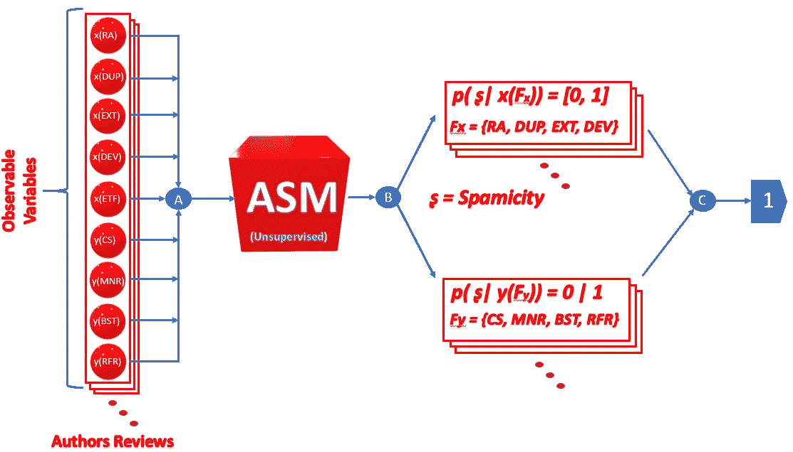
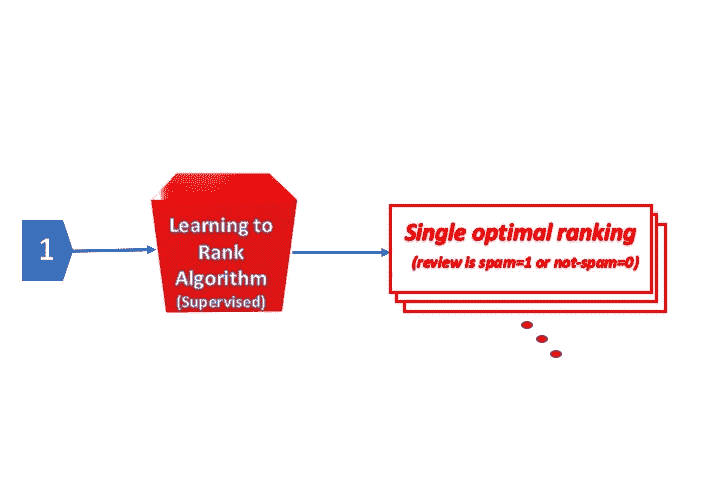

# 买家请注意，虚假产品评论正在困扰着互联网。机器学习如何帮助发现它们。

> 原文：<https://towardsdatascience.com/buyers-beware-fake-product-reviews-are-plaguing-the-internet-cfc599c42b6b?source=collection_archive---------19----------------------->

## 使用机器学习识别虚假产品评论

例如，CBS 新闻报道，在 Walmart.com 发布的 52%的产品评论是“不真实或不可靠的”，而在亚马逊发布的评论中至少有 30%是假的。识别观点垃圾邮件的问题仍然是一个开放的话题，尽管事实上一些研究人员已经解决了这个问题。

是什么让商家招致产品欺骗性评论？主要驱动力是在竞争中领先，定位他们的产品或服务，以影响公众和组织进行购买，从而增加他们的销售。欺诈是通过张贴虚假的负面评论和给竞争对手的产品不公正的评级来进行的。

据了解，“*亚马逊机械土耳其”*，一个互联网众包市场，允许请求者(企业或个人)协调人力来执行一项任务，被用来为一家连锁酒店众包虚假评论。鉴于这一问题已经发展到令人担忧的程度，*Yelp.com*，一家发布众包评论的商业目录服务公司，发起了一项诱捕行动，以揭露那些购买虚假评论的商家。

我将讨论 Mukherjee 等人在他们的论文[中提出的检测产品评论中垃圾邮件的方法。他们称他们的模型为“*作者空间模型*”(**ASM**)。它基于无监督学习，将空间建模为潜在的，简而言之就是模型变量是“隐藏的”。它也是一个贝叶斯推理框架。该模型的目的是将这种潜在的群体分布分类成垃圾邮件发送者和非垃圾邮件发送者。](http://citeseerx.ist.psu.edu/viewdoc/download?doi=10.1.1.423.1899&rep=rep1&type=pdf)

请注意，当我提到产品时，我也将包括服务。

怎样才能识别一篇评论可能是假的？为了开发他们的模型，作者定义了九个变量作为观察到的特征，前五个他们将它们归类为值在区间[0，1]内的*作者特征*(表示 [Beta 分布](https://en.wikipedia.org/wiki/Beta_distribution)，其中接近 0 或 1 的值分别表示非垃圾邮件或垃圾邮件。另一方面，变量 5 至 9 代表*评论特征*，它们采用二进制值，0 代表非垃圾邮件，1 代表垃圾邮件(表示[伯努利分布](https://en.wikipedia.org/wiki/Bernoulli_distribution)):

1.  **内容相似度【CS】**。垃圾邮件发送者倾向于复制类似产品的评论。[余弦相似度](https://en.wikipedia.org/wiki/Cosine_similarity)用于捕捉这些评论中的内容相似度。
2.  **最大评论数(MNR)** 。同一个作者在一天内发表几篇评论的不寻常行为可能是垃圾邮件的迹象。
3.  **回顾突发性(BST)。**指作者发布评论的频率(短)。这个作者通常是网站的新成员。满足这一条件可能意味着有招致欺骗性评论的倾向。
4.  **初审者比例(RFR)** 。该指标量化了早期评论对新推出产品的销售产生影响的事实。
5.  **重复/近似重复的评论(DUP)。**相同或近似相同的评论可能表示垃圾邮件行为。此功能类似于 CS，但在这种情况下属于 review 功能。
6.  **极限额定值(EXT)。**为了给评论带来最大或最小的好处，垃圾邮件发送者通常会给产品标上一星或五星。
7.  **评级偏差(开发)。垃圾邮件发送者会通过放置他们的评论来转移评论的平均情绪。当这种量化的偏差超过阈值时，这些类型的审查被识别。**
8.  **早期时间框架(ETF)。**此功能捕获了评审的早期时间。基本原理是，垃圾邮件发送者最有可能更早地进行审查，接近产品的推出，以实现最大的影响。
9.  **评级滥用(RA)。**指多次对同一产品进行星级评定的行为。

ASM 是如何工作的？为了说明这个模型，我在下面的图表中简化了它的功能(见图 1-A 和 1-B)，关于数学表示请参考论文。

Figure 1-A

Figure 1-B

ASM 从接受所有作者的所有评论开始，这些评论是按照我们已经讨论过的特性组织的。每个球体代表一个可观察变量(即特征)。一旦特征被收集(见图 1-A 节点 A)，它们被模型处理并学习“垃圾邮件和非垃圾邮件的潜在行为分布”(Murkherjee 等人)。因此，ASM 解决了一个聚类问题( *K* = 2)。

在贝叶斯环境中，空间被建模为潜在的 ASM 函数。这是一个 [*的生成过程*](https://en.wikipedia.org/wiki/Generative_model) 因为它发出了 9 个特征和它们的滥发概率。

为了进行推断，该模型使用“ [*”折叠吉布斯采样*](https://en.wikipedia.org/wiki/Gibbs_sampling)”(CGS)，其表示用于近似后验概率分布的技术。CGS 属于 [*马尔可夫链蒙特卡罗*](https://en.wikipedia.org/wiki/Markov_chain_Monte_Carlo) 算法家族。

一旦推断出排名函数，就使用 [*学习排名*](https://en.wikipedia.org/wiki/Learning_to_rank) 监督技术对其进行处理，该技术基本上采用 ASM 获得的排名，并生成单个聚合排名函数(见图 1-A 节点 C)。

在我看来，这篇文章提出了一种技术，可以显著提高产品评论中意见垃圾邮件制造者的检测。这是一个创新，因为提出了一个无监督的方法来检测虚假评论。作者声称，与强大的竞争对手相比，他们已经实现了更高水平的准确性。我相信，随着越来越多提供此类信息的企业开始实施像 ASM 这样的 ML 技术，垃圾观点将开始减少，同时，消费者必须持怀疑态度，并使用过滤虚假评论的网站获得信息。

# [使用行为足迹发现观点垃圾邮件发送者](https://dl.acm.org/citation.cfm?id=2487580)

[A 慕克吉](https://scholar.google.ca/citations?user=wUNpA_sAAAAJ&hl=en&oi=sra)， [A 库玛](https://scholar.google.ca/citations?user=8gCc_kkAAAAJ&hl=en&oi=sra)， [B 刘](https://scholar.google.ca/citations?user=Kt1bjZoAAAAJ&hl=en&oi=sra)， [J 王](https://scholar.google.ca/citations?user=RmSFHp8AAAAJ&hl=en&oi=sra)，M 许……—2013 年第十九届会议录——

# [针对门外汉的吉布斯采样](https://apps.dtic.mil/docs/citations/ADA523027)

[P **雷斯尼克**，E **哈迪斯特** — **2010**](https://scholar.google.ca/citations?user=71BFWc0AAAAJ&hl=en&oi=sra)

# [统计分析中的贝叶斯推断](https://books.google.ca/books?hl=en&lr=&id=T8Askeyk1k4C&oi=fnd&pg=PR11&dq=Bayesian+inference&ots=jUN4l-cUM7&sig=ohSmNeWTWygilWs4Mp9_2JBlxic)

GC Tiao——2011——books.google.com GEP 盒子

# [加快潜在狄利克雷分配模型的标定，完善……](https://digital.library.ryerson.ca/islandora/object/RULA%3A6834/datastream/OBJ/download/Speeding_up_calibration_of_latent_Dirichlet_allocation_model_to_improve_topic_analysis_in_software_engineering.pdf)

作者 JA lópez——2017 年

 [## 买家当心:亚马逊、沃尔玛和其他主要零售商遭遇虚假评论的灾难

### 根据 Fakespot 的一项研究，虚假评论在许多顶级零售商网站上越来越普遍

www.cbsnews.com](https://www.cbsnews.com/news/buyer-beware-a-scourge-of-fake-online-reviews-is-hitting-amazon-walmart-and-other-major-retailers/) 

— — — — — — — — — — — — — — — — — — — — — — — — — — — — — — — -

亲爱的读者，我有兴趣从你那里知道:

1.  当你在网上购物时，你会被当地的评论所影响吗？或者除此之外，你寻找一个或多个外部评论？
2.  如果您使用产品评论网站，您更信任哪个网站？
3.  你认为如何解决这个以惊人速度增长的问题？

感谢参与，可以留言评论回应。