# 在荷兰买房(书呆子气)

> 原文：<https://towardsdatascience.com/buying-a-house-in-the-netherlands-in-a-nerdy-way-1433691c6f2a?source=collection_archive---------6----------------------->


如果你像我一样，当你不得不做出重大决定时，比如买房子，你可能会不知所措。在这种情况下，我总是喜欢采用数据驱动的方法，这将有助于我找到最佳解决方案。这涉及到两个步骤。首先，我们需要尽可能多地收集数据。其次，我们需要定义一个衡量成功的标准。

收集荷兰房价数据需要一些努力。我从 funda.nl 网站上获得了房价。需要注意的是，网站上的要价并不是房屋的实际售价。要价也没有明显偏向低于或高于售价，所以我无法纠正。这是处理真实数据时通常会发生的情况，它总是远非完美。

定义成功的衡量标准是个人的和主观的。我认为房子是一个不错的选择，如果:1。要价便宜；和/或，2。与投资相比，我可以从中获得的潜在租金很高。

1.  为了知道要价是否便宜，我使用了网站上正在出售的房屋的要价，建立了一个机器学习模型，根据房屋的特点预测其要价。然后，我可以用那个模型来评估房子的要价应该是多少，如果实际要价低于模型预测的价格，那么我会认为这是一笔好交易。(注意:在这种情况下，好交易的定义是在数据集本身的范围内，而不是从市场价值的绝对角度；所以，举例来说，如果网站上的所有价格都是市场价格的两倍，我仍然可以通过比较房屋来获得一些不错的交易。
2.  为了知道正在出售的房屋的租金价格，我使用了网站上提供的房屋出租数据，并建立了一个机器学习模型，根据房屋特征预测租金价格。然后，我可以用那个模型来评估一个正在出售的房子的租金价格应该是多少。如果要价与预期租金的比率很低，那么这意味着我可以租下房子，投资回收期很短。

最后一点需要注意的是，这里所做的所有分析都是针对静态数据的，不涉及价格趋势预测。

# 数据

从 funda.nl，我有 2019 年 7 月在阿姆斯特丹、Zaandam 和 Diemen 出售的 2150 套房屋和公寓的数据；出租的房屋和公寓有 1，046 套。

对于每栋房子，我都有以下数据(*是的，网站是荷兰语的，你可以使用谷歌翻译*):

```
['Aangeboden sinds', 'Aantal badkamers', 'Aantal kamers', 'Aantal woonlagen', 'Aanvaarding', 'Achtertuin', 'Badkamervoorzieningen', 'Balkon/dakterras', 'Bijdrage VvE', 'Bouwjaar', 'Capaciteit', 'Cv-ketel', 'Eigendomssituatie', 'Energielabel', 'Externe bergruimte', 'Gebouwgebonden buitenruimte', 'Gelegen op', 'Inhoud', 'Inschrijving KvK', 'Isolatie', 'Jaarlijkse vergadering', 'Lasten', 'Ligging', 'Ligging tuin', 'Onderhoudsplan', 'Oppervlakte', 'Opstalverzekering', 'Overige inpandige ruimte', 'Periodieke bijdrage', 'Reservefonds aanwezig', 'Schuur/berging', 'Servicekosten', 'Soort appartement', 'Soort bouw', 'Soort dak', 'Soort garage', 'Soort parkeergelegenheid', 'Soort woonhuis', 'Specifiek', 'Status', 'Tuin', 'Verwarming', 'Voorlopig energielabel', 'Voorzieningen', 'Vraagprijs', 'Warm water', 'Wonen', 'address']
```

我还使用以下代码创建了一些额外的功能:

```
def create_cols(df):
 df[‘zip_code’]=df[‘address’].str.extract(pat=’([0–9]{4} [A-Z]{2})’)
 df[‘zip_code’]=df[‘zip_code’].str.replace(‘ ‘, ‘’, regex=False)
 df[‘zip_code_number’]=df[‘zip_code’].str.extract(pat=’([0–9]{4})[A-Z]{2}’).fillna(0).astype(int)
 df[‘price’]=df[‘Vraagprijs’].str.extract(pat=’([0–9]{0,3}.?[0–9]{3}.[0–9]{3})’)
 df[‘price’]=df[‘price’].str.replace(‘.’, ‘’, regex=False).astype(float)
 df[‘nr_bedrooms’] = df[‘Aantal kamers’].str.extract(pat=’([0–9]) slaapkamer’).fillna(0).astype(int)
 df[‘nr_rooms’] = df[‘Aantal kamers’].str.extract(pat=’([0–9]) kamer’).fillna(0).astype(int)
 df[‘nr_floors’] = df[‘Aantal woonlagen’].str.extract(pat=’([0–9]) woonla’).fillna(0).astype(int)
 df[‘nr_bathrooms’] = df[‘Aantal badkamers’].str.extract(pat=’([0–9]+) badkamer’).fillna(0).astype(int)
 df[‘nr_toilet’] = df[‘Aantal badkamers’].str.extract(pat=’([0–9]+) aparte? toilet’).fillna(0).astype(int)
 df[‘construction_year’]=df[‘Bouwjaar’].str.extract(pat=’([0–9]{4})’).astype(float)
 df[‘cubic_space’] = df[‘Inhoud’].str.extract(pat=’([0–9]+) m’).fillna(0).astype(float)
 df[‘external_storage_space’] = df[‘Externe bergruimte’].str.extract(pat=’([0–9]+) m’).fillna(0).astype(float)
 df[‘outdoor_space’]=df[‘Gebouwgebonden buitenruimte’].str.extract(pat=’([0–9]+) m’).fillna(0).astype(float)
 df[‘living_space’]=df[‘Wonen’].str.extract(pat=’([0–9]+) m’).fillna(0).astype(float)
 df[‘montly_expenses’]=df[‘Bijdrage VvE’].str.extract(pat=’([0–9]+) per maand’).fillna(0).astype(float)
 df[‘other_indoor_space’]=df[‘Overige inpandige ruimte’].str.extract(pat=’([0–9]+) m’).fillna(0).astype(float)
df[‘dont_have_frontyard’]=df[‘Achtertuin’].str.extract(pat=’(voortuin)’).isna()
 df[‘not_straat’]=df[‘address’].str.extract(pat=’(straat)’).isna()
 df[‘not_gracht’]=df[‘address’].str.extract(pat=’(gracht)’).isna()
 df[‘not_plein’]=df[‘address’].str.extract(pat=’(plein)’).isna()
 df[‘price_per_living_sqm’] = df[‘price’]/df[‘living_space’]
 df[‘is_house’]=df[‘Soort appartement’].isnull()
 df = df[df[‘price’].notna()]
 df = df[df[‘living_space’]>0]
 df = df[df[‘living_space’]<600]
 df = df[df[‘price’]<4500000]
 df[‘dont_have_backyard’] = df[‘Achtertuin’].isna()
 df[‘backyard_size’] = df[‘Achtertuin’].str.extract(pat=’([0–9]+) m²’).fillna(0).astype(float) 
 df[‘has_garage’]=df[‘Soort garage’].isna()
 df[‘total_area’] = df[‘outdoor_space’]+df[‘external_storage_space’]+df[‘living_space’]+df[‘other_indoor_space’]
 df[‘address_nozip’]=df[‘address’].str.extract(pat=’^(.+)[0–9]{4} [A-Z]{2}’)
 df[‘address_zip’]= df[‘address_nozip’] + ‘ ‘ + df[‘zip_code’]
 df[‘parcela’]= df[‘Oppervlakte’].str.extract(pat=’([0–9]+) m’).fillna(0).astype(float) 
 df[‘price_per_parcela_sqm’] = df[‘price’]/df[‘parcela’]
 return df
```

# 数据探索

需要导入包:

```
import pandas as pd
import re
import numpy as np
import seaborn as sns
import scipy.stats as stats
import matplotlib.pyplot as plt
from sklearn.model_selection import GridSearchCV, cross_val_score, KFold
from sklearn.metrics import mean_squared_error
from sklearn.model_selection import train_test_split
from sklearn.metrics import r2_score
from sklearn.preprocessing import LabelEncoder
from xgboost import XGBRegressor
```

加载数据:

```
df = pd.read_csv('data_funda.csv',sep = ',', encoding = 'utf-16')
df = create_cols(df)
```

我们来看看价格、居住空间和建造年份是什么关系。由于价格和生活空间的偏态分布，我还创建了这些变量的对数转换值，并分别将其命名为 price_log1p 和 living_space_log1p(参见*“特征分布”*一节)。

```
# Price vs. Living space
p_cor = df[['living_space','price']].corr(method ='pearson') ['price'].living_space
df.plot.scatter(x='living_space',y='price',c='construction_year',colormap='viridis', figsize=[12,8], vmin=1900, vmax=2000,label="corr:"+str(round(p_cor,4)))
plt.legend()
p_cor = df[['living_space_log1p','price_log1p']].corr(method ='pearson') ['price_log1p'].living_space_log1p
df.plot.scatter(x='living_space_log1p',y='price_log1p',c='construction_year',colormap='viridis', figsize=[12,8], vmin=1900, vmax=2000,label="corr:"+str(round(p_cor,4)))
plt.legend()
```

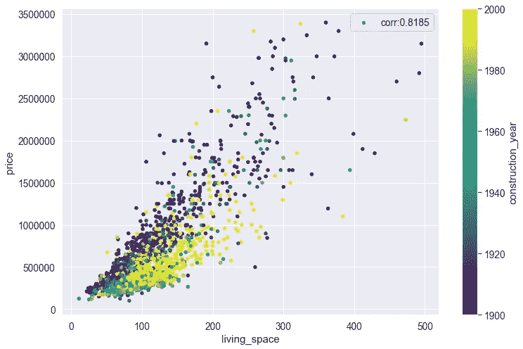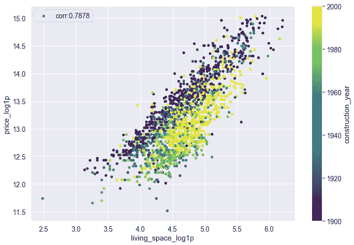

你可以清楚地看到，房子越大，价格越高(*咄！*)，但同样有点令人惊讶的是(如果你对阿姆斯特丹一无所知的话)同样的平方米，非常古老的房子比较新的房子要贵。这是因为位置！。阿姆斯特丹市中心很贵，那里的房子也很旧。从图中还可以看出，2000 年左右建造的房屋往往比 1980 年建造的房屋更大。

价格如何随着卧室数量的变化而变化？

```
# Total bedrooms vs. Price
sns.boxplot(x=df['nr_bedrooms'], y=df['price'])
plt.show()
sns.boxplot(x=df['nr_bedrooms'], y=df['price_per_living_sqm'])
plt.show()
```

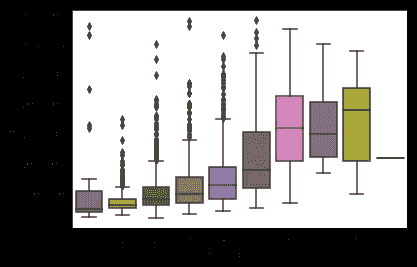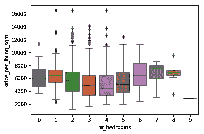

房间数量越多，要价越高(*左地块*)，很可能是因为房子比较大。但是，如果我们看到每平方米的价格是如何随着房间数量的变化而变化的(*右图*)，它似乎是相当平坦的，除了 3、4 和 5 卧室的房子中位数更低。

> 位置，位置，位置！

房价很大程度上取决于房子的位置。让我们来看看价格分布如何随邮政编码而变化。

```
df[['price','zip_code_number']].boxplot(by='zip_code_number', figsize=[25,8], rot=45)
plt.ylabel('Price')
```

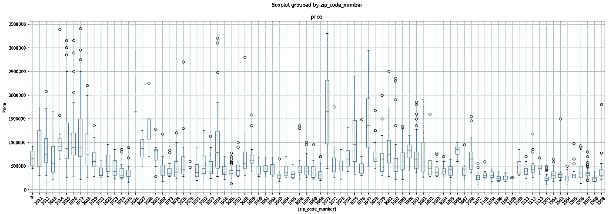

从图中您可以看到，有些邮政编码的房屋具有较高的中值价格和标准差(例如，市中心的邮政编码，如 1071、1077、1017)，而有些邮政编码的价格一直较低(例如，1102、1103、1104，位于 Bijlmermeer 地区)。

事实上，我发现更有趣的是看到每平方米价格的分布与邮政编码。

```
ax=df[['price_per_living_sqm','zip_code_number']].boxplot(by='zip_code_number', figsize=[25,8], rot=45)
plt.ylabel('Price per sqm')
ax.set_ylim([2000,12500])
```

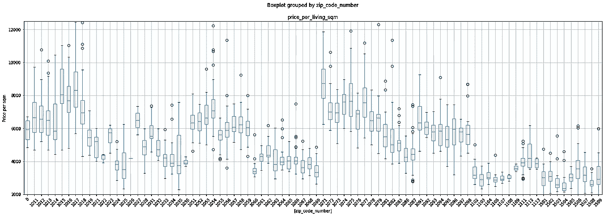

在没有任何机器学习知识的情况下，如果我们有固定的预算和最小平方米的要求，人们可以使用之前的地块来查看要探索的街区和要去看房子。因此，如果我们正在寻找一个至少 100 平方米的房子，并且希望花费不超过 40 万欧元，我们应该关注邮政编码，如 1024，1060，1067，1069，> 1102。当然，你可能会在邮编为 1056 的地方买到一栋低于预算的房子(离群值)，但要做好准备，不得不花一些额外的钱来装修:)。

谈装修…每平米价格如何随施工年份变化？我们来画个图。

```
df_filt = df[(df['construction_year']>1900)&(df['construction_year']<2019)]
df_filt['construction_year_10'] = df_filt['construction_year']/10
df_filt['construction_year_10'] = df_filt['construction_year_10'].apply(np.floor)
df_filt['construction_year'] = df_filt['construction_year_10']*10
data = pd.concat([df_filt['price_per_living_sqm'], df_filt['construction_year']], axis=1)
f, ax = plt.subplots(figsize=(20, 8))
fig = sns.boxplot(x='construction_year', y="price_per_living_sqm", data=data)
fig.axis(ymin=1000, ymax=11000)
plt.xticks(rotation=45)
```

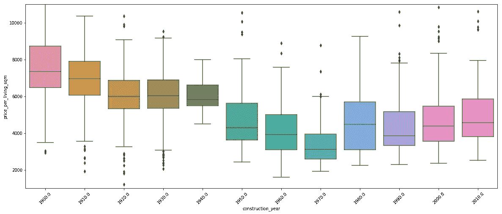

正如我们之前看到的，非常旧的房子每平方米的价格比新房子要高。这是因为那些老房子位于非常昂贵的邮政编码。因此，从每平方米价格最高的 1900 年开始，直到 1970 年，价格下降，然后从那一年开始，价格再次上涨。

为了全面了解每对特征是如何相互关联的，让我们来看看相关矩阵。

```
plt.figure(figsize=(20,12))
sns.heatmap(df.drop(columns='index').corr(), annot=False, square=True)
```

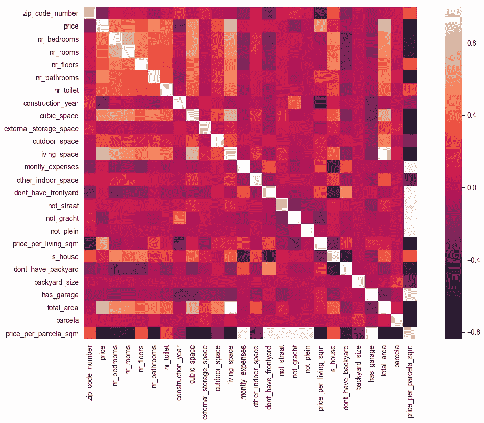

有太多的事情在那里发生，但它给了我们一个概念，什么变量是正相关的(如居住面积与卧室、房间、地板、浴室等的数量。)以及哪些是负相关的(例如，作为一栋房子而没有后院或前院，或者每月有开销)。

如果我们只关注与价格相关性最高的前 10 个变量，那么相关性矩阵如下所示:

```
corrmat = df.corr()
cols = corrmat.nlargest(10, 'price')['price'].index
hm = sns.heatmap(np.corrcoef(df[cols].values.T), cbar=True, annot=True, square=True, fmt='.2f', annot_kws={'size': 10}, yticklabels=cols.values, xticklabels=cols.values)
plt.show()
```

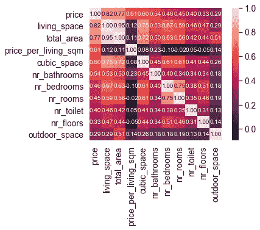

我们可以看到，价格与所有直接或间接与房子大小相关的变量高度相关。

我们可以做的最后一项质量检查是查看每个要素缺失值的百分比。

```
df_na = (df.isnull().sum() / len(df)) * 100
df_na = df_na.drop(df_na[df_na == 0].index).sort_values(ascending=False)[:40]
missing_data = pd.DataFrame({'Missing Ratio' :df_na})
plt.figure(figsize=(15, 9))
sns.barplot(x=df_na.index, y=df_na)
plt.xticks(rotation='80')
plt.ylabel('Percent of missing values', fontsize=15)
```

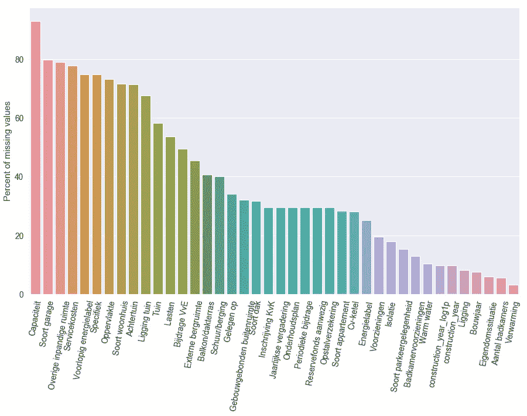

这些变量中的一些有缺失值，因为数据不是由房地产代理商/业主提供的(例如能源标签)，而对于其他一些缺失值实际上意味着缺少它(例如车库或花园-tuin-)。

# 特征分布

为了建立预测房价的 ML 模型，让我们仔细看看特征直方图。我在这里只画两个例子:月支出(欧元)和生活空间(平方米)。

```
for col in df.describe().columns.values:
    if col<>'price_per_parcela_sqm':
        axs = df.hist(column=col,bins=50)
```

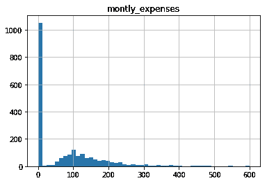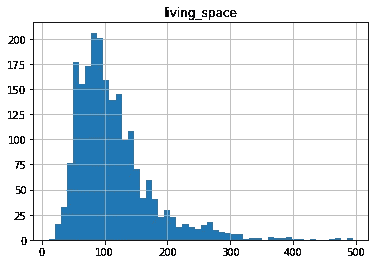

从左边的图中我们可以看到，一些房子(主要是公寓)每月都有开销(荷兰语称为 *Bijdrage VvE* )，平均在 100 欧元左右，而其他一些房子则完全没有。

从右图中，您可以看到居住空间分布的模式大约为 100 平方米。分布不是正态分布，而是高度右偏；价格分布也是如此。让我们仔细看看价格分布。

```
for col in df.describe().columns.values:
    try:
        sns.distplot(df[col], label="Skewness: {:.3f}".format(df[col].skew()))
        plt.title(col+' Distribution')
        plt.ylabel('Frequency')
        plt.xticks(rotation=45)
        plt.legend()
        plt.show()
        qq = stats.probplot(df[col], plot=plt)
        plt.show()
    except:
        pass
```

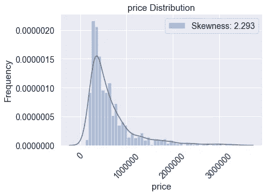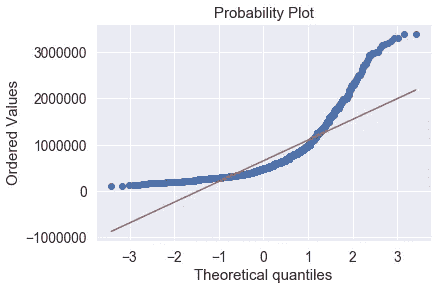

如此高的偏斜度对于输入到 ML 模型的特征和标签来说是不期望的。因此，让我们继续记录具有高偏斜分布的变换变量。

```
# Assign numeric features by excluding non numeric features
numeric = df.dtypes[df.dtypes != 'object'].index# Display the skewness of each column and sort the values in descending order 
skewness = df[numeric].apply(lambda x: x.skew()).sort_values(ascending=False)# Create a dataframe and show 5 most skewed features 
sk_df = pd.DataFrame(skewness,columns=['skewness'])
sk_df['skw'] = abs(sk_df)
sk_df.sort_values('skw',ascending=False).drop('skw',axis=1).head()# As a general rule of thumb, skewness with an absolute value less than 0.5 is considered as a acceptable range of skewness for normal distribution of data
skw_feature = skewness[abs(skewness) > 0.5].index# Transform skewed features to normal distribution by taking log(1 + input)
for col in skw_feature:
    df[col+"_log1p"] = np.log1p(df[col])# let's check the result of the transformation
sns.distplot(df['price_log1p'],label="Skewness: {:.3f}".format(df['price_log1p'].skew()))
plt.legend()
plt.title('Price Log(price + 1) transform Distribution')
plt.ylabel('Frequency')plt.figure()
qq = stats.probplot(df['price_log1p'], plot=plt)
plt.show()
```

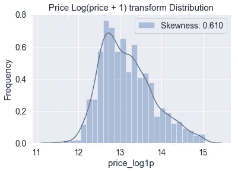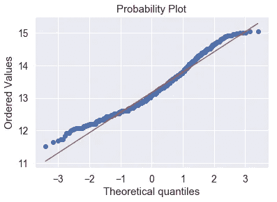

我们可以看到，对价格值进行对数变换后，分布更接近于正态分布(尽管还不完美)。

# 价格预测 ML 模型

数据探索到此为止，让我们建立一个 ML 模型！。

首先，让我们定义将要使用的特性。

```
#Label encoding
feat_enc = ['zip_code_number']# Features
feat_cols = ['nr_bedrooms','nr_rooms','nr_floors','nr_bathrooms','nr_toilet','zip_code_number_le','is_house','has_garage','dont_have_backyard','not_straat','not_gracht','not_plein','has_frontyard','backyard_size_log1p','living_space_log1p','cubic_space_log1p','outdoor_space_log1p','total_area_log1p','montly_expenses_log1p','parcela_log1p','construction_year']
```

我们将训练一个 XGBoost 回归模型，为超参数调整做一些小网格搜索，并且我们将使用交叉验证。

```
df_filt = df[df['price']<700000]#Missing values, impute with mode
for fr in ['construction_year']:
    df_filt[fr].fillna(df_filt[fr].mode()[0], inplace=True)#Label encoding
for feat in feat_enc:
    le = LabelEncoder()
    le.fit(df_filt[feat])
    df_filt[feat+'_le'] = le.transform(df_filt[feat])label='price_log1p'x = df_filt[feat_cols]
y = df_filt[label]
X_train, X_test, y_train, y_test = train_test_split(x, y, test_size=0.1, random_state=1)
print(X_train.shape, X_test.shape,y_train.shape)kfold = KFold(n_splits=5, random_state= 0, shuffle = True)def performance_metric(y_true, y_predict):
    """ Calculates and returns the performance score between 
        true (y_true) and predicted (y_predict) values based on the metric chosen. """
    score = r2_score(y_true, y_predict)
    return scoreXGB = XGBRegressor()xg_param_grid = {
              'n_estimators' :[900,400,1200],
              'learning_rate': [0.04, 0.06, 0.08],    
              'max_depth': [3,6,8],
              'min_child_weight':[0.2],              
              'gamma': [0,1],                
              'subsample':[0.8],
              'colsample_bytree':[1]
              }

gsXGB = GridSearchCV(XGB,param_grid = xg_param_grid, cv=kfold, scoring="neg_mean_squared_error", n_jobs= -1, verbose = 1)
gsXGB.fit(X_train,y_train)
XGB_best = gsXGB.best_estimator_
print(gsXGB.best_params_)
y_hat_xgb = np.expm1(gsXGB.predict(X_test))
```

让我们检查模型的性能。

```
r2_train = performance_metric(np.expm1(y_train), np.expm1(gsXGB.predict(X_train)))
r2_test = performance_metric(np.expm1(y_test), y_hat_xgb)
print "R2 train: ", r2_train
print "R2 test: ", r2_test
plt.scatter(np.expm1(y_train), np.expm1(gsXGB.predict(X_train)),label='R2:'+str(round(r2_train,4)))
plt.title('Train')
plt.xlabel('Price')
plt.ylabel('Price predicted')
plt.plot([100000,700000], [100000,700000], 'k-', alpha=0.75)
plt.legend()
plt.show()plt.scatter(np.expm1(y_test), y_hat_xgb,label='R2:'+str(round(r2_test,4)))
plt.plot([100000,700000], [100000,700000], 'k-', alpha=0.75)
plt.title('Test')
plt.xlabel('Price')
plt.ylabel('Price predicted')
plt.legend()
plt.show()
```

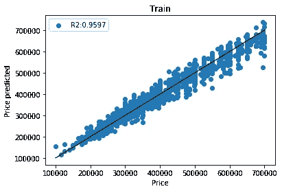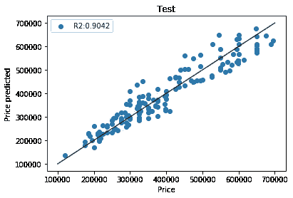

相关性高，这很好，从图中你可以看到一些要价的垂直模式。这是由于房地产经纪人/业主四舍五入价格。

查看特征重要性也很有用，可以了解哪些特征有助于预测房价。

```
from xgboost import plot_importanceplot_importance(XGB_best)
plt.show()
```

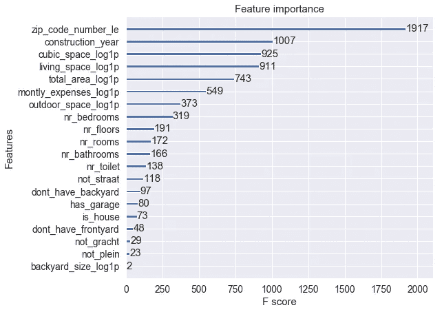

正如我们在数据探索部分已经看到的，房价与房子的位置、建造年份和大小高度相关。

现在，让我们使用模型来预测房价，并寻找要价低于预测价格的房屋。

```
Xtt = pd.concat([X_train,X_test],axis=0)
ypred=pd.DataFrame([np.expm1(gsXGB.predict(Xtt)),Xtt.index]).transpose()
ypred.columns = ['pred','idx']
ypred.set_index('idx',inplace=True)
ytt = ypred.join(df_filt)
ytt['ratio'] = ytt['price']/ytt['pred']
ytt['difference'] = ytt['price']  - ytt['pred']
```

现在，我希望看到室内面积超过 100 平方米、室外面积超过 5 平方米、要价和预测价格之间的差距非常大的房子:

```
x=ytt[['ratio','pred','price','outdoor_space','dont_have_backyard','dont_have_frontyard','living_space','nr_floors','difference','href']].sort_values(by='ratio')
print x[ (x['outdoor_space']>5)& (x['living_space']>100) ].head(10)
```

让我们看一个例子:

```
ratio      pred     price  outdoor_space living_space   difference                                                                                                           
0.814140  368487    300000    16             116       -68487   
href: [https://www.funda.nl/koop/zaandam/huis-40278208-lindenlaan-1/?navigateSource=resultlist](https://www.funda.nl/koop/zaandam/huis-40278208-lindenlaan-1/?navigateSource=resultlist)
```

在这里，预测价格和要价之间的差异是-68K 欧元。我在 [huispedia.nl](https://huispedia.nl/zaandam/1505gj/lindenlaan/1) 上查了一下，根据他们的说法，那栋房子 30 万欧元似乎也很划算(尽管他们预测价值在 37.1 万到 39.7 万欧元之间)。当然，这是做出如此重大决定的冷酷无情的方式，但你仍然需要点击链接，查看照片，看看你是否不介意橙色的墙壁和倾斜的天花板。

# 租金预测

以类似的方式，我使用从 funda.nl 获得的租金价格来建立 ML 模型，该模型预测给定房屋特征的租金价格。我不打算描述确切的方法，但我使用租金模型来估计网站上正在出售的 2，150 所房屋和公寓的租金价值(我们没有租金价格)。

我使用租金预测来估计如果我买了房子后再出租，每套房子的回收期是多少(我称之为 *ratio_sell_rent_year* )。为了计算它，我将价格除以租金预测，再除以 12，得到一个年单位。

最后，我按邮政编码绘制了 ratio_sell_rent_year，看看哪些地区在投资回报方面比较方便。

```
ytt['ratio_sell_rent'] = ytt['price']/ytt['rent_prediction']
ytt['ratio_sell_rent_year'] = ytt['ratio_sell_rent'] /12
ax=ytt[['ratio_sell_rent_year','zip_code_number']].boxplot(by='zip_code_number', figsize=[25,8], rot=45)
ax.set_ylim([0,50])
```

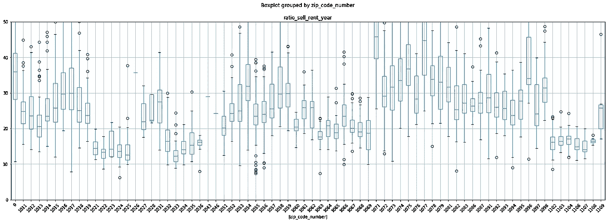

像 1019/25、1032/6 和 1102/8 这样的邮政编码似乎投资回收期较短，平均为 15 年。

与要价 ML 模型类似，我使用租金模型来获得室内面积超过 100 平方米、室外面积超过 5 平方米且比率 _ 销售 _ 租金 _ 年值较低的房屋:

```
ratio_sell_rent_year  ratio_sell_rent  rent_prediction   price  outdoor_space  living_space 
7.932343              95.188121        3571.874268      340000.0   46.0           166.0      
href: [https://www.funda.nl/koop/amsterdam/huis-40067181-moestuinlaan-12/?navigateSource=resultlist](https://www.funda.nl/koop/amsterdam/huis-40067181-moestuinlaan-12/?navigateSource=resultlist)
```

我不知道那栋房子的租金价格是多少，但我发现它旁边有一栋非常相似的房子[这里](https://www.pararius.com/apartment-for-rent/amsterdam/PR0001469520/moestuinlaan)。带家具、约 50 平方米大的房子租金为 7000 欧元。我实际上从外面去看了那栋房子，看起来像是我喜欢住的房子，但是当我们联系荷兰房地产经纪人时，房子已经卖完了。可悲的是，在阿姆斯特丹找房子的最佳方式似乎不是花里胡哨的 ML，而是快速行动😅。

## 有用的链接

*   查看荷兰的房价，以及基于 ML 模型的估计范围价格: [huispedia.nl](http://huispedia.nl)
*   查看阿姆斯特丹房价每平方米地图: [maps.amsterdam.nl](https://maps.amsterdam.nl/woningwaarde/?LANG=en)
*   查看 Mike 关于在阿姆斯特丹买房的精彩帖子:[https://medium . com/@ MTO Connor 3/exploring-housing-prices-in-Amsterdam-b1d 3848 BDC 01](https://medium.com/@mtoconnor3/exploring-housing-prices-in-amsterdam-b1d3848bdc01)