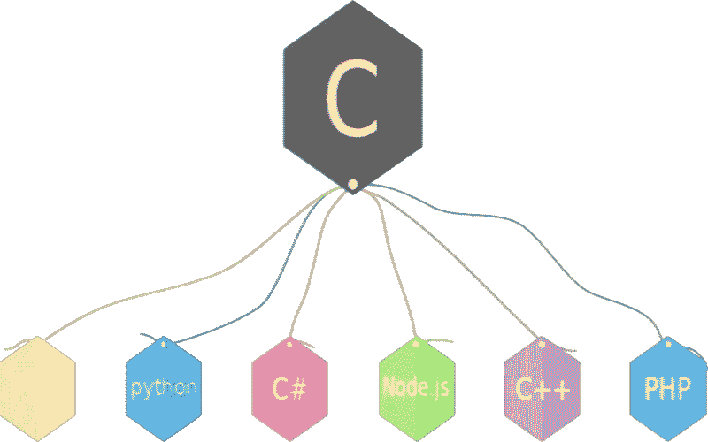
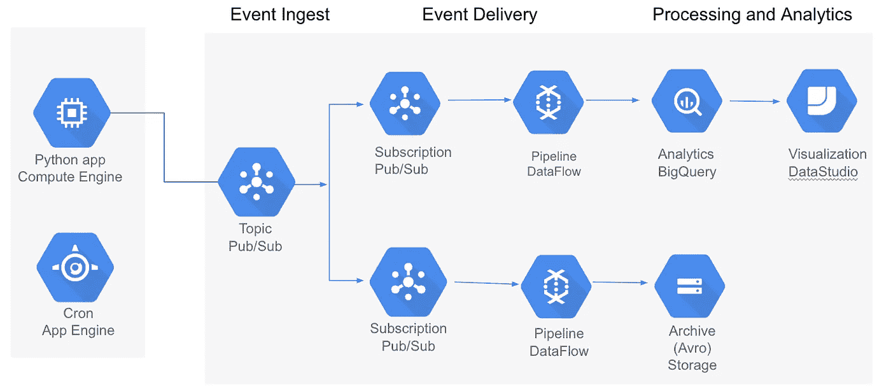
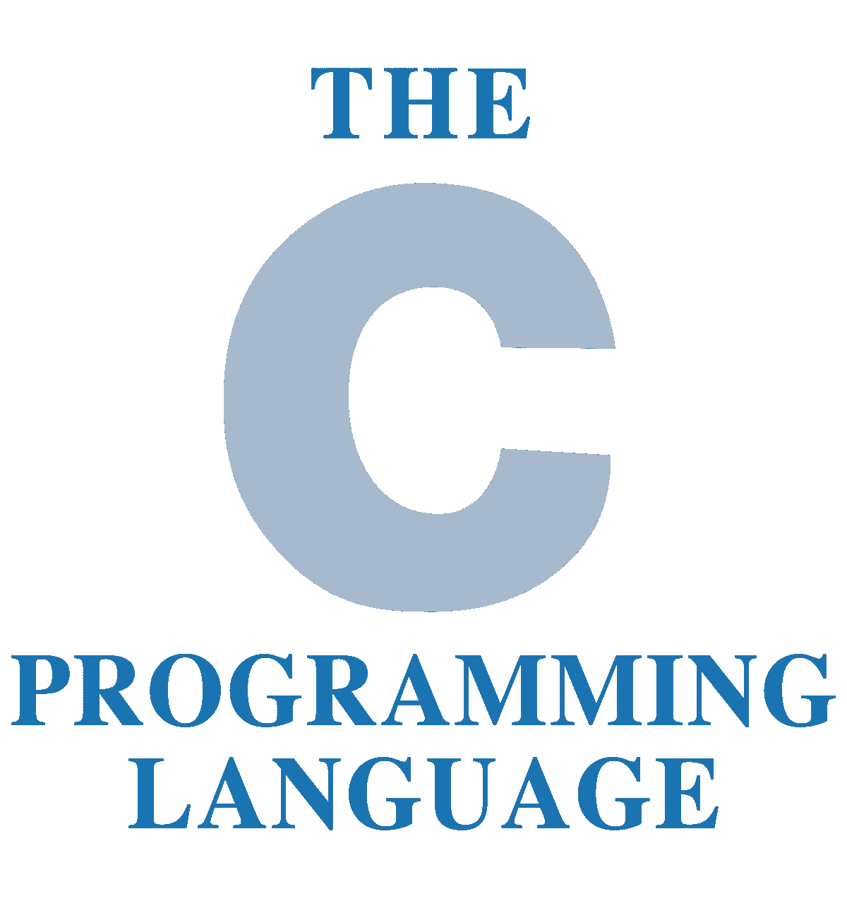

# 数据科学的 c？

> 原文：<https://towardsdatascience.com/c-for-data-science-8321d6509484?source=collection_archive---------9----------------------->


在数据科学领域，有许多语言可以用于统计分析和机器学习。通常，在这些情况下，语言的选择仅仅依赖于语言能够提供的功能。流行的选择包括像 R 和 Python 这样的统计语言。面向对象的编程语言经常被忽略，因为与函数式语言相比，它们的结构很难处理。

这一点在现代计算公式中最重要的语言之一 c 语言中表现得最为真实。

除非你曾经在岩石下编程，即使你曾经这样做过，你也可能听说过 C。C 是一种非常低级的语言，它也具有灵活进入真正高级开发领域的优势。虽然 C 语言是通用的，但 C 语言通常需要很长时间才能达到高水平。



这就是为什么有那么多语言是由 C 编写和解释的，比如 Python。但如果 Python 对数据科学如此伟大，为什么它的母亲不能持有同样的观点？

在很多方面，C 对于数据科学来说是完全可以接受的。这是因为像 C 的商标操作这样的低级语言是移动和管理数据的，因为这是低级语言的最大部分。但是确实有很多属性使得 C 语言不如 Python 这样的语言可行，例如。

# 实际上面向对象


尽管 Python 确实是面向对象的，但 Python 也拥有许多功能强大的特性。在一般的软件中，这往往是一个共同的主题。一种语言没有必要非此即彼，那么为什么不把两者的独特部分结合起来呢？

另一方面，C 天生就是百分之百通用的，但不管怎样，这对数据科学来说不一定是可怕的，但肯定可以更好一点。这不仅让初学者更加困难，也让数据科学家更加困难。当在数据科学中来回工作时，拥有一种具有更多函数属性的语言，函数可以在类之外运行，而不需要不断的回调，肯定会容易得多。

# c 很难

从来不推荐 C 作为你的第一语言是有原因的；与 Python 等解释型语言以及其他语言相比，C 语言无疑是最难的语言之一。而且机器学习编程可能会出奇的难，尤其是在没有库的情况下从头开始。随之而来的是 Cs 最大的缺点，以及将 C 用于数据科学的致命弱点:

> 有这么多更简单、更好的语言(针对 DS)
> 
> 那么为什么要用 C 呢？

除了很难写之外，C 语言也很难读，尤其是对于那些有大量数学运算的混乱的程序员来说。在大多数情况下，没有必要仅仅为了使用 c 就把能够阅读你的代码的程序员的数量分成 1/5，记住这一点，c 肯定有一些可取之处。

# 为什么它对数据科学有好处

在笔记本之外，在管道和数据软件工程领域，当机器学习算法本身也是用 C 语言编写时，许多强大的 C 代码基础会显著受益。对于使用 DS 的软件工程来说，C 语言对于知道如何使用它的每个人来说绝对是天赐之物。由于 Python 的速度问题，Python 通常在很多密集的情况下表现不佳。



除此之外，使用 C 的 Python 包的数量也令人印象深刻。不仅如此，就相对高级的编程而言，C 通常是最快的选择。

# 使用 C

我使用 C 已经很长时间了，但是我从来没有在数据科学中使用过 C。我最接近这样的事情是能够读写 CSV 文件。

> 但凡事都有第一次。

带着这个想法，我第一次去读 CSV。这相对简单，如下所示:

```
#include <stdio.h>
#include <stdlib.h>
#include <string.h>
const char* getfield(char* line, int num)
{
    const char* tok;
    for (tok = strtok(line, ";");
            tok && *tok;
            tok = strtok(NULL, ";\n"))
    {
        if (!--num)
            return tok;
    }
    return NULL;
}

int main()
{
    FILE* stream = fopen("l", "r");

    char line[1024];
    while (fgets(line, 1024, stream))
    {
        char* tmp = strdup(line);
        printf("Field 3 would be %s\n", getfield(tmp, 3)); return l;
}
}
```

现在是时候尝试一种算法了。我不想花太多的时间去创建一个构造函数，因为多亏了内核执行，我们可以把每个类命名为 main 并以这种方式运行函数。

```
int main()
{
int summation(arr) {
     int arr[MAX_SIZE];     
int i, n, sum=0;
for(i=0; i<n; i++)     
{         
scanf("%d", &arr[i]);     
}      
for(i=0; i<n; i++)     {         sum = sum + arr[i];     }       return sum; }int length(arr){for(i=0; i<n; i++)     {         sum = sum + 1;
     }       
return sum; 
}**int** llsq(**int** x[], **int** y[],xt[])
{
     x = m.x
        y = m.y
        # Summatation of x*y
        xy = x .* y
        sxy = sum(xy)
        # N
        n = length(x)
        # Summatation of x^2
        x2 = x .^ 2
        sx2 = sum(x2)
        # Summatation of x and y
        sx = sum(x)
        sy = sum(y)
        # Calculate the slope:
        slope = ((n*sxy) - (sx * sy)) / ((n * sx2) - (sx)^2)
        # Calculate the y intercept
        b = (sy - (slope*sx)) / n
        # Empty prediction list:
        y_pred = []
        for i in xt
            pred = (slope*i)+b
            append!(y_pred,pred)
    return y_pred;}}
```



所以我认为，从创建一个函数来完成获取和操作数据所需的许多事情所用的代码行来看，C 语言显然不太适合数据科学。并不是说 C 在数据科学中没有一席之地，但是在很多方面，在数据科学和机器学习的特定情况下，使用更简单的语言比使用 C 容易得多，从而证明使用像 C 这样的低级语言是正确的。

通常，统计被区分为高级的函数式编程。这是有充分理由的，因为用 C 编写与我们用 Python、R 和 Scala 编写的算法相似的算法尤其困难，并且需要更多的方法。