# 计算相似性——简而言之，最相关的指标

> 原文：<https://towardsdatascience.com/calculate-similarity-the-most-relevant-metrics-in-a-nutshell-9a43564f533e?source=collection_archive---------2----------------------->


Photo by [Karolina Grabowska](https://www.pexels.com/de-de/@karolina-grabowska) on [Pexels](http://www.pexels.com)

许多数据科学技术都基于测量对象之间的相似性和不相似性。例如，K-最近邻使用相似性来分类新的数据对象。在无监督学习中，K-Means 是一种聚类方法，它使用欧几里德距离来计算聚类质心与其指定的数据点之间的距离。推荐引擎使用基于邻居的协作过滤方法，该方法基于与其他用户的相似性/不相似性来识别个人的邻居。

在这篇博文中，我将看看实践中最相关的相似性度量。可以用多种方式来测量对象之间的相似性。

通常，我们可以将相似性度量分为两个不同的组:

1.  基于相似性的指标:

*   皮尔逊相关
*   斯皮尔曼相关
*   肯德尔氏τ
*   余弦相似性
*   雅克卡相似性

2.基于距离的指标:

*   欧几里得距离
*   曼哈顿距离

# 基于相似性的度量

基于相似性的方法确定具有最高值的最相似的对象，因为这意味着它们生活在更近的邻域中。

## 皮尔逊相关

相关性是一种研究两个定量连续变量之间关系的技术，例如年龄和血压。皮尔逊相关系数是与线性关系的强度和方向相关的度量。我们用以下方式计算向量 *x* 和 *y* 的度量:

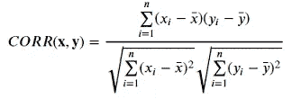

在哪里

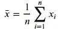

皮尔逊相关可以取值范围从-1 到+1。只有直接相关的增加或减少不会导致 1 或-1 的皮尔逊相关。

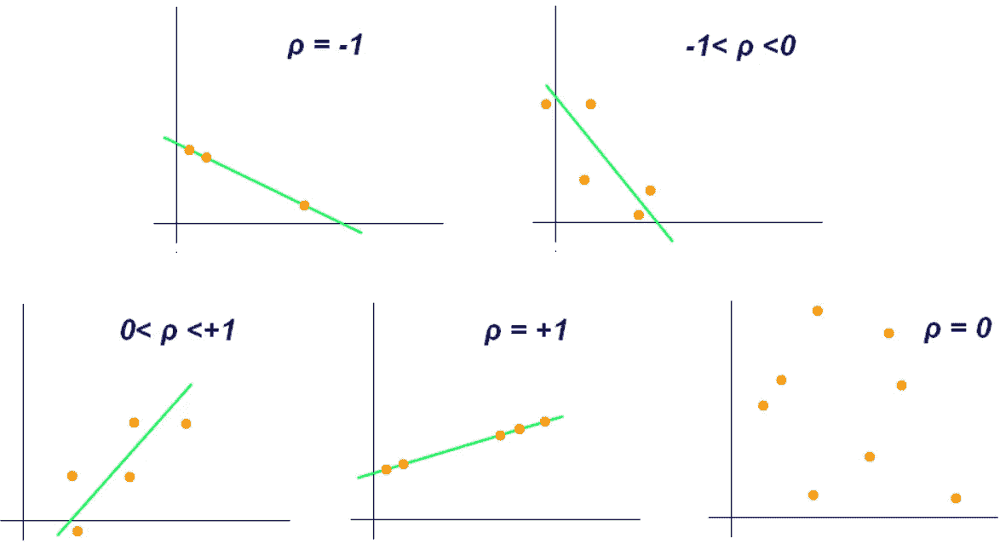

Source: Wikipedia

**用 Python 实现:**

```
import numpy as np
from scipy.stats import pearsonr
import matplotlib.pyplot as plt# seed random number generator
np.random.seed(42)
# prepare data
x = np.random.randn(15)
y = x + np.random.randn(15)# plot x and y
plt.scatter(x, y)
plt.plot(np.unique(x), np.poly1d(np.polyfit(x, y, 1))(np.unique(x)))
plt.xlabel('x')
plt.ylabel('y')
plt.show()
```

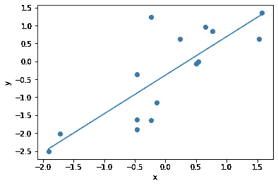

```
# calculate Pearson's correlation
corr, _ = pearsonr(x, y)
print('Pearsons correlation: %.3f' % corr)
```

皮尔逊相关系数:0.810

## 斯皮尔曼相关

Spearman 相关就是所谓的非参数统计，即分布不依赖于参数的统计(服从正态分布或二项式分布的统计就是参数统计的例子)。通常，非参数统计对数据进行排序，而不是取初始值。斯皮尔曼相关系数就是如此，其计算方法与皮尔逊相关类似。这些指标的区别在于，Spearman 的相关性使用每个值的排名。

为了计算 Spearman 相关性，我们首先需要将我们的每个数据映射到排名数据值:

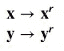

如果原始数据为[0，-5，4，7]，则排名值将为[2，1，3，4]。我们可以用下面的方法计算 Spearman 相关性:

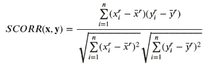

在哪里

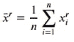

斯皮尔曼的相关性基准单调关系，因此它可以有完美的非线性关系。它可以取值范围从-1 到+1。下面的情节阐明了皮尔逊和斯皮尔曼相关性之间的区别。

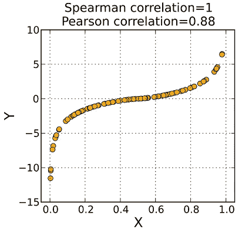

Source: Wikipedia

对于数据探索，我建议计算皮尔逊和斯皮尔曼的相关性。两者的比较会产生有趣的发现。如果 S>P(如上图)，说明我们是单调关系，不是线性关系。由于线性简化了将回归算法拟合到数据集的过程，我们可能希望使用对数变换来修改非线性的单调数据，使其看起来是线性的。

**用 Python 实现:**

```
from scipy.stats import spearmanr
# calculate Spearman's correlation
corr, _ = spearmanr(x, y)
print(‘Spearmans correlation: %.3f’ % corr)
```

斯皮尔曼相关系数:0.836

## 肯德尔氏τ

肯德尔的τ和斯皮尔曼的相关系数很相似。这两个度量都是关系的非参数度量。具体来说，Spearman 和 Kendall 的系数都是基于排名数据而不是原始数据计算的。

与 Pearson 和 Spearman 的相关性类似，Kendall 的 Tau 总是在-1 和+1 之间，其中-1 表示两个变量之间的强负关系，1 表示两个变量之间的强正关系。

尽管 Spearman 和 Kendall 的测量值非常相似，但选择 Kendall 的测量值具有统计学优势，因为在使用较大样本量时，Kendall 的 Tau 具有较小的可变性。然而，Spearman 的度量在计算上更高效，因为 Kendall 的 Tau 是 O(n)，而 Spearman 的相关性是 O(nLog(n))。

第一步是对数据进行分级:


然后我们计算肯德尔的τ值为:

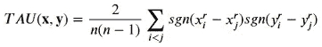

其中 sgn 采用与排序值的差异相关联的符号。我们可以写

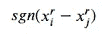

如下所示:

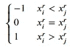

的可能结果

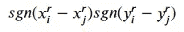

是-1，0，+1。这些相加给出了 x 和 y 的等级指向相同方向的次数的比例。

**用 Python 实现**

```
# calculate Pearson’s correlation
from scipy.stats import kendalltau
corr, _ = kendalltau(x, y)
print(‘Kendalls tau: %.3f’ % corr)
```

肯德尔斯τ:0.695

## 余弦相似性

余弦相似度计算两个向量之间角度的余弦。为了计算余弦相似性，我们使用以下公式:

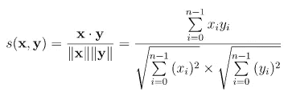

回想一下余弦函数:左边的红色向量指向不同的角度，右边的图形显示了结果函数。

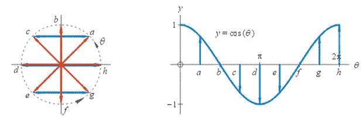

Source: mathonweb

因此，余弦相似度可以取-1 和+1 之间的值。如果向量指向完全相同的方向，余弦相似度为+1。如果向量指向相反的方向，余弦相似度为-1。

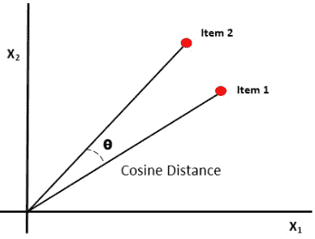

Source: O’Reilly

余弦相似度在文本分析中非常普遍。它用于确定文档之间的相似程度，而不考虑文档的大小。TF-IDF 文本分析技术有助于将文档转换成向量，其中向量中的每个值对应于文档中一个单词的 TF-IDF 得分。每个单词都有自己的轴，余弦相似度决定了文档的相似程度。

**用 Python 实现**

我们需要使用*来改变向量 x 和 y 的形状。reshape(1，-1)* 计算单个样本的余弦相似度。

```
from sklearn.metrics.pairwise import cosine_similarity
cos_sim = cosine_similarity(x.reshape(1,-1),y.reshape(1,-1))
print('Cosine similarity: %.3f' % cos_sim)
```

余弦相似度:0.773

## 雅克卡相似性

余弦相似度用于比较两个*实值向量*，而 Jaccard 相似度用于比较两个*二元向量(集)*。

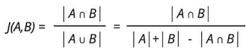

在集合论中，看到公式的可视化通常是有帮助的:

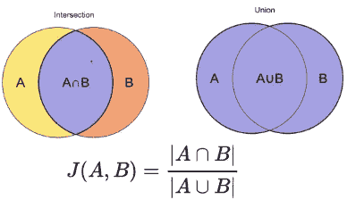

我们可以看到 Jaccard 相似性将交集的大小除以样本集的并集的大小。

余弦相似度和雅克卡相似度都是计算文本相似度的常用度量。计算 Jaccard 相似性在计算上更昂贵，因为它将一个文档的所有术语与另一个文档匹配。Jaccard 相似性在检测重复项时非常有用。

**用 Python 实现**

```
from sklearn.metrics import jaccard_score
A = [1, 1, 1, 0]
B = [1, 1, 0, 1]
jacc = jaccard_score(A,B)
print(‘Jaccard similarity: %.3f’ % jacc)
```

雅克卡相似度:0.500

# 基于距离的度量

基于距离的方法优先考虑具有最低值的对象，以检测它们之间的相似性。

## 欧几里得距离

欧几里德距离是两个向量之间的直线距离。

对于两个矢量 x 和 y，可以计算如下:

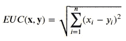

与余弦和 Jaccard 相似性相比，欧几里德距离在 NLP 应用的上下文中并不经常使用。它适用于连续的数值变量。欧几里德距离不是比例不变的，因此建议在计算距离之前缩放数据。此外，欧氏距离会成倍增加数据集中冗余信息的影响。如果我有五个高度相关的变量，我们将这五个变量都作为输入，那么我们将用五来加权这个冗余效应。

**用 Python 实现**

```
from scipy.spatial import distance
dst = distance.euclidean(x,y)
print(‘Euclidean distance: %.3f’ % dst)
```

欧几里德距离:3.273

## 曼哈顿距离

与欧几里得距离不同的是曼哈顿距离，也称为“城市街区”，即一个向量到另一个向量的距离。当您无法穿过建筑物时，您可以将此度量想象为计算两点之间距离的一种方法。

我们计算曼哈顿距离如下:

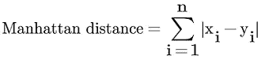

绿线给出的是欧几里德距离，而紫线给出的是曼哈顿距离。

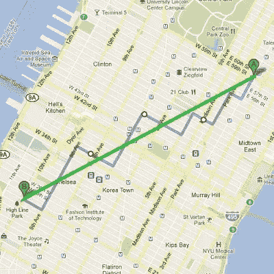

Source: Quora

在许多 ML 应用中，欧几里得距离是选择的度量。然而，对于高维数据，曼哈顿距离是优选的，因为它产生更稳健的结果。

**用 Python 实现**

```
from scipy.spatial import distance
dst = distance.cityblock(x,y)
print(‘Manhattan distance: %.3f’ % dst)
```

曼哈顿距离:10.468

# 摘要

这篇博文概述了实践中使用的最相关的相似性度量。没有简单的如果-那么流程图来选择合适的相似性度量。我们首先需要理解和研究这些数据。然后，对于给定的数据科学问题，找到量化相似性的正确方法总是一个案例一个案例的决定。

## 参考资料:

[https://bib.dbvis.de/uploadedFiles/155.pdf](https://bib.dbvis.de/uploadedFiles/155.pdf)

[http://text2vec.org/similarity.html](http://text2vec.org/similarity.html)

[http://www.ijaret.org/2.10/COMPARATIVE%20ANALYSIS%20OF%*20 JAC card*% 20 系数% 20 余弦% 20 相似度% 20FOR % 20WEB %文档% 20 相似度%20MEASURE.pdf](http://www.ijaret.org/2.10/COMPARATIVE%20ANALYSIS%20OF%20JACCARD%20COEFFICIENT%20AND%20COSINE%20SIMILARITY%20FOR%20WEB%20DOCUMENT%20SIMILARITY%20MEASURE.pdf)