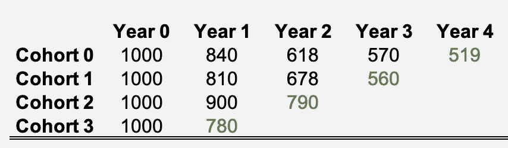

# 使用移位β几何模型计算客户终身价值

> 原文：<https://towardsdatascience.com/calculating-customer-lifetime-values-using-a-shifted-beta-geometric-model-86bf538444f4?source=collection_archive---------8----------------------->


Phot by Ihor Malytskyi on Unsplash

客户终身价值(CLV)是一个关键指标，被视为公司的北极星指标和所有综合 KPI，用于提供以下信息:

*   营销活动——我们应该花多少钱来获得客户？
*   客户细分——谁是我们最有价值的客户，他们的人口统计和行为特征是什么？
*   业务的整体健康状况——我们的 CLV 如何随着时间的推移而变化？
*   公司总价值——我们如何评估我们的*现有*和*未来*客户的价值？

但是什么是 CLV 呢？

> 当前客户的所有未来现金流的现值

在高层次上，为了估算你的 CLV，你需要了解两个简单的客户属性；a *客户生命周期*和他们产生的经常性收入。顾客支付的越多，他们作为顾客停留的时间越长，他们的 CLV 就越大。

本帖将关注更具挑战性的部分——衡量客户的生命周期,*这需要你了解你的企业当前的保留率。*

**本文旨在提供一种端到端的稳健方法来估算客户的终身价值。**

# CLV 公式中的常见陷阱

以下公式通常用于计算大多数经常性收入业务的 CLV。


然而，这种方法有 3 个主要问题:

## 问题#1:未能考虑不确定性

该公式计算出一个表示*预期*客户终身价值(或平均值)的数字。它忽略了我们估计中的任何不确定性。例如，在 SaaS 的企业中，客户对收入的贡献可能会有很大的不同，尤其是如果您有不同的服务计划(基本与高级)。

## 问题#2:恒定的保留率

可以说，最重要的问题是在你的客户中使用一个总留存率。所提议方法的本质是考虑不同客户的不同保留率。稍后会有更多内容。

## 问题#3:一刀切

2 固有的商业维度应该影响你的 CLV 方法。

**契约性与非契约性:**在*契约性*业务(如网飞、SaaS、信用卡)中，明显观察到客户流失。例如，大多数 SaaS 客户都是基于订阅的，因此客户必须取消订阅才能流失。*非合同性*企业(如在线零售、杂货店)不知道客户的最后一次购买是否真的是他们的最后一次购买，或者他们最终是否会再次购买。

**连续 vs 离散:**交易频率是第二维度。在*的网飞和健身俱乐部等离散*支付环境中，客户以固定周期(即每月、每年)支付。在*持续的*支付环境中，如亚马逊、信用卡，支付更不可预测。例如，尽管信用卡公司知道你何时流失(合同规定的),但他们不知道你在某个月产生交易的频率。

# 传统上预测保留

上述问题都会影响我们如何评估客户的生命周期。 ***这篇文章的剩余部分将展示一种更可靠的方法来评估你的客户的保留率，特别是在契约式的离散业务中。***

## 数据

假设有一个跟踪逐年保持率的混合客户表。绿色值反映了当前活跃的客户。



Annual Customer Cohort Retention

## 保留率、流失率和存活率

保留率反映了在随后的周期中存活下来的客户的百分比。流失率是留存率的补充(即 1 减去留存率)。存活率反映了自开始阶段以来，从*存活到*的客户的百分比。在时间 *t* 的存活率可以定义为:


Survival at time t where r_t = retention rate at time t

让我们来计算我们最老的群组——群组 0——的保留率和流失率:

```
Annual Retention and Churn Rates for Cohort 0r1 = 84% (840 / 1000) --> c1 = 1 - .84 = 16%
r2 = 73% (618 / 840)  --> c2 = 1 - .73 = 27%
r3 = 92% (570 / 618)  --> c3 = 1 - .92 = 8%
r4 = 91% (519 / 570)  --> c4 = 1 - .91 = 9%Average Retention = 85%
```

相同群组的最终存活率:

```
Annual Survival Rates for Cohort 0
S1 = r1 = 84%
S2 = r1 * r2 = 84% * 73% = 61%
S3 = r1 * r2 * r3 = 84% * 73% * 92% = 57%
S4 = r1 * r2 * r3 * r4 = 84% * 73% * 92% * 91% = 52%
```

挑战变成预测保留率和存活率，超越我们最老的队列；我们不知道来自群组 0 的 519 个当前客户明年(第 5 年)会有多大比例存活。

> 我们如何将 4 年的数据和预测扩展到 5 年以上？

一种方法是采用*所有年份的平均留存率*并进行预测。


Forecast survival rate using average retention

上面的图表反映了我们每个队列的存活率。这些队列的平均保留率约为 84.4%，可用于使用生存公式预测所有时间 *t* 的存活率。

从使用平均保留率的图表中可以看出，到第 9 年，群组中只有约 20%的客户会保留下来(.844⁹)。下一节提出了预测保留的另一种方法。

# 移位贝塔几何分布

对于具有*离散*支付周期的*合同*业务，sGB 模型是预测留存率的好方法。尽管这篇文章不会涉及数学细节，但它将有助于围绕这种方法发展一些基本的直觉。


[Retention Rate for sGB Model](http://www.brucehardie.com/papers/021/sbg_2006-05-30.pdf)

上面的公式是 sGB 在时间 *t* 的保留率。参数α，β需要以最适合我们报道数据的方式进行估计。让我们围绕公式建立一些直觉:

```
Assume α = 2 and β = 10:r1 = (10+1-1) / (2+10+1-1) = 83.3%
r2 = (10+2-1) / (2+10+2-1) = 84.6%
                ...
r5 = (10+5-1) / (2+10+5-1) = 87.5%
```

请注意，保持率不仅不再是恒定的，而且*还会随着时间的推移而增加。*这微妙地提供了灵活性，以更准确地对保留行为建模，并且是使用 sGB 模型的关键增强。

# 保留异质性对生存曲线的影响

因为流失率和保留率是互补的，了解其中一个使我们能够衡量另一个。[β分布](https://stats.stackexchange.com/questions/47771/what-is-the-intuition-behind-beta-distribution)是一种灵活的分布，用于使用前面提到的参数α和β来模拟流失率。

下图使用 beta 分布，根据抽样的流失概率对生存曲线的类型进行了分类。每个象限都有一对图表——左边的图表是给定α和β的流失率，右边的图表是其对应的生存曲线。


Survival Curves using various churn rate distributions

以下是解释，展示了不同的流失率如何影响存活率。


# 模型开发—求解α和β

剩下的问题是*“我如何确定α和β参数对我的业务是什么？”。*模型参数的*最大似然估计* (MLE)允许我们估计最适合我们企业观察到的综合数据的参数。


Log-Likelihood Function

> **TL；DR** 找出使上述函数的输出最大化的α和β的值

## 用概率方法求解α和β

有许多方法可以优化上面的对数似然函数，如 scipy、pymc3，甚至是 excels solver 加载项。然而，如果您想通过概率优化来考虑参数估计中的不确定性， [pymc3](https://docs.pymc.io/) 是一个很好的选择。使用 pymc3，您可以对后验分布进行采样，以查看我们的参数的可能值，如下所示。

## 结果:α和β后验分布

我们可以对后验分布进行采样，并可视化与我们求解的参数相关的不确定性:


Posterior Samples

我们可以看到，平均α ≈ 1.1 和平均β ≈ 5.3 将我们的参数平均放置在**右上象限***。然而，由于队列规模相对较小，我们的估计存在不确定性，这反映出α < 1 极有可能导致我们的流失分布落入右下象限*。**

# **模型讨论和解释**

**在衡量终身价值之前，下一节将解释不断增长的保留率的价值。**

## **不断增长的客户忠诚度**

****

**Which customer is more likely to survive into the next period?**

**我们以上面的两个客户为例。如果只知道客户与企业续签订阅的次数，那么哪个客户更有可能*再次*续签(即继续到下一期)？客户 B 已经证明了自己是一个忠诚的客户，一个明显喜欢你的产品的客户，因此有 9 次续订。您会预计客户 B 更有可能*再次*续订。我们可以通过使用我们估计的参数测量在 *t=2* 和 *t=10* 年的保留率来衡量这个概念。**

****

**Retention Rates at t=2 and t=10**

**注意在 *t=10* 奖励直觉时，记忆力如何提高。**客户 B 续订到第 10 年的可能性为 92.7%，但客户 A 续订到第 3 年的可能性为 84.5%。****

> **使用平均保留率忽略了客户忠诚度的长期增长**

## **流失率分布**

**我们也可以使用后验参数样本的 beta 分布来绘制流失概率。**

****

**Churn Rate using Beta Distribution**

**上面的每条线反映了给定α和β的流失分布。洋红色线条反映了α和β都大于 1 的样品(通常平均流失率更高)。黑线反映了假设我们的平均参数(α ≈ 1.1，β ≈ 5.3)的流失率分布。相反，当α <1 but β > 1 时出现绿线。**

## **预测存活率— sGB**

****

**Comparison of Forecasted Survival Rates**

**能够在任何时间 *t* 计算留存率意味着我们可以使用之前的生存公式计算任何时间 *t* 的存活率。上图反映了我们使用 sGB 预测的存活曲线与恒定保留率的对比。**

> ****假设保持率不变会低估我们客户的寿命，这反过来也会低估 CLV。****

# **计算 CLV**

**我们现在不仅可以计算未来客户的*预期寿命*，还可以计算现有客户的*；*当前活跃的客户。现有客户的 CLV 可以表示为他们的*剩余终身价值(RLV)* 或*剩余终身价值*。将它们的未来价值折算成现值，就得到所谓的*贴现预期剩余寿命* (DERL)。**

****

**[Discounted Expected Residual Lifetime](http://www.brucehardie.com/notes/018/DERL_in_Excel.pdf)**

**₂F₁function 引用了[超几何函数](https://en.wikipedia.org/wiki/Hypergeometric_function)，它可以从 scipy 库中导入 python:**

```
**from scipy.special import hyp2f1**
```

**与前面展示的不断增加的保留率非常相似，RLV 背后的直觉是，在其他所有因素不变的情况下，已续订 *n 次*的现有客户可能拥有更长的生命周期，从而拥有更高的剩余价值。因此，我们预计 DERL 将随着续约次数的增加而增加。**

****假设每位客户每年的现金流为 1000 美元**，前 20 年每次续约后的 DERL 如下图所示:**

****

**Assuming annual cashflow per customer is $1,000 and 10% discount rate**

**箱线图反映了我们估计的不确定性。例如，对于一个进行了 2 次续订的活跃客户，我们估计 DERL 在 5000 美元到 5700 美元之间，中位数在 5300 美元左右。如果我们解出一个α和β，我们会得到一条直线。也就是说，请注意剩余价值随时间的增长趋势——本质上，我们正在量化客户忠诚度。新获得的客户(续订次数= 0)的 DERL 中值约为 4，500 美元，而进行了 19 次续订的活跃客户的 DERL 中值约为 8000 美元(高出 78%)。**

# **当前客户的总 DERL**

**回头参考我们的群组表，我们可以看到我们的*最老的*群组(群组 0)已经进行了 4 次续订，每个客户的平均 DERL 约为 5，900 美元。此外，我们的*最新*群组(群组 3)仅与我们进行了 1 次续约，因此 DERL 为 4900 美元。**

****

**Total Residual Value Across Customer Base**

**因为上面显示的 DERL 值是每个客户的*，*，所以整个群组的残值是通过将 DERL 乘以该群组的*当前活动客户数量*而获得的(绿色值)。所有群组的总和反映了您现有客户的总剩余价值。**

> **请注意，我们对中值求和；在现实中，建议要么对平均值求和，要么继续将不确定性投影到最后，在这一点上，您可以计算任何您喜欢的统计数据(平均值、中值、百分位数)。**

> **我们所有活跃客户的总(中值)剩余价值约为 1420 万美元**

**此外，假设您的业务团队预测下一年将有突破性进展，新增 1，000 名客户。新客户进行了 0 次续订，因此每位客户的 DERL 约为 4500 美元。因此，我们估计这些未来客户的总终身价值为**【450 万美元】**(1000 * 4500 美元)。**

# **结论**

**这篇文章旨在展示评估 CLV 时的三个考虑因素:**

1.  **考虑不确定性；如果你的客户数据集只有少数几个客户，那么在建模终身价值时你就不那么确定了。**
2.  **sGB 模型是评估契约式离散企业的优秀方法；更直观地模拟保留时间和生命周期**
3.  **假设所有条件相同，剩余生命周期价值比新客户更信任忠诚客户(老客户)。**

**这些考虑因素使您能够更准确地计算当前客户的总价值，并最终提供一个更加稳健和动态的指标来:**

*   **评估 A/B 测试实验**
*   **告知营销收购工作**
*   **为你的创业公司筹集下一轮资金！**

# **来源**

**[1] [这个 CLV 公式怎么了？](http://brucehardie.com/notes/033/what_is_wrong_with_this_CLV_formula.pdf)**

**[2] [如何预测客户保持率](http://www.brucehardie.com/papers/021/sbg_2006-05-30.pdf)**

**[3] [客户群分析的概率模型](http://brucehardie.com/talks/ho_cba_tut_art_09.pdf)**