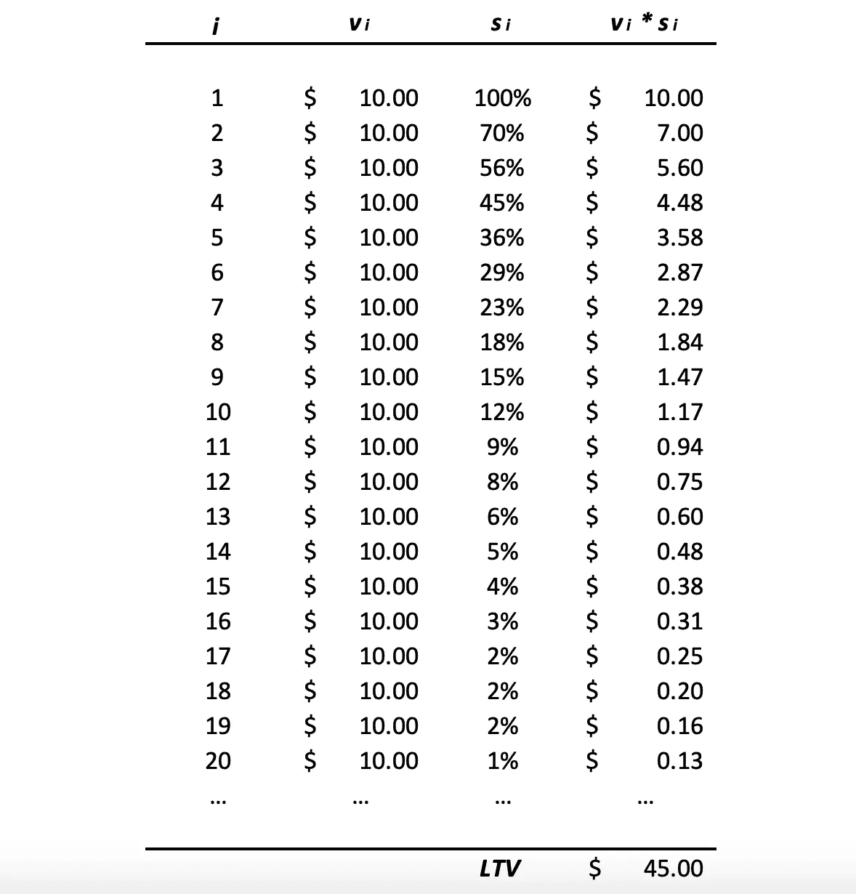
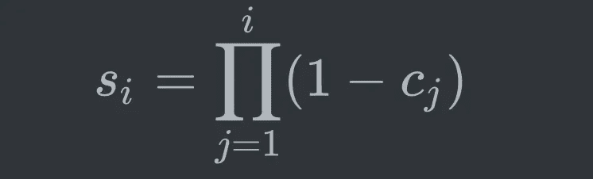
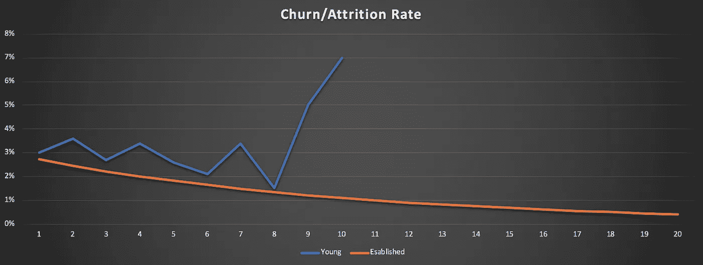
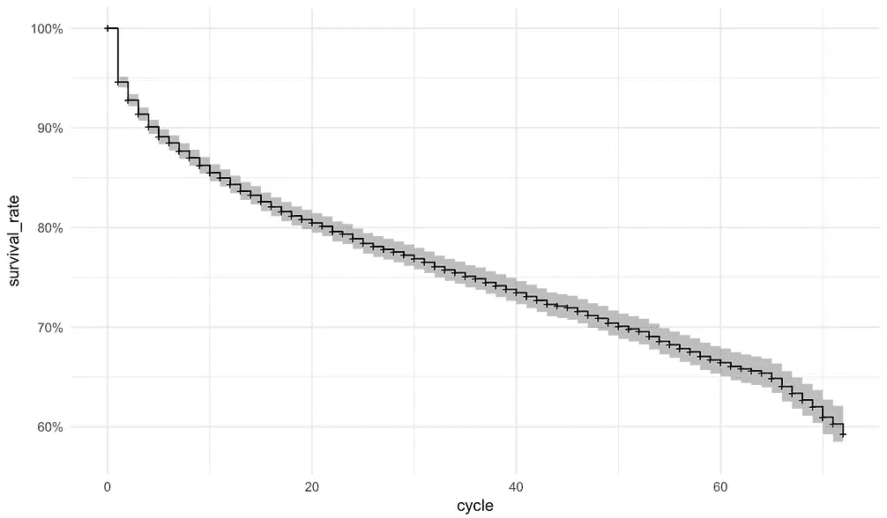
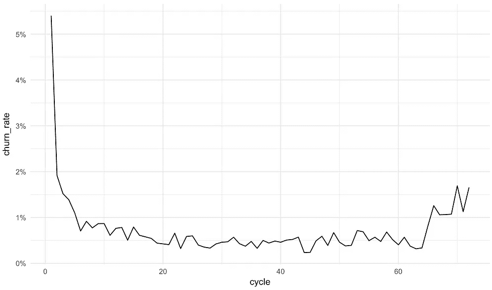
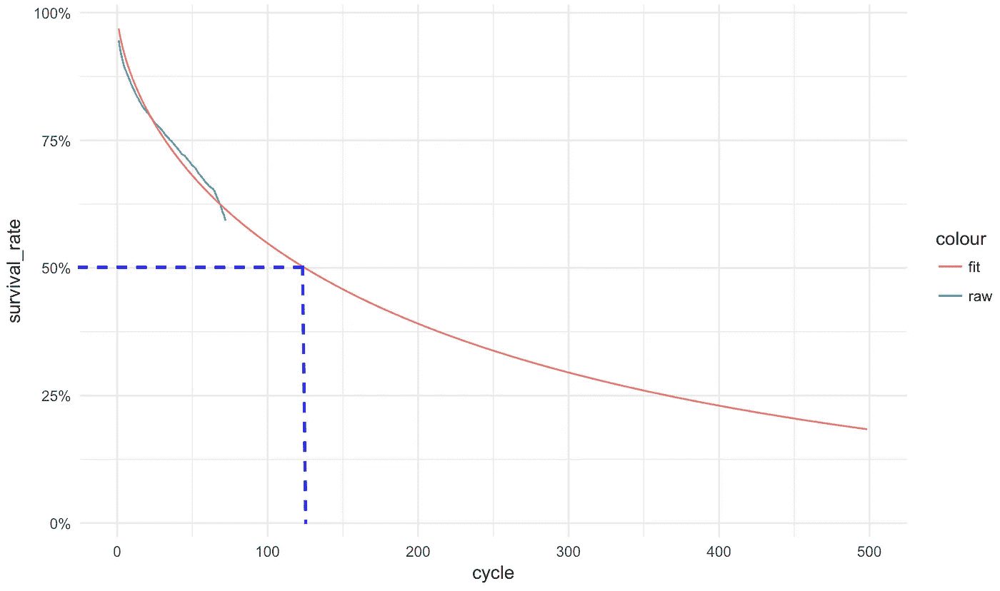
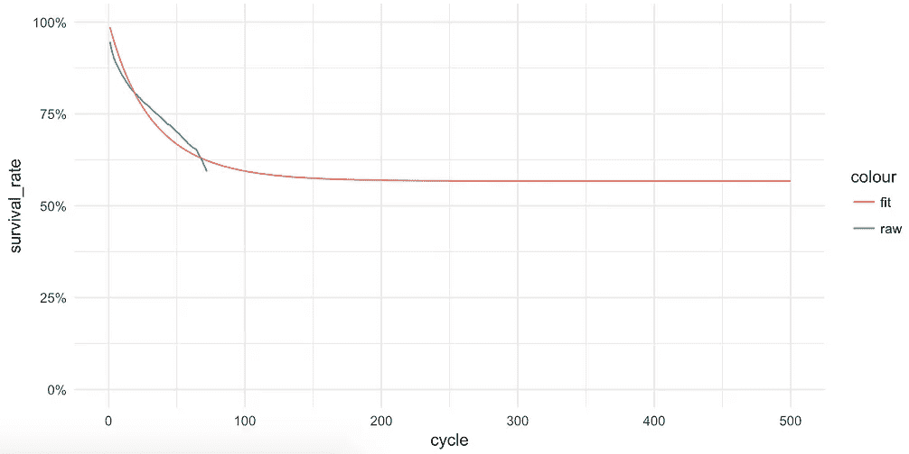
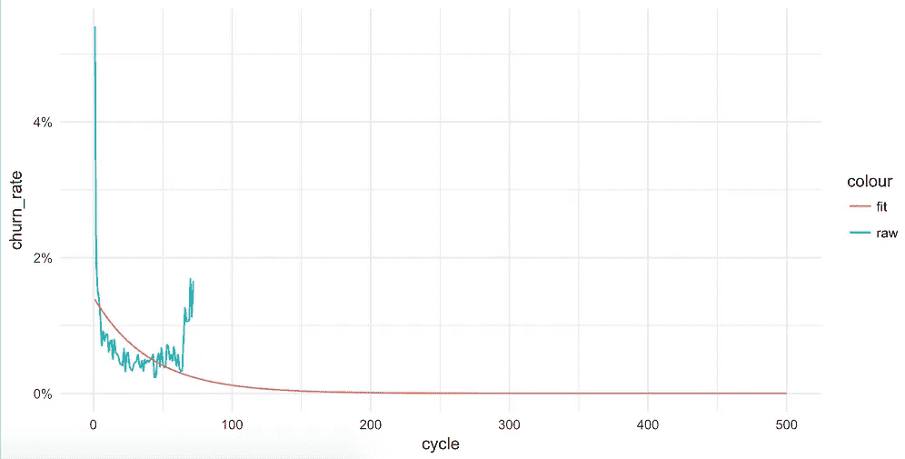
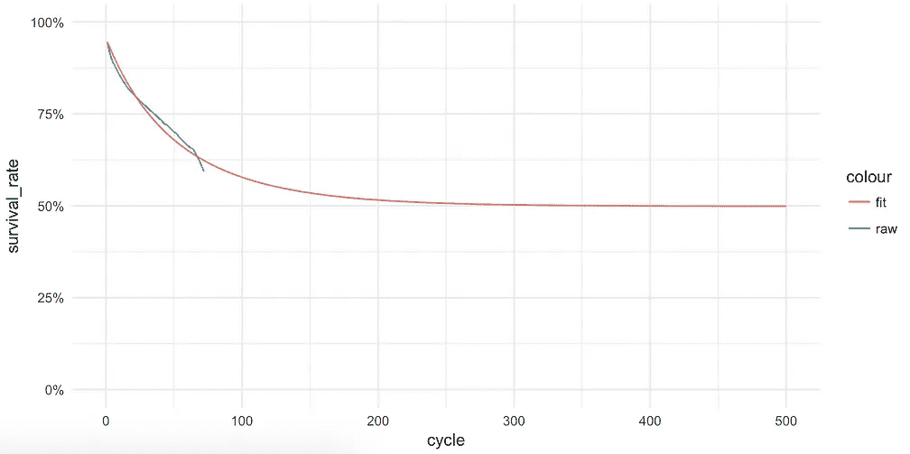
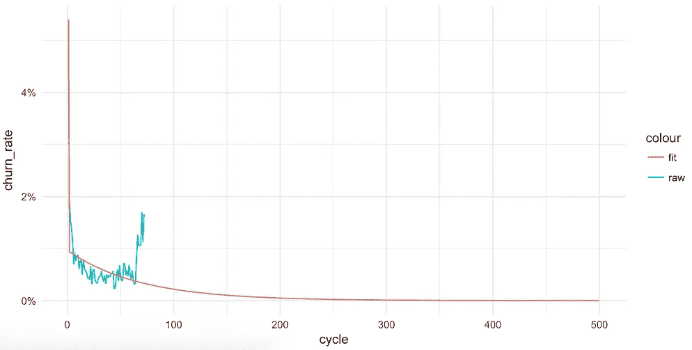

# 订阅业务的终身价值计算

> 原文：<https://towardsdatascience.com/calculating-life-time-value-for-subscription-businesses-d477a3194b32?source=collection_archive---------9----------------------->

Photo by [Austin Distel](https://unsplash.com/@austindistel?utm_source=medium&utm_medium=referral) on [Unsplash](https://unsplash.com?utm_source=medium&utm_medium=referral)

这是千真万确的，如果你不能衡量它，你就不能管理你的业务。基于订阅的业务的一个关键指标是终身价值(LTV)或客户终身价值(CLV)。简而言之，LTV 意味着在客户的一生中产生的总预期价值。让我们进一步分解这个概念:

*   LTV 是一个**期望值**，这意味着它是平均的或统计推断的。
*   LTV 衡量**价值**，即企业关心的价值指标，如收入、利润等。
*   LTV 已经过了他的一生。例外的情况是，一家企业在一段时间后会终止与客户的关系😢，这是极不可能的，也是违背常识的。

在数学上，客户 LTV 可以表示为:

LTV calculation

其中`v_i`代表价值，`s_i`代表计费周期`i`的留存率或存活率。计费周期可以是一周、一个月、一个季度，甚至一年，这取决于商业模式。周期总数`N`代表利息的持续时间，也取决于商业模式。对于按年订阅的模式，`N = 100`应该足够好了。从数学公式来看，我想你已经知道为什么 LTV 度规越来越受欢迎了。它同时衡量盈利能力(`v_i`)和客户忠诚度或粘性(`s_i`)，并将它们很好地结合成一个指标。让我们用下面的玩具例子来说明计算。

LTV calculation

如表中所示，订阅产品在每个计费周期从客户身上获得 10 美元的价值。周期流失率为 30%,因此保留的客户百分比为 100%、70%、56%……因此，第 1、2、3 周期产生的有效客户价值为 10 美元、7 美元、5.6 美元……将所有产生的价值相加，总 LTV 约为 45 美元(40 个周期后该数字稳定下来)。

如您所见，计算非常直观。然而，对于一个真正的企业或产品来说，这可能一点也不简单。一种情况是`v_i`可能会受到通货膨胀、商品成本波动、季节性等因素的影响。另一种情况是，观察到的账单周期总数可能不足以构建计算 LTV 所需的`s_i`，这最有可能发生在年轻企业。在接下来的内容中，我将关注后一种情况，并展示如何使用更系统的方法来计算`s_i`。

# 模拟存活率

我们通常不会直接获得存活率`s_i`，而是从计费周期流失率`c_i`入手。`s_i`和`c_i`的关系如下图所示。

Survival rate calculated from churn rate

显然，流失率在 0%(没有客户在该周期后流失)和 100%(每个客户在该周期后流失)之间，因此随着周期数的增加，存活率总是从 100%下降到 0%。有几种方法可以获得流失率`c_i`。

## 1.经验计算

获取流失率最简单的方法就是根据历史观察值计算每个计费周期的流失率，也称为[卡普兰-迈耶估计量](https://en.wikipedia.org/wiki/Kaplan%E2%80%93Meier_estimator) (KM 曲线)，可以表示如下

其中`d_i`是周期`i`中的下降次数，`n_i`是周期`i`开始时的客户数。

这种方法直观且易于实施和计算，但是，它通常不适用于年轻的企业。具体来说，一个年轻的企业通常没有很多计费周期，没有大量的`n_i`可用于计算流失率。下图显示了年轻企业和成熟企业之间的比较。请注意，对于年轻的企业，流失率比已建立的企业跨越的周期更少，并且在接近结束时变得更嘈杂，因为其总样本量`n_i`在接近最后一个周期时变得越来越小，而对于已建立的企业来说，情况并非如此。你要知道，嘈杂的流失率更多的是一种短暂的影响。随着企业客户群的增长和稳定，将会有更多的客户数据可用，因此嘈杂的蓝色曲线应该越来越接近平滑的橙色曲线。

Churn Rate Comparison

至于计算，可以用 excel、SQL、Python、R 等。在 R 中，已经存在一个名为`suvival`的包来简化生存分析，包括 KM 生存曲线计算。以 [IBM Watson telco 客户演示数据集](https://github.com/IBM/invoke-wml-using-cognos-custom-control)为例，我们可以用如下所示的几行代码计算并绘制 KM 存活率和流失率曲线。

(Left) Survival curve in black with 95% confidence band in gray (Right) Churn rate

如果你有兴趣了解更多关于 KM 曲线的知识，你可以看看 Lauren Oldja 写的一篇关于它的详细文章。

## 2.统计推断

正如前面的方法所指出的，我们不能真的把卡普兰-迈耶方法用于年轻的企业。那么，还有别的办法吗？是的，统计数据来拯救我们了。为了构建一个合理的生存曲线来估计只有几个周期可用的 LTV，我们需要进行统计推断。

与非参数 Kaplan-Meier 方法(其中没有估计参数)不同，统计推断是参数化的。其思想是，我们假设客户流失事件遵循一定的概率分布。常用的分布模型有指数、对数正态、威布尔、伽玛等。给定统计分布模型，然后您可以使用最大似然法来找到符合历史流失数据的最佳参数。在拟合之后，可以使用该模型推断未来周期的流失概率。R 中的`survival`包也为生存模型拟合提供了很好很简单的工具。继续前面的例子，我们可以使用下面的代码来生成拟合的生存曲线

Survival curve using Weibull Model

正如你所看到的，拟合的生存变动是平滑的，我们能够用它来估计未来的存活率，用于 LTV 计算。此外，我们可以从曲线中得出一些有趣的指标。例如，我们预计 50%的客户将在第 120 周期前离开，如上面的蓝色虚线所示。您还可以计算生存曲线下的面积，以获得客户的平均终身任期期望。

## **3。机器学习**

机器学习无处不在，预测未来。我们还可以利用它来计算流失率。事实上，它是我最喜欢的选择，因为我们可以针对这个问题使用各种机器学习技术，如特征工程，交叉验证，正则化等。

客户流失建模本质上是一个二元分类问题。有许多机器学习模型可以解决这个问题，但是，我使用逻辑回归，因为我们需要推断未来的流失率，因此看不见的计费周期和模型，如随机森林和梯度提升机器无法执行这种推断。以下代码使用了 H2O 机器学习包，并拟合了流失和周期之间的单变量逻辑回归模型。

(Left) Survival rate by cycle (Right) churn rate by cycle

正如我们所看到的，虽然这个简单的模型可以拟合生存和流失曲线的整体趋势，但它并不能很好地拟合 cycle 1。为了减轻这种情况，一个技巧是您可以添加一个二进制特性`special_cycle`,对于周期 1 为 1，其余为 0。修改后的代码和结果如下。

(Left) Survival rate by cycle (Right) churn rate by cycle

# 结论

在本帖中，我们讨论了订阅业务的 LTV 公式和计算方法，并重点讨论了计算存活率/流失率的 3 种不同方法。我希望你喜欢这篇文章，并让我知道你的想法！