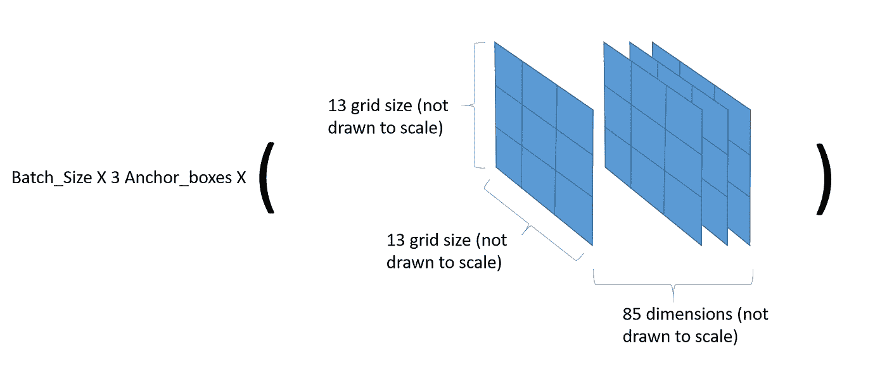
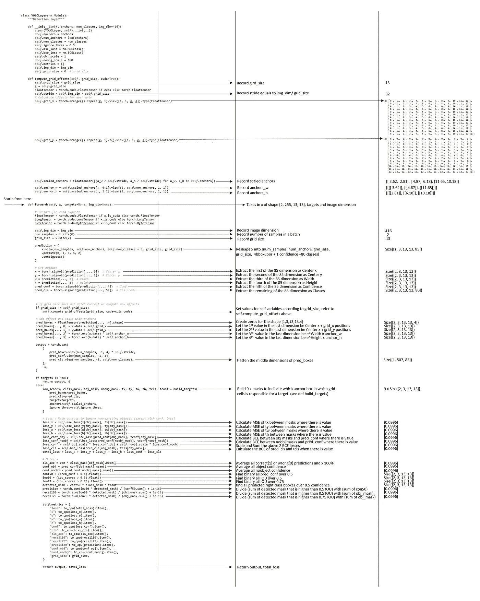
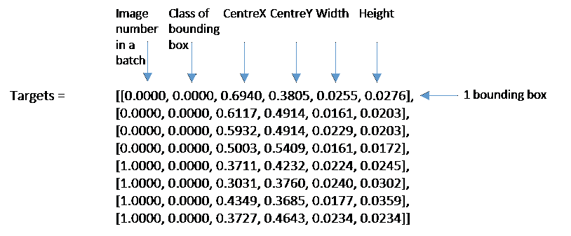
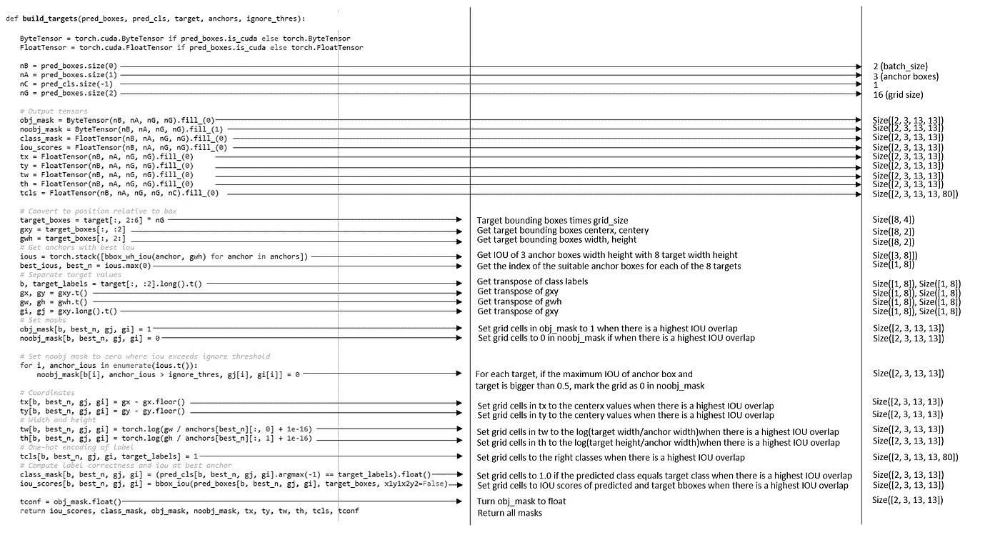

# 计算 Yolo (v3)层的损耗

> 原文：<https://towardsdatascience.com/calculating-loss-of-yolo-v3-layer-8878bfaaf1ff?source=collection_archive---------4----------------------->

## Yolo v3 模型的实现

Yolov3 是最先进的对象检测模型，使其成为快速准确的实时对象检测模型。有没有想过 Yolov3 车型的症结在哪里？秘密在于 Yolo 模型的 Yolo 层。

# Yolov3 架构

Yolov3 模型接收 416x416 的图像，用经过训练的 Darknet-53 主干对其进行处理，并在三个尺度上产生检测。在每个比例下，输出检测的形状为(批量大小 x 锚盒数量 x 网格大小 x 网格大小 x 85 维)。

Output detections of shape (batch_size x num_of_anchor_boxes x grid_size x grid_size x 85 dimensions)

Yolov3 的架构在[https://towardsdatascience . com/Yolo-v3-object-detection-53 FB 7d 3 bfe 6 b](/yolo-v3-object-detection-53fb7d3bfe6b)的 Yolo v3 网络架构图中描绘得非常好(请阅读这个故事了解 Yolo v3 架构)。在该图描述的所有组件中，有 3 个检测层，它们也是 Yolo 层。三个 Yolo 层中的每一层负责计算三个不同尺度的损耗。然后将三个不同尺度的损耗相加，用于反向传播。每个 Yolo 层利用 85 个维度来计算损耗。前 4 个维度对应于边界框的中心线、中心线、宽度和高度。接下来的 1 维对应于边界框的客观性分数，最后的 80 维对应于边界框的独热编码类预测。计算以下 4 种损失:

1.  包围盒的中心线、中心线、宽度和高度的 MSE

2.包围盒的客观分数的 BCE

3.包围盒的无客观性分数的 BCE

4.包围盒的多类预测的 BCE

详细实现代码由[https://towards data science . com/yolo-v3-object-detection-53 FB 7d 3 bfe 6 b](/yolo-v3-object-detection-53fb7d3bfe6b)。解释和张量形状被附加以帮助解释下面的代码。

Yolo 层采用一个复杂的形状特征(批量大小 x 锚盒数量 x 网格大小 x 网格大小 x 85 个维度)来计算上述 4 个损失。首先，基于标记的目标，它首先创建形状的 Obj 掩码((batch _ size x num _ of _ anchor _ boxes x grid _ size x grid _ size x 85 维)以指示哪些边界框应该包含预测，并创建形状的 Noobj 掩码(batch _ size x num _ of _ anchor _ boxes x grid _ size x grid _ size x 85 维)以指示哪些边界框不应该包含预测。有了掩模，可以成功地将目标与相同形状的预测进行比较，以计算四个损失。具体实现见下文。

YoloLayer Class from models.py from [https://towardsdatascience.com/yolo-v3-object-detection-53fb7d3bfe6b](/yolo-v3-object-detection-53fb7d3bfe6b)

从数据集中选取 batch_size 目标，如下所示:

A batch_size targets

基于标记的目标，下面的 build_targets 函数创建形状的 obj 掩码(batch _ size x num _ of _ anchor boxes x gridsize x gridsize)来指示哪些边界框应该包含预测，并创建形状的 noobj 掩码(batch _ size x num _ of _ anchor boxes x gridsize x gridsize)来指示哪些边界框不应该包含预测。

Build_targets function from utils.utils.py from [https://towardsdatascience.com/yolo-v3-object-detection-53fb7d3bfe6b](/yolo-v3-object-detection-53fb7d3bfe6b)