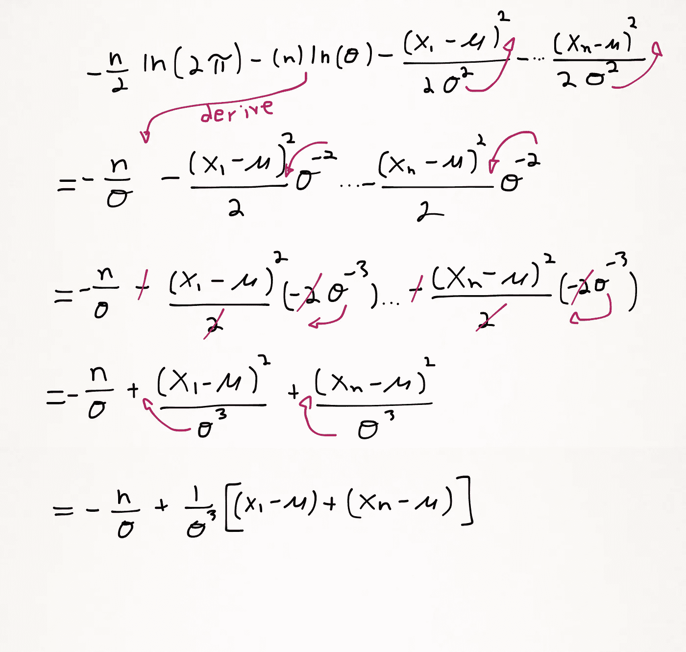

# 逐步手动计算最大似然估计

> 原文：<https://towardsdatascience.com/calculating-maximum-likelihood-estimation-by-hand-step-by-step-3a740c637c20?source=collection_archive---------4----------------------->

我写这个是因为我找不到很多教程来展示这个计算的详细数学。所以我决定把它彻底写出来，并展示所有的步骤，以防有一段时间没有做过微积分的人需要一点指导。

高斯分布很容易通过以平均值为中心的一组数据和围绕平均值的点的对称分布来识别。在分析数据时构建高斯分布，其中每个点都是独立实验的结果，这有助于可视化数据并应用于类似的实验。为了找到一组数据的最佳分布，计算最大似然估计(MLE)。

用于创建分布的两个参数是:

*   **平均值** **(μ)(mu)—** 该参数决定分布的中心，较大的值导致曲线进一步向左平移。
*   **标准偏差(σ)(sigma) —** 该参数决定曲线的宽度，较大的值产生较短和较宽的曲线，较小的值产生较细和较高的曲线。

# 简化高斯分布函数

## 似然估计函数:

## 高斯函数的 Subbing

## 拿走木头

## 用多点简化方程

## 对函数相对于 **μ(平均值)**求导

## 对函数相对于 **σ** 求导(标准偏差)

## 将等式设为零，以找到μ的最佳值

## 将等式设为零，以找到σ的最佳值

