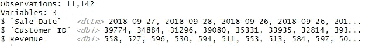
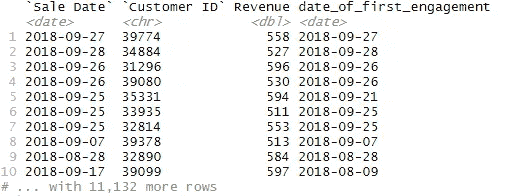
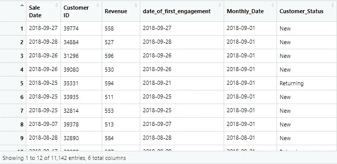
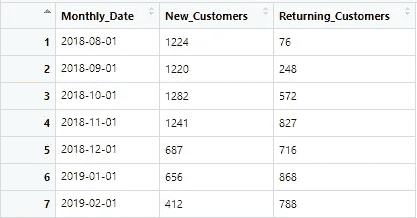
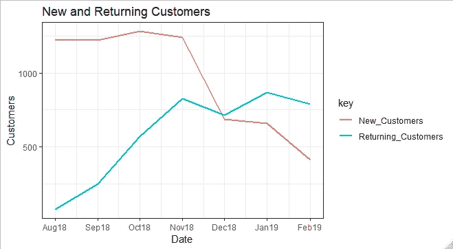

# 在 R 中计算新客户和老客户

> 原文：<https://towardsdatascience.com/calculating-new-and-returning-customers-in-r-909518f62264?source=collection_archive---------18----------------------->

我最近遇到一个问题，我想计算新客户和老客户。所以，我很自然地谷歌了一下，惊讶地发现我在 R 中找不到任何关于它的解决方案，这通常是大多数 R 博客/教程的问题，它们不是非常面向商业的。

由于在网上找不到解决方案，我开始自己动手。我能够使用 DAX 和 Power Pivot 在 Excel 和 Power BI 中很快找到解决方案，但我想在 r 中完成它。实际上，我有点不好意思承认这个解决方案非常简单。我期望你对 R 中的 **Tidyverse** 包有一些基本的了解，主要是 **dplyr** 来理解本教程。

在继续之前，我们首先需要决定如何定义一个客户是“新客户”还是“回头客”

## 新客户

任何过去没有与我们合作过的客户都将被归类为“新客户”

## 回头客

任何过去与我们合作过的客户，如果在当前期间再次与我们合作，都被视为“回头客”

## 加载库

```
library(tidyverse)# For data manipulation
library(readxl) # Read in Excel File
library(lubridate)# Working with Dates
```

## 加载和查看数据

我们使用下面的代码读入销售数据，并查看一下数据类型。

```
**sales_data** <- read_xlsx(path="C:\\Users\\ACER\\Downloads\\sale_data.xlsx")glimpse(sales_data)
```

我们得到以下输出。销售日期显示为日期时间变量，而客户 ID 被识别为数字类型。



我们现在将使用 dplyr 中的 mutate 函数将“销售日期”和“客户 ID”列分别更改为日期和字符类型。

```
**sales_data** <- sales_data%>%
 mutate(`Sale Date` = dmy(`Sale Date`),
        `Customer ID`=as.character(`Customer ID`))
```

现在我们的数据已经准备好了，我们要做的第一件事就是计算每一行中每个客户的首次签约日期。这将决定他们在那个时间点是新客户还是回头客。

```
**sales_data** <- sales_data %>%
group_by(`Customer ID`)%>%
mutate(date_of_first_engagement=min(`Sale Date`))%>%
ungroup()
```

由于我们想计算每一行中每个客户的第一次接洽日期，我们将首先按“客户 ID”对数据进行分组，然后使用 **mutate** 函数计算他们在“销售日期”使用 **min** 函数与我们第一次接洽的时间。这基本上是在 r 中计算条件计算列的一种非常有用的方法。
一旦计算完成，我们将取消对它的分组，因为我们不想要任何基于“客户 ID”的进一步计算。下面是我们的数据集在计算完成后的样子



在第 10 行，客户“39099”于 2018 年 9 月 17 日与我们合作，但我们可以看到，他们与我们的首次合作日期是 2018 年 8 月 9 日，这意味着在 9 月 17 日，该客户是“回头客”，而在 8 月 9 日，他们是“新客户”。

使用这个逻辑，我们现在将创建一个新列——“客户状态”。我们将使用 **case_when** 函数，根据“销售日期”和“首次接洽日期”的差异，在每个时间点对每个客户进行分类

```
**sales_data** <- sales_data%>%
 mutate(Customer_Status = case_when(`Date Interviewed`>date_of_first_engagement ~ "Returning",
`Date Interviewed` == date_of_first_engagement ~ "New",
 TRUE ~ "Other"))
```

基本上，我们所做的是计算如果客户的“销售日期”大于客户的第一次合作日期，那么这意味着他们以前与我们合作过，因此是“回头客”，如果他们的“销售日期”等于他们的第一次合作日期，那么这意味着这是他们第一次与我们合作，因此在那个时间点上是“新客户”。以下是数据集的外观。



我们的数据终于准备好了！现在我们可以对它做一些有趣的分析。我想看看我们每个月有多少“新”和“回头客”。我们将使用 **group by** 和**summary**函数来得到这个结果

```
**New_and_Returning_Customers** <-  sales_data%>%
group_by(floor_date(`Sale Date`,unit = 'month'))%>%
summarise
(New_Customers = n_distinct(`Customer ID`[Customer_Status=="New"]),Returning_Customers= n_distinct(`Customer ID`[Customer_Status=="Returning"]))
```

因为我想按月分组，所以我使用 lubridate 包中的 **floor_date** 函数将“销售日期”四舍五入到最近的月份，然后使用条件非重复计数来获得每月新老客户的唯一计数。



我们可以使用 **ggplot2** 包来制作一个简单的数据折线图

# 结论

现在我们已经了解了如何计算新客户和老客户，我们可以对他们进行各种分析。本教程的目的是让你了解如何以一种相对简单明了的方式进行计算。