# 在 Python 中计算字符串相似度

> 原文：<https://towardsdatascience.com/calculating-string-similarity-in-python-276e18a7d33a?source=collection_archive---------0----------------------->

以任何方式、形状或形式比较字符串都不是一项简单的任务。除非它们完全相等，否则比较很容易。但大多数时候情况并非如此——最有可能的是，你想看看给定的字符串是否类似于学位，那完全是另一回事。


Photo by [Tomasz Frankowski](https://unsplash.com/@sunlifter?utm_source=medium&utm_medium=referral) on [Unsplash](https://unsplash.com?utm_source=medium&utm_medium=referral)

让我们用一个例子来更深入地探讨这个问题。你有一个网页，它需要一些**用户输入**——假设出于某种原因，你决定使用文本字段而不是下拉菜单来显示位置信息。用户有可能会打错字，而您不希望错字存储在您的数据库中。你想要正确无误的版本。

***但是你会如何着手纠正弦呢？*** 我的意思是你可以硬编码它，但是你真的要这么做吗？有太多的输入错误选项，硬编码通常不是一个好主意。

这就是本文的目的。我想让你们熟悉我最擅长的两种字符串匹配或相似性计算技术:

1.  莱文斯坦距离
2.  余弦相似性

第一个主要用于解决打字错误，我发现如果你想比较两个文档，它几乎没有用。这就是梯子的用处。恰恰相反，对错别字检测没用，但对一整句话，或者**文档相似度**计算很棒。

阅读完本文后，您将能够做到以下几点:

*   确定哪种相似性算法适合您的情况
*   用 Python 实现

***好了，准备好潜水了吗？*** 走吧。

# 莱文斯坦距离

让我们从一个基本定义开始:

> 在信息论、语言学和计算机科学中，Levenshtein 距离是衡量两个序列之间差异的字符串度量。非正式地，两个单词之间的 Levenshtein 距离是将一个单词变成另一个单词所需的单个字符编辑(插入、删除或替换)的最小数量。[1]

用最简单的话来说，您想要计算需要对字符串 *A* 执行多少次转换才能使其等于字符串 *B* 。该算法也被称为 ***编辑距离*** ，所以这可能是你更熟悉的术语。

要在 Python 中使用它，你需要安装它，比如说通过 ***pip*** :

```
pip install python-Levenshtein
```

仅此而已。现在让我们看看如何使用它。

因为' *Levenshtein* '很难正确输入，而且我之前说过我主要用它来检测输入错误，这将是一个很好的第一个例子。但是首先，进口:

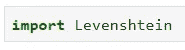

现在你可以计算距离了:

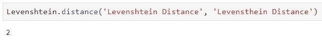

第一个打对了，第二个是我直接打出来的，你知道，没有先谷歌一下。乍一看，它们看起来一模一样，所以作为最终用户，您可能甚至不会注意到拼写错误。但是如果存储在某个**数据库**中，用于以后的分析，那就大不一样了。

我以前也说过，我不会对更长的字符串或整个文档使用这种算法，原因如下:

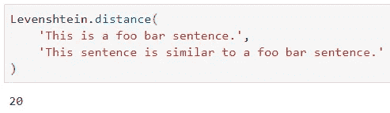

如你所见，两个句子传达了几乎相同的信息，但是从一个句子到另一个句子需要 20 次转换。所以，如果你已经设置字符串在低于某个阈值时自动匹配，20 可能不是那个阈值，因为它对于像这两个这样的简单短句来说太大了。

那是它的余弦兄弟来救援的地方。

# 余弦相似性

和以前一样，让我们从一些基本定义开始:

> 余弦相似性是内积空间的两个非零向量之间的相似性的度量，它度量它们之间角度的余弦。[2]

By Giphy: [https://giphy.com/gifs/CiYImHHBivpAs/html5](https://giphy.com/gifs/CiYImHHBivpAs/html5)

我知道，这不是最干净的定义，但我觉得足够好了。它需要一些数学知识，如果你没有，请参考下面这篇文章(*线性代数中的向量*):

[](/linear-algebra-essentials-with-numpy-part-1-af4a867ac5ca) [## Numpy 线性代数基础(第一部分)

### 学习数据科学的基本线性代数技能—第 1/2 部分

towardsdatascience.com](/linear-algebra-essentials-with-numpy-part-1-af4a867ac5ca) 

好吧，让我们进一步提炼。

根据定义，您应该首先计算两个矢量之间的**角。但是你不能把一个句子，表示成 n 维空间中的一个向量。**

你需要从所有你想计算相似度的“句子”中构造一个向量空间。这个向量空间将有**多的维度，就像所有句子中唯一的单词加在一起**一样多。

好吧，我们先导入，我会即时解释一切:

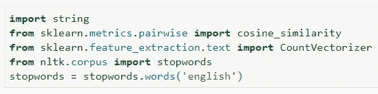

您将需要 ***string*** 模块来删除字符串中的标点符号——句子*和句子*和句子*。默认情况下，*是不同的，您希望避免这种情况。***count vectorizer***会负责将字符串转换成数字向量，这也很简洁。最后，由于这篇文章是用英语写的，你需要删除那些最常见的没有意义的单词——它们被称为**停用词**——比如“*我*”、“*我*”、“*我自己*”等等。

如果你不删除停用词，你会得到一个更高维的空间，向量之间的角度会更大——意味着更少的相似性——即使向量传达的信息几乎相同。

现在我将宣布一些任意的，在某种程度上相似的句子的列表。这是一个列表，因为向量空间将由所有唯一的单词创建，这将确保每个向量具有相同的维数，因为您无法计算不同维空间中向量之间的角度:

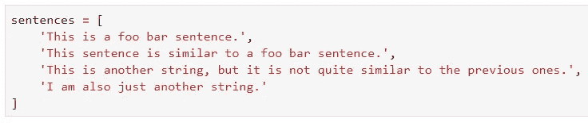

***还记得进口吗？*** 我们进口了不少，是时候好好利用一下了。我将声明一个函数，它将执行以下操作:

1.  从给定字符串中删除标点符号
2.  将字符串小写
3.  删除停用词

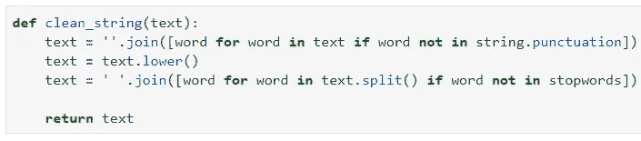

现在你实际上不需要一个循环来为每个句子应用那些变换，你可以使用内置的 ***映射*** 函数:

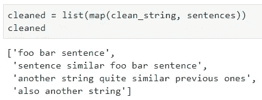

太好了，准备工作差不多完成了。现在，您将利用 ***计数矢量器*** 的能力来执行一些魔术(*不是真正的*)。它将在*维空间中创建 ***k*** 个向量，其中 ***k*** 是句子的数量， ***n*** 是所有句子组合起来的唯一词的数量。然后，如果一个句子包含某个单词，则该值为 1，否则为 0:*

*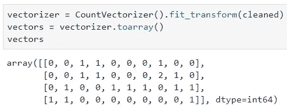*

*准备工作到此结束。这太多了(*有点像*)，但是值得。如果您现在从获得的数字向量计算余弦相似性，您将获得以下矩阵:*

*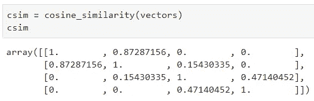*

*对角线元素是 1，这是有意义的，句子 **X** 与句子 **X** 完全“相似”。然而，分割这个矩阵是不方便的，所以我决定定义一个函数来计算两个给定向量的相似性。请记住，***cosine _ similarity()***期望 2D 数组，输入向量默认为 1D 数组，所以这就是我们需要整形的原因:*

*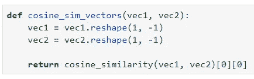*

*为了确认一切正常:*

*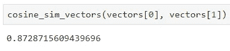*

*太酷了。在现实世界的例子中，这可以用于向用户提供一些推荐，例如，基于他的评论与其他每个用户的评论的相似性。*

# *在你走之前*

*计算数值向量之间的相似度并不难，诀窍是先把字符串转换成数值向量，在这个过程中丢弃一切不相关的东西。*

*作为一个练习，这将是一个好主意，找到一些未标记的电子邮件或其他一些文本的数据集，并尝试使用相似性度量将它们以某种方式分组。你看一下 **TF-IDF** 可能也是个好主意，因为我在本文中没有解释它。*

*无论如何，感谢你的阅读，我希望你能从中得到一些有用的东西。*

*喜欢这篇文章吗？成为 [*中等会员*](https://medium.com/@radecicdario/membership) *继续无限制学习。如果你使用下面的链接，我会收到你的一部分会员费，不需要你额外付费。**

*[](https://medium.com/@radecicdario/membership) [## 通过我的推荐链接加入 Medium-Dario rade ci

### 作为一个媒体会员，你的会员费的一部分会给你阅读的作家，你可以完全接触到每一个故事…

medium.com](https://medium.com/@radecicdario/membership)* 

# *参考*

*[1][https://en.wikipedia.org/wiki/Levenshtein_distance](https://en.wikipedia.org/wiki/Levenshtein_distance)*

*[https://en.wikipedia.org/wiki/Cosine_similarity](https://en.wikipedia.org/wiki/Cosine_similarity)*