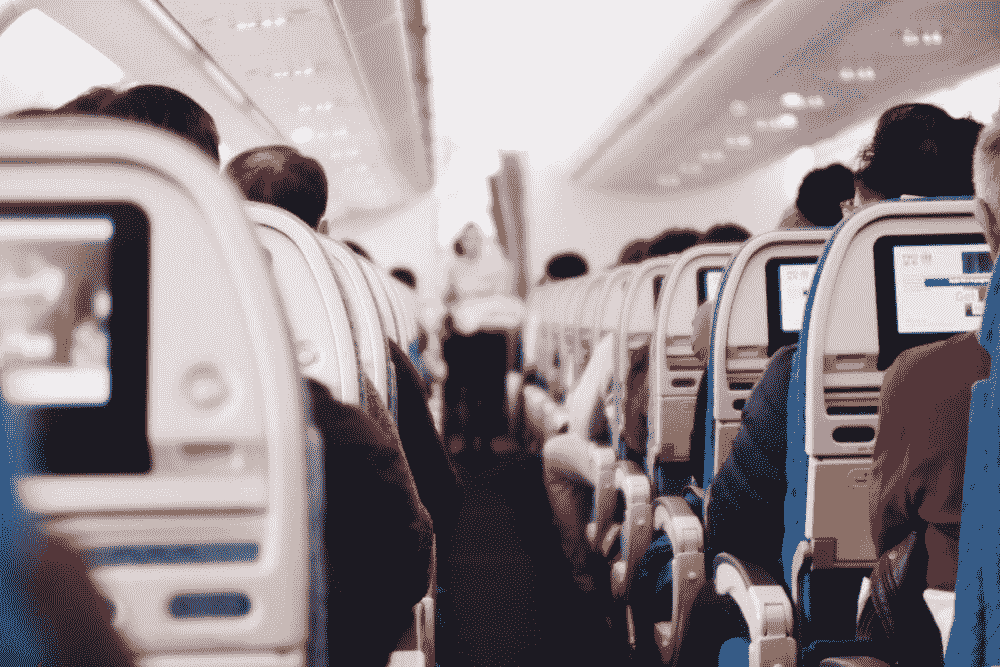
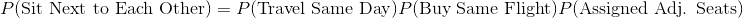
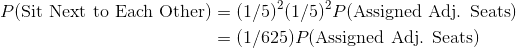
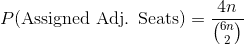

# 计算这个假期你在飞机上坐在前任旁边的几率

> 原文：<https://towardsdatascience.com/calculating-the-odds-you-sit-next-to-your-ex-on-a-flight-this-holiday-season-c87c52c49fe5?source=collection_archive---------27----------------------->

## 剧透:这比你一生中被闪电击中一次的可能性还小！

Credit [Suhyeon Choi](https://unsplash.com/@by_syeoni) at [Unsplash](https://unsplash.com/photos/tTfDMaRq-FE)

最近，我坐上了从波士顿到 Ft 的飞机。劳德代尔来我家度假。我迟到了，是最后一批被允许登机的人之一。我走到飞机后部，找到我的座位，问坐在过道上的人是否可以让我坐在中间的座位上。她从笔记本电脑上抬起头——是我的前任！当我们在飞机上叙旧的时候，我不停地想，我们不太可能各自订了票，但是我们最后却坐在了一起。这种可能性有多大？让我们来计算一下！

我们需要做三件事才能坐到一起:

1)我们决定在同一天起飞

我们在同一天买了同一趟航班

航空公司给我们安排了相邻的座位

我们可以把我们坐在一起的概率写成:

在这个分析中，我们将做一个简化的假设，即航空公司随机分配座位给乘客，即使实际上有人可以支付额外的费用来获得他们选择的座位。

假设我们两个人都打算在 2019 年 12 月 16 日到 12 月 20 日这一周回家旅行，我们随机地统一决定了我们的旅行日期。类似地，让我们假设一天有 5 个航班选项，我们随机地统一选择航班。我们的等式现在是:

我们需要计算一家航空公司分配给我们相邻座位的概率。飞机可以有许多不同的座位安排，但让我们假设所有的飞机都有 30 排，每排有两组 3 个座位。这实际上非常接近精神航空公司运营的空客 A320 的实际座位图。

计算这个概率似乎令人生畏，但我们现在可以通过假设飞机只有一排来简化事情。在这种情况下，我和我的前任有 15 (6 选 2)对可能的座位，但其中只有 4 对是相邻的座位(左侧和右侧的靠窗和中间、过道和中间)。所以，拿到相邻座位的概率是 4/15。

如果有两排，则有 66 (12 选 2)对可能的座位，但其中只有 8 对是相邻的(每排 4 对)。我们可以从这种模式推断出下面的公式，其中 n 是飞机上的行数:

Probability of getting adjacent seats at random. n is the number of rows on the plane.

代入这个公式，概率是 0.007449。我们也可以通过[模拟](https://github.com/freddyaboulton/seat-simulation/blob/master/simulation.py)来验证这个答案。

为了得到最终的答案，我们代入我们的第一个方程，得到 0.0000119 或者大约十万分之一。这大约是你一生中 30 次*少一次被雷击的概率！*

*一路平安，假期愉快。我希望你用这些时间与朋友和家人相聚:)*