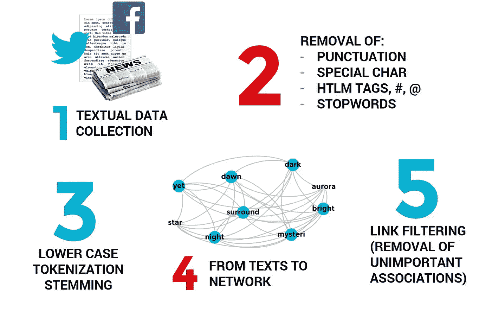
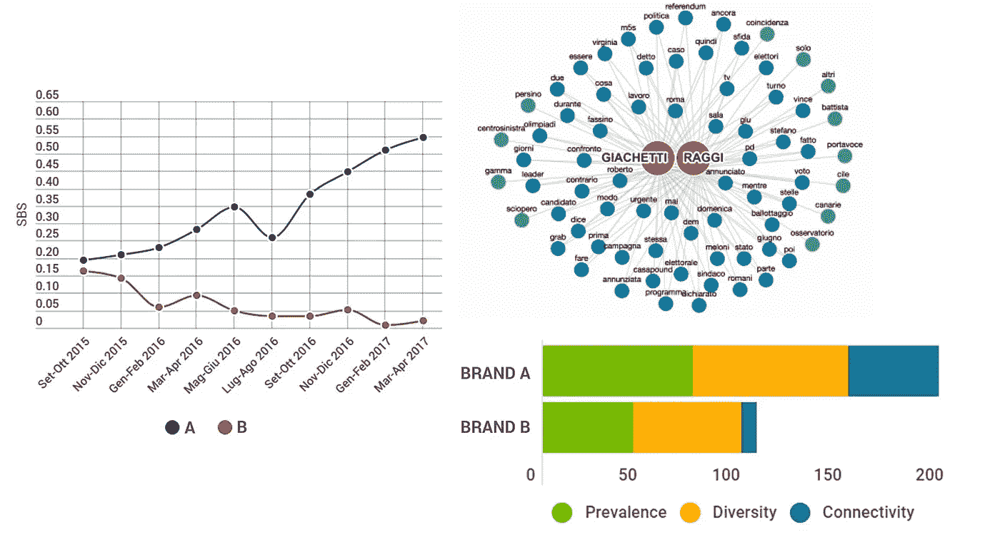

# 用 Python 计算语义品牌得分

> 原文：<https://towardsdatascience.com/calculating-the-semantic-brand-score-with-python-3f94fb8372a6?source=collection_archive---------16----------------------->

## 大数据时代的品牌智能


**语义品牌得分** ( **SBS** )是一个新颖的指标，旨在评估一个或多个品牌在不同背景下的重要性，只要有可能分析**文本数据**，甚至**大数据**。

相对于一些传统措施的优势在于，SBS 不依赖于对小样本消费者进行的调查。这一衡量标准可以根据任何文本来源进行计算，例如报纸文章、电子邮件、推文、在线论坛、博客和社交媒体上的帖子。这个想法是通过对**大文本数据**的分析来捕捉洞察和**诚实信号** 。消费者或其他品牌利益相关者的自发表达可以从他们通常出现的地方收集——例如，如果研究博物馆品牌的重要性，可以从旅游论坛收集。这样做的好处是减少了因使用问卷而产生的偏见，因为受访者知道他们正在被观察。SBS 还可以适应不同的语言，并研究特定单词或一组单词的重要性，不一定是“品牌”。

“品牌”可以是一个政治家的名字，或者是代表一个概念的一组词(例如，“创新”的概念或者一个公司的核心价值)。该指标用于评估一个新品牌取代一个旧品牌时发生的转变动态[1]。语义品牌得分也有助于将品牌的重要性与其竞争对手的重要性联系起来，或者分析单个品牌的重要性时间趋势。在一些应用中，分数被证明对于预测目的是有用的；例如，已经发现政治候选人在网络媒体上的品牌重要性与选举结果之间存在联系[4]，或者博物馆品牌的重要性与游客数量的趋势之间存在联系[6]。使用 SBS 的出版物的更新列表是 [**，可在此处**](https://semanticbrandscore.com/articles/sbsarticles.html) 获得。

## 品牌重要性的三个维度

SBS 衡量**品牌重要性**，这是品牌资产的基础[1]。事实上，这一指标部分受到了众所周知的品牌资产概念化以及品牌形象和品牌意识结构的启发(参见凯勒的[工作](https://journals.sagepub.com/doi/abs/10.1177/002224299305700101?journalCode=jmxa))【2】。

品牌重要性从三个维度来衡量:*流行度*、*多样性*和*连通性*。**流行度**衡量品牌名称的使用频率，即品牌被直接提及的次数。**多样性**衡量与品牌相关的词语的多样性。**连接性**代表品牌在其他单词或词组(有时被视为话语主题)之间架起连接桥梁的能力。

关于 SBS 的更多信息可以在[这个网站](https://semanticbrandscore.com/)【5】，在[维基百科](https://en.wikipedia.org/wiki/Semantic_Brand_Score)，或者阅读[这篇论文](https://www.sciencedirect.com/science/article/pii/S0148296318301541)【1】中找到。在本文中，我不会在这个指标上花太多时间，因为我的重点是描述使用 Python 3 计算它的主要步骤。

## 数据收集和文本预处理

语义品牌得分的计算需要结合文本挖掘和社会网络分析的方法和工具。图 1 说明了主要的初步步骤，包括数据收集、文本预处理和构建单词共现网络。



对于本入门教程，我们可以假设相关的文本数据已经收集并组织在一个文本文件中，其中每一行都是一个不同的文档。我将把两个想象的品牌*(‘BrandA’*和【T20’‘BrandB’)插入随机的英文文本中。

## 使用 Python 3 计算语义品牌得分

此演示的更新 **GitHub 库**可在 [**此处**](https://github.com/iandreafc/semanticbrandscore-demo) 获得。在那里，您将找到一个 Python 笔记本，以及示例文件。

```
**# Read text documents from an example CSV file**
import csv
readfile = csv.reader(open("AliceWonderland.csv", 'rt',  encoding="utf8"), delimiter = "|", quoting=csv.QUOTE_NONE)texts = [line[0] for line in readfile]**#I imported 4 Chapters of Alice in Wonderland**
print(len(texts))
print(texts[0][:200])
```

我将文本文件作为文本文档列表( *texts* )导入 Python，现在对其进行处理以删除标点符号、停用词和特殊字符。单词被小写并拆分成记号，从而获得一个新的 *texts* 变量，这是一个列表的列表。更复杂的文本操作**预处理**总是可能的(比如移除 html 标签或' # ')，为此我推荐阅读 Python 中自然语言处理的众多教程之一。停用词列表取自 NLTK 包。最后，单词词缀通过滚雪球式词干去除。

```
**##Import re, string and nltk, and download stop-words**
import re
import nltk
import string
from nltk.stem.snowball import SnowballStemmer**#Define stopwords**
#nltk.download("stopwords")
stopw = nltk.corpus.stopwords.words('english')**#Define brands (lowercase)**
brands = ['alice', 'rabbit']**# texts is a list of strings, one for each document analyzed.****#Convert to lowercase**
texts = [t.lower() for t in texts]
**#Remove words that start with HTTP**
texts = [re.sub(r"http\S+", " ", t) for t in texts]
**#Remove words that start with WWW**
texts = [re.sub(r"www\S+", " ", t) for t in texts]
**#Remove punctuation**
regex = re.compile('[%s]' % re.escape(string.punctuation))
texts = [regex.sub(' ', t) for t in texts]
**#Remove words made of single letters**
texts = [re.sub(r'\b\w{1}\b', ' ', t) for t in texts]
**#Remove stopwords**
pattern = re.compile(r'\b(' + r'|'.join(stopw) + r')\b\s*')
texts = [pattern.sub(' ', t) for t in texts]
**#Remove additional whitespaces**
texts = [re.sub(' +',' ',t) for t in texts]**#Tokenize text documents (becomes a list of lists)**
texts = [t.split() for t in texts]**# Snowball Stemming**
stemmer = SnowballStemmer("english")
texts = [[stemmer.stem(w) if w not in brands else w for w in t] for t in texts]
texts[0][:6]
```

在文本预处理过程中，我们应该注意不要丢失有用的信息。表情符号:-)，由标点符号组成，如果我们计算情感，它会非常重要。

我们现在可以继续计算**流行度**，它计算每个品牌名称的出现频率——**随后标准化**，考虑文本中所有单词的得分。我在这里选择的标准化是减去均值，除以标准差。其他方法也是可能的[1]。这一步对于比较考虑不同时间框架或文件集(例如，4 月和 5 月 Twitter 上的品牌重要性)的衡量标准非常重要。在合计流行度、多样性和连接性以获得语义品牌得分之前，绝对得分的标准化是必要的。

```
**#PREVALENCE**
**#Import Counter and Numpy**
from collections import Counter
import numpy as np**#Create a dictionary with frequency counts for each word**
countPR = Counter()
for t in texts:
    countPR.update(Counter(t))**#Calculate average score and standard deviation**
avgPR = np.mean(list(countPR.values()))
stdPR = np.std(list(countPR.values()))**#Calculate standardized Prevalence for each brand**
PREVALENCE = {}
for brand in brands:
    PR_brand = (countPR[brand] - avgPR) / stdPR
    PREVALENCE[brand] = PR_brand
    print("Prevalence", brand, PR_brand)
```

下一步也是最重要的一步是将文本(标记列表的列表)转换成一个社交网络，其中**节点是单词**和**链接根据每对单词之间的共现次数**进行加权。在这个步骤中，我们必须定义一个**共现范围**，即共现单词之间的最大距离(这里设置为 7)。此外，我们可能想要移除表示可忽略的同现的链接，例如那些权重= 1 的链接。如果这些不是品牌，有时去除隔离物也是有用的。

```
**#Import Networkx**
import networkx as nx**#Choose a co-occurrence range**
co_range = 7**#Create an undirected Network Graph**
G = nx.Graph()**#Each word is a network node**
nodes = set([item for sublist in texts for item in sublist])
G.add_nodes_from(nodes)**#Add links based on co-occurrences**
for doc in texts:
    w_list = []
    length= len(doc)
    for k, w in enumerate(doc):
        **#Define range, based on document length**
        if (k+co_range) >= length:
            superior = length
        else:
            superior = k+co_range+1
        **#Create the list of co-occurring words**
        if k < length-1:
            for i in range(k+1,superior):
                linked_word = doc[i].split()
                w_list = w_list + linked_word
        **#If the list is not empty, create the network links**
        if w_list:    
            for p in w_list:
                if G.has_edge(w,p):
                    G[w][p]['weight'] += 1
                else:
                    G.add_edge(w, p, weight=1)
        w_list = []**#Remove negligible co-occurrences based on a filter**
link_filter = 2
**#Create a new Graph which has only links above
#the minimum co-occurrence threshold**
G_filtered = nx.Graph() 
G_filtered.add_nodes_from(G)
for u,v,data in G.edges(data=True):
    if data['weight'] >= link_filter:
        G_filtered.add_edge(u, v, weight=data['weight'])**#Optional removal of isolates**
isolates = set(nx.isolates(G_filtered))
isolates -= set(brands)
G_filtered.remove_nodes_from(isolates)**#Check the resulting graph (for small test graphs)**
#G_filtered.nodes()
#G_filtered.edges(data = True)
print("Filtered Network\nNo. of Nodes:", G_filtered.number_of_nodes(), "No. of Edges:", G_filtered.number_of_edges())
```

确定了共现网络之后，我们现在可以计算**多样性**和**连通性**，它们是品牌节点的**独特性中心性**(之前我们使用度)和加权介数中心性。我们对这些值进行标准化，就像我们对患病率进行标准化一样。关于**显著性中心性**的更多信息在**【7】和 [**这篇文章**](/distinctiveness-centrality-56c1e6762328?source=friends_link&sk=4c92a370a95cc75a78d833bf10ceba7b) 中给出。你还需要安装 Python[***distinct ns*包**](https://github.com/iandreafc/distinctiveness) **。****

```
**#INSTALL AND IMPORT THE DISTINCTIVENESS PACKAGE**
#pip install -U distinctiveness
from distinctiveness.dc import distinctiveness**#DIVERSITY**
**#Calculate Distinctiveness Centrality**
DC = distinctiveness(G_filtered, normalize = False, alpha = 1)
DIVERSITY_sequence=DC["D2"]**#Calculate average score and standard deviation**
avgDI = np.mean(list(DIVERSITY_sequence.values()))
stdDI = np.std(list(DIVERSITY_sequence.values()))**#Calculate standardized Diversity for each brand**
DIVERSITY = {}
for brand in brands:
    DI_brand = (DIVERSITY_sequence[brand] - avgDI) / stdDI
    DIVERSITY[brand] = DI_brand
    print("Diversity", brand, DI_brand)
```

**如果我们将连通性计算为加权中间中心性，我们首先必须定义**逆权重**，因为权重被 Networkx 视为距离(这与我们的情况相反)。**

```
**#Define inverse weights** 
for u,v,data in G_filtered.edges(data=True):
    if 'weight' in data and data['weight'] != 0:
        data['inverse'] = 1/data['weight']
    else:
        data['inverse'] = 1**#CONNECTIVITY**
CONNECTIVITY_sequence=nx.betweenness_centrality(G_filtered, normalized=False, weight ='inverse')
**#Calculate average score and standard deviation**
avgCO = np.mean(list(CONNECTIVITY_sequence.values()))
stdCO = np.std(list(CONNECTIVITY_sequence.values()))
**#Calculate standardized Prevalence for each brand**
CONNECTIVITY = {}
for brand in brands:
    CO_brand = (CONNECTIVITY_sequence[brand] - avgCO) / stdCO
    CONNECTIVITY[brand] = CO_brand
    print("Connectivity", brand, CO_brand)
```

**每个品牌的**语义品牌得分**最终通过对流行度、多样性和连接性的标准化值求和得到。不同的方法也是可能的，例如取非标准化系数的几何平均值。**

```
**#Obtain the Semantic Brand Score of each brand**
SBS = {}
for brand in brands:
    SBS[brand] = PREVALENCE[brand] + DIVERSITY[brand] + CONNECTIVITY[brand]
    print("SBS", brand, SBS[brand])**#Generate a final pandas data frame with all results**
import pandas as pdPREVALENCE = pd.DataFrame.from_dict(PREVALENCE, orient="index", columns = ["PREVALENCE"])
DIVERSITY = pd.DataFrame.from_dict(DIVERSITY, orient="index", columns = ["DIVERSITY"])
CONNECTIVITY = pd.DataFrame.from_dict(CONNECTIVITY, orient="index", columns = ["CONNECTIVITY"])
SBS = pd.DataFrame.from_dict(SBS, orient="index", columns = ["SBS"])SBS = pd.concat([PREVALENCE, DIVERSITY, CONNECTIVITY, SBS], axis=1, sort=False)
SBS
```

## **分析演示**

****

**[这个链接](https://semanticbrandscore.com/demographs/graphs.html)指向一个简短的**演示**，一旦计算出 SBS，就可以进行分析[8]。为了推断独特的和共享的品牌特征，词共现网络可以另外用于研究文本品牌关联。品牌情感的计算也可以补充分析。**

## **结论**

**本文简要介绍了语义品牌得分，并提供了使用 Python 3 简化计算的简短教程。在学习基础知识的同时，我们应该记住，有许多选择可以做出，并且会影响结果。例如，可以选择不同的加权方案或标准化方法，将 3 个维度合并为一个分数。应特别注意选择合适的词共现范围。此外，可以使用不同的技术来修剪那些假定代表可忽略的同现的链接。**

**最后，如果计算是在大数据上进行的，最终的代码会复杂得多。像介数中心性这样的度量在大型图上有很高的计算复杂度。 [Graph-Tool](https://graph-tool.skewed.de/) 是一个对我帮助很大的库，因为它的性能明显高于 Networkx。在某些情况下，处理初始数据集可以降低复杂性。例如，对于在线新闻，人们可以选择只分析标题和第一段，而不是全部内容。**

**作为一名自学的 Python 程序员，我将感谢您对这个指标及其有效计算的任何评论或建议。随时 [**联系我**](https://andreafc.com) 。**

**您也可以查看 GitHub 资源库中的笔记本来了解这个演示( [**此处**](https://github.com/iandreafc/semanticbrandscore-demo) )。**

## **参考**

**[1] Fronzetti Colladon，A. (2018 年)。语义品牌得分。*商业研究杂志*， *88* ，150–160。[https://doi.org/10.1016/j.jbusres.2018.03.026](https://doi.org/10.1016/j.jbusres.2018.03.026)**

**[2]凯勒，K. L. (1993 年)。概念化，测量和管理基于顾客的品牌资产。*市场营销杂志*， *57* (1)，1–22。**

**[3] [维基百科上的语义品牌评分](https://en.wikipedia.org/wiki/Semantic_Brand_Score)页面。**

**[4] Fronzetti Colladon，A. (2020 年)。通过研究在线新闻中的品牌重要性预测选举结果。*国际预测杂志*， *36* (2)，414–427。【https://doi.org/10.1016/j.ijforecast.2019.05.013 **

**[5][Semanticbrandscore.com](https://semanticbrandscore.com/)，公制网站，有更新的链接和信息**

**[6] Fronzetti Colladon，a .，Grippa，f .，& Innarella，R. (2020 年)。研究线上品牌重要性与博物馆访客的关联性:语意品牌评分的应用。*旅游管理透视*， *33* ，100588。[https://doi.org/10.1016/j.tmp.2019.100588](https://doi.org/10.1016/j.tmp.2019.100588)**

**[7]弗伦泽蒂·科拉顿和纳尔迪，M. (2020 年)。社会网络中的独特性中心性。 *PLoS ONE* ， *15* (5)，e0233276。[https://doi.org/10.1371/journal.pone.0233276](https://doi.org/10.1371/journal.pone.0233276)**

**[8]弗伦泽蒂·科拉顿和格里帕(2020 年)。品牌情报分析。在 A. Przegalinska，F. Grippa 和 P. A. Gloor(编辑)，*协作的数字化转型*(第 125–141 页)。瑞士斯普林格自然基金会。[https://doi.org/10.1007/978-3-030-48993-9_10](https://doi.org/10.1007/978-3-030-48993-9_10)**