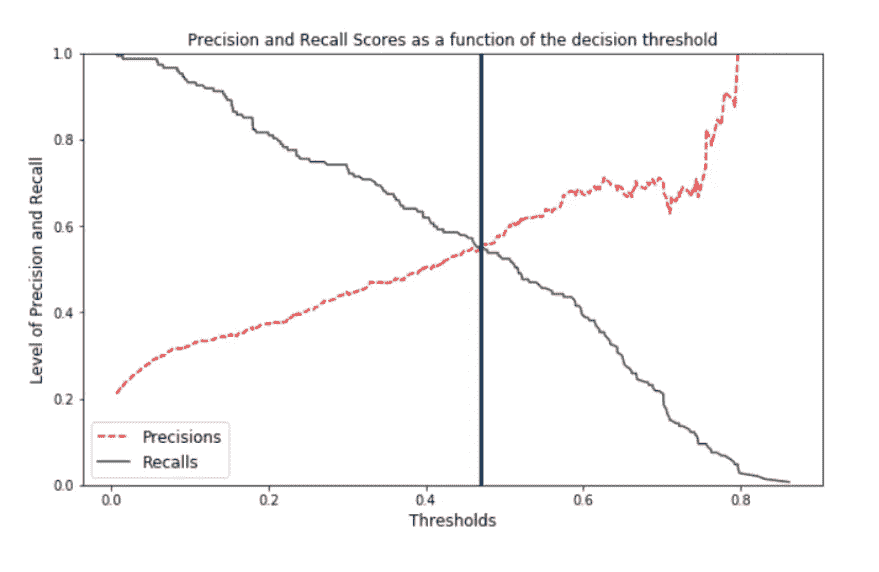
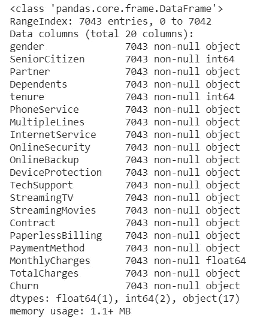

# 优化机器学习模型性能的预测和校准技术

> 原文：<https://towardsdatascience.com/calibration-techniques-of-machine-learning-models-d4f1a9c7a9cf?source=collection_archive---------10----------------------->

## 机器学习性能优化

## Python 代码示例



Image by author

C **校准**是改善预测模型误差分布的后处理技术。

机器学习(ML)模型的评估是部署之前的关键步骤。因此，有必要对一个 ML 模型进行行为分析。在许多实际应用中，除了模型的平均误差之外，了解该误差是如何分布的以及概率估计的好坏也很重要。根据我的经验，许多当前的 ML 技术在总体结果上是好的，但是具有差的误差分布评估。我将讨论常用的校准技术和使用分类的校准方法。

> 从科学的角度来看，ML 方法的主要目标是从给定的数据集建立一个假设(模型)。在学习过程之后，必须尽可能精确地评估假设的质量。

对于基于分类的模型，常见的度量是精度(误差的倒数)、f 度量或宏观平均。在概率分类中，除了正确分类实例的百分比之外，还使用了其他度量，如对数损失、均方误差(MSE)(或 Brier 氏评分)或 ROC 曲线下面积(AUROC)。如果输出不是二进制的，而是 0 到 1 之间的浮点数，那么分数可以用于排名。但是 0 和 1 之间的浮点数导致了*概率*，我们怎么知道我们是否可以相信它们是概率呢？

## 为什么我们需要校准的分类器:

我们需要一个好的分类器来区分真阳性和真阴性。我们这里要处理电信客户数据；因此，在" C *hurn"* 分析中，我们期望分类器触发" *Churn* "和" *NoChurn* "之间的标志，这允许我们通过调整阈值来校准该模型的灵敏度。这意味着，如果分类器可以检测到 90%的“流失”可能性，企业应该将其视为真正的标签。此外，大多数与分类相关的数据非常不平衡，其中*【流失】*的数量远远小于*无流失*。因此，我们可能想要重新采样数据以平衡它们，这样我们可能会使我们的模型过于激进，从而导致一些*偏差*。

## 二元分类器:

在处理两类分类问题时，我们总是可以把一类标为正类，而把另一类标为负类。测试集由 P 个正例和 N 个负例组成。一个分类器给他们每个人分配一个类，但是有些分配是错误的。为了评估分类结果，我们计算真阳性(TP)、真阴性(TN)、假阳性(FP)(实际上是阴性，但被分类为阳性)和假阴性(FN)(实际上是阳性，但被分类为阴性)例子的数量。它保持住了

*   TP + FN = P 和
*   TN + FP = N

分类器将 TP + FP 实例分配给正类，将 TN + FN 实例分配给负类。让我们定义几个众所周知和广泛使用的衡量标准:

*   FPrate = FP /N
*   TPrate = TP /P = Recall
*   Yrate = (TP + FP) /(P + N)
*   精度= TP/ (TP + FP)
*   准确率= (TP + TN)/ (P + N)。

精度和准确度通常用来衡量二元分类器的分类质量。也可以定义用于特殊目的的其他几种度量。我们将在下面的章节中对它们进行描述

## 概率分类器:

概率分类器是一个函数 f : X → [0，1],它将每个例子 X 映射到一个实数 f(x)。通常，选择阈值 t，其中 f(x) ≥ t 的例子被认为是正的，其他的被认为是负的。这意味着每对概率分类器和阈值 t 定义了一个二元分类器。因此，上一节中定义的度量也可用于概率分类器，但它们始终是阈值 t 的函数。注意，TP(t)和 FP(t)始终是单调递减函数。对于有限的示例集，它们是逐步的，而不是连续的。通过改变 t，我们得到一族二元分类器。

让我们用现有的电信数据做实验。

```
# Loading the CSV with pandas
data = pd.read_csv(‘Telco_Customer_Churn.csv’)data.dtypes # types of data in data set
```


```
#Removing customer IDs from the data set the columns not used in the predictive model.
df = data.drop(“customerID”, axis=1)
df.info()
```



我们将转换分类变量(*‘是’，‘否’*，等等)。)转换成数值。此外，需要将“*总费用”*转换为数字数据类型。此外，“*总费用*有 11 个缺失值。因此它将替换数据集中的 11 行。这里的预测变量是“*Churn”*。因此，也有必要将预测变量转换为二进制数值变量。

```
df.dropna(inplace = True)df[‘Churn’].replace(to_replace=’Yes’, value=1, inplace=True)
df[‘Churn’].replace(to_replace=’No’, value=0, inplace=True)# converting all the categorical variables into dummy variables
df_dummies = pd.get_dummies(df)
df_dummies.info()
```

## 分类算法:

我们将考虑物流回归和随机森林分类器来预测客户流失。重要的是在回归中调整变量，使所有变量都在 0 到 1 的范围内。

```
df_dummies = df_dummies.drop(“TotalCharges”, axis=1) # removing Total Charges to avoid multi-colinearity.# Using the data frame where we had created dummy variables
y = df_dummies[‘Churn’].values
X = df_dummies.drop(columns = [‘Churn’])# Scaling all the variables to a range of 0 to 1
features = X.columns.values
scaler = MinMaxScaler(feature_range = (0,1))
scaler.fit(X)
X = pd.DataFrame(scaler.transform(X))
X.columns = features
```

## 方法:

我们的第一步是使用 train-test-split 将我们的数据分成训练集和测试集，这将允许我们稍后交叉验证我们的结果。我们还对训练-测试-分割进行了分层，以确保在我们的训练集和测试集中发现相同比例的目标变量。

## 拆分数据:

x 是自变量的数据，y 是因变量的数据。测试大小变量决定了数据的分割比例。在 90 的培训/10 的测试比例中，这样做是很常见的。此外，需要对培训-测试-拆分进行分层，以获得平衡的拆分

```
X_train, X_test, y_train, y_test = train_test_split(X, y, test_size=0.1, random_state=101)
print(‘length of X_train and x_test: ‘, len(X_train), len(X_test))
print(‘length of y_train and y_test: ‘, len(y_train), len(y_test))
```

## 逻辑回归:

使用 ML 算法和因变量，这里的流失 1 或流失 0 是分类的。经过训练的模型可用于预测客户是否对测试数据集产生了兴趣。结果保存在“prediction_test”中，然后测量并打印准确度分数。

```
lr_model = LogisticRegression(solver=’lbfgs’).fit(X_train, y_train)
lr_prediction = lr_model.predict_proba(X_test)
prediction_test = lr_model.predict(X_test)
lr_pred = lr_model.predict(X_test)print(classification_report(y_test, prediction_test))
```


*   在第一类(NoChurn)的 557 个点中，该模型成功地正确识别了其中的 502 个点
*   在第 1 类的 147 个点中，模型正确预测了其中的 77 个点
*   在总共 704 个中，模型正确预测了其中 579 个。


准确率 82%(精确到 82.24%)。然而，考虑到数据是倾斜的，并且目标类别不平衡，这可能不是正确的衡量标准。所以，我们研究精确度，回忆，F 值。

混淆矩阵清楚地显示了模型性能，分为真阳性、真阴性、假阳性和假阴性。

*   精度是分类器不将实际上是负的实例标记为正的能力。对于每个类别，它被定义为真阳性与真阳性和假阳性之和的比率。
*   召回是分类器找到所有肯定实例的能力。对于每个类别，它被定义为真阳性与真阳性和假阴性之和的比率。
*   F1 分数是精确度和召回率的加权调和平均值，最好的分数是 1.0，最差的是 0.0。

## 等级校准(CC):

CC 是真实类别分布与估计类别分布的近似程度。以这种方式校准模型的标准方法是通过改变确定模型何时预测“*客户流失*或“NoChurn”的阈值，使该阈值对“客户流失”类更严格，对“NoChurn”类更温和，以平衡比例。

```
y_scores=lr_prediction
prec, rec, tre = precision_recall_curve(y_test, y_scores[:,1], )def plot_prec_recall_vs_tresh(precisions, recalls, thresholds):
 fig, ax = plt.subplots(figsize=(10,6))
 plt.plot(thresholds, precisions[:-1], “r — “, label=”Precisions”)
 plt.plot(thresholds, recalls[:-1], “#424242”, label=”Recalls”)
 plt.ylabel(“Level of Precision and Recall”, fontsize=12)
 plt.title(“Precision and Recall Scores as a function of the decision threshold”, fontsize=12)
 plt.xlabel(‘Thresholds’, fontsize=12)
 plt.legend(loc=”best”, fontsize=12)
 plt.ylim([0,1])
 plt.axvline(x=0.47, linewidth=3, color=”#0B3861")

plot_prec_recall_vs_tresh(prec, rec, tre)
plt.show()
```


正面类(*【流失】*)预测的准确率(58.33%)和召回率(52.38%)相对较低。交叉点上方的区域是良好性能水平的区域。下面的另一个区域是表现不佳的区域。原则上，这种类型的校准可能会产生更多的误差。事实上，通常情况下，我们希望获得一个有用的模型来解决非常不平衡的类分布问题，即少数类的例子非常少。

## AUROC 曲线:

衡量二元分类器性能的一种更直观的方法是接收器工作特性(AUROC)曲线下的面积。它说明了模型在多大程度上能够区分流失和非流失。

```
lr_prediction = lr_model.predict_proba(X_test)
skplt.metrics.plot_roc(y_test, lr_prediction)
```


> 众所周知，AUROC 曲线很少受到类别分布变化的影响(放大对 FP 的影响很小，而我们可以看到对 TP 的一些影响)。

宏平均独立计算每个类的指标，然后取平均值(因此平等对待所有类)，而微平均聚合所有类的贡献来计算平均指标。如果我们想知道系统在数据集上的整体表现，我们将考虑宏观平均。我们不应该用这个平均数做出任何具体的决定。另一方面，当我们的数据集大小不同时，微观平均是一个有用的度量。

因此，我们在这里看到，ROC 曲线未能明确显示平衡和不平衡情况之间的差异。此外，AUROC 分数不足以评估早期检索性能，尤其是当曲线相互交叉时。

我们将检查随机森林分类器；不过，我们就不再赘述了。类似的一套过程，如逻辑回归，可以做比较。

## 随机森林分类器:

同样，训练一个随机森林模型并在验证集上进行预测。

```
rf_model = RandomForestClassifier(random_state=101, n_estimators=100).fit(X_train, y_train)
rf_prediction = rf_model.predict_proba(X_test)
rf_model.score(X_test, y_test)
```

# 0.7798295454545454

## 概率校准(PC):

PC 伴随着概率估计的每个预测。如果我们预测我们有 99%的把握，如果我们只有 50%的时间是正确的，这是没有校准的，因为我们的估计过于乐观。类似地，如果我们预测我们只有 60%的把握，而我们 80%的时间是正确的，这是没有校准的，因为我们的估计太悲观了。在这两种情况下，正确猜测的数量或比例的期望值(在这种情况下是概率或置信度评估)与实际值不匹配。然后，校准被定义为预测概率与实际概率的接近程度。准确度和校准虽然相互依赖，但却是截然不同的两码事。

这里，我们有类别概率和标签来计算校准图的箱。

```
lr_y, lr_x = calibration_curve(y_test, lr_prediction[:,1], n_bins=20)
rf_y, rf_x = calibration_curve(y_test, rf_prediction[:,1], n_bins=20)fig, ax = plt.subplots()
# only these two lines are calibration curves
plt.plot(lr_x,lr_y, marker=’o’, linewidth=1, label=’lr’)
plt.plot(rf_x, rf_y, marker=’o’, linewidth=1, label=’rf’)# reference line, legends, and axis labels
line = mlines.Line2D([0, 1], [0, 1], color=’black’)
transform = ax.transAxes
line.set_transform(transform)
ax.add_line(line)
fig.suptitle(‘Calibration plot for Telecom data’)
ax.set_xlabel(‘Predicted probability’)
ax.set_ylabel(‘True probability in each bin’)
plt.legend(); plt.show()
```


```
def bin_total(y_true, y_prob, n_bins):
 bins = np.linspace(0., 1\. + 1e-8, n_bins + 1)# In sklearn.calibration.calibration_curve the last value in the array is always 0.
 binids = np.digitize(y_prob, bins) — 1return np.bincount(binids, minlength=len(bins))
bin_total(y_test, lr_prediction[:,1], n_bins=20)
```

#数组([191，88，47，58，46，32，30，32，24，24，25，22，22，19，24，17，2，1，0，0，0])

```
bin_total(y_test, rf_prediction[:,1], n_bins=20)
```

# array([213，70，59，47，39，42，27，27，22，18，26，21，22，18，7，12，10，6，7，11，0])

缺失的条柱具有 75%、85%和 95%的端点值。我们希望我们的预测能够避开那些空箱子，变得有鉴别力。在分类问题中，辨别和校准是并行不悖的。如果构建模型的目标是自动做出决策，而不是提供统计估计，有时它会出现在校准之前。在这里，查看 bin 中的点数，随机森林(橙色线)似乎比逻辑回归(蓝色线)更好。

一篇关于模型校准的有趣文章可以在 [***这里***](https://bit.ly/2IU9E7L) 找到补充阅读。

# 总结:

校准技术通常基于导出将值或概率转换为更好的估计值的变换。在分类的情况下，大多数转换技术通常包括宁滨或排序。我将为模型拟合评估推荐一个拟合优度测试(Hosmer-Lemeshow)。如果你有兴趣，你可以阅读 [***这篇***](https://www2.stat.duke.edu/~zo2/dropbox/goflogistic.pdf) 的文章来了解更多。

**我这里可以到达**[](https://www.linkedin.com/in/saritmaitra/)***。***