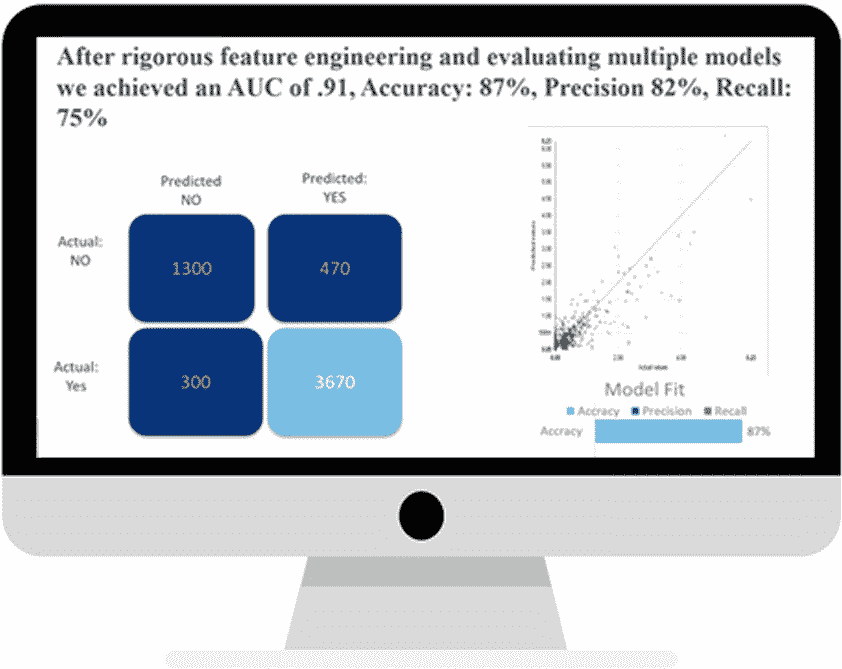
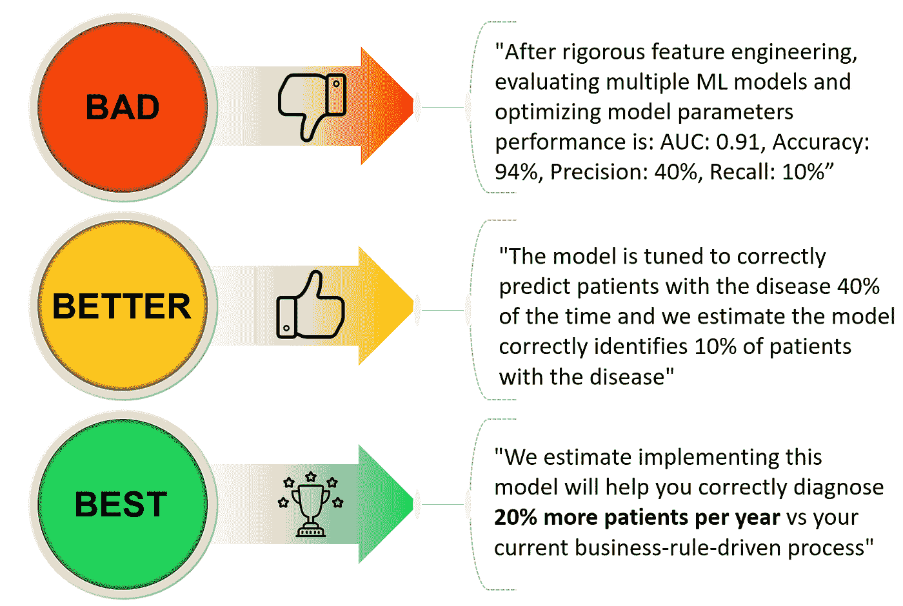

# 呼唤数据科学家—停止使用准确性、精确度或召回等衡量标准！

> 原文：<https://towardsdatascience.com/call-to-data-scientists-stop-using-measures-like-accuracy-precision-or-recall-1441f405e500?source=collection_archive---------16----------------------->

## [现实世界中的数据科学](https://medium.com/towards-data-science/data-science-in-the-real-world/home)

## 用决策者能理解的语言交流

These are important metrics, but know your audience and ensure your communicating in their language!

好吧这个标题是故意挑衅和夸张滴。正如我们的一位数据科学家所说“*我被这个标题吓坏了，但最终完全同意你的观点*。

我坚信机器学习和数据科学领域提供的机会，但我们必须诚实面对自己。越来越多的人持怀疑态度，期望过高，有些人甚至警告说数据科学领域正在出现[的信誉危机](https://www.datacamp.com/community/podcast/credibility-crisis-in-data-science)。

此外，许多决策者没有经过适当的培训来帮助解释、理解和正确应用我们模型的输出。

# 与 IMPACT 沟通

为此，我们需要更好地向关键利益相关者和决策者展示我们的影响力。最后，重要的是在业务问题的背景下，用非数据科学家能够理解的语言传达影响。

> “在业务问题的背景下重点构建您的模型结果”

例如，我不认为准确度、精确度和召回率这样的指标对大多数商业用户来说是特别有用的。在某些具有不平衡数据集的项目中，我们有个位数精度的数字，这导致了重大的业务影响，特别是在与模型正在取代的流程相关联的情况下。

这是关键点——我们需要确保将结果与当前的工作方式进行比较。

关键业务利益相关者通常不愿意实施甚至试验一个新模型，除非他们能够清楚地理解它如何对他们的关键业务度量产生重大影响。

# 如何最好地框定你的结果

如果可能的话，确保我们在最终用户能够理解的业务环境中制定结果符合我们的最佳利益。让我们想象一下，你正在与营销副总裁会面，向他展示你的诊断罕见疾病患者模型的结果。

当我们将模型结果转化为有助于支持关键利益相关方做出明智决策的信息时，请看下面的进展:

我承认这是一个简单的例子，而且还有其他需要考虑的因素，但是请把这个例子看作是说明性的。

> 在业务环境中，它应该是量化相对于当前流程的改进。

这就引出了两个重要的概念——*'***'*和一个 ***挑战者模型*** 的想法。在以分析为中心的项目的构思阶段，我们采用*“切合目的”*的设计原则。在直接跳到高级 ML 模型之前，确保您首先探索更简单的方法。在可能的情况下，首先考虑部署一种更简单的方法(即 *challenger model* )，看看是否能够实现预期的业务成果。*

# *你的利益相关者需要什么？*

**

*Photo by [Stephen Dawson](https://unsplash.com/@srd844?utm_source=medium&utm_medium=referral) on [Unsplash](https://unsplash.com?utm_source=medium&utm_medium=referral)*

*要记住的关键点是，您的决策者可能有不同的需求，这驱动了对重要指标的不同观点。有些人可能专注于增加销售额，有些人专注于降低成本，有些人可能专注于减少错误，而有些人只是希望你让他们的工作更容易。*

> *“避免不必要的模型腐烂——根据利益相关者的需求定义成功”*

*理想的情况是，在任何项目开始之前，与您的关键利益相关者合作，讨论这些重要的指标。用利益相关者的语言定义成功是推动有意义和持续的业务采用的主要因素，而不是让你的模型在架子上腐烂。*

**特别感谢我们两位才华横溢的数据科学家* [*艾米丽·科岗*](https://www.linkedin.com/in/emily-kogan-a61190b6/) *和* [*埃里克·舍兰*](https://www.linkedin.com/in/eriksjoland/) *对本文的贡献。**