# 骰子、民意测验和狄利克雷多项式

> 原文：<https://towardsdatascience.com/calogica-com-dice-polls-dirichlet-multinomials-eca987e6ec3f?source=collection_archive---------11----------------------->

## 概率规划在贝叶斯统计中的一些应用


Photo by [Jonathan Petersson](https://unsplash.com/photos/a6N685qLsHQ?utm_source=unsplash&utm_medium=referral&utm_content=creditCopyText) on [Unsplash](https://unsplash.com/search/photos/dice?utm_source=unsplash&utm_medium=referral&utm_content=creditCopyText)

作为学习贝叶斯统计的长期项目的一部分，我目前正在阅读安德鲁·吉尔曼、约翰·卡林、哈尔·斯特恩、大卫·邓森、阿基·维赫塔里和唐纳德·鲁宾撰写的[贝叶斯数据分析，第三版](http://www.stat.columbia.edu/~gelman/book/)，通常被称为 **BDA3** 。虽然在过去一年左右的项目中，我一直在使用贝叶斯统计和概率编程语言，如 [PyMC3](https://docs.pymc.io/) ，但这本书迫使我超越纯粹的从业者建模方法，同时仍然提供非常实用的价值。

以下是我觉得有趣的本书前几章的一些摘录。他们的目的是希望激励其他人学习贝叶斯统计，而不是试图对数学过于正式。如果有些东西在房间里受过训练的数学家看来不是 100%，请让我知道，或者只是稍微眯着眼睛看一下。；)

我们将涵盖:

*   一些常见的**共轭分布**
*   使用掷骰子的**狄利克雷多项式**分布示例
*   涉及**轮询来自 BDA3 的数据**的两个示例

# 共轭分布

在本书的第 2 章中，作者介绍了先验概率分布的几种选择，以及第 2.4 节中的**共轭分布**的概念。

来自[维基百科](https://en.wikipedia.org/wiki/Conjugate_prior)

> *在贝叶斯概率理论中，如果后验分布 p(θ | x)与先验概率分布 p(θ)在同一个概率分布族中，则先验和后验称为共轭分布，先验称为似然函数的共轭先验。*

约翰·库克在他的[网站](https://www.johndcook.com/blog/conjugate_prior_diagram/)上有一张有用的图表，展示了一些常见的共轭分布族:

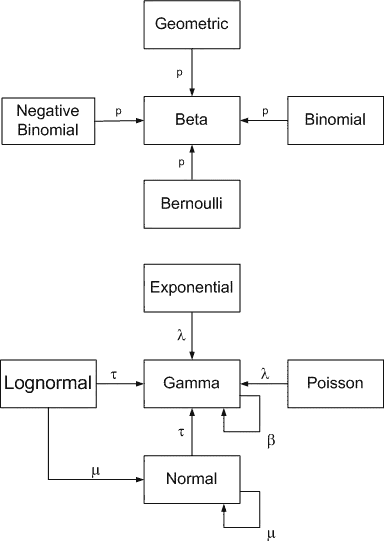

Conjugate Priors

共轭分布在概率论中是一个非常重要的概念，这在很大程度上是由于一些很好的数学性质使得计算后验概率更容易处理。即使有越来越好的计算工具，如 MCMC，基于共轭分布的模型也是有优势的。

# 贝塔二项式

共轭分布的一个更广为人知的例子是[Beta-二项式](https://www.statisticshowto.datasciencecentral.com/beta-binomial-distribution/)分布，它通常用于模拟一系列的硬币投掷(这是关于概率的帖子中一直存在的话题)。

*二项式*分布代表一系列伯努利试验的成功概率，而*贝塔*分布则代表每次试验成功概率的先验概率分布。

因此，硬币落在*头*上的概率 **p** 被建模为*β*分布(参数为α和β)，而*头*和*尾*的概率被假设为遵循*二项式*分布，参数为 **n** (代表翻转次数)和*β*分布 **p** ，因此

> p∞β(α，β)
> 
> y∞二项式(n，p)

# 伽马泊松

另一种常用的共轭分布是*伽马-泊松*分布，这样命名是因为参数化*泊松*分布的速率参数λ被建模为*伽马*分布:

> λ∞伽马(k，θ)
> 
> y∞泊松(λ)

虽然离散的*泊松*分布通常用于计数数据的应用，例如商店顾客、电子商务订单、网站访问，但是*伽马*分布用作建模这些事件发生率(λ)的有用分布，因为*伽马*分布仅建模正的连续值，但是在其他方面其参数化相当灵活:

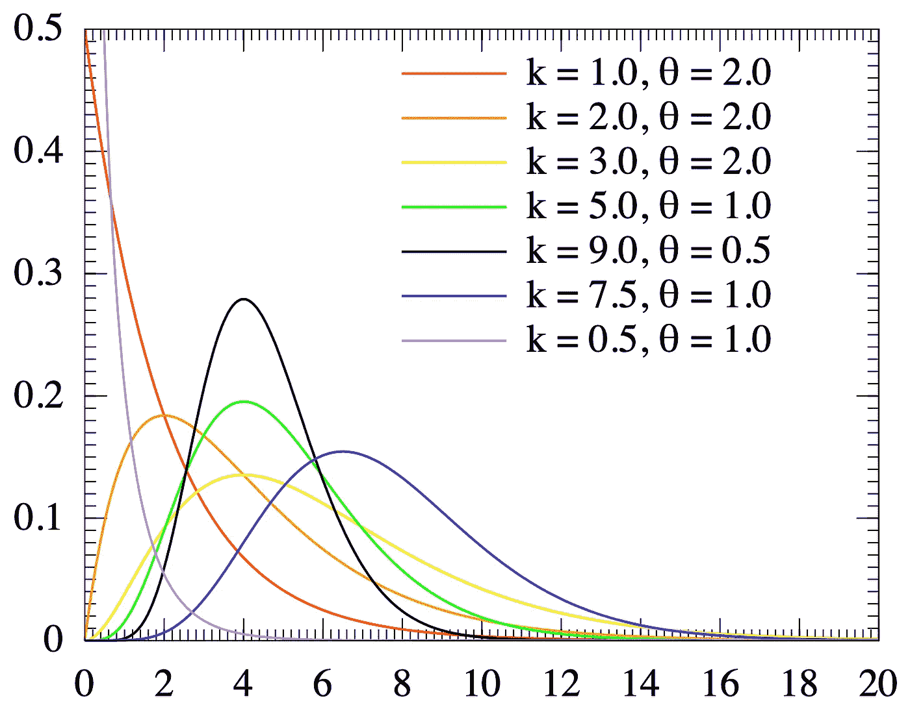

Gamma Distributions

这种分布也被称为[负二项分布](https://en.wikipedia.org/wiki/Negative_binomial_distribution#Gamma%E2%80%93Poisson_mixture)，我们可以将其视为泊松分布的*混合*。

如果你觉得这很困惑，你并不孤单，也许你会开始理解为什么我们经常试图用好的旧的正态分布来近似事物…

# 狄利克雷多项式

一个或许更有趣但似乎很少被提及的共轭分布的例子是 BDA3 第 3 章中介绍的[狄利克雷多项式](https://en.wikipedia.org/wiki/Dirichlet-multinomial_distribution)分布。

思考*狄利克雷-多项式*分布的一种方式是，*多项式*(即多项选择)分布是*二项式*分布(即二元选择)的推广，*狄利克雷*分布是*贝塔*分布的推广。也就是说， *Beta* 分布模拟单个*概率*p**概率**的概率，而 *Dirichlet* 模拟多个互斥选择的概率，由 a 参数化，a 被称为*浓度*参数，代表每个选择的权重(我们将在后面看到更多)。

换句话说，把**硬币**想象成*贝塔二项式*分布，把**骰子**想象成*狄利克雷多项式*分布。

> θ∞狄利克雷(a)
> 
> y∞多项式(n，θ)

在野外，我们可能会遇到*狄利克雷*分布，这些天经常出现在自然语言处理中的主题建模上下文中，它通常被用作[潜在狄利克雷分配](https://en.wikipedia.org/wiki/Latent_Dirichlet_allocation)(或 LDA)模型的一部分，这是一种奇特的方式，即我们试图计算出一篇文章属于给定内容的某个主题的概率。

然而，为了我们的目的，让我们在简单的多项选择的背景下看一下*狄利克雷多项式*，让我们从投掷骰子作为激励的例子开始。

# 扔骰子

(如果您想尝试这里的代码片段，您需要首先导入相关的 Python 库。或者您可以跟随本文附带的 [Jupyter 笔记本](https://nbviewer.jupyter.org/github/clausherther/public/blob/master/probabilistic_programming/Dirichlet%20Multinomial%20Example.ipynb)。)

```
import numpy as np
from scipy import stats
import pandas as pd

import matplotlib.pyplot as plt
import seaborn as sns

import pymc3 as pm
```

让我们首先创建一些表示 122 个六面骰子的数据，其中 **p** 表示公平骰子每一面的预期概率，即 1/6。

```
y = np.asarray([20,  21, 17, 19, 17, 28])
k = len(y)
p = 1/k
n = y.sum()print(n, p)**(122, 0.16666666666666666)**
```

仅仅看一个简单的数据柱状图，我们就怀疑我们可能处理的不是一个公平的死亡！

```
sns.barplot(x=np.arange(1, k+1), y=y);
```

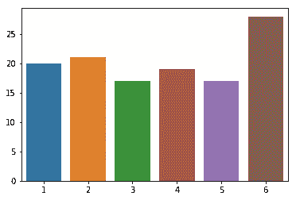

Barplot of rolls of six-sided die

然而，我们是贝叶斯统计的学生，我们想更进一步，量化我们在骰子的公平性方面的不确定性，并计算有人向我们扔骰子的概率。

让我们在 PyMC3 中建立一个简单的模型，它不仅可以计算 theta 的后验概率(即骰子每边的概率)，还可以估计骰子返回 6 的偏差。为此，除了未观察到的(`theta`)和观察到的(`results`)随机变量之外，我们还将使用 PyMC3 `Deterministic`变量。

对于θ上的先验，我们将假设非信息性的*均匀*分布，通过用参数`a`的一系列 1 初始化*狄利克雷*先验，一个 1 对应一个`k`可能的结果。这类似于将一个 *Beta* 分布初始化为 *Beta(1，1)* ，它对应于*均匀*分布(关于这个[的更多信息在这里](https://en.wikipedia.org/wiki/Beta_distribution#Bayes'_prior_probability_(Beta(1,1))))。

```
with pm.Model() as dice_model:

    # initializes the Dirichlet distribution with a uniform prior:
    a = np.ones(k) 

    theta = pm.Dirichlet("theta", a=a)

    # Since theta[5] will hold the posterior probability 
    # of rolling a 6 we'll compare this to the 
    # reference value p = 1/6 to determine the amount of bias
    # in the die 
    six_bias = pm.Deterministic("six_bias", theta[k-1] - p)

    results = pm.Multinomial("results", n=n, p=theta, observed=y)
```

从 3.5 版开始，PyMC3 包含了一个方便的函数，可以用平板符号绘制模型:

```
pm.model_to_graphviz(dice_model)
```

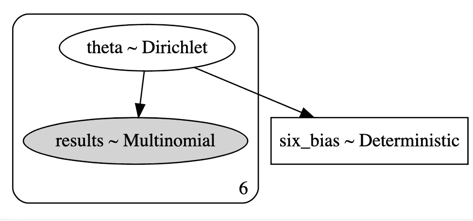

让我们使用默认的 NUTS 采样器从关节后部抽取 1000 个样本:

```
with dice_model:
    dice_trace = pm.sample(draws=1000) *Auto-assigning NUTS sampler...
Initializing NUTS using jitter+adapt_diag...
Multiprocess sampling (4 chains in 4 jobs)
NUTS: [theta]
Sampling 4 chains: 100%|██████████| 6000/6000 [00:01<00:00, 3822.31draws/s]*
```

从跟踪图中，我们已经可以看到其中一个θ后验概率与其余的不一致:

```
with dice_model:
    pm.traceplot(dice_trace, combined=True, lines={"theta": p})
```

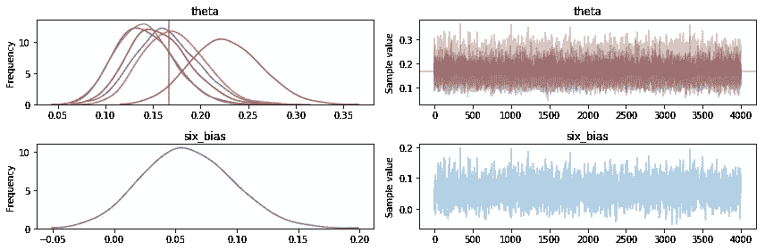

我们将绘制每个θ的后验分布，并将其与我们的参考值 **p** 进行比较，以查看 95% HPD(最高后验密度)区间是否包括 **p=1/6** 。

```
axes = pm.plot_posterior(dice_trace, 
                          varnames=["theta"], 
                          ref_val=np.round(p, 3))for i, ax in enumerate(axes):
    ax.set_title(f"{i+1}")
```

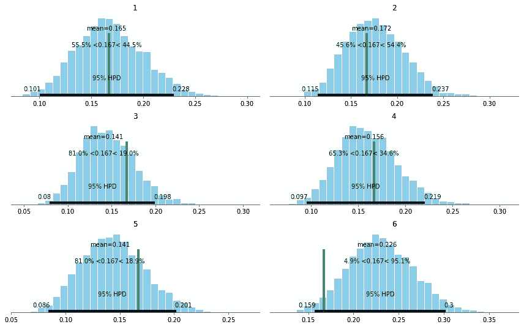

我们可以清楚地看到，掷出 6 的后验概率的 HPD 几乎不包括我们对公平骰子的期望值。

更准确地说，通过比较θ[Six]和 **p** ，让我们画出骰子偏向 6 的概率。

```
ax = pm.plot_posterior(dice_trace, 
                        varnames=["six_bias"], 
                        ref_val=[0])ax.set_title(f"P(Theta[Six] - {p:.2%})");
```

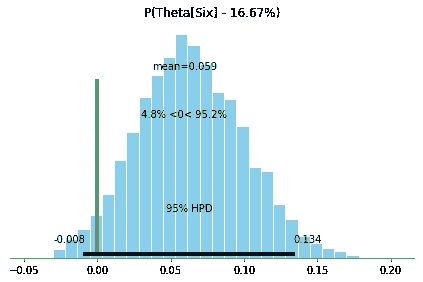

P(Theta[Six])

最后，我们可以通过计算参考线右侧 0:

```
six_bias = dice_trace["six_bias"]
six_bias_perc = len(six_bias[six_bias>0])/len(six_bias)

print(f'P(Six is biased) = {six_bias_perc:.2%}')**P(Six is biased) = 95.25%**
```

因此，我们的骰子有超过 95%的可能性偏向 6。最好买些新骰子…！

# 投票#1

让我们把狄利克雷多项式分布的回顾转向另一个例子，关于轮询数据。

在 BDA3 关于多变量模型的第 3.4 节，特别是关于分类数据的多项模型的第*节*中，作者引用了 1988 年老布什和迈克尔·杜卡基斯总统竞选中的一个不太成熟的投票数据示例。

对于那些当时不关注政治的人来说:布什以巨大优势获胜。自 1988 年以来，没有一位总统候选人能在选举人票或普选中获得与布什相同或更高的票数。

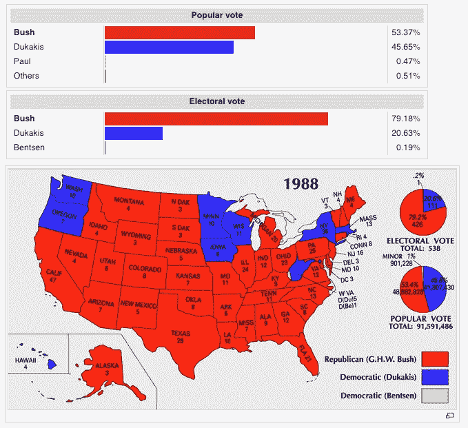

(Image credit: [https://commons.wikimedia.org/wiki/File:ElectoralCollege1988-Large.png)](https://commons.wikimedia.org/wiki/File:ElectoralCollege1988-Large.png))

反正回到数据问题！设置如下:

*   1，447 名可能的选民接受了关于他们在即将到来的总统选举中的偏好的调查
*   他们的回答是:
    T5 布什:727
    杜卡基斯:583
    其他:137
*   更多人投票给布什而不是杜卡基斯的概率有多大？即两个主要候选人的支持率有什么不同？

我们设置了数据，其中`k`代表受访者的选择数量:

```
y = np.asarray([727, 583, 137])
n = y.sum()
k = len(y)
```

我们再次建立了一个简单的狄利克雷多项式模型，并加入了一个`Deterministic`变量来计算兴趣值——布什和杜卡基斯的受访者概率之差。

```
with pm.Model() as polling_model:

    # initializes the Dirichlet distribution with a uniform prior:
    a = np.ones(k) 

    theta = pm.Dirichlet("theta", a=a)

    bush_dukakis_diff = pm.Deterministic("bush_dukakis_diff",
                                          theta[0] - theta[1])

    likelihood = pm.Multinomial("likelihood", 
                                 n=n, 
                                 p=theta, 
                                 observed=y)pm.model_to_graphviz(polling_model)
```

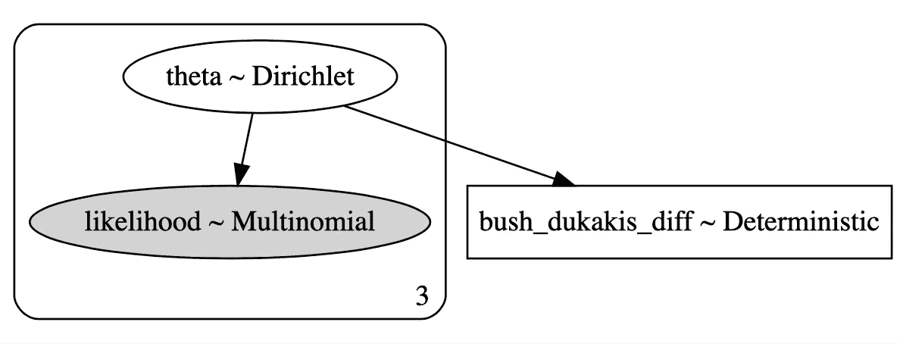

```
with polling_model:
    polling_trace = pm.sample(draws=1000)
```

看看布什和杜卡基斯的受访者之间的%差异，我们可以看到大部分的密度是**大于 0%** ，这表明布什在这次民意调查中有很大的优势。
我们还通过`scipy.stats`将 *Beta* 分布拟合到该数据，我们可以看到，2θ值的差值的后验非常好地拟合了 *Beta* 分布(鉴于狄利克雷分布作为 *Beta* 分布的多元推广的特性，这是可以预料的)。

```
_, ax = plt.subplots(1,1, figsize=(10, 6))
sns.distplot(polling_trace["bush_dukakis_diff"], 
     bins=20, ax=ax, kde=False, fit=stats.beta)ax.axvline(0, c='g', linestyle='dotted')
ax.set_title("% Difference Bush vs Dukakis")
ax.set_xlabel("% Difference");
```

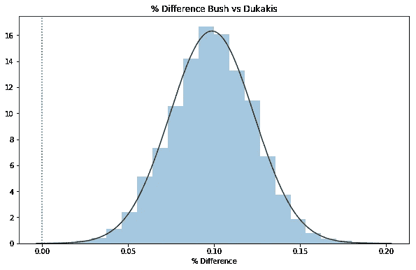

带有`bush_dukakis_diff > 0`的样本百分比:

```
diff = polling_trace["bush_dukakis_diff"]
bush_dukakis_diff_perc = len(diff[diff>0])/len(diff)

print(f'P(More Responses for Bush) = {bush_dukakis_diff_perc:.0%}')**P(More Responses for Bush) = 100%**
```

# 投票#2

作为对前一个模型的扩展，BDA 的作者在第 3.10 章中包括了一个练习(练习 2)，为我们提供了 1988 年总统竞选的民调数据，在辩论之一的之前取*，在*之后取*。*

> *两个多项观察值的比较:1988 年 9 月 25 日，一场总统竞选辩论的当晚，ABC 新闻对美国注册选民进行了一项调查；辩论前对 639 人进行了民意测验，辩论后对 639 名不同的人进行了民意测验。结果如表 3.2 所示。假设调查是从注册选民人口中随机抽取的独立样本。用两种不同的多项式分布对数据建模。对于* j=1，2 *，设* αj *为在调查* j *时偏好布什或杜卡基斯的选民中，偏好布什的比例。绘制*α2-α1*的后验密度直方图。转向布什的后验概率是多少？*

让我们复制练习中的数据，将问题建模为概率模型，同样使用 PyMC3:

```
data = pd.DataFrame([
        {"candidate": "bush", "pre": 294, "post": 288},
        {"candidate": "dukakis", "pre": 307, "post": 332},
        {"candidate": "other", "pre": 38, "post": 10}
       ], columns=["candidate", "pre", "post"])
```

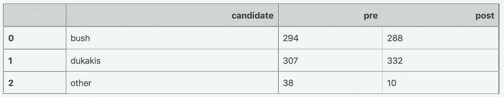

转换为 2x3 阵列:

```
y = data[["pre", "post"]].T.valuesprint(y) **array([[294, 307,  38],
       [288, 332,  10]])**
```

每次调查的受访者人数:

```
n = y.sum(axis=1) 
print(n)**array([639, 630])**
```

每次调查中两个主要候选人的受访者人数:

```
m = y[:, :2].sum(axis=1) 
print(m) **array([601, 620])**
```

对于这个模型，我们需要稍微不同地设置先验。我们需要 2 套，而不是 1 套*theta*，每个调查一套(辩论前/辩论后)。要做到这一点而不创建每个变量的特定前/后版本，我们将利用 PyMC3 的`shape`参数，该参数可用于大多数(所有？)分布。

在这种情况下，我们需要一个二维形状参数，代表辩论的数量`n_debates`和候选人的选择数量`n_candidates`

```
n_debates, n_candidates = y.shape
print(n_debates, n_candidates) **(2, 3)**
```

因此，我们需要用形状`(2,3)`初始化 Dirichlet 分布，然后在需要的地方通过索引引用相关参数。

```
with pm.Model() as polling_model_debates:

    # initializes the Dirichlet distribution with a uniform prior: shape = (n_debates, n_candidates)
    a = np.ones(shape)

    # This creates a separate Dirichlet distribution for each debate
    # where sum of probabilities across candidates = 100% 
    # for each debate theta = pm.Dirichlet("theta", a=a, shape=shape)

    # get the "Bush" theta for each debate, at index=0
    # and normalize across supporters for the 2 major candidates bush_pref = pm.Deterministic("bush_pref", theta[:, 0] * n / m)

    # to calculate probability that support for Bush 
    # shifted from debate 1 [0] to 2 [1] bush_shift = pm.Deterministic("bush_shift", 
        bush_pref[1]-bush_pref[0])

    # because of the shapes of the inputs, 
    # this essentially creates 2 multinomials, 
    # one for each debate responses = pm.Multinomial("responses", 
        n=n, p=theta, observed=y)
```

对于具有多维形状的模型，最好在采样前检查各种参数的形状:

```
for v in polling_model_debates.unobserved_RVs:
    print(v, v.tag.test_value.shape)**theta_stickbreaking__ (2, 2)
*theta (2, 3)* bush_pref (2,)
bush_shift ()**
```

标牌视觉效果也有所帮助:

```
pm.model_to_graphviz(polling_model_debates)
```

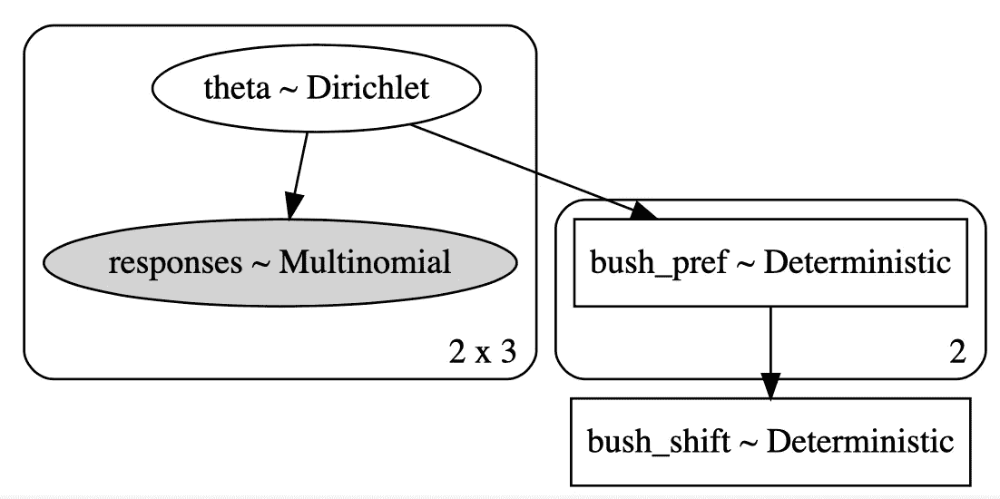

让我们以稍微多一点的抽取次数和调谐步骤进行采样:

```
with polling_model_debates:
    polling_trace_debates = pm.sample(draws=3000, tune=1500)
```

快速查看 traceplot 以确保模型平滑收敛:

```
with polling_model_debates:
    pm.traceplot(polling_trace_debates, combined=True)
```

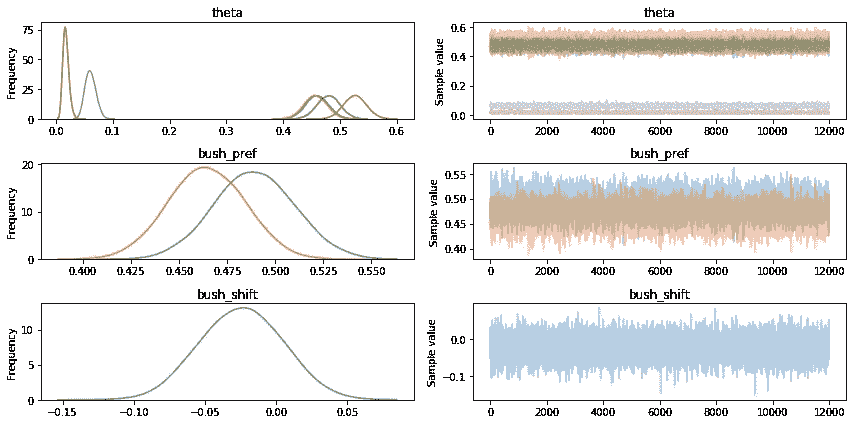

让我们来看一下`theta`的后验概率的平均值，表明辩论前&后每位候选人的支持率百分比:

```
s = ["pre", "post"]
candidates = data["candidate"].valuespd.DataFrame(polling_trace_debates["theta"].mean(axis=0), 
    index=s, 
    columns=candidates)
```

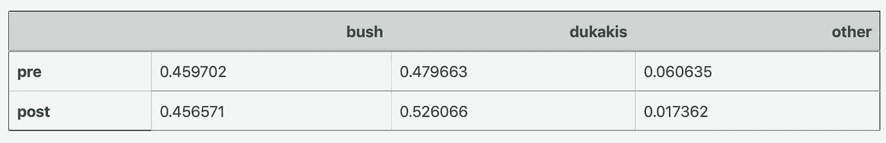

仅从平均值来看，我们可以看到布什的支持者人数可能**在辩论后从 48.8%下降到 46.3%(作为两大候选人支持者的百分比):**

```
pd.DataFrame(polling_trace_debates["bush_pref"].mean(axis=0),  
    index=s, columns=["bush_pref"])
```

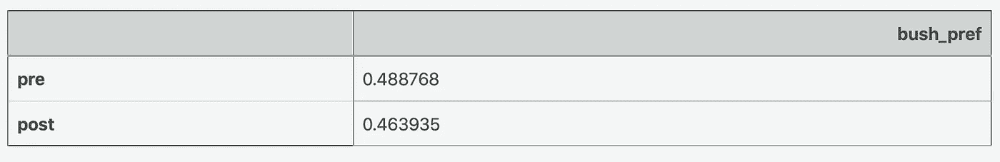

让我们通过绘制布什%回应的辩论前/后值的后验分布和布什支持者辩论前/后差异的后验分布来直观地比较结果:

```
_, ax = plt.subplots(2,1, figsize=(10, 10))sns.distplot(polling_trace_debates["bush_pref"][:,0], 
    hist=False, ax=ax[0], label="Pre-Debate")sns.distplot(polling_trace_debates["bush_pref"][:,1], 
    hist=False, ax=ax[0], label="Post-Debate")ax[0].set_title("% Responses for Bush vs Dukakis")
ax[0].set_xlabel("% Responses");sns.distplot(polling_trace_debates["bush_shift"], 
    hist=True, ax=ax[1], label="P(Bush Shift)")ax[1].axvline(0, c='g', linestyle='dotted')
ax[1].set_title("% Shift Pre/Prior Debate")
ax[1].set_xlabel("% Shift");
```

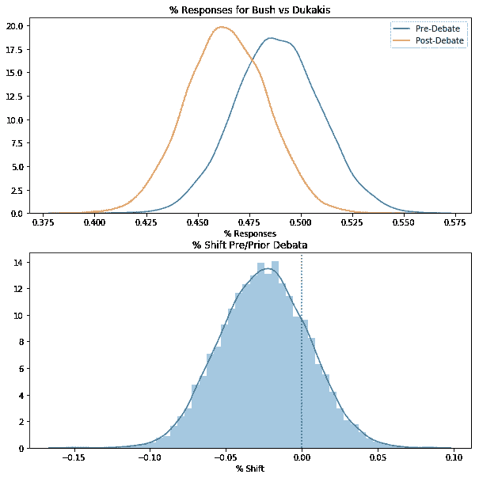

从第二个图中，我们已经可以看到很大一部分后验密度低于 0，但让我们精确地实际计算一下辩论后支持从*转向*布什的概率:

```
bush_shift = polling_trace_debates["bush_shift"]
perc_shift = (
              len(bush_shift[bush_shift > 0])
              /len(bush_shift)
             )
print(f'P(Shift Towards Bush) = {perc_shift:.1%}')**P(Shift Towards Bush) = 19.9%**
```

虽然这是一种迂回的方式来表明布什在 9 月的辩论中失去了支持，但希望这说明了概率模型(和 PyMC3)的灵活性和稳健性。

如果你对这篇文章有任何想法或反馈，请告诉我！

(这个帖子在 Github 上也有 [Jupyter 笔记本。)](https://nbviewer.jupyter.org/github/clausherther/public/blob/master/Dirichlet%20Multinomial%20Example.ipynb)