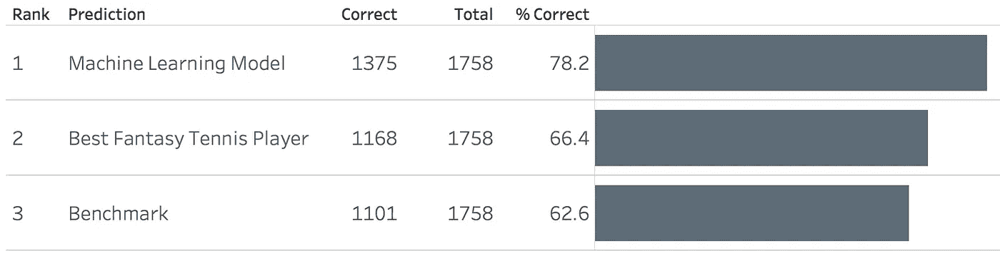

# 一台机器能打败世界上最好的网球运动员吗？

> 原文：<https://towardsdatascience.com/can-a-machine-beat-the-best-tennis-player-in-the-world-79112b47f547?source=collection_archive---------26----------------------->

Photo by Marcus Nilsson

# 介绍

我是个网球爱好者。我喜欢每周打网球，看网球，甚至打梦幻网球。虽然梦幻网球不像梦幻足球那样普及，但世界各地都有相当多的人参与其中。有多种格式，但最常见的是括号。在括号格式中，在锦标赛开始之前，幻想网球运动员试图预测谁将是锦标赛中所有网球比赛的获胜者。

由于我既是一个超级网球迷，也是一个数据呆子，我一直想知道机器学习算法如何应对世界上最好的幻想网球运动员。它能打败他们吗？为了回答这个问题，我着手做了四件事:

1.  为挑战设定规则
2.  为挑战创建基准预测
3.  测试最佳梦幻网球选手在挑战中的表现
4.  建立一个机器学习模型，并在挑战赛上进行测试

术语网球运动员在这种情况下可能有点混乱，因为它既可以适用于幻想的网球运动员，也可以适用于实际参加网球比赛的网球运动员。为了清楚起见，每当我提到这位梦幻网球运动员时，我将在博客的其余部分使用 FTP 缩写。

# 1.为挑战设定规则

挑战将包括预测哪名选手将成为网球比赛的获胜者:

*   我将使用 2018 年所有 66 场 ATP 单打比赛中的 1758 场比赛，不包括 ATP 巡回赛决赛。之所以选择 2018 年，是因为在撰写本文时，这是最后一个完整的赛季。第 3 节解释了为什么没有选择本赛季的所有比赛。
*   只有比赛开始前可用的数据才能用来预测比赛的结果。
*   挑战的参赛者将会是:基准预测、FTP 和机器学习模型都将预测相同匹配的结果。
*   准确性将被用来衡量参赛者的预测有多好。这意味着成功预测最多比赛次数的选手将获胜。通过将正确预测的数量除以所有预测来计算准确度。如果 100 个匹配中有 50 个预测正确，准确率将是 50%。

# 2.为挑战创建基准预测

为了与 FTP 和机器学习模型的预测进行比较，我首先创建了一个基准预测。使用的简单策略是总是挑选排名最好的球员作为比赛的获胜者。ATP 排名显示了球员在过去 52 周的表现。

当应用这种策略时，1758 个匹配中有 1101 个被正确预测。这相当于精度为 **62.6%** 。

# 3.测试最佳梦幻网球选手在挑战中的表现

那么谁是世界上最好的 FTP 呢？由于不存在任何官方的梦幻网球排名，答案并不直接，可能有点主观。周围有许多不同的梦幻网球网站，但 www.tennisdrawchallenge.com 是一个支持全年所有 ATP 比赛的网站。它也是玩家最活跃的网站之一，有超过 1000 名玩家参加大满贯赛事。对于这个挑战，我选择了正确预测 2018 年比赛数量最多的 FTP:

Best fantasy tennis player of 2018

所以世界上最好的 FTP 预测 57%的匹配是正确的。但是等等，就 57%？考虑到抛硬币能让你得到 50%，这听起来很低。原因是括号格式，所有比赛都必须在比赛开始前预测**。所以当 FTP 做预测时，只有在第一轮比赛中，他才能绝对确定比赛中的网球选手是谁。随着锦标赛进入下一轮，预测的获胜者甚至可能不会参加比赛。自然，正确预测的数量会比在比赛开始后**但每场比赛开始前**预测的少。**

为了让 FTP 更公平一点，我只考虑了基于比赛中正确球员的预测。让我来解释一下 2018 年澳大利亚网球公开赛抽签的一些例子:

***Grey*** *= no previous match,* ***Green*** *= won previous match,* ***Red*** *= lost previous match*

*   **例 1** :第一轮的所有比赛都将被考虑在内，因为每场比赛中的两名选手在预测时都是已知的。对于这个例子，这将意味着由框 1 标记的所有 8 个匹配。
*   例 2 :在这场比赛中，双方球员都和 FTP 预测的一样，因此会被考虑在内。FTP 认为纳达尔将击败迈尔，这被证明是真的。
*   **例 3** :这场比赛不算，因为其中一名球员不认识。FTP 认为这场比赛将是施瓦茨曼对哈利斯，但结果却是施瓦茨曼对路德。由于该预测是基于比赛中错误的球员做出的，因此将不予考虑。

在调整为仅包括两个玩家都已知的匹配后，FTP 预测 1758 个匹配中有 1168 个是正确的，这将产生 66.4%的准确率**。这是将对照机器学习模型进行测试的结果。**

# **4.建立一个机器学习模型，并在挑战赛上进行测试**

**与任何机器学习模型一样，我们在预测任何事情之前都需要数据。在这次挑战中，我使用了 Jeff Sackmann [提供的 ATP 数据。杰夫多年来一直免费分享高质量的网球数据，非常感谢他。](https://github.com/JeffSackmann/tennis_atp)**

**根据 ATP 数据，我创建了一组输入，模型应该根据这些输入进行训练。像玩家的排名，年龄，身高，与对手的正面交锋，胜率等等都被使用。**

**对于模型本身，测试了几种不同的机器学习模型。表现最好的是 XGBoost。所有的数据准备和建模细节都可以在我的 Github 资源库[这里](https://github.com/Bomada/tennis-blog)找到。**

**当机器学习模型预测到同样的 1758 个匹配时，它成功地获得了 1375 个正确，这相当于 **78.2%** 的准确率。**

# **结论**

**在这篇文章中，我试图回答一台机器是否能打败世界上最好的 FTP 的问题。我找到了世界上最好的 FTP，看到了他在 2018 年 ATP 单打赛季期间对网球比赛冠军的预测有多准确。然后，我使用 XGBoost 分类器建立了一个机器学习模型，并在相同的网球比赛中进行了测试。结果是:**

****

**Results for challenge**

**结果不言自明。机器学习模型不仅打败了最好的 FTP。它会以巨大的优势做到这一点。**

**那么这是否意味着每个 FTP 都应该开始让机器为它们做决定呢？不一定。通常，在梦幻网球的世界里没有奖金，所以金钱不是主要的动机。大多数玩家参加比赛是为了荣誉和乐趣。让一台机器做所有的决定会减少一些乐趣。但大多数 FTP 可能会受益，并通过分析机器学习模型如何预测网球比赛来了解更多关于比赛的信息。**

**看来梦幻网球的世界仍有很大的改进潜力。**