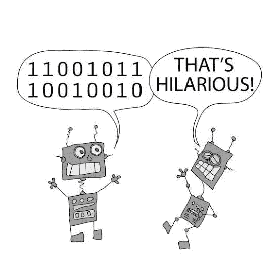
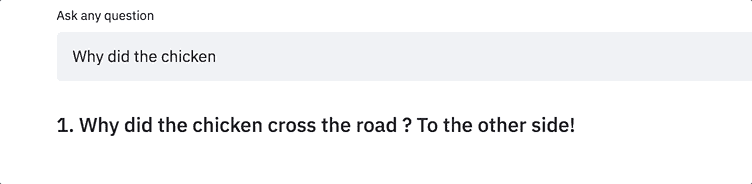
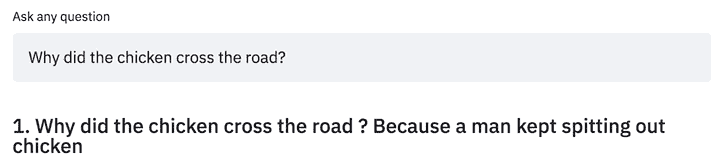
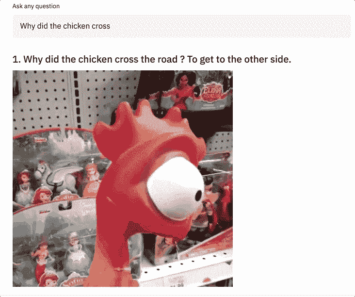
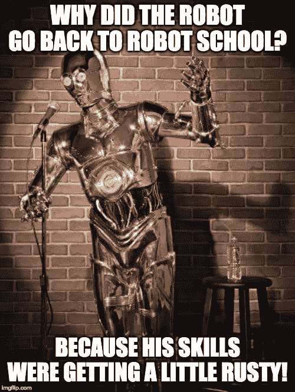
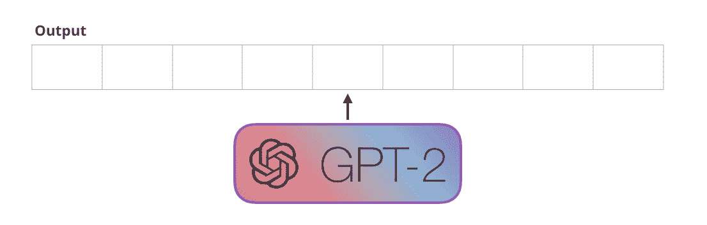
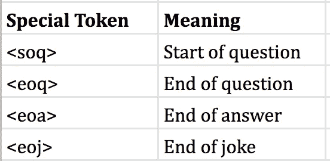
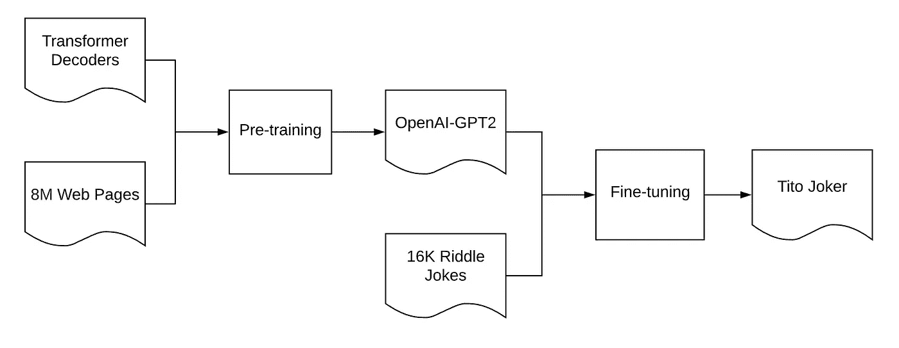
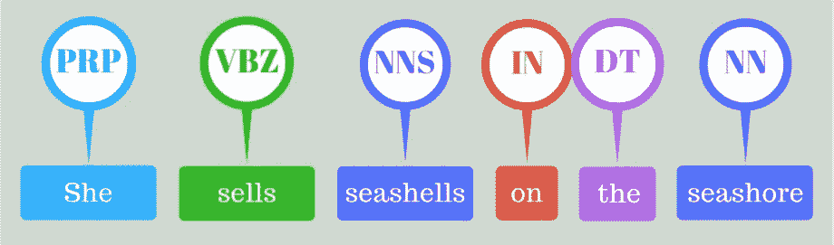

# 机器人能让你笑吗？—教人工智能讲笑话

> 原文：<https://towardsdatascience.com/can-a-robot-make-you-laugh-teaching-an-ai-to-tell-jokes-815f1e1e689c?source=collection_archive---------8----------------------->

## 是的，他几乎和我一样有趣！

A robot laughing at a friend’s joke ([Pinterest](https://www.google.com/search?q=robot+jokes+comics&rlz=1C5CHFA_enPH839PH839&sxsrf=ACYBGNR-oCXliQuf1GWRcuRm2q3vgfQb-w:1577114175318&tbm=isch&source=iu&ictx=1&fir=7Q2pU2RK6szL2M%253A%252CvxeVVXMCg9fblM%252C_&vet=1&usg=AI4_-kSsnrtxqZtASeALJ49CEgTkRUomWA&sa=X&ved=2ahUKEwi_rsKRiMzmAhVJfXAKHYIqCDkQ9QEwAHoECAkQBg#imgrc=eCDVGiE98kZ_QM))

[Tito Joker](https://github.com/enzoampil/tito-joker) 是一个幽默的 AI，它使用最先进的深度学习来讲笑话。他的目标是充分理解幽默，讲出真正有趣的笑话。

为什么他被命名为提托小丑？因为在菲律宾语中，“tito”翻译成英语就是“叔叔”的意思，而在菲律宾，我们都有那个说最幼稚笑话的叔叔！

[Tito Joker](https://github.com/enzoampil/tito-joker) tells riddle type jokes based on custom inputs typed in by users

欢迎在这个[网站](http://35.225.94.177:8501/)上与蒂托·小丑互动。

如上面的 gif 图所示，他不仅能够讲语法正确的笑话，而且还能讲出正确的笑话。

例如，他理解“小鸡为什么过马路？”，用一个在鸡过马路的上下文中有意义的地点或原因来回答。当然，他并不是一直都这样，但他经常这样(如下图)。

Tito Joker can tell as many jokes as you want given your input question

为了让他更有趣，我决定教他如何使用互联网上最流行的交流方式之一——gif！这个想法是，一旦他讲了一个笑话，他也试图展示一个与这个笑话相关的 GIF。

Tito Joker is able to show a GIF that matches the meaning of the joke

# **这怎么可能？**

今年 2019 年，我在深度学习的自然语言处理(NLP)应用方面做了很多工作，特别关注去年发布的基于 [Transformer](https://jalammar.github.io/illustrated-transformer/) 的预训练模型——[BERT](https://jalammar.github.io/illustrated-bert/)、 [OpenAI GPT-2](https://jalammar.github.io/illustrated-gpt2/) 和 [XLNET](https://arxiv.org/abs/1906.08237) 。

别担心，我不会在这里详细讨论 Transformer 架构，但下面是来自 Jay Allamar 的惊人的[博客文章](https://jalammar.github.io/illustrated-transformer/)的解释图。

Transformer Architecture Illustration by [Jay Alammar](https://jalammar.github.io/illustrated-transformer/)

作为一个爱开玩笑的人，我可以说我对幽默很有热情，所以模拟其复杂性的想法真的让我很兴奋。我们能否利用深度学习来建立一个实际上自己很有趣的 AI？也许，我们甚至可以把它带到一个可以做单口喜剧的地步！(见下文)

C-3PO telling a joke as a standup comedian

## 1.利用开放式 GPT-2 进行迁移学习

鉴于它在语言生成任务上的顶级性能，我决定使用 OpenAI GPT-2(简称 GPT2)作为 Tito Joker 的主干模型。GPT2 的目标很简单——给定所有前面的单词，预测语句的下一个单词(如下所示)。

Language modelling illustration by [Jay Alammar](https://jalammar.github.io/illustrated-gpt2/)

请注意，GPT2 被训练使用从 800 万个网页中抓取的 40GB 文本来完成这一任务。这是一个很大的文本！

现在，这一切都很有趣，但我们如何使用这个模型来创建一个讲笑话的人工智能？*迁移学习* —使用预训练模型(例如 GPT2)并在另一个数据集上“微调”它的过程，该数据集包含您希望模型学习的信息。

从这里开始，很明显，方法将是收集包含幽默的文本数据集。通过在幽默数据集上微调 GPT2，我们可以创建一个新的人工智能模型，它理解幽默，并因此可以讲笑话——**蒂托·小丑**。

## 2.带有谜语式笑话的幽默数据集创建

来自 Kaggle 的笑话数据集被用于微调。它包含了 231，657 个不同格式的笑话，包括“Yo Mama”和“它需要多少个”各种笑话。

*警告:该数据集包含 NSFW 笑话，因此 Tito Joker 的幽默也将反映这种性质的笑话。我计划在 Tito Joker 的未来版本中增加过滤这些内容的功能。*

Kaggle is a platform that gives free access to data science competitions and open-sourced datasets

为了让 Tito Joker 更容易理解一个笑话的“概念”，我决定把这个笑话的范围限定为谜语类型的笑话。换句话说，我过滤了以“什么”、“如何”、“何时”或“为什么”开头的笑话。这使得笑话的数量下降到 65394 个。

除此之外，我还添加了一些特殊的标记，让模型能够理解一个谜语式笑话的“问题”和“答案”之间的区别。下表总结了这些情况:

Special tokens help Tito Joker understand the structure of a riddle type joke

带有特殊标志的笑话示例:

> <soq>小鸡为什么要过马路？<eoq>到另一边去。<eoa></eoa></eoq></soq>

更多详情请参考 Tito Joker 的[预处理脚本](https://github.com/enzoampil/tito-joker/blob/master/experiments/process_jokes.py)。

## 3.用 GPT2 +幽默数据集进行 Tito Joker 训练

既然我们已经有了预训练的模型和幽默的数据集，我们现在可以训练 Tito Joker 了！Tito Joker 是通过对上一节的幽默数据集进行微调而创建的。通过这个过程，Tito Joker 有效地从幽默数据集中“学习”了幽默的概念。

Tito Joker 的端到端培训工作流程总结如下:

Tito Joker’s Training Workflow

在一台配有一个 T4 GPU、批量为 2 的 Google Colab 笔记本上，微调大约需要 30 分钟。另外，请注意，培训过程是使用与[原始 GPT2 论文](https://d4mucfpksywv.cloudfront.net/better-language-models/language_models_are_unsupervised_multitask_learners.pdf)相同的语言建模目标和超参数执行的。

更多信息请参考铁托小丑[训练脚本](https://github.com/enzoampil/tito-joker/blob/master/experiments/Jokes_GPT2_Finetuning.ipynb)。

## 4.使用词性标注和 GIPHY 生成 GIF

词性标注被用来检测蒂托·乔克讲的笑话中的名词。一旦常见名词被识别出来，它们就被用来搜索 [GIPHY API](https://developers.giphy.com/docs/sdk/) ，然后返回一个相关的 GIF。

比如，如果输入的段子是“为什么*鸡*要过马路？”，常见名词，*鸡*，将被检测并用于从 GIPHY 返回一个 GIF。

POS tagging illustration from [nlpforhackers](https://nlpforhackers.io/wp-content/uploads/2016/08/Intro-POS-Tagging.png)

请注意，我最初计划使用命名实体识别(NER)，但决定从名词开始，因为“名称”在 GIPHY 上更难匹配。例如，“Lorenzo”(指我自己)不太可能返回我自己的相关 GIF，相比之下，常见的名词“boy”在 GIPHY API 上会很容易有匹配。

# 提托小丑怎么学才能更搞笑？

Tito Joker still has a lot to learn if he wants to be as funny as me :)

## 1.对笑话的滑稽程度进行“评级”

一个*反馈系统*将允许用户“评价”蒂托·乔克讲的笑话。这些反馈将被储存起来，并可用于随着时间的推移不断提高 Tito Joker 的“滑稽度”。

从建模的角度来看，这可能意味着必须训练一个单独的“滑稽”模型，用于过滤产生的笑话。强力方法的一个例子是生成 100 个笑话，然后只返回这 100 个笑话中最有趣的一个。

## 2.控制要讲的笑话类型

*语义控件*将允许用户配置他们想从 Tito Joker 中体验的幽默类型。例如，我们可能想要明确地告诉 Tito Joker 产生 *Yo Mama* 类型的笑话，或者我们甚至可能想要明确地设置情绪，并最小化所讲笑话的毒性。

这将要求我们在培训和部署时考虑这些玩笑维度(例如玩笑类型、情绪和毒性)。他们的梦想是拥有类似于关的 TL-GAN 模型的东西，这种模型可以根据年龄、发际线和性别(以及其他因素)轻松配置模型生成的人脸。

## 3.给 Tito Joker 一个主题的上下文

*上下文输入*将允许用户给提托小丑*上下文信息*，他们希望提托小丑在讲笑话时考虑这些信息。这是基于一个想法，即语境是一个笑话的*智慧*的来源。例如，单口喜剧演员被认为是有趣的，因为他们能够在他们讲的笑话中嵌入相关的概念——政治、文化、时事。

实现这一点的一种方法是使用类似的规范，用 [BERT 来表示 Q & A](https://arxiv.org/abs/1810.04805) ，其中问题和上下文段落都被用作模型的输入。想象一下，能够输入一篇关于唐纳德·特朗普的文章，以向蒂托·小丑提供在讲笑话时要考虑哪种信息的背景(例如，墨西哥边境上的墙、移民、与中国的贸易战等)。).

# 结论

用人工智能模拟幽默仍然是一项正在进行的工作，但还有很多实验有待进行。如果我们继续朝着这个目标努力，我相信很快我们就能训练提托·小丑自己变得有趣。

如果你想试用 Tito Joker，了解更多的方法，甚至为改进模型做出贡献，请随时查看[网站](http://35.225.94.177:8501/)和 [github repo](https://github.com/enzoampil/tito-joker) 。

如果还有任何问题，请不要犹豫，在下面评论，给我发电子邮件(*lorenzo.ampil@gmail.com)*，或者通过 [Linkedin](https://www.linkedin.com/in/lorenzoampil/) 或 [Twitter](https://twitter.com/AND__SO) 给我发信息。

## 承认

特别感谢:

*   [拥抱脸](https://huggingface.co/)因为他们使用 PyTorch 实现了 OpenAI GPT-2
*   Streamlit 让部署 Tito Joker 成为一个网络应用变得非常简单
*   思维机器数据科学公司赞助了我运行 Tito Joker 的服务器
*   我的 TM 同事在这篇文章上给了我大量建设性的反馈。
*   [空间](https://spacy.io/)让他们的 POS 和 NER 模型变得非常简单易用

## 参考

*   拉德福德等人(2018)“语言模型是无监督的多任务学习者”来自[https://cdn . open ai . com/better-Language-Models/Language _ Models _ are _ Unsupervised _ multishop _ Learners . pdf](https://cdn.openai.com/better-language-models/language_models_are_unsupervised_multitask_learners.pdf)
*   OpenAI (2019)“更好的语言模型及其含义”，来自 https://openai.com/blog/better-language-models/#fn1
*   来自 https://jalammar.github.io/illustrated-gpt2/的 Allamar，J. (2019)“图解 GPT-2(可视化变压器语言模型)”
*   关，S. (2018)“使用人工智能生成定制的照片级真实感人脸”来自[https://blog . insightdatascience . com/Generating-custom-photo-realistic-faces-using-AI-d 170 B1 b 59255](https://blog.insightdatascience.com/generating-custom-photo-realistic-faces-using-ai-d170b1b59255)
*   Devlin 等人(2018)“BERT:用于语言理解的深度双向转换器的预训练”，来自[https://arxiv.org/pdf/1810.04805.pdf](https://arxiv.org/pdf/1810.04805.pdf)