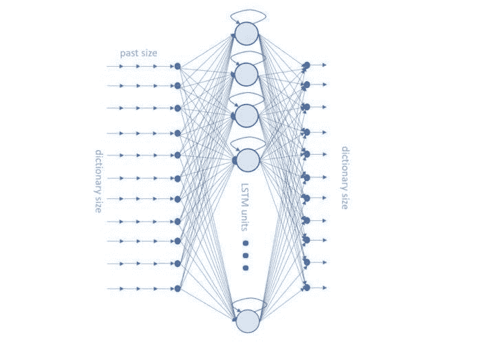
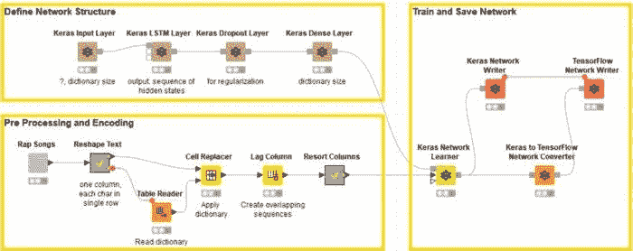
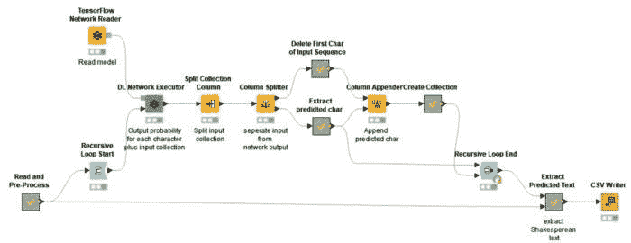

# AI 能写得像莎士比亚吗？

> 原文：<https://towardsdatascience.com/can-ai-write-like-shakespeare-de710befbfee?source=collection_archive---------17----------------------->

许多真话都是在玩笑中说出来的
——莎士比亚、 [*李尔王*](https://www.goodreads.com/work/quotes/2342136)

“啊，小心，我的主，嫉妒；这是绿眼睛的怪物，它嘲笑它所吃的肉。
――威廉·莎士比亚， [*奥赛罗*](https://www.goodreads.com/work/quotes/995103)

有一颗星星在跳舞，在那颗星星下，我诞生了
――莎士比亚， [*无事生非*](https://www.goodreads.com/work/quotes/2080738)

谁能像莎士比亚那样写作？或者像莎士比亚那样拼写？我们能教人工智能像莎士比亚一样写作吗？还是这是一个无望的任务？一个 AI 神经网络能否像李尔王一样描述绝望，像奥赛罗一样感受嫉妒，或者像贝内迪克一样运用幽默？理论上，如果我们能教会它，没有理由不这样做。

从麻省理工学院的[威廉莎士比亚全集网站](http://shakespeare.mit.edu/)上，我下载了三部著名的莎士比亚名著:《李尔王》、《奥赛罗》和《无事生非》。然后我在这个语料库上训练了一个[深度学习](https://en.wikipedia.org/wiki/Deep_learning) [递归神经网络(RNN)](https://en.wikipedia.org/wiki/Recurrent_neural_network) 带有一个隐藏层的[长短期记忆(LSTM)单元](https://en.wikipedia.org/wiki/Long_short-term_memory)来产生自由文本。

神经网络能够像莎士比亚那样学习写作吗？如果是的话，它在模仿诗人风格方面走了多远？它能够为剧中的每一个角色产生一个有意义的文本吗？在人工智能情节中，苔丝狄蒙娜会遇到李尔王吗？这会引发奥赛罗的嫉妒吗？悲剧会战胜喜剧吗？每个角色会保持和原版戏剧一样的说话风格吗？

我相信你有更多的问题。所以，事不宜迟，让我们看看我们的深度学习网络是否能够产生诗歌，或者仅仅是装傻。

**用 LSTM 神经网络生成自由文本**

递归神经网络(RNN)已经被成功地用于生成自由文本。用于自由文本生成的最常见的神经网络架构依赖于至少一个 [LSTM](https://colah.github.io/posts/2015-08-Understanding-LSTMs/) 层。

为了训练我们的第一个 Shakespeare simulator，我使用了一个只有三层的神经网络:输入层、LSTM 层和输出层(图 1)。

该网络在字符级被训练。也就是说，从输入文本中生成 m 个字符的序列，并输入到网络中。

每个字符都使用热零编码进行编码。这意味着每个字符由大小为 n 的向量表示，其中 n 是来自输入文本语料库的字符集的大小。

将大小为[m，n]的全部输入张量输入到网络中。训练网络将位置 m+1 处的下一个字符与前 m 个字符相关联。

所有这些导致了以下网络:

*   具有 n 个单位的输入层将接受[m，n]个张量，其中 n 是字符集的大小，m 是用于预测的过去样本(本例中为字符)的数量。我们任意选择 m=100，估计 100 个过去的字符可能足以预测第 101 个字符。当然，字符集的大小 n 取决于输入的语料库。
*   对于隐藏层，我们使用了 512 个 LSTM 单位。需要相对较高数量的 LSTM 单元来处理所有这些(过去 m 个字符-下一个字符)关联。
*   最后，最后一层包括 n 个 softmax 激活单元，其中 n 也是字符集的大小。事实上，这一层应该为字典中的每一个字符生成概率数组。因此，n 个输出单元，每个字符概率一个。

Figure 1\. The deep learning LSTM-based neural network we used to generate free text. n input neurons, 512 hidden LSTM units, an output layer of n softmax units where n is the character set size, in this case the number of characters used in the training set.

注意，为了避免过度拟合，在 LSTM 层和输出密集层之间的训练期间，临时引入了中间的[脱落层](https://medium.com/@amarbudhiraja/https-medium-com-amarbudhiraja-learning-less-to-learn-better-dropout-in-deep-machine-learning-74334da4bfc5)。丢弃层选择在训练阶段的每次迭代期间移除一些随机单元。然后移除脱落层用于部署。

**构建、训练和部署神经网络**

该网络接受了《李尔王》(King Lear)、《奥赛罗》(Othello)和《无事生非》(Ado About)的全文训练，这些文本可从威廉莎士比亚全集网站(The Complete of William Shakespeare)获得，共有 13298 个句子。

使用由 [KNIME 分析平台](https://www.knime.com/knime-software/knime-analytics-platform)提供的 Keras 和 TensorFlow 的基于 GUI 的[集成来构建、训练和部署上述神经网络。](https://www.knime.com/deeplearning/keras)

构建和训练网络的工作流程如图 2 所示。图 3 显示了部署网络逐个字符预测最终文本的工作流程。这两个工作流都是从博客帖子“[从前…由 LSTM 网络](https://www.knime.com/blog/text-generation-with-lstm)”中实现的工作流复制和改编的，其中一个类似的网络被训练和部署来生成自由文本，已经对来自格林童话的文本进行了训练。这两个工作流都可以从 KNIME 示例服务器的 04 _ Analytics/14 _ Deep _ Learning/02 _ Keras/11 _ Generate _ Fairy _ Tales 下免费下载。

在图 2 中，定义网络结构部分(左上角)中的棕色块(节点)构建了神经网络的不同层。预处理和编码部分(左下)中的节点对数据进行清理、标准化、整形和转换。最后，训练由 Keras 网络学习者节点执行，并且网络被存储起来以供部署。

请注意，如果训练集很大，这个网络可能需要相当长的时间来训练。可以通过将 KNIME Analytics Platform 指向一个用于 GPU 的 Keras 安装来加快速度。

图 3 中的部署工作流读取并使用之前训练的网络来预测自由文本，一个字符接一个字符。

Figure 2\. The training workflow trains a neural network (62 inputs -> 512 LSTM -> 62 outputs) to predict the next character in the text, based on the previous 100 characters. Training set consists of the texts of “King Lear,” “Othello,” and “Much Ado About Nothing” by William Shakespeare. Thus, the network should learn to build words and sentences in a Shakespearean style.

Figure 3\. The deployment workflow takes 100 characters as the start and then generates text character after character in a loop, until 1,000 characters are generated, making the full, final Shakespeare-like text.

**人工智能生成的莎士比亚文本**

下面是一些结果，在对整个数据集(三部选定的戏剧)进行 50 个时期的训练后，使用 100 个过去的字符作为输入张量，并递归生成 1000 个新字符。

让我们从奥赛罗和苔丝狄蒙娜之间的对话(斜体)的 100 个字符开始，然后看看我们的网络将如何继续(纯文本)。

哦，我美丽的勇士！

*——苔丝狄蒙娜
我亲爱的奥赛罗！*

奥赛罗看到你比我先到这里来，我感到非常惊奇。哦，我灵魂的快乐！我是一个小人物。

——格洛斯特
我不知道，亲爱的:
我从心里发现你像个小偷
说皮尔查斯会好起来的。
将军说话就是这么
转一个人，我觉得，besoou。

-凯西奥先生，我请你撒谎:这只手里没有一份温柔和谈论；我不会被派遣威胁。
我们的好老朋友，
居士安抚国事，为他求情；
我会骗你更快！
和嫁妆的祝福:
净出足够做你；
还有那封信中的摩尔人是有缺陷的！阿布霍雷，天堂，我要去 sor
和对方也一样。

——奥赛罗
我看到他的演讲对我这样的考验，
他将生活在谎言的沼泽里
他和女儿
是一个最可怜的人，
他是这个国家最可怜的人，
一个被许多人称之为生命的人
一个不得不失去孩子的人。

先生，对我妹妹？

——奥斯瓦德我求求你，牵着你的手:你可以接受这一切，让他难过，让天堂
凯西奥把这句话藏在心里
让我说:我会永远…

— —

当苔丝狄蒙娜从对话中消失时，《李尔王》中的几个次要角色(格洛斯特、里根和奥斯瓦尔德)慢慢出现在场景中。我们从三部戏剧的不同台词出发，创造了其他自由文本，有趣的是，我们注意到悲剧《奥赛罗》和《李尔王》中的角色经常混合在一起，而喜剧《无事生非》中的角色似乎更自成一体。

该文本使用莎士比亚英语中的单词及其特有的复杂句子结构生成。不是所有的句子都有完美的意义，但大多数似乎都有。还要注意，次要角色被分配了较短的对话，而在这个例子中，奥赛罗和凯西奥得到了最长的发言——这是应该的。

**用人工智能写出一个原始场景**

让我们使用前 100 个字符(同样是斜体)来触发一个新的场景。在这里，我介绍了关键字“场景”、地点、涉及的角色以及第一个发言的角色的名字。神经网络完成剩下的工作。

*场景一.
威尼斯。一条街道。
输入罗德利哥和伊阿古*

苔丝狄蒙娜请告诉我凯西奥的事。
是的，所以我听到写信给 prive 和那里，
她会看到他现在如此巫妖 wor 老窟，
和最好的良心比在这场革命反对他:
有儿子反对父亲，
和你父亲的儿子，我们这个时代最好的没有 excel 你的忠告手表
最坏的不是一个温柔的好战的岛屿，
分裂必须采取的耻辱
的报复
让我们的命运支撑到一个力量，
在他们的本性中的视力，让安全地离开机架:我发誓，是这样的
，她会送回我的信使。

-格洛斯特
我看到枪托上的铁锈。

——李尔王
多好的一辆车啊，我可以认路
不应该这样，鄙视我的兄弟；
我已经超过了他，告诉我我很害怕，
她可能是诚实的，但他已经承认在他身上娱乐
，并认为下一个方式玷污它，
主 commet 至少
会让她喘不过气来，
她可能…

— —

事实证明，创造一个新场景比继续现有场景要困难得多。《苔丝狄蒙娜的谈话》开篇不错，和原著一致。然而，我不确定我能坚持到底。

**用人工智能混合莎士比亚和现代英语**

但说真的，一个产生古英语文本的人工智能引擎有多大用处？

我们能不能用一点莎士比亚的作品来改进现在的英语句子？让我们给我们受过莎士比亚训练的网络输入一些现代文本，看看会出现什么。

那么，什么样的日常，现代文本可以做一点莎士比亚的改进呢？软件许可协议？让我们看看网络能让许可协议的开始变得多有趣(斜体部分)。

*本许可证是指 GNU 通用公共许可证的版本。版权也意味着版权*——比克，
把我的任何东西交给他的剑
交给他的盐和最隐秘的散漫是如此为歌唱，但不是在他的事上比那更应肯定的是将被出售
作为主人比较，不要活在叛徒。祝福你的五个智慧！

——肯特
O 可惜！
先生，现在哪里还有耐心，
这离海那么远，还要招标拆除
那么多褶皱的救和诚。

——布拉班西奥
我一定不认为凯西奥的土耳其人在奇怪的会见一个魔术师的婴儿床是辱骂 libe 说
我可以欺骗他最好的优势，
在她的预言公平一点，目前在你的权力；谢谢你，先生。

-奥尔巴尼
格洛斯特，我会证明他的运动和第一 accuriors 和警卫和白色的谈话。

——李尔王
小偷在哪里？你永远也不会让船长们把信送到沼地去，如果他生气了，我们没有更好的东西就一定会值钱

——里根
我请求你，有一个比我想的更多的理由来宣布我的心，热

— —

拯救、诚实、小偷、主人、叛徒和欺骗这些词似乎符合上下文。还要注意，从许可协议的起始文本中萌发的对话有趣地主要涉及戏剧中次要的、不太悲惨的角色。

至于其他的，不可理解的部分对我来说就像原始的法律语言一样不可理解。引用我们电视网的话，“先生，现在哪里有耐心了……”

**用 AI 做莎士比亚说唱**

最后，让我们给我们的莎士比亚式英语人工智能注入一些不那么生硬的现代语言——一些有创意的东西。在一些说唱歌词中加入一点莎士比亚的风格怎么样？那会改变意思还是只改变单词？同样，让我们从一首说唱歌曲中触发 100 个字符的自由文本的生成。

她在你的 b****上吸着饼干，thot，thot，thot thot
在烹饪同伴*，*而她所能做到的最好的不是一个男人。
诚信，持有，我恳求你的恩典，—

——李尔王
那么他还有很多。

——李尔王
你已经看到了这种平淡的一部分，我原以为会看到塞弗永远不会第二次乘风破浪去捕捉那邪恶的恶魔。
仍然通过那条我不知道该怎么办的路。

——奥赛罗
你看见她了吗？啊，不幸的女孩！
先生，这个走投无路的混蛋！什么消息？
看错了我爸！

——李尔王
你说什么？

——肯特先生，我的确认识你；去荒野和雨中，我被她带走了我的姐妹？

——李尔王
不不不！城堡在哪里？

进入格洛斯特，与法国国王和科迪莉娅·高纳里尔
先生，我没有想到这一点。

——伊阿古
的确！

——奥赛罗
的确！是的，的确是:德西姆，先生。

——康沃尔
叹着气，会！

——奥赛罗
你看这张纸我该怎么抬出一个家伙来，那使他的儿子成为一个可怜的穷权力
那使他的儿子
下雨的时候魔鬼发怒了！我已经从寒风中失去了国王

— —

有趣的是，人工智能生成的文本谈论了一个不快乐的女孩、一个邪恶的恶魔和一个绝望的混蛋，这些词和其他词表达的概念非常接近许多说唱歌曲中包含的概念。

**深度学习从莎士比亚身上学到了什么**

我们已经完成了这个实验。我们训练了一个带有隐藏 LSTM 层的递归神经网络来生成自由文本。我们学到了什么？

总而言之，该网络是根据莎士比亚戏剧《李尔王》、《奥赛罗》和《无事生非》的全文进行训练的。它学会了用莎士比亚的风格创作自由文本。它只需要一个 100 个字符的初始序列来触发自由文本的生成。

我们展示了一些不同的结果。我们从奥赛罗和苔丝狄蒙娜之间的对话开始，看看网络将如何继续下去。我们还根据我们提供的角色和地点，让网络写了一个全新的场景。最后，我们通过在许可协议文本和说唱歌词文本中引入一点莎士比亚的风格，探索了用莎士比亚英语改进现代英语的可能性。有趣的是，莎士比亚英语中与上下文相关的单词出现在自由生成的文本中。

这些结果很有趣，因为真实的莎士比亚英语单词被用来形成更复杂的句子结构，即使是从现代英语句子开始。神经网络正确地识别主要或次要字符，给他们或多或少的文本。拼写和标点大多准确，甚至诗歌风格，即文本的节奏，遵循莎士比亚的风格。

当然，就更有意义的对话而言，试验数据集大小、神经单元和网络架构可能会带来更好的结果。

*首次发表于* [*信息世界。*](https://www.infoworld.com/article/3340377/deep-learning/how-to-use-deep-learning-to-write-shakespeare.html?nsdr=true)