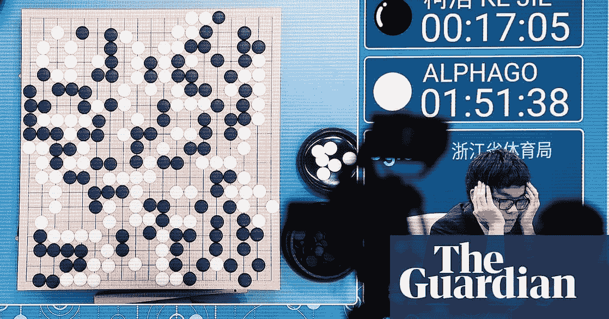
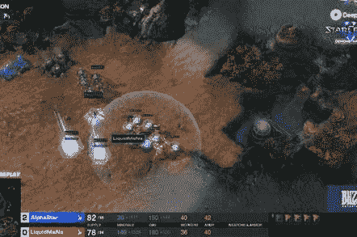
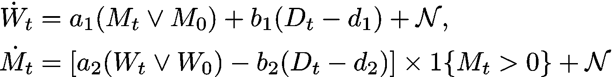
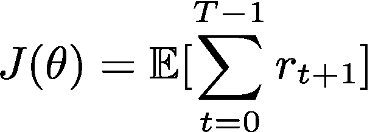
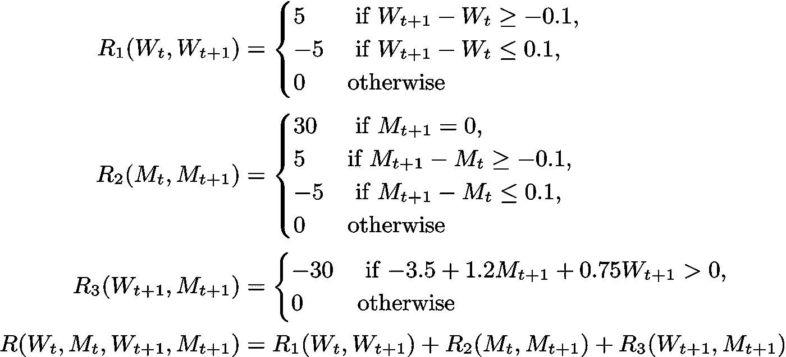
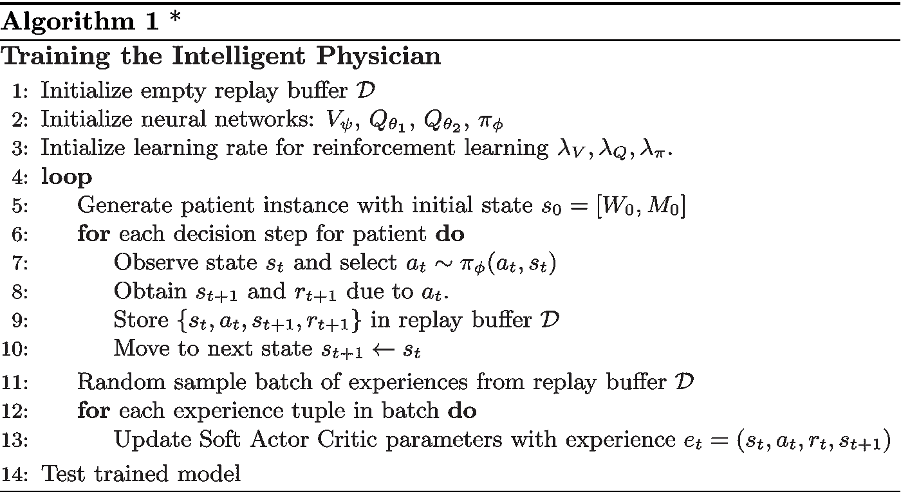
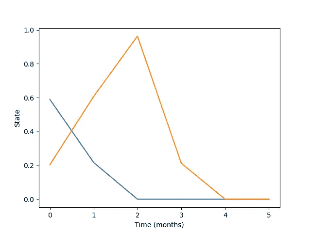
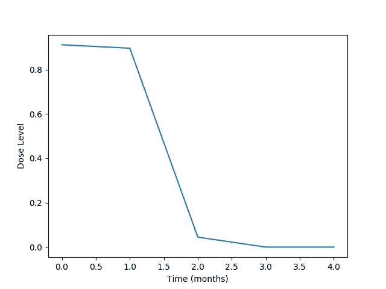

# 人工智能能帮助医疗决策吗？

> 原文：<https://towardsdatascience.com/can-artificial-intelligence-help-medical-decision-making-77b63f5b981c?source=collection_archive---------13----------------------->

## 基于强化学习的化疗智能医生

将机器学习应用于医学领域的研究越来越受到关注。例如，计算机视觉已经被证明是为医生和医学研究人员提供分析信息的有价值的工具。

我想探索智能机器是否可以直接扮演医生的角色——自主做出医疗决策。在这个项目中，我创造了一个基于强化学习的智能医生，它可以根据患者的癌症进展情况制定最佳的化疗方案。

> 注:这是我提交给 2019 年纽约市科学与工程博览会的科学博览会项目。

# 什么是强化学习？

听说过 *AlphaGo 吗？* *阿尔法星？*

Left: Taken From [The Guardian’s article: “World’s best Go player flummoxed by Google’s ‘godlike’ AlphaGo”](https://www.theguardian.com/technology/2017/may/23/alphago-google-ai-beats-ke-jie-china-go), Right: Taken from The Register’s article: [“Human StarCraft II e-athletes crushed by neural net ace — DeepMind’s AlphaStar”](https://www.theregister.co.uk/2019/01/25/ai_in_starcraft/)

在媒体上，强化学习通常出现在游戏环境中；AI 机器人在*围棋* (Deepmind 的 alpha Go)*星际争霸* (Deepmind 的 alpha star)*Dota*(open AI 的 OpenAI Five)等游戏中击败人类职业选手。

本质上，强化学习是一个与最佳决策相关的机器学习领域:训练一个“代理”根据当前状态的观察做出最佳动作，以达到定义的理想状态。

在强化学习中，最优策略(将状态映射到最优动作的函数)是通过“试错”错误方法来学习的。代理基于对当前状态的观察来概率性地选择动作，观察结果状态，并根据定义的性能度量来接收“奖励”。也就是说，用于训练强化学习模型的数据是{ *状态、动作、奖励、下一状态}的元组。*利用这些数据，代理评估所选动作的值，并更新其参数，以便具有更好值的动作——“最优动作”——将具有更高的被选择概率。

> 这是对强化学习的一个非常肤浅的解释——看看我的其他博文[和](http://medium.com/@thechrisyoon),我在那里详细解释了核心概念和算法！

# 数据收集

作为一名独立的高中研究者，我不具备获取真实医学数据的法律和专业资格。为了克服这一点，我基于一个数学模型创建了一个化疗治疗模拟，该模型表示给定当前生理状态和应用的化疗剂量时患者癌症进展的变化。

该模型由(赵，2009)中构建的常微分方程组表示:

其中 *W* 、 *M* 、 *D* 分别代表毒性指数、肿瘤大小指数和归一化剂量， *a、b、d* 为(赵，2009)中确定的模型常数。{ *M > 0* }术语表示一个至关重要的假设，即一旦肿瘤大小指数减少到 0，患者就被认为是永远治愈了，并且不会有癌症复发。 *N* 项表示高斯噪声，该噪声用于扰乱动态，试图模拟患者间的变异性和随机生理事件。

利用这个模型，我创建了一个化疗模拟环境，灵感来自于 *OpenAI Gym。*也就是说，环境包含成员函数:

1.  `reset()`:创建一个随机的初始患者实例。
2.  `reward(state, action)`:根据当前和最终的患者生理状态评估应用剂量。返回一个数字“奖励”
3.  `step(state, action)`:返回后续病人状态，并奖励给定当前状态的一个当前动作。

使用这种模拟，我们可以创建**合成但似是而非的治疗数据**及其相应的化疗治疗方案。然后我们用它来训练我们聪明的医生。

# 奖励函数

奖励函数非常重要，因为它塑造了代理人试图实现的最优行为。如果你看看强化学习的一般目标函数:

即最大化预期的情景累积回报，代理人行为的优化在很大程度上取决于回报函数(在各种强化学习算法中——如在培训我的医生时所使用的——目标函数中可以添加其他项)。

## 我们如何评价智能医师的治疗方案？

那么，我们如何**构建一个奖励函数**来恰当地解决医生的目标**减少肿瘤大小，同时控制累积毒性？**

以下是我们如何评估聪明的医生的决定的分析:

*   如果治疗导致肿瘤尺寸减小，则奖励为正；如果治疗导致肿瘤尺寸增大，则奖励为负。
*   如果治疗导致毒性降低，则奖励为正；如果治疗导致毒性增加，则奖励为负。
*   如果患者“治愈”(即肿瘤大小缩小至 0)，则为高阳性奖励。
*   如果患者“死亡”(即肿瘤大小和毒性指数的加权和超过规定的阈值)，则为高负回报。

及其奖励函数公式:

# 培养聪明的医生

智能医师基于软演员评论家算法(Haarnoja，2018)。*我打算跳过关于算法的细节(因为帖子会太长)，但如果有兴趣，你可以看看* [*图马斯·哈尔诺贾的论文*](https://arxiv.org/abs/1801.01290) *，或者* [*瓦伊沙克诉库马尔的博文*](/soft-actor-critic-demystified-b8427df61665) 。

本质上，软演员评论家可以:

1.  学习连续行动空间中的最优策略。这适合于化疗任务，因为我们想要产生我们想要应用于患者的精确的最佳剂量。相反，在离散行动空间中学习，在这种情况下，意味着从有限的、少量的预定义剂量中进行选择，永远不会是真正的最优决策(只是给定选择中的最优选择)。
2.  通过最大化状态空间探索非常高效和有效地学习最优策略。软行动者批评家通过将熵项结合到其目标函数中，抑制贪婪的行动选择，并鼓励代理在学习时尽可能随机地行动。

所以，这里有一个培训聪明医生的概述:

那就是:

1.  我们生成一个随机的病人实例
2.  我们用现有的模型进行化疗
3.  将癌症进展和治疗方案存储在智能医生的存储器中
4.  用智能医生记忆中随机批次的癌症进展和治疗方案更新神经网络参数
5.  对 1000 个生成的患者重复步骤 1~4。

# 测试训练有素的医生

在智能医生对 1000 名患者进行训练后，它在另一组 1000 名假设的患者身上进行了测试。

对于这 1000 名患者，医生展示了以下统计数据:

一般来说，在治疗结束时，医生能够完全减少患者的肿瘤块，而毒性仍然存在，但没有达到致命水平。当“治愈”被定义为最终肿瘤块时< 0.01 and final toxicity index < 0.8, **，医生治愈了 1000 名模拟患者中的 947 名。**

下面是从医生那里摘录的一个成功治疗进展的例子:

Left: Cancer Progression (Blue: Tumor Mass, Orange: Toxicity), Right: optimal dosage regimen produced by intelligent physician

在这种情况下，医生似乎在初始阶段使用了大剂量治疗来快速缩小肿瘤大小，然后使用小剂量至零剂量来逐渐减少累积的毒性。

# 讨论

在训练聪明的医生制定最佳化疗方案方面取得了成功。医生可以有效地减小肿瘤大小，同时将毒性保持在非致命水平，并最终达到完全安全的水平。

然而，更重要的问题在于人工智能的伦理。

医疗领域的决策具有极高的风险。在癌症治疗的背景下，患者没有机会尝试多种治疗方案。因此，我必须承认我所采用的方法中的问题，以及机器学习方法的固有弱点:

1.  这个模型只能和它得到的数据一样好。数学模型很难复制病人之间的变异性和决定真实世界动态的随机事件。因此，我的方法对于现实世界的应用来说永远不够健壮。
2.  强化学习在现实世界的应用中变得很成问题，因为我们无法在元层面上预测或解释它的行为。我们所知道的是，行为是由定义的奖励函数塑造的，是通过数百万个数据点的训练获得的。
3.  尤其是在复杂、高维的状态和动作空间中，强化学习在面对未知条件时往往泛化能力很差。因此，我们永远无法保证在现实生活中部署时不会发生灾难性的行为。

然而，现代强化学习是一个相对年轻的领域，并且正在以非常快的速度增长——我们永远无法衡量它在几十年后会有什么能力。无论如何，人工智能在现实世界中的应用应该以极大的责任感和谨慎来对待。

# 参考文献(在这篇博文中)

*   赵，，*癌症临床试验的强化学习设计，*北卡罗来纳大学教堂山分校，2009。
*   Tuomas Haarnoja，Aurick Zhou，Pieter Abbeel，和 Sergey Levine，*软行动者-批评家:具有随机行动者的非策略最大熵深度强化学习*，第 35 届机器学习国际会议论文集，2018 年，ICML，瑞典斯德哥尔摩，stockholmsssan，2018 年 7 月 10 日至 15 日，2018 年，第 1856-1865 页。